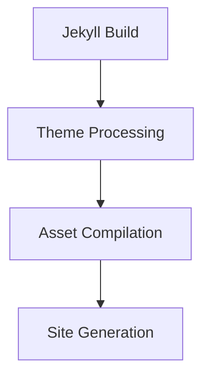

# Documentation Development Guidelines

## 📚 Dual Documentation Architecture Overview

Zer0-Mistakes implements a sophisticated dual documentation system designed to serve different audiences with appropriate content formats and complexity levels.

### Documentation Ecosystem Structure
```
Documentation Architecture
├── /docs/ (Technical Documentation)
│   ├── MDX format with interactive components
│   ├── Developer/contributor focused
│   └── Repository-specific implementation
├── /pages/_docs/ (Public Documentation)
│   ├── Markdown format for Jekyll rendering
│   ├── End-user/theme adopter focused
│   └── General technology guides
└── /.github/instructions/ (AI Guidance)
    ├── GitHub Copilot optimization
    ├── Development assistance
    └── File-specific instructions
```

## 🛠️ Technical Documentation (`/docs/`)

### Purpose & Audience
- **Target Audience**: Developers, contributors, maintainers, technical staff
- **Content Focus**: Repository architecture, build processes, feature implementation
- **Format**: MDX (Markdown + JSX) with interactive components
- **Scope**: Technical implementation details and development workflows

### Directory Structure & Content Types

#### `/docs/systems/` - Infrastructure & Automation
```mdx
---
title: "Automated Version System Architecture"
description: "Technical implementation of semantic versioning automation"
type: "system-architecture"
audience: "developers"
components: ["scripts/analyze-commits.sh", "lib/jekyll-theme-zer0/version.rb"]
dependencies: ["Ruby", "Git", "GitHub Actions"]
---

# Automated Version System Architecture

## System Overview

<ArchitectureDiagram>
  ```mermaid
  graph LR
    A[Commit Analysis] --> B[Version Calculation]
    B --> C[Gem Publishing]
  ```
</ArchitectureDiagram>

## Implementation Details

<CodeBlock language="ruby" file="lib/jekyll-theme-zer0/version.rb">
```ruby
module JekyllThemeZer0
  VERSION = "0.5.0"
end
```
</CodeBlock>
```

#### `/docs/features/` - Component Implementation
```mdx
---
title: "PostHog Analytics Integration"
description: "Privacy-compliant analytics implementation"
type: "feature-implementation"
components: ["_includes/analytics/posthog.html", "_includes/components/cookie-consent.html"]
testing: ["test/test_analytics.sh"]
---

# PostHog Analytics Integration

## Component Architecture

<ComponentDiagram>
  PostHog → Cookie Consent → User Privacy Controls
</ComponentDiagram>

## Implementation Pattern

<CodeExample>
```liquid

  

```
</CodeExample>
```

### Content Standards for Technical Documentation

#### Front Matter Requirements
```yaml
---
title: "Descriptive Technical Title"
description: "Technical implementation summary (150-160 chars)"
type: "system|feature|configuration|release"
audience: "developers|contributors|maintainers"
components: ["file1.rb", "file2.html"]  # Related source files
dependencies: ["Jekyll", "Bootstrap", "Docker"]  # Technical dependencies
testing: ["test/test_file.sh"]  # Related test files
last_updated: "2025-11-16"
complexity: "beginner|intermediate|advanced"
---
```

#### MDX Component Usage
- **CodeBlock**: For syntax-highlighted code with file references
- **ArchitectureDiagram**: For Mermaid diagrams showing system design
- **TestingGuide**: For test procedures and validation steps
- **ConfigurationExample**: For configuration file examples
- **ComponentDiagram**: For component relationship visualization

#### Cross-Reference Patterns
```mdx
## Related Components

- **Source Code**: [`_layouts/journals.html`](../../_layouts/journals.html)
- **Tests**: [`test/test_layouts.sh`](../../test/test_layouts.sh)
- **Documentation**: [Layout Architecture](../features/layout-system.mdx)
- **Configuration**: [Theme Config](../configuration/theme-setup.mdx)
```

## 📖 Public Documentation (`/pages/_docs/`)

### Purpose & Audience
- **Target Audience**: End-users, theme adopters, general developers
- **Content Focus**: Usage guides, tutorials, general technology documentation
- **Format**: Standard Markdown for Jekyll compatibility
- **Scope**: How to use features rather than how they're implemented

### Content Categories

#### Technology Guides
```markdown
---
title: "Jekyll Fundamentals for Theme Users"
description: "Essential Jekyll concepts for Zer0-Mistakes theme users"
layout: default
categories: [jekyll, fundamentals]
tags: [tutorial, getting-started]
permalink: /docs/jekyll/fundamentals/
difficulty: "beginner"
estimated_time: "15 minutes"
---

# Jekyll Fundamentals for Theme Users

This guide covers essential Jekyll concepts you need to know when using the Zer0-Mistakes theme.

## Basic Configuration

Configure your site by editing `_config.yml`:

```yaml
title: "Your Site Name"
description: "Your site description"
theme: "jekyll-theme-zer0"
```

## Creating Content

Add new blog posts in the `_posts/` directory:

```markdown
---
title: "Your Post Title"
date: 2025-11-16
layout: journals
---

Your post content here.
```
```

#### User Tutorials
```markdown
---
title: "Customizing Theme Colors"
description: "How to customize the Zer0-Mistakes theme color scheme"
layout: default
categories: [customization, design]
tags: [css, bootstrap, colors]
permalink: /docs/customization/colors/
difficulty: "beginner"
prerequisites: ["Basic CSS knowledge"]
---

# Customizing Theme Colors

Learn how to customize the color scheme of your Zer0-Mistakes theme.

## Quick Color Changes

Override Bootstrap CSS variables in your custom stylesheet:

```css
:root {
  --bs-primary: #3498db;
  --bs-secondary: #2c3e50;
}
```

## Advanced Customization

For more extensive customization, create a custom SCSS file:

```scss
// _sass/custom.scss
$primary: #your-primary-color;
$secondary: #your-secondary-color;

@import "bootstrap";
```
```

### Content Standards for Public Documentation

#### Front Matter Requirements
```yaml
---
title: "User-Friendly Guide Title"
description: "Clear description for end-users (150-160 chars)"
layout: default
categories: [category1, category2]
tags: [tag1, tag2, tag3]
permalink: /docs/section/guide-name/
difficulty: "beginner|intermediate|advanced"
estimated_time: "X minutes"
prerequisites: ["Prerequisite 1", "Prerequisite 2"]
updated: "2025-11-16"
---
```

#### Content Structure Pattern
1. **Introduction**: Brief overview and purpose
2. **Prerequisites**: What users need before starting
3. **Step-by-Step Instructions**: Clear, numbered procedures
4. **Code Examples**: Practical, copy-paste ready examples
5. **Troubleshooting**: Common issues and solutions
6. **Next Steps**: Links to related guides

## 🔄 Documentation Conversion Workflow

### MDX to Markdown Conversion

When converting technical documentation for public consumption:

#### Content Transformation Guidelines
1. **Remove Implementation Details**: Focus on usage rather than architecture
2. **Simplify Language**: Replace technical jargon with user-friendly terms
3. **Add Context**: Provide explanatory text for user understanding
4. **Convert Components**: Replace MDX components with static Markdown
5. **Update Cross-References**: Link to user documentation rather than source code

#### Example Conversion Process
```bash
# Technical Documentation (docs/features/analytics.mdx)
## Implementation Details
<CodeBlock file="_includes/analytics/posthog.html">
```liquid

  <!-- PostHog implementation -->

```
</CodeBlock>

# Converts to Public Documentation (pages/_docs/analytics/setup.md)
## Enabling Analytics
To enable PostHog analytics on your site, add this to your `_config.yml`:

```yaml
posthog:
  enabled: true
  api_key: 'your_api_key_here'
```
```

### External Documentation Import

#### Git Submodule Integration
```bash
# Import external documentation
git submodule add https://github.com/jekyll/jekyll.git external/jekyll-docs

# Configure sparse checkout
cd external/jekyll-docs
git sparse-checkout init --cone
git sparse-checkout set docs/_docs

# Process content for integration
./scripts/import-external-docs.sh jekyll-docs docs/_docs pages/_docs/jekyll/
```

#### Content Processing Standards
1. **Header Standardization**: Add Zer0-Mistakes front matter
2. **Navigation Integration**: Update links for site structure
3. **Brand Neutrality**: Remove external branding elements
4. **Cross-Reference**: Add links to related theme documentation
5. **Testing**: Validate Jekyll processing and rendering

## 🧪 Documentation Testing Guidelines

### Validation Procedures

#### Content Quality Checks
```bash
# Validate Markdown syntax
markdownlint pages/_docs/**/*.md

# Check external links
./scripts/test-external-links.sh

# Validate Jekyll processing
bundle exec jekyll build --config _config.yml,_config_dev.yml

# Test MDX components (technical docs)
./scripts/test-mdx-rendering.sh docs/
```

#### Cross-Reference Validation
```bash
# Check internal link integrity
./scripts/validate-internal-links.sh

# Verify component references
./scripts/check-component-references.sh

# Test conversion pipeline
./scripts/test-conversion-pipeline.sh
```

### Performance Testing
- **Build Time**: Monitor Jekyll build performance impact
- **File Size**: Track documentation bundle size
- **Loading Speed**: Test page rendering performance
- **Mobile Compatibility**: Verify responsive documentation design

## 📝 Writing Standards & Best Practices

### Technical Documentation (MDX)

#### Code Example Standards
```mdx
<CodeBlock 
  language="ruby" 
  file="lib/jekyll-theme-zer0/version.rb"
  highlight="2-4"
  caption="Version constant definition">
```ruby
module JekyllThemeZer0
  VERSION = "0.5.0"  # Semantic version
  THEME_NAME = "zer0-mistakes"
end
```
</CodeBlock>
```

#### Architecture Documentation
```mdx
<ArchitectureDiagram title="Component Relationship">

</ArchitectureDiagram>
```

### Public Documentation (Markdown)

#### Step-by-Step Instructions
```markdown
## Setting Up Custom Navigation

Follow these steps to customize your site navigation:

1. **Create navigation data file**:
   ```bash
   touch _data/navigation.yml
   ```

2. **Add navigation items**:
   ```yaml
   main:
     - title: "Home"
       url: /
     - title: "About"
       url: /about/
   ```

3. **Test your changes**:
   ```bash
   bundle exec jekyll serve
   ```

4. **Verify navigation appears** in your browser at `http://localhost:4000`
```

#### Troubleshooting Sections
```markdown
## Common Issues

### Navigation Not Appearing

**Problem**: Custom navigation doesn't show on the site.

**Solution**: 
1. Check file location: `_data/navigation.yml`
2. Verify YAML syntax is correct
3. Restart Jekyll server: `bundle exec jekyll serve`

**Still having issues?** [Open an issue](https://github.com/bamr87/zer0-mistakes/issues) with your configuration details.
```

## 🤖 AI-Assisted Documentation Development

### GitHub Copilot Optimization

#### Context-Rich Front Matter
```yaml
---
# AI Context Enhancement
title: "Feature Implementation Guide"
description: "Complete technical implementation with testing procedures"
ai_context:
  - "Include practical code examples from actual source files"
  - "Reference related components and dependencies"
  - "Provide testing and validation procedures"
  - "Connect to broader theme architecture"
technical_scope:
  - "Component implementation patterns"
  - "Jekyll plugin integration"
  - "Bootstrap framework usage"
  - "Docker development workflow"
---
```

#### AI Development Assistance Patterns
- **Template Generation**: Use Copilot for generating documentation templates
- **Code Example Creation**: Leverage AI for accurate code snippets
- **Cross-Reference Generation**: AI-assisted linking between related docs
- **Conversion Assistance**: AI help for MDX to Markdown transformation

### Copilot-Optimized Documentation Structure

#### File Organization for AI Context
```
docs/
├── templates/                    # AI training templates
│   ├── technical-doc-template.mdx
│   ├── feature-guide-template.mdx
│   └── api-reference-template.mdx
├── _includes/                    # Reusable MDX components
│   ├── CodeExample.mdx
│   ├── ArchitectureDiagram.mdx
│   └── TestingGuide.mdx
└── [feature-directories]/       # Context-organized content
```

## 🚀 Publication & Deployment

### Documentation Release Process

#### Technical Documentation Updates
1. **Content Review**: Technical accuracy and implementation correctness
2. **Component Testing**: Verify MDX components render properly
3. **Cross-Reference Validation**: Ensure all links and references work
4. **Performance Check**: Monitor build time impact
5. **Integration Testing**: Test with Jekyll build process

#### Public Documentation Release
1. **User Testing**: Verify instructions work for end-users
2. **Accessibility Check**: Ensure content is inclusive and readable
3. **Mobile Compatibility**: Test responsive design and navigation
4. **SEO Optimization**: Verify meta tags and structured data
5. **Link Validation**: Check external and internal link health

### Continuous Integration

#### Automated Documentation Testing
```yaml
# .github/workflows/documentation.yml
name: Documentation CI
on: [push, pull_request]
jobs:
  test-documentation:
    steps:
      - name: Validate Technical Docs
        run: ./scripts/test-technical-docs.sh
      - name: Test Public Documentation
        run: ./scripts/test-public-docs.sh
      - name: Check Conversion Pipeline
        run: ./scripts/test-conversion.sh
      - name: Validate Links
        run: ./scripts/test-all-links.sh
```

## 📊 Documentation Metrics & Analytics

### Quality Metrics
- **Content Coverage**: Track documentation completeness
- **User Feedback**: Monitor documentation effectiveness
- **Search Analytics**: Understand user documentation patterns
- **Conversion Success**: Track technical to public doc conversion

### Performance Monitoring
- **Build Impact**: Monitor Jekyll build time effects
- **Bundle Size**: Track documentation weight
- **Loading Performance**: Page speed optimization
- **Mobile Experience**: Responsive design effectiveness

---

**File Scope**: This instruction file applies to all documentation-related files including:
- `/docs/**` (Technical documentation)
- `/pages/_docs/**` (Public documentation)
- `DOCUMENTATION_WORKFLOW.md`
- Any files with `*documentation*` or `*docs*` in the filename

**AI Integration**: Optimized for GitHub Copilot assistance with comprehensive context and structured patterns for maximum AI productivity in documentation development.