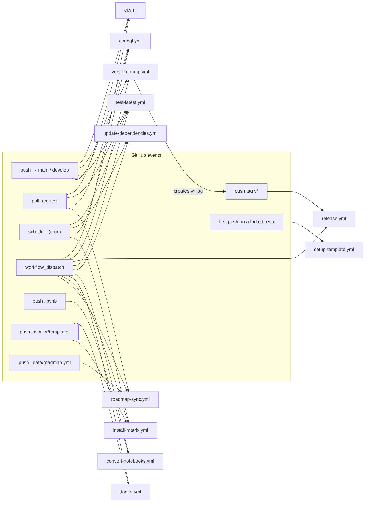
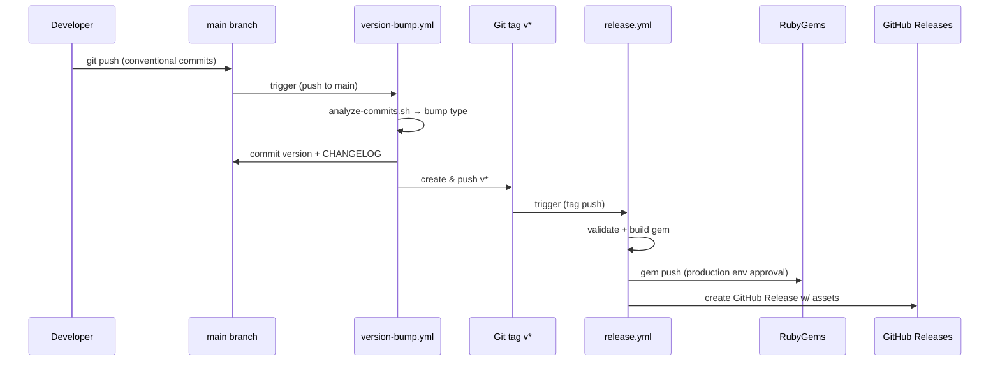
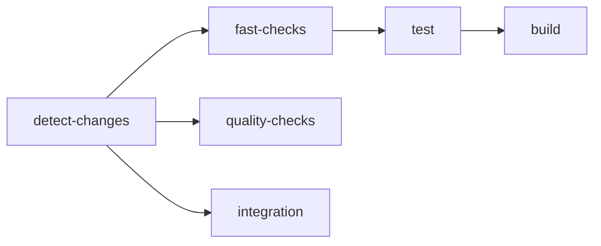
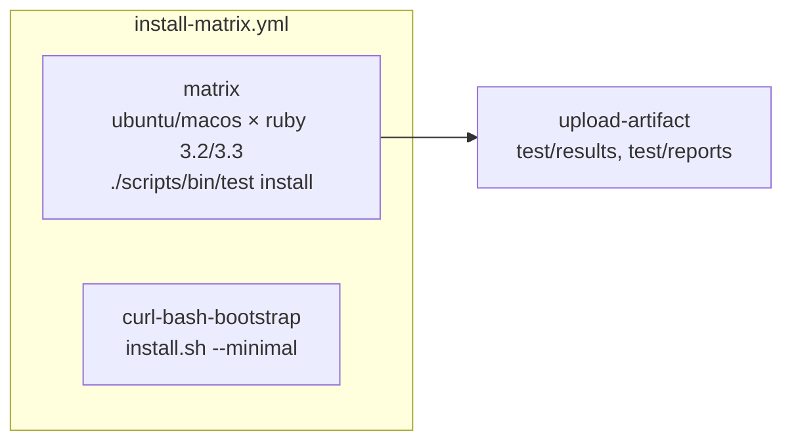

# GitHub Actions Workflows

This directory contains the CI/CD automation for the **zer0-mistakes** Jekyll
theme. Every workflow is path-filtered, concurrency-scoped, and built on the
shared composite actions in [`.github/actions/`](../actions/README.md).

## 📂 Inventory

| # | File | Purpose | Primary Triggers |
|---|------|---------|------------------|
| 1 | [`ci.yml`](./ci.yml) | Comprehensive CI pipeline (lint → test → build → integration) | `push`/`pull_request` to `main`/`develop`, manual |
| 2 | [`version-bump.yml`](./version-bump.yml) | Semantic version bump from conventional commits, creates `v*` tag | `push` to `main`, manual |
| 3 | [`release.yml`](./release.yml) | Publish gem to RubyGems + create GitHub Release | `push` of `v*` tag, manual |
| 4 | [`test-latest.yml`](./test-latest.yml) | Canary build with **no** dependency pins; promotes Docker tag | `push`/`pull_request` to `main`/`develop`, daily cron, manual |
| 5 | [`update-dependencies.yml`](./update-dependencies.yml) | Refresh `Gemfile.lock` and open a PR | weekly cron, manual |
| 6 | [`convert-notebooks.yml`](./convert-notebooks.yml) | Convert `.ipynb` → Jekyll Markdown and commit results | `push`/`pull_request` touching `pages/_notebooks/**`, manual |
| 7 | [`codeql.yml`](./codeql.yml) | CodeQL SAST for Actions, JS/TS, Python, Ruby | `push`/`pull_request` to `main` (code paths), weekly cron |
| 8 | [`doctor.yml`](./doctor.yml) | Run `install doctor` health checks across OSes | `push`/`pull_request` touching installer code, manual |
| 9 | [`install-matrix.yml`](./install-matrix.yml) | End-to-end installer tests across OS × Ruby + `curl\|bash` bootstrap | `push`/`pull_request` touching installer/templates, weekly cron, manual |
| 10 | [`roadmap-sync.yml`](./roadmap-sync.yml) | Regenerate the roadmap section of the root `README.md` from `_data/roadmap.yml` | `push` to `main`, PRs touching the data file or generator, manual |
| 11 | [`setup-template.yml`](./setup-template.yml) | One-shot template instantiation: opens a PR personalising `_config.yml` | first `push` to `main` in a downstream/forked repo |

## 🗺️ Trigger Map



## 🔁 Release Pipeline (push → tag → publish)



---

## 1. `ci.yml` — Comprehensive CI Pipeline

**Triggers:** `push`/`pull_request` to `main`/`develop`, `workflow_dispatch`.

Validates code quality, runs the test suite, builds the gem, and performs a
Docker integration test. Uses [`dorny/paths-filter`](https://github.com/dorny/paths-filter)
so that docs-only PRs skip the heavy jobs.

### Jobs

| Job | Purpose | Condition | Timeout |
|-----|---------|-----------|---------|
| `detect-changes` | Classify changes (code / docker / content) | always | 3 min |
| `fast-checks` | Quick syntax & smoke checks | code changes | 5 min |
| `quality-checks` | Lint, security audit, markdown checks | always (covers docs PRs) | 10 min |
| `test` | Full test suite (matrix on Ruby) + Playwright styling | code changes | 25 min |
| `build` | Build & validate the gem, run install smoke test | code changes | 10 min |
| `integration` | Docker build + critical-page accessibility | code or docker changes | 12 min |

### Job dependency graph



### Manual dispatch inputs

- `test_scope`: `fast` | `standard`
- `fix_markdown`: auto-fix markdown formatting

### Path-filter behaviour

| Change type | Jobs that run | Approx. runtime |
|-------------|---------------|------------------|
| Markdown / docs only | `detect-changes`, `quality-checks` | ~3 min |
| Code changes | All jobs | ~15 min |
| Docker changes | `detect-changes`, `quality-checks`, `integration` | ~8 min |

---

## 2. `version-bump.yml` — Semantic Version Management

**Triggers:** `push` to `main` (with extensive `paths-ignore`), `workflow_dispatch`.
Concurrency group `version-bump-main` (no cancel-in-progress).

### Automatic mode (push to `main`)

1. Compares `HEAD` to the last `v*` tag.
2. Runs [`scripts/analyze-commits.sh`](../../scripts/analyze-commits.sh) to map
   conventional commits to a bump type:
   - `feat:` → **minor**
   - `fix:` → **patch**
   - `BREAKING CHANGE:` (or `!`) → **major**
3. Updates `lib/jekyll-theme-zer0/version.rb`, `package.json`, and `CHANGELOG.md`.
4. Commits, then creates and pushes a `v*` tag (which triggers `release.yml`).

### Manual mode (`workflow_dispatch`)

| Input | Options | Description |
|-------|---------|-------------|
| `version_type` | `patch`, `minor`, `major`, `auto` | Bump type |
| `skip_tests` | `true` / `false` | Skip the validation test run |
| `dry_run` | `true` / `false` | Preview the change without committing |

### Skip conditions

The workflow exits early when:

- The commit message contains `chore: bump version`.
- The commit author is the `github-actions[bot]`.
- The change set only touches `CHANGELOG.md`, `version.rb`, `package.json`,
  `.github/workflows/**`, `README.md`, `docs/**`, `release_notes.md`, or `*.gem`.

---

## 3. `release.yml` — Gem Publishing & GitHub Release

**Triggers:** `push` of a `v*` tag, `workflow_dispatch`.

Unified release flow that publishes to RubyGems and produces a GitHub Release
with build artifacts attached.

### Jobs

| Job | Purpose | Condition |
|-----|---------|-----------|
| `validate` | Verify version consistency, run the test suite | always |
| `build` | Build the gem, generate the install script | after `validate` |
| `publish-gem` | Push gem to RubyGems | tag push, **or** manual with `publish_gem: true` |
| `github-release` | Create GitHub Release with assets | after `build` |

### Manual dispatch inputs

| Input | Type | Description |
|-------|------|-------------|
| `tag` | string | Tag to release (e.g. `v0.8.0`) |
| `publish_gem` | boolean | Publish to RubyGems |
| `draft` | boolean | Create as draft release |
| `prerelease` | boolean | Mark as prerelease |

### Environment & secrets

- **Environment:** `production` (manual approval gate before `publish-gem`).
- **Secret:** `RUBYGEMS_API_KEY` (required to push the gem).

---

## 4. `test-latest.yml` — Latest-Dependency Canary

**Triggers:** `push`/`pull_request` to `main`/`develop`, daily cron, manual.

Implements the **zero version-pin strategy**:

1. Build a Docker image with **no** dependency pins (no cache).
2. Run the full test suite (RSpec + HTMLProofer).
3. On success → tag and push an immutable Docker image (`date+commit`).
4. Document the resolved versions for debugging.

> ⚠️ This workflow is **expected to fail loudly** when an upstream dependency
> breaks compatibility — that is the canary behaviour.

---

## 5. `update-dependencies.yml` — Automated `Gemfile.lock` Refresh

**Triggers:** weekly cron, `workflow_dispatch`.
Concurrency group `update-dependencies` (cancel in-progress).
Permissions: `contents: write`, `pull-requests: write`.

Runs `bundle update`, commits the diff, and opens a PR for review. Existing CI
validates the update; merge if green, investigate if not.

---

## 6. `convert-notebooks.yml` — Jupyter Notebook Conversion

**Triggers:** `push`/`pull_request` touching `pages/_notebooks/**.ipynb` or
`scripts/convert-notebooks.sh`, manual (`force_reconvert` boolean input).

Converts notebooks to Jekyll-friendly Markdown via
[`scripts/convert-notebooks.sh`](../../scripts/convert-notebooks.sh). On `push`
events, the converted artifacts are committed back to the branch.

---

## 7. `codeql.yml` — CodeQL Security Scanning

**Triggers:** `push`/`pull_request` to `main` (code-file paths only), weekly cron.

Runs CodeQL static analysis for **Actions, JavaScript/TypeScript, Python, and
Ruby**. Path filters keep doc/content-only changes from triggering scans.

---

## 8. `doctor.yml` — Installer Health Checks

**Triggers:** `push`/`pull_request` touching the installer (`scripts/bin/install`,
`scripts/lib/install/doctor.sh`, `scripts/platform/**`), manual.

Runs `./scripts/bin/install doctor` on a matrix of OSes:

- `ubuntu-latest`
- `macos-latest`

The job parses the JSON output, asserts `fail == 0`, and additionally prints a
verbose human-readable run for log readability. See
[`.github/instructions/install.instructions.md`](../instructions/install.instructions.md)
for installer architecture context.

---

## 9. `install-matrix.yml` — Installer End-to-End Matrix

**Triggers:** `push`/`pull_request` touching `install.sh`, `scripts/bin/install`,
`scripts/lib/install/**`, `templates/profiles/**`, `templates/deploy/**`,
installer tests, or this workflow file. Also: weekly drift cron (Mondays
06:00 UTC) and manual.

### Jobs

| Job | Matrix | What it does |
|-----|--------|--------------|
| `matrix` | OS ∈ {ubuntu-latest, macos-latest} × Ruby ∈ {3.2, 3.3} | Runs `./scripts/bin/test install` (full installer e2e suite); uploads `test/results` and `test/reports` artifacts. |
| `curl-bash-bootstrap` | OS ∈ {ubuntu-latest, macos-latest} | Simulates a remote install by running `install.sh --minimal` against a clean target directory. Verifies `_config.yml`, `Gemfile`, and `index.md` are produced. |

> Ruby ≥ 3.2 is required because Bundler 2.7.x (pinned in `Gemfile.lock`) drops
> support for older Ruby versions.



---

## 10. `roadmap-sync.yml` — Roadmap Regeneration

**Triggers:** `push` to `main` touching `_data/roadmap.yml` or the generator
scripts; PRs touching those files, the generator, or `README.md`; manual.
Permissions: `contents: write`.

- **On PRs:** runs `ruby scripts/generate-roadmap.rb --check` and fails the
  build if the root `README.md`'s roadmap section is out of date — contributors
  must regenerate locally before merge.
- **On `push` / manual:** regenerates the README and commits the diff back with
  `[skip ci]` so the push does not retrigger CI.

---

## 11. `setup-template.yml` — Downstream Site Bootstrap

**Triggers:** first `push` to `main`. The `if:` guard
`github.repository != 'bamr87/zer0-mistakes'` means it **only runs in
forks/template instantiations**, never in the upstream repo.

When a downstream repo is created from this template, the workflow:

1. Detects the new owner/repo.
2. Confirms `_config.yml` still has the upstream defaults (`github_user` =
   `bamr87`).
3. Rewrites `_config.yml` with the new owner, repo, GitHub Pages URL, and
   `remote_theme: "bamr87/zer0-mistakes"`; clears analytics IDs.
4. Opens a welcome PR (`setup/initial-config`) prompting the new maintainer to
   merge the personalised configuration.

Permissions: `contents: write`, `pull-requests: write`.

---

## 🔐 Required Secrets & Environments

```yaml
# Secrets
GITHUB_TOKEN       # Auto-provided to every workflow
RUBYGEMS_API_KEY   # Required by release.yml → publish-gem

# Environments
production         # Manual approval gate guarding RubyGems publishing
```

## 🧱 Composite Actions

All workflows lean on the shared composite actions in
[`.github/actions/`](../actions/README.md):

| Action | Purpose |
|--------|---------|
| [`setup-ruby`](../actions/setup-ruby) | Ruby + Bundler setup with cache |
| [`configure-git`](../actions/configure-git) | Git identity for automated commits |
| [`test-suite`](../actions/test-suite) | Comprehensive test execution |
| [`quality-checks`](../actions/quality-checks) | Lint / audit / markdown checks |

## 🧪 Local Workflow Equivalents

```bash
# Preview a version bump (no commit/tag)
./scripts/release patch --dry-run

# Build the gem locally
./scripts/build

# Run the theme test suite
./test/test_runner.sh --verbose

# Run the same installer tests as install-matrix.yml
./scripts/bin/test install

# Run the same health checks as doctor.yml
./scripts/bin/install doctor
./scripts/bin/install doctor --json

# Reproduce the analyze-commits step used by version-bump.yml
./scripts/analyze-commits.sh HEAD~5..HEAD

# Regenerate the README roadmap section like roadmap-sync.yml
ruby scripts/generate-roadmap.rb            # write changes
ruby scripts/generate-roadmap.rb --check    # PR-style verification
```

## 🛠️ Troubleshooting

### Version bump did not trigger

- Commit subject contains `chore: bump version` (intentionally skipped).
- Commit author is `github-actions[bot]` (skipped to avoid loops).
- Your changes only match the `paths-ignore` list (CHANGELOG, version files,
  workflows, docs, etc.).

### Release workflow did not start

- Tag does not match the `v*` pattern (e.g., `release-0.8.0` is ignored).
- The version in `lib/jekyll-theme-zer0/version.rb` does not match the tag —
  the `validate` job will hard-fail.

### Gem publish failing

- `RUBYGEMS_API_KEY` secret missing or expired.
- The `production` environment approval has not been granted.
- That gem version already exists on RubyGems (you must bump again).

### Installer matrix failing

- New required tool not installed in the runner — update the
  `Install jq + python3` step in `install-matrix.yml`.
- Profile or deploy template added without an accompanying installer test —
  see [`.github/instructions/install.instructions.md`](../instructions/install.instructions.md).

### Roadmap PR check failing

- Run `ruby scripts/generate-roadmap.rb` locally and commit the README diff.

### CI failures

- Inspect the failing job's log; most jobs surface the actual command output.
- Reproduce locally with `./test/test_runner.sh` and `./scripts/build`.
- For Docker integration failures, run `docker-compose up --build` locally.
