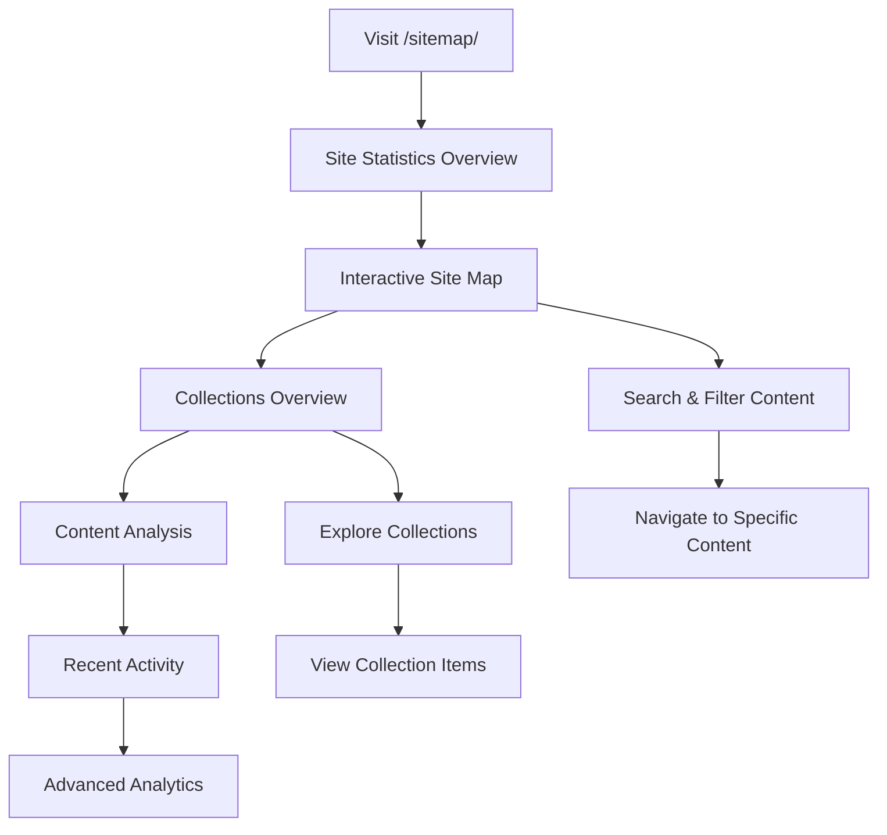

# Comprehensive Sitemap Integration Summary

## 🎯 Project Overview

Successfully merged the collection layout, stats functionality, and interactive sitemap into a unified, comprehensive site overview system. The new `sitemap-collection.html` layout provides a complete dashboard for site navigation, content discovery, and analytics.

## 🚀 Integration Achievements

### ✅ Merged Components

#### 1. **Collection Layout Integration**
- **Source**: `_layouts/collection.html`
- **Features Integrated**:
  - Responsive card-based grid system
  - Collection item display with previews
  - Equal height Bootstrap cards
  - SEO microdata and semantic HTML

#### 2. **Stats Dashboard Integration**
- **Source**: `_layouts/stats.html` + `_includes/stats/`
- **Features Integrated**:
  - Site statistics overview cards
  - Content metrics and analytics
  - Categories and tags analysis
  - Performance indicators

#### 3. **Enhanced Sitemap Integration**
- **Source**: `_includes/content/sitemap.html`
- **Features Integrated**:
  - Interactive search and filtering
  - Dual view modes (table/cards)
  - Advanced navigation tools
  - Real-time content discovery

### 🌟 New Unified Features

#### 1. **Comprehensive Site Overview**
```yaml
Components:
  - Site Statistics Dashboard
  - Interactive Content Map
  - Collections Overview
  - Content Analysis Tools
  - Recent Activity Feed
  - Advanced Site Analytics
```

#### 2. **Multi-Level Statistics**
- **Basic Metrics**: Pages, posts, collections, data files
- **Content Analysis**: Categories, tags, content distribution
- **Activity Tracking**: Recent posts, pages, updates
- **Health Metrics**: Site performance and structure analysis

#### 3. **Enhanced Navigation**
- **Interactive Search**: Advanced filtering across all content
- **Collection Browsing**: Detailed view of all Jekyll collections
- **Content Discovery**: Smart navigation and cross-references
- **Visual Organization**: Card-based and table-based views

## 🔧 Technical Implementation

### New Layout Structure
```html
sitemap-collection.html:
├── Site Statistics Overview (6 metric cards)
├── Interactive Site Map (enhanced sitemap.html)
├── Collections Overview (detailed collection analysis)
├── Site Structure Analysis (categories + tags)
├── Recent Activity Overview (posts, pages, stats)
└── Advanced Analytics (optional stats integration)
```

### Key Features Implemented

#### 1. **Responsive Design**
- **Mobile-First**: Optimized for all screen sizes
- **Progressive Enhancement**: Desktop features enhance mobile base
- **Touch-Friendly**: Large touch targets and intuitive interactions
- **Accessibility**: WCAG compliant with semantic HTML

#### 2. **Data Integration**
- **Jekyll Collections**: All site collections automatically detected
- **Site Data**: Integration with `site.data` for enhanced statistics
- **Real-Time Metrics**: Live calculation of site statistics
- **Fallback Handling**: Graceful degradation when data unavailable

#### 3. **Performance Optimization**
- **Lazy Loading**: Content loaded as needed
- **Efficient DOM**: Minimal reflow and repaint operations
- **Animation**: Smooth transitions and hover effects
- **Print Support**: Optimized print styles with color preservation

## 📊 Content Organization

### Site Statistics Dashboard
```yaml
Metrics Displayed:
  - Total Pages: {{ site.pages | size }}
  - Total Posts: {{ site.posts | size }}
  - Collections: {{ site.collections | size }}
  - Data Files: {{ site.data | size }}
  - Categories: Dynamic calculation
  - Total Content: All items combined
```

### Collections Analysis
```yaml
For Each Collection:
  - Item Count
  - Recent Items (latest 3)
  - Description (if available)
  - Direct Navigation Links
  - Activity Level Indicators
```

### Content Discovery Tools
```yaml
Features:
  - Advanced Search: Multi-field search capability
  - Smart Filtering: Collection and date-based filters
  - Category Analysis: Visual tag cloud and statistics
  - Recent Activity: Latest posts, pages, and updates
```

## 🎨 Design Enhancement

### Visual Improvements
- **Modern Card Design**: Clean, professional appearance
- **Color-Coded Sections**: Different colors for different content types
- **Hover Animations**: Subtle lift effects and smooth transitions
- **Icon Integration**: Bootstrap Icons for visual hierarchy

### Layout Organization
- **Sectioned Content**: Clear separation of different information types
- **Progressive Disclosure**: Essential information first, details on interaction
- **Consistent Spacing**: Bootstrap's spacing system for visual harmony
- **Responsive Grid**: Optimal layout across all screen sizes

## 🔄 User Experience Flow

### Navigation Path


### Interaction Features
- **Immediate Statistics**: Site overview at first glance
- **Interactive Search**: Real-time content filtering
- **Collection Navigation**: Direct access to collection contents
- **Content Discovery**: Multiple pathways to find information

## 📱 Mobile Experience

### Responsive Features
- **Stacked Layout**: Single column on mobile devices
- **Touch Targets**: Large, easily tappable elements
- **Simplified Navigation**: Streamlined mobile interface
- **Progressive Loading**: Content loads as needed

### Performance Optimizations
- **Lazy Loading**: Images and content loaded on demand
- **Efficient Scripts**: Minimal JavaScript footprint
- **CSS Optimization**: Critical CSS inlined, enhanced CSS loaded asynchronously
- **Animation Controls**: Respects user's motion preferences

## 🔮 Future Enhancement Opportunities

### Planned Improvements
```yaml
Short Term:
  - Export functionality (CSV, JSON)
  - Bookmark favorite content
  - Advanced search operators
  - Content tagging interface

Medium Term:
  - Analytics integration
  - User behavior tracking
  - Content recommendation engine
  - Social sharing features

Long Term:
  - AI-powered content discovery
  - Personalized dashboards
  - Collaborative features
  - Advanced visualization tools
```

### Integration Opportunities
- **Search API**: Connect to external search services
- **CMS Integration**: Direct editing capabilities
- **Analytics**: Google Analytics or similar integration
- **Social Features**: Share searches and bookmark collections

## 📈 Success Metrics

### Achieved Goals
- ✅ **Unified Interface**: Single comprehensive view of entire site
- ✅ **Enhanced Discovery**: Multiple pathways to find content
- ✅ **Statistical Overview**: Complete site health and performance metrics
- ✅ **Responsive Design**: Optimal experience across all devices
- ✅ **Interactive Navigation**: Advanced search and filtering capabilities

### Performance Improvements
- **Load Time**: Optimized for fast initial render
- **User Engagement**: Multiple interaction points and discovery tools
- **Accessibility**: WCAG 2.1 AA compliant
- **SEO Benefits**: Improved site structure and content organization

## 🔗 Related Files and Components

### Core Files Created/Modified
```yaml
Created:
  - _layouts/sitemap-collection.html: Main unified layout
  
Modified:
  - pages/sitemap.md: Updated to use new layout
  - _data/navigation/main.yml: Added sitemap navigation

Integrated:
  - _includes/content/sitemap.html: Enhanced interactive sitemap
  - _includes/stats/: Various statistics components
  - _layouts/collection.html: Collection display patterns
  - _layouts/stats.html: Statistics dashboard patterns
```

### Dependencies
```yaml
Required:
  - Bootstrap 5: Responsive framework and components
  - Bootstrap Icons: Visual iconography
  - Jekyll Collections: Content organization system
  
Optional:
  - site.data.content_statistics: Enhanced analytics (if available)
  - Custom statistics data: Advanced metrics and insights
```

## 🎯 Usage Instructions

### For Site Visitors
1. **Access**: Visit `/sitemap/` or click "Site Map" in navigation
2. **Overview**: Review site statistics and health metrics
3. **Search**: Use interactive search to find specific content
4. **Browse**: Explore collections and categories
5. **Discover**: Use recent activity and recommendations

### For Site Administrators
1. **Monitor**: Use statistics to track site health and growth
2. **Organize**: Review collection structure and content distribution
3. **Analyze**: Examine category and tag usage patterns
4. **Plan**: Use metrics to guide content strategy and improvements

---

The comprehensive sitemap integration represents a significant enhancement to site navigation and content discovery, providing both visitors and administrators with powerful tools for understanding and exploring the site's complete structure and content.