[](https://github.com/bamr87/zer0-mistakes/actions/workflows/pages/pages-build-deployment)
[](https://badge.fury.io/rb/jekyll-theme-zer0)
[](https://github.com/bamr87/zer0-mistakes/actions/workflows/ci.yml)
[](https://opensource.org/licenses/MIT)
[](https://github.com/bamr87/zer0-mistakes/blob/main/docker-compose.yml)
[](https://getbootstrap.com/)

# 🚀 zer0-mistakes

### The Self-Healing Jekyll Theme

**Docker-first • AI-powered • Privacy-compliant • Zero-configuration**

[Quick Start](#-quick-start) • [Features](#-key-features) • [Documentation](#-documentation) • [Contributing](CONTRIBUTING.md)

---

## 📖 Table of Contents

- [Overview](#overview)
- [Quick Start](#-quick-start)
- [Architecture](#-architecture)
- [Key Features](#-key-features)
- [Installation Methods](#-installation-methods)
- [Project Structure](#-project-structure)
- [Development Workflow](#-development-workflow)
- [Deployment](#-deployment)
- [Documentation](#-documentation)
- [Release System](#-release-system)
- [Roadmap](#-roadmap)
- [Contributing](#-contributing)
- [Support](#-support)

---

## Overview

**zer0-mistakes** is a professional Jekyll theme engineered to eliminate setup friction and provide a seamless development experience. With AI-powered error recovery, Docker containerization, and comprehensive automation, you can go from zero to deployed in under 5 minutes.

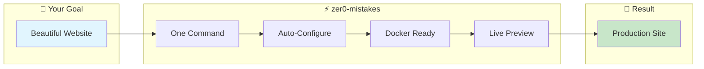

### Why zer0-mistakes?

| Challenge | Traditional Jekyll | zer0-mistakes |
|-----------|-------------------|---------------|
| **Setup Time** | 15-30 minutes | **2-5 minutes** |
| **Success Rate** | ~60% | **~95%** |
| **Platform Support** | Limited | **Universal** |
| **Error Handling** | Manual debugging | **Self-healing** |
| **Dependencies** | Ruby + Bundler + Jekyll | **Docker only** |

---

## 🚀 Quick Start

### Prerequisites

- **Docker Desktop** ([download](https://www.docker.com/products/docker-desktop))
- **Git** ([download](https://git-scm.com/))

### One-Line Installation

```bash
mkdir my-site && cd my-site && curl -fsSL https://raw.githubusercontent.com/bamr87/zer0-mistakes/main/install.sh | bash
```

### Start Development

```bash
docker-compose up
# 🌐 Open http://localhost:4000
```

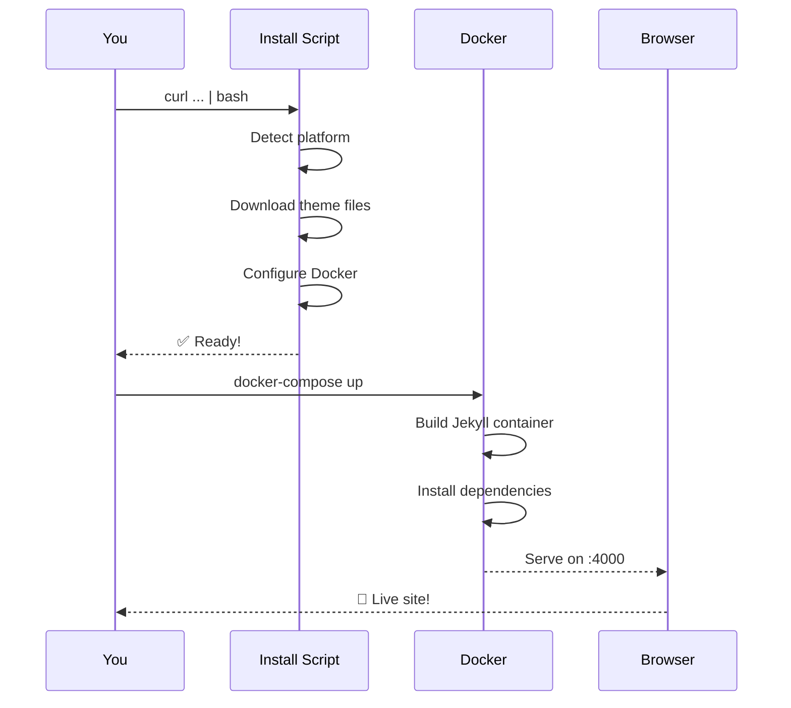

---

## 🏗 Architecture

### System Overview

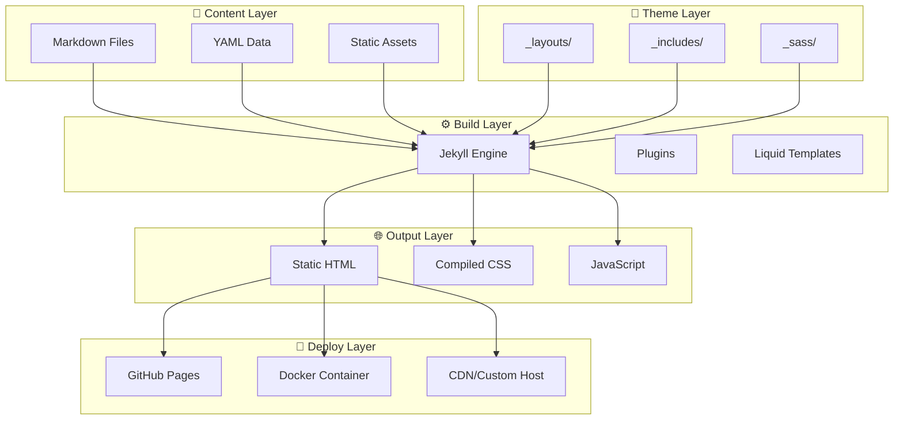

### Technology Stack

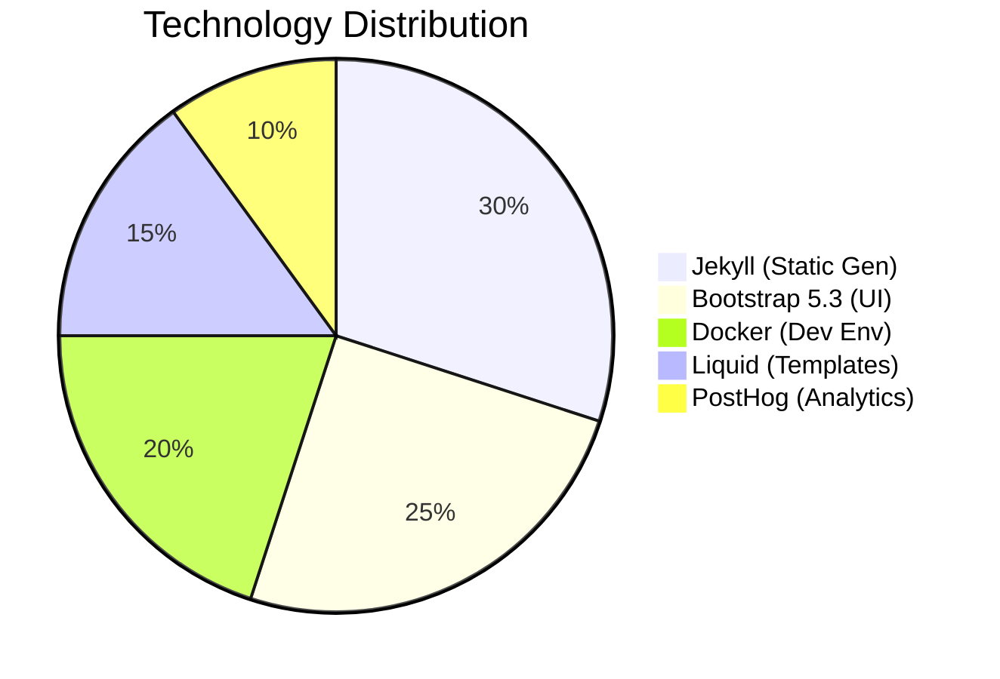

| Layer | Technology | Purpose |
|-------|-----------|---------|
| **Framework** | Jekyll 3.9.5 | Static site generation |
| **Styling** | Bootstrap 5.3.3 | Responsive UI components |
| **Development** | Docker | Cross-platform consistency |
| **Templates** | Liquid | Dynamic content rendering |
| **Analytics** | PostHog | Privacy-first tracking |
| **Diagrams** | Mermaid 10+ | Documentation visuals |

---

## ✨ Key Features

### 🤖 AI-Powered Installation

The 1,090-line `install.sh` script provides intelligent error recovery with 27+ automated fix scenarios:

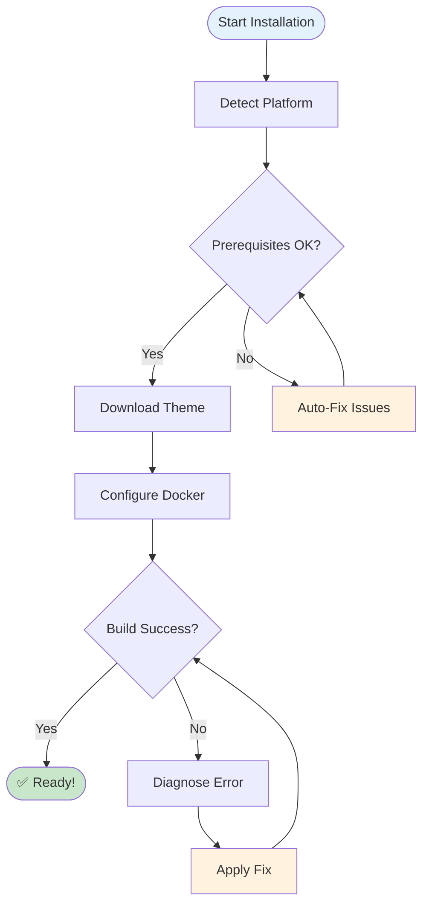

### 🐳 Docker-First Development

Zero local dependencies required. Works identically across all platforms:

```yaml
# docker-compose.yml - That's all you need!
services:
  jekyll:
    image: jekyll/jekyll:latest
    platform: linux/amd64
    command: jekyll serve --config "_config.yml,_config_dev.yml"
    ports: ["4000:4000"]
    volumes: ["./:/app"]
```

### 🔒 Privacy-First Analytics

GDPR/CCPA compliant PostHog integration with granular consent:

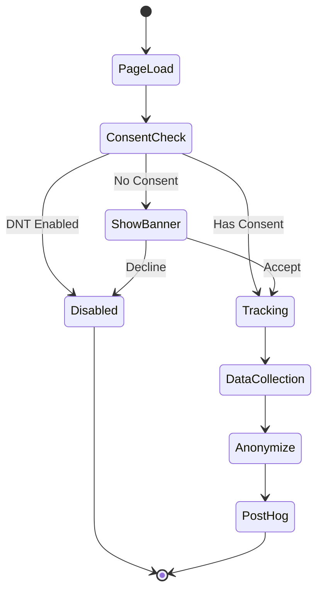

### 📊 Mermaid Diagram Support

10+ diagram types with GitHub Pages compatibility:

| Type | Syntax | Use Case |
|------|--------|----------|
| Flowchart | `graph TD` | Process flows |
| Sequence | `sequenceDiagram` | Interactions |
| Class | `classDiagram` | OOP structures |
| State | `stateDiagram-v2` | State machines |
| ER | `erDiagram` | Database schemas |
| Gantt | `gantt` | Timelines |
| Pie | `pie` | Distributions |
| Git | `gitGraph` | Branch history |

### 📓 Jupyter Notebook Support

Seamless integration for data science and computational content:

- **Automatic Conversion**: `.ipynb` → Markdown with front matter
- **Output Rendering**: Code execution results, plots, tables preserved
- **Image Extraction**: Matplotlib/PNG outputs → `/assets/images/notebooks/`
- **GitHub Actions**: Automated conversion on push to `pages/_notebooks/`
- **MathJax Support**: LaTeX equations rendered with `$$` syntax
- **Syntax Highlighting**: Code cells with Rouge highlighting
- **Responsive Layout**: Mobile-friendly notebook viewer

```bash
# Convert notebooks
./scripts/convert-notebooks.sh

# Add to _config.yml
collections:
  notebooks:
    output: true
    permalink: /notebooks/:name/
```

---

## 📦 Installation Methods

### Method 1: AI-Powered Install (Recommended)

```bash
curl -fsSL https://raw.githubusercontent.com/bamr87/zer0-mistakes/main/install.sh | bash
```

### Method 2: Remote Theme (GitHub Pages)

```yaml
# _config.yml
remote_theme: "bamr87/zer0-mistakes"
plugins:
  - jekyll-remote-theme
```

### Method 3: Fork & Customize

```bash
gh repo fork bamr87/zer0-mistakes --clone
cd zer0-mistakes
docker-compose up
```

### Method 4: Ruby Gem

```ruby
# Gemfile
gem "jekyll-theme-zer0", "~> 0.10"
```

---

## 📁 Project Structure

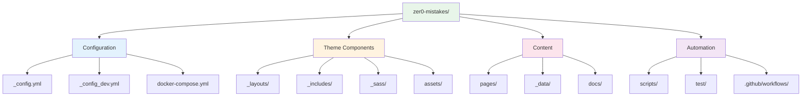

### Key Directories

| Directory | Purpose | Key Files |
|-----------|---------|-----------|
| `_layouts/` | Page templates | `default.html`, `journals.html`, `landing.html` |
| `_includes/` | Reusable components | `core/`, `components/`, `analytics/` |
| `_sass/` | Stylesheets | `custom.scss`, `core/` |
| `assets/` | Static files | `css/`, `js/`, `images/` |
| `scripts/` | Automation | `release`, `build`, `version.sh` |
| `docs/` | Technical docs | `features/`, `systems/`, `releases/` |

---

## 🔄 Development Workflow

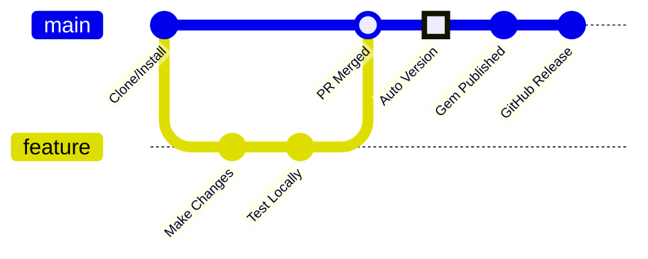

### Daily Development

```bash
# Start development server
docker-compose up

# Make changes (auto-reload enabled)
# Edit files in _layouts/, _includes/, pages/

# Run tests
./test/test_runner.sh

# Commit changes
git commit -m "feat: add new component"
```

### Testing Commands

```bash
# Quick validation
./test/validate_installation.sh

# Full test suite
./test/test_runner.sh --verbose

# Docker-specific tests
./test/test_docker_deployment.sh
```

---

## 🚀 Deployment

### GitHub Pages (Automatic)

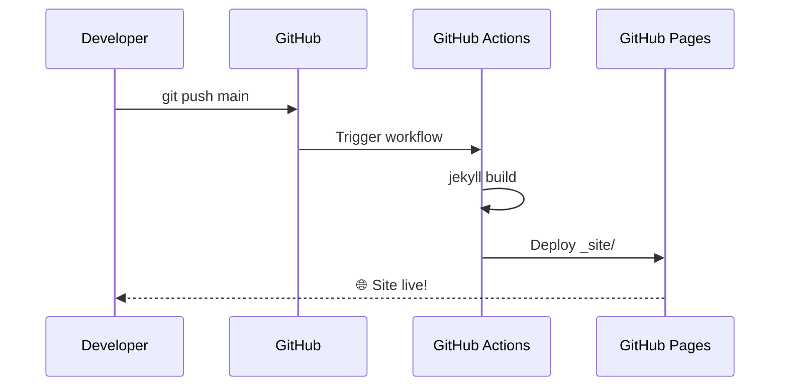

1. Push to `main` branch
2. GitHub Actions builds automatically
3. Site deploys to GitHub Pages

### Docker Production

```bash
docker-compose -f docker-compose.prod.yml up -d
```

### Custom Hosting

```bash
# Build static site
docker-compose run --rm jekyll jekyll build

# Deploy _site/ to any static host
```

---

## 📚 Documentation

### Documentation Architecture

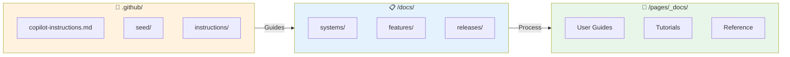

### Quick Links

| Resource | Description |
|----------|-------------|
| [📋 Technical Docs](docs/) | Architecture, systems, implementation |
| [📖 User Guides](pages/_docs/) | Published tutorials and references |
| [🤖 Copilot Instructions](.github/copilot-instructions.md) | AI development guidelines |
| [🌱 Seed Documentation](.github/seed/) | Full reconstruction blueprints |
| [📝 PRD](PRD.md) | Product requirements & roadmap |

---

## 🔧 Release System

### Automated Release Pipeline

```mermaid
flowchart LR
    subgraph Trigger["🎯 Trigger"]
        COMMIT[Commit to main]
    end
    
    subgraph Analyze["🔍 Analyze"]
        PARSE[Parse Commits]
        BUMP[Determine Version]
    end
    
    subgraph Build["⚙️ Build"]
        CHANGE[Update CHANGELOG]
        VERSION[Bump Version]
        TEST[Run Tests]
        GEM[Build Gem]
    end
    
    subgraph Publish["🚀 Publish"]
        RUBYGEMS[Push to RubyGems]
        GHREL[GitHub Release]
        TAG[Git Tag]
    end
    
    COMMIT --> PARSE --> BUMP
    BUMP --> CHANGE --> VERSION --> TEST --> GEM
    GEM --> RUBYGEMS --> GHREL --> TAG
```

### Release Commands

```bash
# Preview release
/opt/homebrew/bin/bash scripts/release patch --dry-run

# Full release
/opt/homebrew/bin/bash scripts/release patch  # 0.10.3 → 0.10.4
/opt/homebrew/bin/bash scripts/release minor  # 0.10.3 → 0.11.0
/opt/homebrew/bin/bash scripts/release major  # 0.10.3 → 1.0.0
```

---

## 🗺 Roadmap

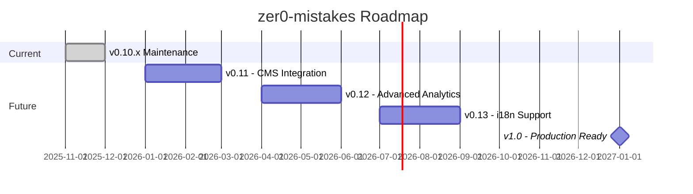

| Version | Target | Features |
|---------|--------|----------|
| **v0.11** | Q1 2026 | Headless CMS integration, content API |
| **v0.12** | Q2 2026 | A/B testing, conversion funnels |
| **v0.13** | Q3 2026 | Multi-language support (i18n) |
| **v1.0** | Q1 2027 | Stable API, 90%+ test coverage |

---

## 🤝 Contributing

We welcome contributions! See [CONTRIBUTING.md](CONTRIBUTING.md) for guidelines.

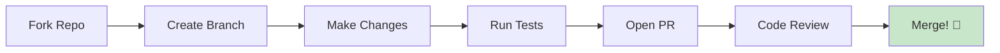

### Quick Contribution

```bash
# Fork and clone
gh repo fork bamr87/zer0-mistakes --clone
cd zer0-mistakes

# Create feature branch
git checkout -b feature/awesome-feature

# Make changes and test
docker-compose up
./test/test_runner.sh

# Submit PR
git push origin feature/awesome-feature
```

---

## 📞 Support

| Channel | Link |
|---------|------|
| 📖 Documentation | [zer0-mistakes.org](https://bamr87.github.io/zer0-mistakes/) |
| 🐛 Issues | [GitHub Issues](https://github.com/bamr87/zer0-mistakes/issues) |
| 💬 Discussions | [GitHub Discussions](https://github.com/bamr87/zer0-mistakes/discussions) |
| 📧 Email | [support@zer0-mistakes.com](mailto:support@zer0-mistakes.com) |

---

## 📊 Project Stats

| Metric | Value |
|--------|-------|
| **Current Version** | 0.10.3 |
| **Installation Success** | ~95% |
| **Setup Time** | 2-5 minutes |
| **RubyGems Downloads** | 2,500+ |
| **Documentation** | 17,500+ lines |
| **Lighthouse Score** | 95+ |

---

## 🙏 Acknowledgments

Built with these amazing technologies:

- [Jekyll](https://jekyllrb.com/) - Static site generation
- [Bootstrap](https://getbootstrap.com/) - UI framework
- [Docker](https://docker.com/) - Containerization
- [PostHog](https://posthog.com/) - Privacy-first analytics
- [Mermaid](https://mermaid.js.org/) - Diagram rendering
- [GitHub Copilot](https://github.com/features/copilot) - AI assistance

---

**Built with ❤️ for the Jekyll community**

**v0.10.3** • [Changelog](CHANGELOG.md) • [License](LICENSE) • [Contributing](CONTRIBUTING.md)


