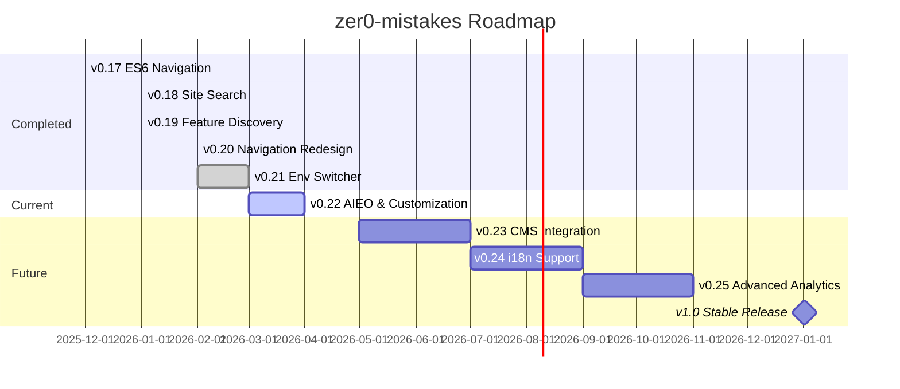

[](https://github.com/bamr87/zer0-mistakes/actions/workflows/pages/pages-build-deployment)
[](https://badge.fury.io/rb/jekyll-theme-zer0)
[](https://github.com/bamr87/zer0-mistakes/actions/workflows/ci.yml)
[](https://opensource.org/licenses/MIT)
[](https://github.com/bamr87/zer0-mistakes/blob/main/docker-compose.yml)
[](https://getbootstrap.com/)
[](AGENTS.md)
[](#-aieo-optimized--built-for-ai-citation)

# zer0-mistakes

### A modern website theme that just works — for blogs, docs, portfolios, and more

**Free • Open source • Hosted on GitHub Pages for $0/month • Works on Mac, Windows, and Linux**

`zer0-mistakes` is a ready-made website you can publish in **under five minutes**, with no design skills, no servers to manage, and almost nothing to install. Pick a template, write your content in plain text, and push to GitHub — your site is live.

If you already know Jekyll, Ruby, Docker, or AI coding agents: the same theme grows with you into a fully programmable platform with self-healing install scripts, multi-agent guidance for Copilot / Cursor / Claude, AI-generated preview images, and automated semantic releases to RubyGems. Beginners can skip those parts entirely.

[Get Started in 5 Minutes](#-get-started-in-5-minutes) • [What You Get](#-what-you-get) • [Who It's For](#-who-its-for) • [Advanced & AI Features](#-advanced-features-for-power-users) • [Live Demo](https://zer0-mistakes.com/)

---

## ✨ What You Get

A complete, professional website out of the box — no design or coding required to start:

- 📝 **Pages, posts, and a blog** — write in Markdown, organize with tags and categories
- 🎨 **Beautiful responsive design** — looks great on phones, tablets, and desktops
- 🌗 **Light and dark mode** — automatic, with a one-click toggle
- 🔍 **Built-in site search** — press `/` or `Ctrl/Cmd+K` from anywhere
- 🧭 **Smart navigation** — sidebar, breadcrumbs, table of contents
- 🔒 **Privacy-friendly** — cookie consent and GDPR/CCPA compliant analytics already wired up
- 📊 **Diagrams and math** — Mermaid charts and LaTeX equations work out of the box
- 📓 **Jupyter notebooks** — drop in `.ipynb` files and they render as posts
- 🧠 **Obsidian-friendly** — edit your site as an Obsidian vault, `[[wiki-links]]` and all
- ⚙️ **Free hosting on GitHub Pages** — no servers, no monthly bill

> **Want to see it in action?** Visit the [live demo site](https://zer0-mistakes.com/) — it's built with this exact theme.

---

## 👥 Who It's For

| If you are… | You'll love that… |
|---|---|
| **A writer or blogger** | You just write Markdown. The theme handles the design. |
| **A student or teacher** | You can publish lecture notes, notebooks, and reading lists for free on GitHub Pages. |
| **A maker, artist, or creator** | You get a portfolio-quality landing page with image galleries and project pages. |
| **A small business or community** | You ship a polished marketing site without paying for hosting or a CMS. |
| **A developer or technical team** | You get Docker-first dev, semantic-versioned releases, ES6 navigation modules, design tokens, and a full test suite. |
| **An AI-assisted builder** | The theme ships with first-class guidance for GitHub Copilot, Cursor, Claude Code, Codex, Aider, and any [agents.md](https://agents.md/)-aware tool. |

---

## 🚀 Get Started in 5 Minutes

You only need a free [GitHub account](https://github.com/signup). Pick the path that matches your comfort level:

### Path A — Easiest: Fork on GitHub (no terminal required)

1. Click **[Fork](https://github.com/bamr87/zer0-mistakes/fork)** on the repo page.
2. Rename your fork to **`<your-username>.github.io`** (this turns it into a free website at that URL).
3. Go to **Settings → Pages → Build and deployment** and select **Deploy from a branch → `main`**.
4. Wait ~1 minute. Visit `https://<your-username>.github.io` — your site is live.
5. Edit `_config.yml` and any `*.md` file directly on GitHub to make it yours.

### Path B — Three-file starter (still no install)

Want the lightest possible setup? Create a new repo with just these three files and push it to GitHub. The theme is loaded over the network — there's nothing to download.

```text
my-site/
├── _config.yml      ← title + remote theme link
├── Gemfile          ← github-pages + jekyll-remote-theme
└── index.md         ← your homepage content
```

Full file contents and the in-browser setup wizard are in the [Bare-Minimum Starter](#-bare-minimum-starter-3-files-zero-install) section below.

### Path C — Local development with Docker

If you want a live-reload preview on your own computer, you'll need [Docker Desktop](https://www.docker.com/products/docker-desktop) (free) and [Git](https://git-scm.com/).

```bash
mkdir my-site && cd my-site && curl -fsSL https://raw.githubusercontent.com/bamr87/zer0-mistakes/main/install.sh | bash
docker-compose up
# Open http://localhost:4000 in your browser
```

The installer auto-detects your operating system, sets up Docker, downloads the theme, and recovers from common errors. Total time: 2–5 minutes.

---

## ⚡ Why People Pick zer0-mistakes

| | Most starter themes | zer0-mistakes |
|---|---|---|
| **Setup** | Install Ruby, install Bundler, install Jekyll, hope for the best | One command, or just fork a repo |
| **Works on Apple Silicon, Windows, Linux** | Sometimes | Always (Docker-first) |
| **First-time success rate** | ~60% | ~95% (self-healing install) |
| **Looks good immediately** | Needs CSS tweaking | Bootstrap 5.3 design system, ready to ship |
| **Hosting cost** | $5–20/month | $0 (GitHub Pages) |
| **AI coding-agent support** | None | Built-in for Copilot, Cursor, Claude, Codex, Aider |
| **AI-generated post previews** | None | One-command image generation |
| **Release & changelog management** | Manual | Automated semantic versioning |

---

## 🎯 Bare-Minimum Starter (3 files, zero install)

Don't want to run the installer? You can publish a working site to GitHub
Pages with **just three files** in your repo. The remote theme provides every
layout, style, and even an in-browser configuration wizard.

```text
my-site/
├── _config.yml      ← site configuration (remote_theme: bamr87/zer0-mistakes)
├── Gemfile          ← github-pages + jekyll-remote-theme
└── index.md         ← layout: welcome
```

`_config.yml`:

```yaml
title:        "My Site"
description:  "A site rendered by the zer0-mistakes remote theme."
remote_theme: bamr87/zer0-mistakes
plugins:
  - jekyll-remote-theme
  - jekyll-feed
  - jekyll-sitemap
  - jekyll-seo-tag
site_configured: false   # show the welcome wizard until you flip this to true
```

`Gemfile`:

```ruby
source "https://rubygems.org"
gem "github-pages", group: :jekyll_plugins
gem "jekyll-remote-theme"
gem "webrick", "~> 1.7"
```

`index.md`:

```markdown
---
layout: welcome
title: Home
---

# Welcome to my site
```

Push to a GitHub Pages–enabled repository and visit your site. Until you set
`site_configured: true`, the home page renders the **welcome layout** — a hero
card and a full in-browser wizard that generates a personalised `_config.yml`
you can download. Flip the flag (or fill in `title`/`founder`/`email`) and your
own content takes over.

---

## 🧰 Advanced Features for Power Users

Everything below is **optional**. Beginners can ignore it and still ship a great site. Developers and AI-assisted builders, this is where `zer0-mistakes` becomes a fully programmable platform.

Jump to a topic:

- [AI-native workflow](#-ai-native-workflow) — multi-agent guidance, AI install wizard, AI preview images, AIEO discovery
- [Architecture & technology stack](#-architecture)
- [Key features in depth](#-key-features) — installer CLI, site scraper, Docker, analytics, search, navigation, dark mode
- [Installation methods](#-installation-methods) — one-liner, modular CLI, remote theme, fork, Ruby gem
- [Project structure](#-project-structure)
- [Migration utility](#️-migration-utility--add-admin-pages-to-an-existing-site)
- [Development workflow & testing](#-development-workflow)
- [Deployment options](#-deployment)
- [Documentation map](#-documentation)
- [Release system & GitHub Actions automation](#-release-system)
- [Roadmap](#-roadmap)
- [AIEO — built for AI citation](#-aieo-optimized--built-for-ai-citation)

---

## 🤖 AI-Native Workflow

> **Who this is for:** anyone using GitHub Copilot, Cursor, Claude Code, Codex, Aider, Continue, or Jules. If you don't use an AI coding assistant, you can skip this section — the rest of the theme works without any AI configuration.

zer0-mistakes treats AI as core infrastructure across **install → author → build → release → discover**. Every layer is wired for **automation, facilitation, and integration** with the AI tools you already use — with one consistent guidance layer in `.github/` and `AGENTS.md` that every major agent picks up automatically.

### What's wired for AI

| Capability | What it does | Where it lives |
|---|---|---|
| **Self-healing install** | Detects platform, fixes Docker/Jekyll issues, retries with fallbacks | [`install.sh`](install.sh) |
| **Modular installer CLI** | Spec-driven `init`, `wizard`, `agents`, `deploy`, `doctor`, `scrape` subcommands; declarative profiles; deploy plugins (GitHub Pages, Azure SWA, Docker) | [`scripts/bin/install`](scripts/bin/install), [`scripts/install/`](scripts/install/) |
| **AI wizard** | `install wizard --ai` generates a site spec via OpenAI, records AI provenance, falls back to profile defaults | [`scripts/install/ai/wizard.sh`](scripts/install/ai/wizard.sh) |
| **Site scraper** | `install init --scrape <URL>` — BFS-crawls any site, classifies pages by kind, downloads assets, wires nav, seeds config; zero post-processing needed | [`scripts/install/scrape.sh`](scripts/install/scrape.sh), [`scripts/install/scrape_html.py`](scripts/install/scrape_html.py) |
| **Cross-tool agent guide** | Single entry point for any [agents.md](https://agents.md/)-aware AI tool | [`AGENTS.md`](AGENTS.md) |
| **Copilot project context** | Architecture, conventions, commands, release flow | [`.github/copilot-instructions.md`](.github/copilot-instructions.md) |
| **File-scoped instructions** | `applyTo:` globs auto-load guidance for `_layouts/`, `_includes/`, `scripts/`, `test/`, `docs/`, version files | [`.github/instructions/`](.github/instructions/) |
| **Reusable agent prompts** | `commit-publish`, `frontmatter-maintainer`, `seed` (full-rebuild blueprint) | [`.github/prompts/`](.github/prompts/) |
| **Cursor slash-commands** | Mirrors prompts as `/commit-publish`, `/frontend-run-improve` | [`.cursor/commands/`](.cursor/commands/) |
| **AI preview images** | Jekyll plugin + script generate OpenAI/DALL·E images for posts missing previews | [`_plugins/preview_image_generator.rb`](_plugins/preview_image_generator.rb), [`scripts/generate-preview-images.sh`](scripts/generate-preview-images.sh) |
| **AI release pipeline** | Conventional-commit analyzer chooses MAJOR/MINOR/PATCH, writes CHANGELOG, tags & publishes | [`scripts/analyze-commits.sh`](scripts/analyze-commits.sh), [`scripts/bin/release`](scripts/bin/release) |
| **AIEO content layer** | `SoftwareApplication`, `WebPage`, `FAQPage`, `Person` JSON-LD; glossary; FAQ; dated roadmap | [See AIEO section](#-aieo-optimized--built-for-ai-citation) |

### Quick AI tasks

```bash
# Generate AI preview images for posts missing previews (needs OPENAI_API_KEY)
./scripts/generate-preview-images.sh --collection posts

# Preview before generating (no API calls)
./scripts/generate-preview-images.sh --dry-run --verbose

# Let AI analyze commits and propose the next version bump
./scripts/analyze-commits.sh HEAD~10..HEAD

# Run the AI-facilitated release pipeline (validate → version → changelog → publish)
./scripts/bin/release patch --dry-run

# Clone any existing website into a zer0-mistakes site (no OPENAI_API_KEY required)
./scripts/bin/install init ./my-clone --scrape https://example.com --scrape-depth 2

# Use the AI wizard to interactively generate a site spec (needs OPENAI_API_KEY)
./scripts/bin/install wizard --ai ./my-site
```

### Drop-in for any AI editor

Clone the repo (or fork) and your editor's AI agent will pick up project context automatically:

- **GitHub Copilot / VS Code** → reads [`.github/copilot-instructions.md`](.github/copilot-instructions.md) + `.github/instructions/*.instructions.md`
- **Cursor** → reads `.cursor/commands/` for slash-commands; falls back to `AGENTS.md`
- **Claude Code / Codex / Aider / Jules / Continue** → read [`AGENTS.md`](AGENTS.md) per the [agents.md](https://agents.md/) convention
- **Custom agents** → Load layered guidance from [`.github/`](.github/) on demand

> No configuration required. The guidance is layered — agents read only what's needed for the file they're touching.

---

## 🏗 Architecture

> **Who this is for:** developers, theme customizers, and anyone integrating zer0-mistakes into a larger system. If you only want to publish a blog, you can skip ahead to [Key Features](#-key-features) or [Installation Methods](#-installation-methods).

zer0-mistakes is a layered system: your content (Markdown + YAML) flows through the theme's templates, gets compiled by Jekyll, and is published as a fully static site that any host can serve. Every layer is replaceable without affecting the others.

### Technology Stack

| Layer | Technology | Purpose |
|-------|-----------|---------|
| **Framework** | Jekyll 3.9.5 | Static site generation |
| **Styling** | Bootstrap 5.3.3 | Responsive UI components |
| **Icons** | Bootstrap Icons | Unified iconography |
| **Development** | Docker | Cross-platform consistency |
| **Templates** | Liquid | Dynamic content rendering |
| **AI Agents** | Copilot · Codex · Cursor · Claude Code · Aider · Jules · Continue | Multi-tool agentic development via [`AGENTS.md`](AGENTS.md) + `.github/instructions/` |
| **AI Content** | OpenAI Images API | AI-generated preview images via [`_plugins/preview_image_generator.rb`](_plugins/preview_image_generator.rb) |
| **AI Automation** | Conventional-commit analyzer | Auto semantic versioning + changelog ([`scripts/analyze-commits.sh`](scripts/analyze-commits.sh)) |
| **AIEO** | JSON-LD + FAQ + Glossary schema | Optimized for AI citation and retrieval |
| **Analytics** | PostHog | Privacy-first tracking |
| **Diagrams** | Mermaid 10+ | Documentation visuals |
| **Navigation** | ES6 Modules | Modular JavaScript architecture |
| **Search** | Client-side JSON | Fast in-browser search |

---

## ✨ Key Features

This is the in-depth tour of what ships out of the box. Each subsection is independent — jump to whatever matters for your project.

| Audience | Start with |
|---|---|
| New users | [Docker-first dev](#-docker-first-development), [Search](#-site-search-v0180), [Dark mode](#-darklight-mode-toggle), [Legal pages](#-legal--compliance-pages-v0150) |
| Bloggers / writers | [Mermaid diagrams](#-mermaid-diagram-support), [Obsidian vault](#-obsidian-vault-integration), [Jupyter notebooks](#-jupyter-notebook-support) |
| Site migrators | [Site Scraper](#-site-scraper--clone-any-website) |
| Developers / SREs | [Modular installer CLI](#-ai-powered-installation--modular-installer), [Enhanced navigation](#-enhanced-navigation-system-v0170), [Privacy-first analytics](#-privacy-first-analytics) |

### 🤖 AI-Powered Installation & Modular Installer

Two layers of installation automation:

**Classic one-liner** (`install.sh`) — self-healing, ~95% success rate, works on macOS / Linux / Windows WSL:

```bash
curl -fsSL https://raw.githubusercontent.com/bamr87/zer0-mistakes/main/install.sh | bash
```

**Modular CLI** (`scripts/bin/install`) — declarative, spec-driven, composable:

```bash
# Initialise a new site from a profile
./scripts/bin/install init ./my-site --profile full

# Scaffold deploy configs (GitHub Pages + Docker)
./scripts/bin/install deploy github-pages,docker-prod ./my-site

# Clone any existing website into a zer0-mistakes site
./scripts/bin/install init ./my-clone --scrape https://example.com --scrape-depth 2 --scrape-max-pages 20

# AI wizard — generates site spec via OpenAI and runs full apply pipeline
./scripts/bin/install wizard --ai ./my-site

# Health check / doctor
./scripts/bin/install doctor ./my-site
```

The installer is driven by a single spec file (`.zer0/install.spec.json`) that records every decision — profiles chosen, deploy targets, AI provenance — so the entire setup is reproducible and version-controlled.

The ~1,100-line classic `install.sh` provides intelligent platform detection, Docker configuration, prerequisite checks, and error recovery with fallbacks.

### 🌐 Site Scraper — Clone Any Website

`install init --scrape <URL>` BFS-crawls an existing website and turns it into a fully rendered zer0-mistakes site with zero post-processing:

| What gets scraped | Where it lands |
|---|---|
| Home page | `index.md` with `permalink: /` |
| Event pages | `pages/events/<slug>.md` |
| Blog / news posts | `pages/news/<slug>.md` |
| All other pages | `pages/<slug>.md` |
| Images | `assets/scraped/<md5>.<ext>` (markdown rewritten to local paths) |
| Navigation | `_data/navigation/main.yml` (junk labels filtered: Back / Cart / Folder:) |
| Site metadata | `_config.yml` title / description / lang / logo seeded from `<og:>` tags |

Requires only `python3` (stdlib) and `curl` — no `pip` dependencies, no API key.

```bash
# Clone a site with default depth=2, max-pages=25
./scripts/bin/install init ./my-clone --scrape https://example.com

# Deeper crawl
./scripts/bin/install init ./my-clone --scrape https://example.com --scrape-depth 3 --scrape-max-pages 50
```

### 🐳 Docker-First Development

No Ruby, no Bundler, no Jekyll install on your machine. Docker is the *only* prerequisite, and the same container runs identically on Intel Macs, Apple Silicon, Linux, and Windows/WSL2. The bundled `docker-compose.yml` mounts your project directory into the container, so file edits trigger a live rebuild automatically.

```yaml
# docker-compose.yml — that's all you need
services:
  jekyll:
    image: jekyll/jekyll:latest
    platform: linux/amd64     # forces x86 emulation on Apple Silicon for gem compatibility
    command: jekyll serve --config "_config.yml,_config_dev.yml" --livereload
    ports: ["4000:4000", "35729:35729"]   # Jekyll + LiveReload
    volumes: ["./:/app"]
    environment:
      JEKYLL_ENV: development
```

Day-to-day commands:

```bash
docker-compose up                # start with live reload at http://localhost:4000
docker-compose exec jekyll bash  # drop into the container shell
docker-compose down -v           # clean up volumes and gem cache
docker-compose down && docker-compose up --build   # full rebuild after Gemfile changes
```

A separate [`docker-compose.test.yml`](docker-compose.test.yml) provides an isolated environment for CI-style test runs, and [`docker-compose.prod.yml`](docker-compose.prod.yml) (referenced in the [Deployment](#-deployment) section) builds a production image.

### 🔒 Privacy-First Analytics

GDPR/CCPA compliant PostHog integration with granular consent: it respects Do Not Track, shows a consent banner, anonymizes data, and only sends events to PostHog after the user opts in.

### 📊 Mermaid Diagram Support

10+ diagram types with GitHub Pages compatibility:

| Type | Syntax | Use Case |
|------|--------|----------|
| Flowchart | `graph TD` | Process flows |
| Sequence | `sequenceDiagram` | Interactions |
| Class | `classDiagram` | OOP structures |
| State | `stateDiagram-v2` | State machines |
| ER | `erDiagram` | Database schemas |
| Gantt | `gantt` | Timelines |
| Pie | `pie` | Distributions |
| Git | `gitGraph` | Branch history |

### 🧠 Obsidian Vault Integration

Edit your content as an [Obsidian](https://obsidian.md) vault — same files,
same git history, identical rendering on the published site:

- **Open repo as a vault**: shared `.obsidian/` config commits with the repo.
- **Wiki-links** `[[Page Title]]` and aliases `[[Page|Alias]]` resolve to permalinks.
- **Embeds**: `![[image.png|400]]` for images, `![[Note Title]]` for note transclusion.
- **Callouts** `> [!note] …` map to Bootstrap alert components.
- **Backlinks panel** auto-renders on every note (and on any page with `backlinks: true`).
- **Inline tags** `#topic` link to the tag index, hierarchical tags supported.
- **Zero plugin requirements**: works on the default GitHub Pages
  `remote_theme` build via a client-side resolver
  (`assets/js/obsidian-wiki-links.js`) backed by a Liquid-generated
  `assets/data/wiki-index.json`.

```bash
# Open the repo root as an Obsidian vault, edit, then commit & push
git commit -am "note: today's thinking" && git push
```

Read the [Obsidian docs](pages/_docs/obsidian/) for setup, syntax reference,
authoring workflow, and troubleshooting.

### 📓 Jupyter Notebook Support

Seamless integration for data science and computational content:

- **Automatic Conversion**: `.ipynb` → Markdown with front matter
- **Output Rendering**: Code execution results, plots, tables preserved
- **Image Extraction**: Matplotlib/PNG outputs → `/assets/images/notebooks/`
- **GitHub Actions**: Automated conversion on push to `pages/_notebooks/`
- **MathJax Support**: LaTeX equations rendered with `$$` syntax
- **Syntax Highlighting**: Code cells with Rouge highlighting
- **Responsive Layout**: Mobile-friendly notebook viewer

```bash
# Convert notebooks
./scripts/convert-notebooks.sh

# Add to _config.yml
collections:
  notebooks:
    output: true
    permalink: /notebooks/:name/
```

### 🧭 Enhanced Navigation System (v0.17.0)

Modern, accessible sidebar navigation with ES6 modular architecture:

- **ES6 Navigation Modules**: Modular JavaScript with native ES6 imports
- **Navbar Hover Dropdowns**: Desktop hover support with smooth fade transitions
- **Intersection Observer Scroll Spy**: 70% reduction in scroll event overhead
- **Keyboard Shortcuts**: `[` and `]` for section navigation
- **Swipe Gestures**: Mobile-friendly left/right edge detection
- **Skip-to-Content**: Accessibility-first WCAG 2.1 Level AA compliant
- **Mobile TOC FAB**: Floating action button for table of contents
- **Nav Tree Component**: Hierarchical YAML navigation rendering

| Shortcut | Action |
|----------|--------|
| `[` | Previous section |
| `]` | Next section |
| `Tab` | Skip to content |
| Swipe | Toggle sidebar (mobile) |

### 🔍 Site Search (v0.18.0)

Client-side search with modal interface and keyboard shortcuts:

- **Keyboard Activation**: Press `/` or `Cmd/Ctrl+K` to open search
- **Real-time Results**: Instant search across all content
- **JSON Index**: Auto-generated search index for fast queries
- **Bootstrap Modal**: Responsive modal interface

| Shortcut | Action |
|----------|--------|
| `/` | Open search modal |
| `Cmd/Ctrl+K` | Open search modal |
| `Escape` | Close search |

### 🎨 Dark/Light Mode Toggle

Theme color mode switcher with system preference detection:

- **Three Modes**: Light, dark, and auto (system preference)
- **Persistence**: LocalStorage saves user preference
- **Smooth Transitions**: CSS transitions between themes
- **Bootstrap Integration**: Uses `data-bs-theme` attribute

### 📋 Legal & Compliance Pages (v0.15.0)

Built-in GDPR/CCPA compliant documentation:

- **Privacy Policy**: Comprehensive data collection transparency
- **Terms of Service**: Ready-to-customize legal framework
- **Cookie Consent**: Granular user preference management

---

## 📦 Installation Methods — Reference Card

The three beginner paths are already covered in [Get Started in 5 Minutes](#-get-started-in-5-minutes). This section is the technical reference: every supported installation method with its exact command and the situation it fits.

| Method | Command | When to use it |
|---|---|---|
| **One-line installer** | `curl -fsSL https://raw.githubusercontent.com/bamr87/zer0-mistakes/main/install.sh \| bash` | Default. Self-healing, ~95% success rate, macOS / Linux / WSL. Same as Get-Started Path C. |
| **Modular CLI** | `./scripts/bin/install init --profile full /path/to/site` | Reproducible, spec-driven setup with profiles, deploy plugins, AI wizard, and site scraper. Detailed below. |
| **Remote theme** | `remote_theme: "bamr87/zer0-mistakes"` in `_config.yml` | Three-file repos. Identical to [Get-Started Path B](#path-b--three-file-starter-still-no-install). |
| **Fork & deploy** | Fork → rename to `<user>.github.io` → enable Pages | Zero-terminal setup. Identical to [Get-Started Path A](#path-a--easiest-fork-on-github-no-terminal-required). |
| **Ruby gem dependency** | `gem "jekyll-theme-zer0", "~> 1.9"` in `Gemfile` | When you want a pinned version managed by Bundler instead of the remote theme. |

> **New in 1.0:** the installer is a modular CLI with subcommands and declarative profiles. The classic `curl \| bash` one-liner still works — it bootstraps the same pipeline. See [docs/installation/](docs/installation/index.md) for the full guide and [docs/installation/migration-from-0.x.md](docs/installation/migration-from-0.x.md) for the 0.x → 1.0 flag mapping.

### Modular CLI (the in-depth bits)

Clone the repo to use `scripts/bin/install` directly:

```bash
git clone https://github.com/bamr87/zer0-mistakes.git
./zer0-mistakes/scripts/bin/install help
./zer0-mistakes/scripts/bin/install init --profile full /path/to/new-site
./zer0-mistakes/scripts/bin/install deploy github-pages,docker-prod /path/to/new-site
./zer0-mistakes/scripts/bin/install doctor /path/to/new-site         # health check
./zer0-mistakes/scripts/bin/install agents /path/to/new-site --all   # AI agent guidance
```

Available subcommands: `init`, `wizard [--ai]`, `agents`, `deploy`, `doctor`, `diagnose [--ai]`, `scrape`, `upgrade`, `list-profiles`, `list-targets`, `version`, `help`.

Key `init` flags: `--profile <name>`, `--scrape <URL>`, `--scrape-depth N` (default 2), `--scrape-max-pages N` (default 25), `--skip-doctor`, `--force`.

### Forking workflow

After forking, personalize locally:

```bash
git clone https://github.com/<your-username>/<your-username>.github.io.git
cd <your-username>.github.io
./scripts/fork-cleanup.sh   # interactive config wizard
docker-compose up
```

See [docs/FORKING.md](docs/FORKING.md) for the full progressive workflow.

---

## 📁 Project Structure

The repository follows Jekyll convention with a few additions for tooling and AI guidance. If you only ever edit content, you'll spend all your time in `pages/` and `_data/`. The rest is here when you need it.

### Key Directories

| Directory | Purpose | Key Files |
|-----------|---------|-----------|
| `_layouts/` | Page templates | `default.html`, `journals.html`, `landing.html`, `notebook.html` |
| `_includes/` | Reusable components | `core/`, `components/` (see `_includes/components/README.md`), `analytics/`, `navigation/` |
| `_sass/` | Stylesheets | `tokens/` (design tokens), `components/`, `layouts/`, `utilities/`, `custom.scss` (legacy barrel), `core/`, `theme/` |
| `_data/` | Data-driven content | `landing.yml` (homepage copy), `navigation/*.yml`, `ui-text.yml` (i18n), `features.yml`, `authors.yml`, `theme_backgrounds.yml` |
| `assets/` | Static files | `css/`, `js/` (incl. `modules/navigation/`), `images/`, **`vendor/`** (Bootstrap, jQuery, MathJax, Mermaid, … — committed for GitHub Pages) |
| `scripts/` | Automation | `release`, `build`, `migrate.sh`, `vendor-install.sh`, `convert-notebooks.sh` |
| `templates/` | Installable templates | `pages/admin/` (6 admin page templates), `config/install.conf` |
| `docs/` | Technical docs | `design-system.md`, `theming.md`, `components.md`, `layouts-and-navigation.md`, `design-tokens.md`, `configuration.md`, `code-blocks.md`, `customization.md`, `extending.md`, `js-api.md`; see [`docs/README.md`](docs/README.md) |
| `pages/` | Content pages | `privacy-policy.md`, `terms-of-service.md` |

> **Homepage routing**: The site root (`/`) is served by **`README.md`** (front matter declares `layout: landing` and `permalink: /`). The root **`index.html`** file is a posts archive served at **`/pages/`**, not the homepage — keep this in mind when customizing landing copy. To change the homepage hero/features, edit `_data/landing.yml` rather than editing the layout HTML.

---

## 🛠️ Migration Utility — Add Admin Pages to an Existing Site

Already running a Jekyll site on zer0-mistakes and want the built-in admin UI? `scripts/migrate.sh` copies the six in-browser admin pages (theme customizer, config editor, navigation editor, collection manager, analytics dashboard, environment inspector) into your target site without touching your content.

```bash
# From the zer0-mistakes repo — install into another site
./scripts/migrate.sh /path/to/your-site

# Preview without making changes
./scripts/migrate.sh --dry-run /path/to/your-site

# Overwrite existing admin pages
./scripts/migrate.sh --force /path/to/your-site

# Verify an existing installation
./scripts/migrate.sh --verify /path/to/your-site
```

This installs 6 admin pages to `pages/_about/settings/`:

| Page | URL | Description |
|------|-----|-------------|
| Theme Customizer | `/about/settings/theme/` | Skins, palette generator, skin editor, live preview, color editing, YAML export |
| Configuration | `/about/config/` | View/edit `_config.yml`, quick actions, environment info |
| Navigation Editor | `/about/settings/navigation/` | Edit header/footer/sidebar menus, export YAML |
| Collection Manager | `/about/settings/collections/` | Browse and manage Jekyll collections |
| Analytics | `/about/settings/analytics/` | Site analytics and performance metrics |
| Environment | `/about/settings/environment/` | Jekyll build info and environment details |

> **Note:** Admin pages require theme version ≥ 0.22.10 for the `admin` layout and component includes.

---

## 🔄 Development Workflow

> **Who this is for:** contributors and anyone customizing the theme locally. The flow is the same one this repo uses internally — clone, branch, change, test, PR, and the automated release pipeline does the rest.

### Daily Development

```bash
docker-compose up                      # live reload at http://localhost:4000
# edit _layouts/, _includes/, pages/
./test/test_runner.sh                  # run tests
git commit -m "feat: add new component"
```

### Testing Commands

```bash
# Quick validation
./test/validate_installation.sh

# Full test suite
./test/test_runner.sh --verbose

# Docker-specific tests
./test/test_docker_deployment.sh

# Frontend smoke tests (Playwright; starts Jekyll on :4011 unless BASE_URL is set)
npm run test:smoke
# Pixel regression (skin homepage screenshots; baselines committed for Linux)
npm run test:snapshots
```

### Vendor assets (maintainers)

Third-party CSS and JavaScript live under `assets/vendor/` so GitHub Pages builds work without npm at publish time. To refresh bundles after changing versions, see [Vendor assets](pages/_docs/development/vendor-assets.md) (published at `/docs/development/vendor-assets/`). Short version:

```bash
npm install
npm run vendor:install    # manifest downloads (+ Mermaid copy when node_modules present)
# or: ./scripts/vendor-install.sh
```

---

## 🚀 Deployment

Three supported targets, in order of recommendation:

| Target | Cost | Setup | Best for |
|---|---|---|---|
| **GitHub Pages user site** | Free | Push to `main` of `<username>.github.io` (see [Path A](#path-a--easiest-fork-on-github-no-terminal-required)) | Most users; personal sites, docs, blogs, portfolios |
| **Docker production image** | Self-hosted | `docker-compose -f docker-compose.prod.yml up -d` | Self-hosted servers, intranet, air-gapped environments |
| **Custom static host** | Varies | `docker-compose run --rm jekyll jekyll build` → upload `_site/` | Netlify, Vercel, Cloudflare Pages, S3 + CloudFront, Azure Static Web Apps |

---

## 📚 Documentation

zer0-mistakes documentation is split across three audiences. Pick the layer that matches your task:

- **`/docs/`** — technical reference for theme contributors (architecture, design system, internals).
- **`/pages/_docs/`** — published user guides on [zer0-mistakes.com/docs/](https://zer0-mistakes.com/docs/) (tutorials, how-tos, FAQs).
- **`.github/`** — AI agent guidance ([copilot-instructions.md](.github/copilot-instructions.md), file-scoped instructions, reusable prompts, project seed).

### Quick Links

| Resource | Description |
|----------|-------------|
| [📋 Technical Docs](https://github.com/bamr87/zer0-mistakes/tree/main/docs/) | Architecture, systems, implementation |
| [📖 User Guides](https://zer0-mistakes.com/docs/) | Published tutorials and references |
| [🎨 Customization](https://zer0-mistakes.com/docs/customization/) | Layouts, styles, navigation guides |
| [📊 Analytics](https://zer0-mistakes.com/docs/analytics/) | PostHog, Google Analytics setup |
| [🔍 SEO](https://zer0-mistakes.com/docs/seo/) | Meta tags, sitemap, structured data |
| [📓 Jupyter Notebooks](https://github.com/bamr87/zer0-mistakes/blob/main/docs/JUPYTER_NOTEBOOKS.md) | Notebook conversion documentation |
| [📝 PRD](docs/PRD.md) | Product requirements & roadmap |
| [🔒 Privacy Policy](https://zer0-mistakes.com/privacy-policy/) | GDPR/CCPA compliant privacy docs |

---

## 🔧 Release System

> **Who this is for:** maintainers of this theme, and anyone who forks it to publish their own gem. The release pipeline is fully automated — one command takes you from "commit on main" to "version published on RubyGems and tagged on GitHub."

The pipeline analyzes your commit messages (Conventional Commits format), decides whether the next release is a patch / minor / major bump, regenerates `CHANGELOG.md`, updates the version file, runs the test suite, builds the gem, publishes to [RubyGems](https://rubygems.org/gems/jekyll-theme-zer0), pushes a tag, and cuts a GitHub Release with auto-generated notes.

### Release Commands

```bash
# Preview release (no changes published)
./scripts/bin/release patch --dry-run

# Full release
./scripts/bin/release patch  # 1.9.1 → 1.9.2
./scripts/bin/release minor  # 1.9.1 → 1.10.0
./scripts/bin/release major  # 1.9.1 → 2.0.0
```

---

## ⚙️ GitHub Actions Automation

zer0-mistakes ships with a **complete CI/CD and automation suite** powered by [GitHub Actions](https://github.com/bamr87/zer0-mistakes/actions). Every workflow is opinionated, tested, and ready to fork — push to `main` and the entire pipeline (test → version → publish → release) runs automatically.

### Workflow Catalogue

All workflows live under [`.github/workflows/`](.github/workflows/).

| # | Workflow | File | Trigger | Purpose |
|---|----------|------|---------|---------|
| 1 | **Comprehensive CI Pipeline** | [`ci.yml`](.github/workflows/ci.yml) | push / PR / dispatch | Detect changes → fast checks → quality control → matrix test suite (Ruby 3.3) → integration tests → build & validate |
| 2 | **TEST (Latest Dependencies)** | [`test-latest.yml`](.github/workflows/test-latest.yml) | scheduled / dispatch | Zero-pin Docker build with bleeding-edge gems; promotes only passing images |
| 3 | **Update Dependencies** | [`update-dependencies.yml`](.github/workflows/update-dependencies.yml) | weekly schedule | Refreshes `Gemfile.lock` to latest compatible versions and opens an automated PR |
| 4 | **CodeQL Security Scanning** | [`codeql.yml`](.github/workflows/codeql.yml) | push / PR on code paths | Static security analysis across Ruby, JavaScript, TypeScript, Python, YAML, plugins, scripts |
| 5 | **Version Bump** | [`version-bump.yml`](.github/workflows/version-bump.yml) | push to main / dispatch | Analyzes conventional commits, determines MAJOR/MINOR/PATCH bump, updates `version.rb` + CHANGELOG, creates tag |
| 6 | **Release (Gem + GitHub)** | [`release.yml`](.github/workflows/release.yml) | tag `v*` / dispatch | Pre-release validation → build assets → publish to [RubyGems](https://rubygems.org/gems/jekyll-theme-zer0) → create GitHub Release |
| 7 | **Convert Jupyter Notebooks** | [`convert-notebooks.yml`](.github/workflows/convert-notebooks.yml) | push to `pages/_notebooks/**.ipynb` | Auto-converts `.ipynb` → Jekyll-friendly Markdown with extracted images |
| 8 | **Roadmap Sync** | [`roadmap-sync.yml`](.github/workflows/roadmap-sync.yml) | push affecting `_data/roadmap.yml` | Regenerates the README roadmap section from data; fails PRs with stale README |
| 9 | **New Site Setup** | [`setup-template.yml`](.github/workflows/setup-template.yml) | first push after template/fork | Creates a PR with prefilled `_config.yml` so a new site is ready to merge & go |

> 💡 GitHub Pages adds an additional managed `pages-build-deployment` run on every push to `main`.

### Trigger guide

Use these to invoke automation without leaving your terminal:

```bash
# List recent workflow runs
gh run list --repo bamr87/zer0-mistakes --limit 10

# Manually dispatch a release
gh workflow run release.yml --ref main -f tag=v0.22.21

# Trigger an automatic version bump on demand
gh workflow run version-bump.yml --ref main

# Re-run the most recent failed CI run
gh run rerun --failed --repo bamr87/zer0-mistakes

# Watch a workflow run live
gh run watch --repo bamr87/zer0-mistakes
```

### Forking these workflows

When you fork the theme as a starter, the workflows come with you. To make them safe and useful in your fork:

1. **Add `RUBYGEMS_API_KEY`** in `Settings → Secrets and variables → Actions` if you plan to publish your own gem; otherwise disable [`release.yml`](.github/workflows/release.yml).
2. **Tune triggers** in [`update-dependencies.yml`](.github/workflows/update-dependencies.yml) (default: weekly).
3. **Disable** [`setup-template.yml`](.github/workflows/setup-template.yml) after the first run — it's a one-shot bootstrap.
4. **GitHub Pages** is auto-enabled when you push to `main` if your repo is `<username>.github.io`.

---

## 🗺 Roadmap

The diagram and table below are auto-generated from [`_data/roadmap.yml`](_data/roadmap.yml) by [`scripts/generate-roadmap.sh`](scripts/generate-roadmap.sh). See the full [Roadmap page](/roadmap/) for per-version detail and the [PRD](docs/PRD.md) for product context.

<!-- ROADMAP_MERMAID:START -->


```mermaid
gantt
    title zer0-mistakes Roadmap
    dateFormat YYYY-MM
    section Completed
    v0.17 ES6 Navigation         :done, 2025-12, 2025-12
    v0.18 Site Search            :done, 2026-01, 2026-01
    v0.19 Feature Discovery      :done, 2026-01, 2026-01
    v0.20 Navigation Redesign    :done, 2026-02, 2026-02
    v0.21 Env Switcher           :done, 2026-02, 2026-03
    section Current
    v0.22 AIEO & Customization   :active, 2026-03, 2026-04
    section Future
    v0.23 CMS Integration        :2026-05, 2026-07
    v0.24 i18n Support           :2026-07, 2026-09
    v0.25 Advanced Analytics     :2026-09, 2026-11
    v1.0 Stable Release          :milestone, 2027-01, 1d
```

<!-- ROADMAP_MERMAID:END -->

<!-- ROADMAP_TABLE:START -->

| Version | Status | Target | Highlights |
|---------|--------|--------|------------|
| **v0.17** | ✅ Completed | Dec 2025 | ES6 modular navigation with auto-hide navbar, hover dropdowns, keyboard navigation, and touch gestures. |
| **v0.18** | ✅ Completed | Jan 2026 | Client-side site search with a keyboard-shortcut search modal. |
| **v0.19** | ✅ Completed | Jan 2026 | 43 documented features with a comprehensive feature registry. |
| **v0.20** | ✅ Completed | Feb 2026 | Local Docker publishing pipeline and CI variable abstraction. |
| **v0.21** | ✅ Completed | Feb 2026 | Environment switcher, settings modal redesign, and RubyGems API-key auth. |
| **v0.22** | 🚧 In Progress | Q1–Q2 2026 | AI Engine Optimization (AIEO), structured data, and visual customization tools. |
| **v0.23** | 🗓 Planned | Q2 2026 | Headless CMS integration with a content API and admin dashboard. |
| **v0.24** | 🗓 Planned | Q3 2026 | Multi-language content support with locale-aware routing. |
| **v0.25** | 🗓 Planned | Q4 2026 | Visual theme customizer, A/B testing, and conversion funnels. |
| **v1.0** | 🎯 Milestone | Q1 2027 | Stable public API, 90%+ test coverage, and long-term support commitment. |

<!-- ROADMAP_TABLE:END -->

---

## 🤝 Contributing

Contributions of every size are welcome — bug reports, doc tweaks, new components, new layouts, accessibility improvements, translations, or whole new features. Every change in this repo is shipped through the same automated release pipeline described above, so your PR can be merged and live as a published gem within hours.

See [CONTRIBUTING.md](CONTRIBUTING.md) for the full guide. The short version:

### Quick Contribution

```bash
gh repo fork bamr87/zer0-mistakes --clone
cd zer0-mistakes
git checkout -b feature/awesome-feature
docker-compose up                  # iterate locally
./test/test_runner.sh              # verify
git push origin feature/awesome-feature
```

---

## 📞 Support

| Channel | Link |
|---------|------|
| 📖 Documentation | [zer0-mistakes.com](https://zer0-mistakes.com/) |
| 🐛 Issues | [GitHub Issues](https://github.com/bamr87/zer0-mistakes/issues) |
| 💬 Discussions | [GitHub Discussions](https://github.com/bamr87/zer0-mistakes/discussions) |
| 📧 Email | [support@zer0-mistakes.com](mailto:support@zer0-mistakes.com) |

---

## 📊 Project Stats

| Metric | Value |
|--------|-------|
| **Current Version** | 1.9.10 ([RubyGems](https://rubygems.org/gems/jekyll-theme-zer0), [CHANGELOG](/CHANGELOG)) |
| **Documented Features** | 43 ([Feature Registry](https://github.com/bamr87/zer0-mistakes/blob/main/_data/features.yml)) |
| **Setup Time** | 2-5 minutes ([install.sh benchmarks](https://github.com/bamr87/zer0-mistakes/blob/main/install.sh)) |
| **Documentation Pages** | 70+ ([browse docs](/pages/)) |
| **RubyGems Downloads** | 3,000+ ([rubygems.org](https://rubygems.org/gems/jekyll-theme-zer0)) |
| **Lighthouse Score** | 95+ ([measured via Chrome DevTools](https://developer.chrome.com/docs/lighthouse/)) |

---

## 🤖 AIEO-Optimized — Built for AI Citation

**Why this matters:** when someone asks ChatGPT, Claude, Gemini, or Perplexity about your topic, you want those models to cite *your* site — and to cite it accurately. AI Engine Optimization (AIEO) is to AI assistants what SEO is to Google: a set of patterns that make your content easier for language models to ingest, attribute, and summarize correctly.

zer0-mistakes ships these patterns by default on every page, so you get AI discoverability without changing how you write. Implementation lives in `_includes/seo/` and the structured data partials; nothing you author has to know about it.

Key patterns applied (see [glossary entry](https://zer0-mistakes.com/glossary/#aieo) for definitions):

| AIEO Pattern | Implementation |
|---|---|
| **Structured Data** | JSON-LD `SoftwareApplication`, `WebPage`, `Person`, and `FAQPage` schemas in every page head |
| **Entity Density** | Author profiles, technology names, and version numbers linked to canonical sources |
| **E-E-A-T Signals** | Visible [author block](/glossary/#e-e-a-t) on the landing page with social proof links |
| **FAQ Injection** | Dedicated [FAQ page](/faq/) with 12 question-answer pairs and FAQPage schema |
| **Definitional Precision** | Machine-readable [Glossary](/glossary/) with 20+ key term definitions |
| **Temporal Anchoring** | Dated [Roadmap](/roadmap/) with past, present, and future milestones |
| **Substantiated Claims** | Project stats table links to RubyGems, CHANGELOG, and Feature Registry as evidence |
| **Procedural Clarity** | Step-by-step installation with Mermaid sequence diagrams and comparison tables |

All AIEO enhancements are backward-compatible, follow existing code style (Bootstrap 5.3, Liquid templates), and add zero runtime overhead on pages that don't use them.

---

## 🙏 Acknowledgments

Built with these technologies:

- [Jekyll](https://jekyllrb.com/) — Static site generation
- [Bootstrap](https://getbootstrap.com/) — UI framework
- [Docker](https://docker.com/) — Containerization
- [PostHog](https://posthog.com/) — Privacy-first analytics
- [Mermaid](https://mermaid.js.org/) — Diagram rendering

And these AI partners that make zer0-mistakes truly AI-native:

- [GitHub Copilot](https://github.com/features/copilot) — Project-wide instructions & file-scoped guidance
- [OpenAI Codex](https://openai.com/codex) — Cross-tool agent integration via `AGENTS.md`
- [Cursor](https://cursor.com/) — Slash-command workflows in `.cursor/commands/`
- [Claude Code](https://www.claude.com/product/claude-code) — Anthropic agent compatibility
- [Aider](https://aider.chat/), [Continue](https://continue.dev/), [Jules](https://jules.google/) — Additional [agents.md](https://agents.md/)-aware tools
- [OpenAI Images API](https://platform.openai.com/docs/guides/images) — AI-generated preview images

---

**Built with ❤️ — and a little help from our AI partners — for the Jekyll community**

**v1.9.10** • [Changelog](CHANGELOG.md) • [License](LICENSE) • [Contributing](CONTRIBUTING.md) • [AI Agent Guide](AGENTS.md)


