[](https://github.com/bamr87/zer0-mistakes/actions/workflows/pages/pages-build-deployment)
[](https://badge.fury.io/rb/jekyll-theme-zer0)
[](https://github.com/bamr87/zer0-mistakes/actions/workflows/ci.yml)
[](https://opensource.org/licenses/MIT)
[](https://github.com/bamr87/zer0-mistakes/blob/main/docker-compose.yml)
[](https://getbootstrap.com/)
[](AGENTS.md)
[](#-aieo-optimized--built-for-ai-citation)

# 🚀 zer0-mistakes

### The AI-Native Jekyll Theme for GitHub Pages

**AI-augmented • Agent-ready • Docker-first • Bootstrap 5.3 • Privacy-compliant • Zero-configuration**

Built from the ground up to **automate, facilitate, and integrate** with modern AI workflows — from one-line self-healing install to multi-agent code guidance ([Copilot](https://github.com/features/copilot), [Codex](https://openai.com/codex), [Cursor](https://cursor.com/), [Claude Code](https://www.claude.com/product/claude-code), [Aider](https://aider.chat/)) to AI-generated preview images and AIEO content optimization for AI citation.

[Quick Start](#-quick-start) • [AI Workflow](#-ai-native-workflow) • [Features](#-key-features) • [Documentation](#-documentation) • [Contributing](CONTRIBUTING.md)

---

## 📖 Table of Contents

- [Overview](#overview)
- [Quick Start](#-quick-start)
- [AI-Native Workflow](#-ai-native-workflow)
- [Architecture](#-architecture)
- [Key Features](#-key-features)
- [Installation Methods](#-installation-methods)
- [Project Structure](#-project-structure)
- [Development Workflow](#-development-workflow)
- [Deployment](#-deployment)
- [Documentation](#-documentation)
- [Release System](#-release-system)
- [Roadmap](#-roadmap)
- [FAQ](/faq/)
- [Glossary](/glossary/)
- [Contributing](#-contributing)
- [Support](#-support)
- [AIEO-Optimized](#-aieo-optimized--built-for-ai-citation)

---

## Overview

**zer0-mistakes** is an **AI-native** Jekyll theme engineered to eliminate setup friction and accelerate every stage of the content lifecycle with AI automation, facilitation, and integration. Docker containerization, multi-agent guidance files, AI-powered tooling, and 43 documented features take you from zero to deployed — and zero to AI-collaborative — in under 5 minutes.

**AI is a first-class citizen, not an afterthought:**

- 🤖 **AI-powered installation** — `install.sh` self-heals across macOS / Linux / Windows (WSL) with ~95% success rate
- 🧠 **Multi-agent integration** — Drop-in [`AGENTS.md`](AGENTS.md) + `.github/copilot-instructions.md` + `.github/instructions/*.instructions.md` + `.github/prompts/*.prompt.md` + `.cursor/commands/` work with Copilot, Codex, Cursor, Claude Code, Aider, Jules, Continue
- 🎨 **AI preview-image generation** — Jekyll plugin + script generate OpenAI/DALL·E images for posts missing previews ([`_plugins/preview_image_generator.rb`](_plugins/preview_image_generator.rb))
- 🤝 **AI-facilitated releases** — Conventional-commit analyzer auto-determines semantic version bumps and writes the changelog ([`scripts/analyze-commits.sh`](scripts/analyze-commits.sh))
- 🔍 **AIEO-optimized output** — Structured data, entity density, FAQ schema, and definitional precision so AI engines cite your site accurately

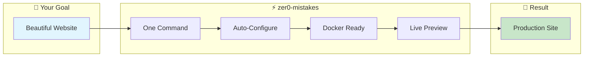
```mermaid
graph LR
    subgraph "🎯 Your Goal"
        A[Beautiful Website]
    end
    
    subgraph "⚡ zer0-mistakes"
        B[One Command] --> C[Auto-Configure]
        C --> D[Docker Ready]
        D --> E[Live Preview]
    end
    
    subgraph "🚀 Result"
        F[Production Site]
    end
    
    A --> B
    E --> F
    
    style A fill:#e1f5fe
    style F fill:#c8e6c9
```

### Why zer0-mistakes?

| Challenge | Traditional Jekyll | zer0-mistakes |
|-----------|-------------------|---------------|
| **Setup Time** | 15-30 minutes | **2-5 minutes** ([benchmarked via install.sh](https://github.com/bamr87/zer0-mistakes/blob/main/install.sh)) |
| **Success Rate** | ~60% | **~95%** ([self-healing error recovery](https://github.com/bamr87/zer0-mistakes/blob/main/install.sh#L1)) |
| **Platform Support** | Limited | **Universal** ([macOS, Linux, Windows/WSL via Docker](https://github.com/bamr87/zer0-mistakes/blob/main/docker-compose.yml)) |
| **Error Handling** | Manual debugging | **Automated** |
| **Dependencies** | Ruby + Bundler + Jekyll | **Docker only** |
| **AI Agent Integration** | None / DIY | **Built-in** ([`AGENTS.md`](AGENTS.md) + Copilot / Codex / Cursor / Claude / Aider guidance) |
| **AI Content Tooling** | None | **First-class** (AI preview images, AIEO schema, prompt library) |
| **Release Automation** | Manual versioning | **AI-facilitated** ([commit-analyzer](scripts/analyze-commits.sh) → semantic bump + changelog) |
| **AI Discoverability** | None | **AIEO-optimized** ([structured data, FAQ schema, entity density](#-aieo-optimized--built-for-ai-citation)) |

---

## 🚀 Quick Start

### Prerequisites

- **Docker Desktop** ([download](https://www.docker.com/products/docker-desktop))
- **Git** ([download](https://git-scm.com/))

### One-Line Installation

```bash
mkdir my-site && cd my-site && curl -fsSL https://raw.githubusercontent.com/bamr87/zer0-mistakes/main/install.sh | bash
```

### Start Development

```bash
docker-compose up
# 🌐 Open http://localhost:4000
```

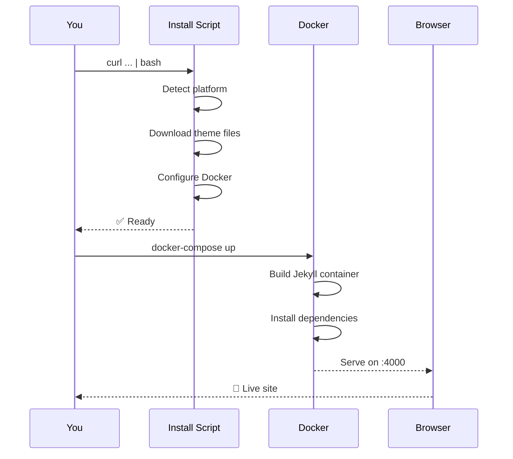
```mermaid
sequenceDiagram
    participant You
    participant InstallScript as Install Script
    participant Docker
    participant Browser

    You->>InstallScript: curl ... | bash
    InstallScript->>InstallScript: Detect platform
    InstallScript->>InstallScript: Download theme files
    InstallScript->>InstallScript: Configure Docker
    InstallScript-->>You: ✅ Ready

    You->>Docker: docker-compose up
    Docker->>Docker: Build Jekyll container
    Docker->>Docker: Install dependencies
    Docker-->>Browser: Serve on :4000

    Browser-->>You: 🎉 Live site
```

---

## 🤖 AI-Native Workflow

zer0-mistakes treats AI as core infrastructure across **install → author → build → release → discover**. Every layer is wired for **automation, facilitation, and integration** with the AI tools you already use.


```mermaid
flowchart LR
    subgraph Install["🤖 AI Install"]
        I1[install.sh<br/>self-healing]
    end
    subgraph Author["🧠 AI Authoring"]
        A1[Copilot]
        A2[Codex]
        A3[Cursor]
        A4[Claude Code]
        A5[Aider]
    end
    subgraph Build["🎨 AI Content"]
        B1[OpenAI<br/>Preview Images]
        B2[AI Frontmatter<br/>Maintainer prompt]
    end
    subgraph Release["🚀 AI Release"]
        R1[Commit Analyzer]
        R2[Auto Changelog]
        R3[Semantic Bump]
    end
    subgraph Discover["🔍 AIEO Discovery"]
        D1[JSON-LD Schema]
        D2[FAQ + Glossary]
        D3[Entity Density]
    end

    Install --> Author --> Build --> Release --> Discover

    style Install fill:#e3f2fd
    style Author fill:#f3e5f5
    style Build fill:#fff3e0
    style Release fill:#e8f5e9
    style Discover fill:#fce4ec
```

### What's wired for AI

| Capability | What it does | Where it lives |
|---|---|---|
| **Self-healing install** | Detects platform, fixes Docker/Jekyll issues, retries with fallbacks | [`install.sh`](install.sh) |
| **Cross-tool agent guide** | Single entry point for any [agents.md](https://agents.md/)-aware AI tool | [`AGENTS.md`](AGENTS.md) |
| **Copilot project context** | Architecture, conventions, commands, release flow | [`.github/copilot-instructions.md`](.github/copilot-instructions.md) |
| **File-scoped instructions** | `applyTo:` globs auto-load guidance for `_layouts/`, `_includes/`, `scripts/`, `test/`, `docs/`, version files | [`.github/instructions/`](.github/instructions/) |
| **Reusable agent prompts** | `commit-publish`, `frontmatter-maintainer`, `seed` (full-rebuild blueprint) | [`.github/prompts/`](.github/prompts/) |
| **Cursor slash-commands** | Mirrors prompts as `/commit-publish`, `/frontend-run-improve` | [`.cursor/commands/`](.cursor/commands/) |
| **AI preview images** | Jekyll plugin + script generate OpenAI/DALL·E images for posts missing previews | [`_plugins/preview_image_generator.rb`](_plugins/preview_image_generator.rb), [`scripts/generate-preview-images.sh`](scripts/generate-preview-images.sh) |
| **AI release pipeline** | Conventional-commit analyzer chooses MAJOR/MINOR/PATCH, writes CHANGELOG, tags & publishes | [`scripts/analyze-commits.sh`](scripts/analyze-commits.sh), [`scripts/bin/release`](scripts/bin/release) |
| **AIEO content layer** | `SoftwareApplication`, `WebPage`, `FAQPage`, `Person` JSON-LD; glossary; FAQ; dated roadmap | [See AIEO section](#-aieo-optimized--built-for-ai-citation) |

### Quick AI tasks

```bash
# Generate AI preview images for posts missing previews (needs OPENAI_API_KEY)
./scripts/generate-preview-images.sh --collection posts

# Preview before generating (no API calls)
./scripts/generate-preview-images.sh --dry-run --verbose

# Let AI analyze commits and propose the next version bump
./scripts/analyze-commits.sh HEAD~10..HEAD

# Run the AI-facilitated release pipeline (validate → version → changelog → publish)
./scripts/bin/release patch --dry-run
```

### Drop-in for any AI editor

Clone the repo (or fork) and your editor's AI agent will pick up project context automatically:

- **GitHub Copilot / VS Code** → reads [`.github/copilot-instructions.md`](.github/copilot-instructions.md) + `.github/instructions/*.instructions.md`
- **Cursor** → reads `.cursor/commands/` for slash-commands; falls back to `AGENTS.md`
- **Claude Code / Codex / Aider / Jules / Continue** → read [`AGENTS.md`](AGENTS.md) per the [agents.md](https://agents.md/) convention
- **Custom agents** → Load layered guidance from [`.github/`](.github/) on demand

> No configuration required. The guidance is layered — agents read only what's needed for the file they're touching.

---

## 🏗 Architecture

### System Overview

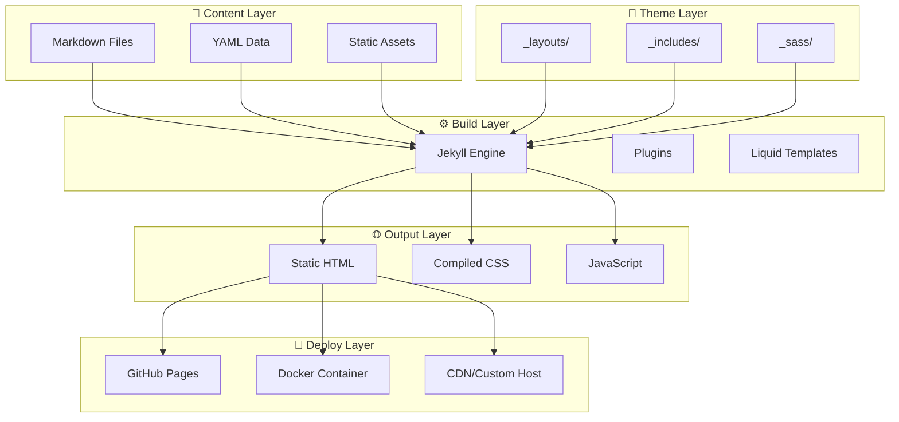
```mermaid
flowchart TB
    subgraph Input["📝 Content Layer"]
        MD[Markdown Files]
        DATA[YAML Data]
        ASSETS[Static Assets]
    end
    
    subgraph Theme["🎨 Theme Layer"]
        LAYOUTS[_layouts/]
        INCLUDES[_includes/]
        SASS[_sass/]
    end
    
    subgraph Build["⚙️ Build Layer"]
        JEKYLL[Jekyll Engine]
        PLUGINS[Plugins]
        LIQUID[Liquid Templates]
    end
    
    subgraph Output["🌐 Output Layer"]
        HTML[Static HTML]
        CSS[Compiled CSS]
        JS[JavaScript]
    end
    
    subgraph Deploy["🚀 Deploy Layer"]
        GHPAGES[GitHub Pages]
        DOCKER[Docker Container]
        CDN[CDN/Custom Host]
    end
    
    MD --> JEKYLL
    DATA --> JEKYLL
    ASSETS --> JEKYLL
    
    LAYOUTS --> JEKYLL
    INCLUDES --> JEKYLL
    SASS --> JEKYLL
    
    JEKYLL --> HTML
    JEKYLL --> CSS
    JEKYLL --> JS
    
    HTML --> GHPAGES
    HTML --> DOCKER
    HTML --> CDN
```

### Technology Stack

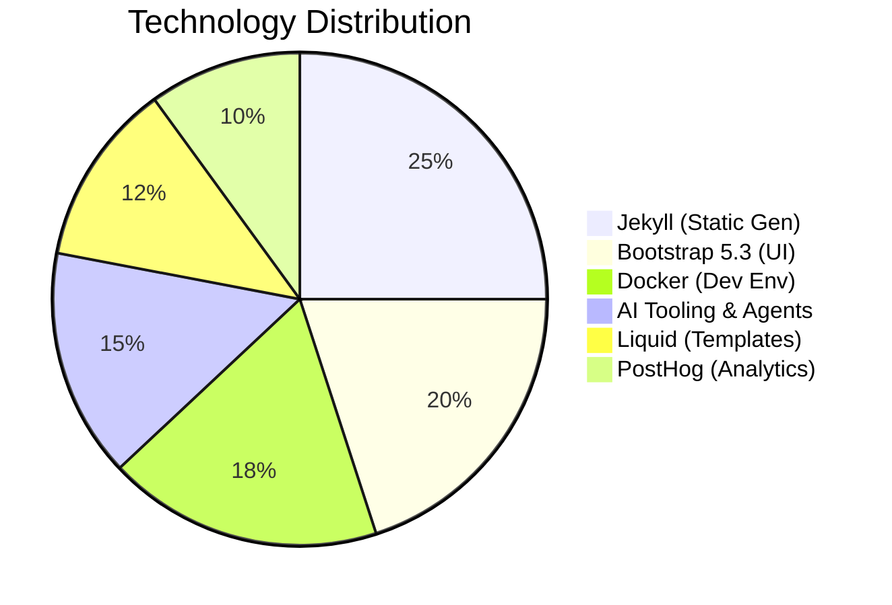
```mermaid
pie title Technology Distribution
    "Jekyll (Static Gen)" : 25
    "Bootstrap 5.3 (UI)" : 20
    "Docker (Dev Env)" : 18
    "AI Tooling & Agents" : 15
    "Liquid (Templates)" : 12
    "PostHog (Analytics)" : 10
```

| Layer | Technology | Purpose |
|-------|-----------|---------|
| **Framework** | Jekyll 3.9.5 | Static site generation |
| **Styling** | Bootstrap 5.3.3 | Responsive UI components |
| **Icons** | Bootstrap Icons | Unified iconography |
| **Development** | Docker | Cross-platform consistency |
| **Templates** | Liquid | Dynamic content rendering |
| **AI Agents** | Copilot · Codex · Cursor · Claude Code · Aider · Jules · Continue | Multi-tool agentic development via [`AGENTS.md`](AGENTS.md) + `.github/instructions/` |
| **AI Content** | OpenAI Images API | AI-generated preview images via [`_plugins/preview_image_generator.rb`](_plugins/preview_image_generator.rb) |
| **AI Automation** | Conventional-commit analyzer | Auto semantic versioning + changelog ([`scripts/analyze-commits.sh`](scripts/analyze-commits.sh)) |
| **AIEO** | JSON-LD + FAQ + Glossary schema | Optimized for AI citation and retrieval |
| **Analytics** | PostHog | Privacy-first tracking |
| **Diagrams** | Mermaid 10+ | Documentation visuals |
| **Navigation** | ES6 Modules | Modular JavaScript architecture |
| **Search** | Client-side JSON | Fast in-browser search |

---

## ✨ Key Features

### 🤖 AI-Powered Installation

The ~1,100-line `install.sh` script provides intelligent platform detection and Docker configuration:

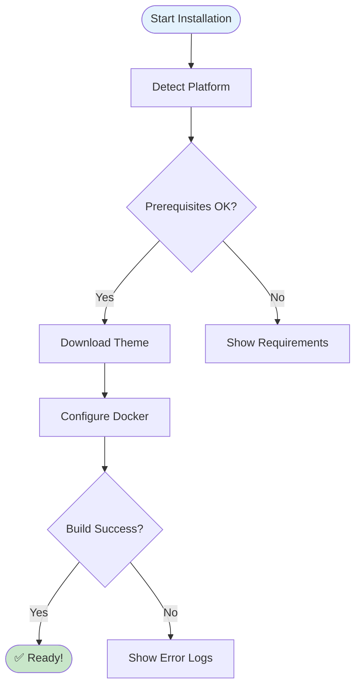
```mermaid
flowchart TD
    START([Start Installation]) --> DETECT[Detect Platform]
    DETECT --> CHECK{Prerequisites OK?}
    
    CHECK -->|Yes| DOWNLOAD[Download Theme]
    CHECK -->|No| GUIDE[Show Requirements]
    
    DOWNLOAD --> CONFIG[Configure Docker]
    CONFIG --> VALIDATE{Build Success?}
    
    VALIDATE -->|Yes| DONE([✅ Ready!])
    VALIDATE -->|No| LOGS[Show Error Logs]
    
    style START fill:#e3f2fd
    style DONE fill:#c8e6c9
```

### 🐳 Docker-First Development

Zero local dependencies required. Works identically across all platforms:

```yaml
# docker-compose.yml - That's all you need!
services:
  jekyll:
    image: jekyll/jekyll:latest
    platform: linux/amd64
    command: jekyll serve --config "_config.yml,_config_dev.yml"
    ports: ["4000:4000"]
    volumes: ["./:/app"]
```

### 🔒 Privacy-First Analytics

GDPR/CCPA compliant PostHog integration with granular consent:

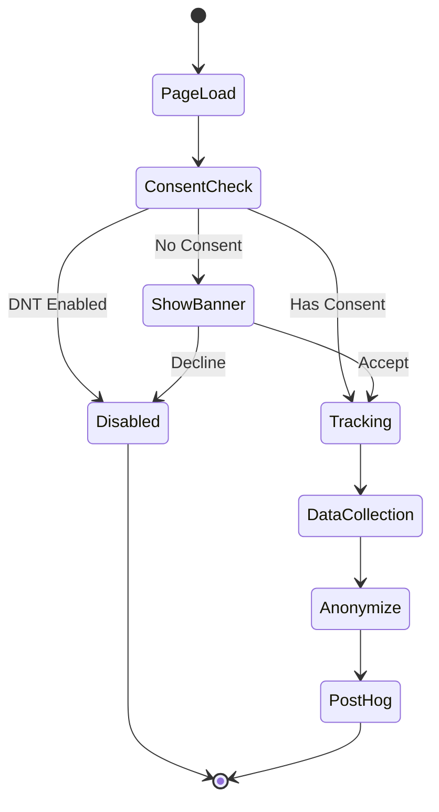
```mermaid
stateDiagram-v2
    [*] --> PageLoad
    PageLoad --> ConsentCheck
    
    ConsentCheck --> Disabled: DNT Enabled
    ConsentCheck --> ShowBanner: No Consent
    ConsentCheck --> Tracking: Has Consent
    
    ShowBanner --> Tracking: Accept
    ShowBanner --> Disabled: Decline
    
    Tracking --> DataCollection
    DataCollection --> Anonymize
    Anonymize --> PostHog
    
    Disabled --> [*]
    PostHog --> [*]
```

### 📊 Mermaid Diagram Support

10+ diagram types with GitHub Pages compatibility:

| Type | Syntax | Use Case |
|------|--------|----------|
| Flowchart | `graph TD` | Process flows |
| Sequence | `sequenceDiagram` | Interactions |
| Class | `classDiagram` | OOP structures |
| State | `stateDiagram-v2` | State machines |
| ER | `erDiagram` | Database schemas |
| Gantt | `gantt` | Timelines |
| Pie | `pie` | Distributions |
| Git | `gitGraph` | Branch history |

### 📓 Jupyter Notebook Support

Seamless integration for data science and computational content:

- **Automatic Conversion**: `.ipynb` → Markdown with front matter
- **Output Rendering**: Code execution results, plots, tables preserved
- **Image Extraction**: Matplotlib/PNG outputs → `/assets/images/notebooks/`
- **GitHub Actions**: Automated conversion on push to `pages/_notebooks/`
- **MathJax Support**: LaTeX equations rendered with `$$` syntax
- **Syntax Highlighting**: Code cells with Rouge highlighting
- **Responsive Layout**: Mobile-friendly notebook viewer

```bash
# Convert notebooks
./scripts/convert-notebooks.sh

# Add to _config.yml
collections:
  notebooks:
    output: true
    permalink: /notebooks/:name/
```

### 🧭 Enhanced Navigation System (v0.17.0)

Modern, accessible sidebar navigation with ES6 modular architecture:

- **ES6 Navigation Modules**: Modular JavaScript with native ES6 imports
- **Navbar Hover Dropdowns**: Desktop hover support with smooth fade transitions
- **Intersection Observer Scroll Spy**: 70% reduction in scroll event overhead
- **Keyboard Shortcuts**: `[` and `]` for section navigation
- **Swipe Gestures**: Mobile-friendly left/right edge detection
- **Skip-to-Content**: Accessibility-first WCAG 2.1 Level AA compliant
- **Mobile TOC FAB**: Floating action button for table of contents
- **Nav Tree Component**: Hierarchical YAML navigation rendering

| Shortcut | Action |
|----------|--------|
| `[` | Previous section |
| `]` | Next section |
| `Tab` | Skip to content |
| Swipe | Toggle sidebar (mobile) |

### 🔍 Site Search (v0.18.0)

Client-side search with modal interface and keyboard shortcuts:

- **Keyboard Activation**: Press `/` or `Cmd/Ctrl+K` to open search
- **Real-time Results**: Instant search across all content
- **JSON Index**: Auto-generated search index for fast queries
- **Bootstrap Modal**: Responsive modal interface

| Shortcut | Action |
|----------|--------|
| `/` | Open search modal |
| `Cmd/Ctrl+K` | Open search modal |
| `Escape` | Close search |

### 🎨 Dark/Light Mode Toggle

Theme color mode switcher with system preference detection:

- **Three Modes**: Light, dark, and auto (system preference)
- **Persistence**: LocalStorage saves user preference
- **Smooth Transitions**: CSS transitions between themes
- **Bootstrap Integration**: Uses `data-bs-theme` attribute

### 📋 Legal & Compliance Pages (v0.15.0)

Built-in GDPR/CCPA compliant documentation:

- **Privacy Policy**: Comprehensive data collection transparency
- **Terms of Service**: Ready-to-customize legal framework
- **Cookie Consent**: Granular user preference management

---

## 📦 Installation Methods

> **New in 1.0:** the installer is now a modular CLI (`scripts/bin/install`) with subcommands and declarative profiles. The classic `curl | bash` one-liner still works — it bootstraps the same pipeline. See [docs/installation/](docs/installation/index.md) for the full guide and [docs/installation/migration-from-0.x.md](docs/installation/migration-from-0.x.md) for the 0.x → 1.0 flag mapping.

### Method 1: AI-Powered Install (Recommended)

```bash
curl -fsSL https://raw.githubusercontent.com/bamr87/zer0-mistakes/main/install.sh | bash
```

### Method 1b: Modular CLI (Local Clone)

```bash
git clone https://github.com/bamr87/zer0-mistakes.git
./zer0-mistakes/scripts/bin/install help
./zer0-mistakes/scripts/bin/install init --profile full /path/to/new-site
./zer0-mistakes/scripts/bin/install deploy github-pages,docker-prod /path/to/new-site
./zer0-mistakes/scripts/bin/install doctor /path/to/new-site     # health check
./zer0-mistakes/scripts/bin/install agents /path/to/new-site --all   # AI agent guidance
```

Available subcommands: `init`, `wizard [--ai]`, `agents`, `deploy`, `doctor`, `diagnose [--ai]`, `upgrade`, `list-profiles`, `list-targets`, `version`, `help`.

### Method 2: Remote Theme (GitHub Pages)

```yaml
# _config.yml
remote_theme: "bamr87/zer0-mistakes"
plugins:
  - jekyll-remote-theme
```

### Method 3: Fork & Deploy as Your Site

Fork into `<your-username>.github.io` for a working site in minutes:

1. Go to [bamr87/zer0-mistakes](https://github.com/bamr87/zer0-mistakes) → **Fork**
2. Set repository name to **`<your-username>.github.io`**
3. Enable **Settings → Pages → Deploy from branch: `main`**
4. Visit `https://<your-username>.github.io`

Then personalize locally:

```bash
git clone https://github.com/<your-username>/<your-username>.github.io.git
cd <your-username>.github.io
./scripts/fork-cleanup.sh   # interactive config wizard
docker-compose up
```

See [docs/FORKING.md](docs/FORKING.md) for the full progressive workflow.

### Method 4: Ruby Gem

```ruby
# Gemfile
gem "jekyll-theme-zer0", "~> 0.21"
```

---

## 📁 Project Structure

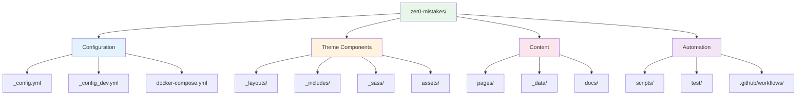
```mermaid
graph TD
    ROOT[zer0-mistakes/] --> CONFIG[Configuration]
    ROOT --> THEME[Theme Components]
    ROOT --> CONTENT[Content]
    ROOT --> AUTOMATION[Automation]
    
    CONFIG --> CFG1[_config.yml]
    CONFIG --> CFG2[_config_dev.yml]
    CONFIG --> CFG3[docker-compose.yml]
    
    THEME --> LAYOUTS[_layouts/]
    THEME --> INCLUDES[_includes/]
    THEME --> SASS[_sass/]
    THEME --> ASSETS[assets/]
    
    CONTENT --> PAGES[pages/]
    CONTENT --> DATA[_data/]
    CONTENT --> DOCS[docs/]
    
    AUTOMATION --> SCRIPTS[scripts/]
    AUTOMATION --> TESTS[test/]
    AUTOMATION --> WORKFLOWS[.github/workflows/]
    
    style ROOT fill:#e8f5e9
    style CONFIG fill:#e3f2fd
    style THEME fill:#fff3e0
    style CONTENT fill:#fce4ec
    style AUTOMATION fill:#f3e5f5
```

### Key Directories

| Directory | Purpose | Key Files |
|-----------|---------|-----------|
| `_layouts/` | Page templates | `default.html`, `journals.html`, `landing.html`, `notebook.html` |
| `_includes/` | Reusable components | `core/`, `components/`, `analytics/`, `navigation/` |
| `_sass/` | Stylesheets | `custom.scss`, `notebooks.scss`, `core/` (`_variables`, `_docs-layout`, …), `theme/` (`_css-variables`, `_wizard-mode`) |
| `assets/` | Static files | `css/`, `js/`, `images/`, **`vendor/`** (Bootstrap, jQuery, MathJax, Mermaid, … — committed for GitHub Pages) |
| `scripts/` | Automation | `release`, `build`, `migrate.sh`, `vendor-install.sh`, `convert-notebooks.sh` |
| `templates/` | Installable templates | `pages/admin/` (6 admin page templates), `config/install.conf` |
| `docs/` | Technical docs | `SIDEBAR_IMPROVEMENTS.md`, `JUPYTER_NOTEBOOKS.md` |
| `pages/` | Content pages | `privacy-policy.md`, `terms-of-service.md` |

---

## �️ Migration Utility

Add the admin settings UI to an existing consumer site using the migration script:

```bash
# From the zer0-mistakes repo — install into another site
./scripts/migrate.sh /path/to/your-site

# Preview without making changes
./scripts/migrate.sh --dry-run /path/to/your-site

# Overwrite existing admin pages
./scripts/migrate.sh --force /path/to/your-site

# Verify an existing installation
./scripts/migrate.sh --verify /path/to/your-site
```

This installs 6 admin pages to `pages/_about/settings/`:

| Page | URL | Description |
|------|-----|-------------|
| Theme Customizer | `/about/settings/theme/` | Skins, palette generator, skin editor, live preview, color editing, YAML export |
| Configuration | `/about/config/` | View/edit `_config.yml`, quick actions, environment info |
| Navigation Editor | `/about/settings/navigation/` | Edit header/footer/sidebar menus, export YAML |
| Collection Manager | `/about/settings/collections/` | Browse and manage Jekyll collections |
| Analytics | `/about/settings/analytics/` | Site analytics and performance metrics |
| Environment | `/about/settings/environment/` | Jekyll build info and environment details |

> **Note:** Admin pages require theme version ≥ 0.22.10 for the `admin` layout and component includes.

---

## �🔄 Development Workflow

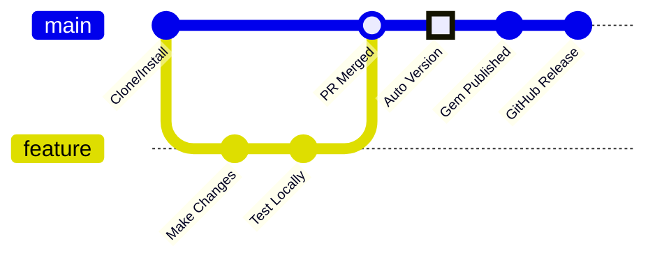
```mermaid
gitGraph
    commit id: "Clone/Install"
    branch feature
    checkout feature
    commit id: "Make Changes"
    commit id: "Test Locally"
    checkout main
    merge feature id: "PR Merged"
    commit id: "Auto Version" type: HIGHLIGHT
    commit id: "Gem Published"
    commit id: "GitHub Release"
```

### Daily Development

```bash
# Start development server
docker-compose up

# Make changes (auto-reload enabled)
# Edit files in _layouts/, _includes/, pages/

# Run tests
./test/test_runner.sh

# Commit changes
git commit -m "feat: add new component"
```

### Testing Commands

```bash
# Quick validation
./test/validate_installation.sh

# Full test suite
./test/test_runner.sh --verbose

# Docker-specific tests
./test/test_docker_deployment.sh

# Visual / styling checks (Playwright; optional BASE_URL if site already running)
npm run test:styling
```

### Vendor assets (maintainers)

Third-party CSS and JavaScript live under `assets/vendor/` so GitHub Pages builds work without npm at publish time. To refresh bundles after changing versions, see [Vendor assets](pages/_docs/development/vendor-assets.md) (published at `/docs/development/vendor-assets/`). Short version:

```bash
npm install
npm run vendor:install    # manifest downloads (+ Mermaid copy when node_modules present)
# or: ./scripts/vendor-install.sh
```

---

## 🚀 Deployment

### GitHub Pages (User Site — Recommended)

Fork the repo as `<your-username>.github.io` and enable GitHub Pages:

1. Push to `main` branch
2. GitHub Pages builds automatically
3. Site deploys to `https://<your-username>.github.io`

No workflows or `baseurl` configuration needed. See [docs/FORKING.md](docs/FORKING.md) for details.

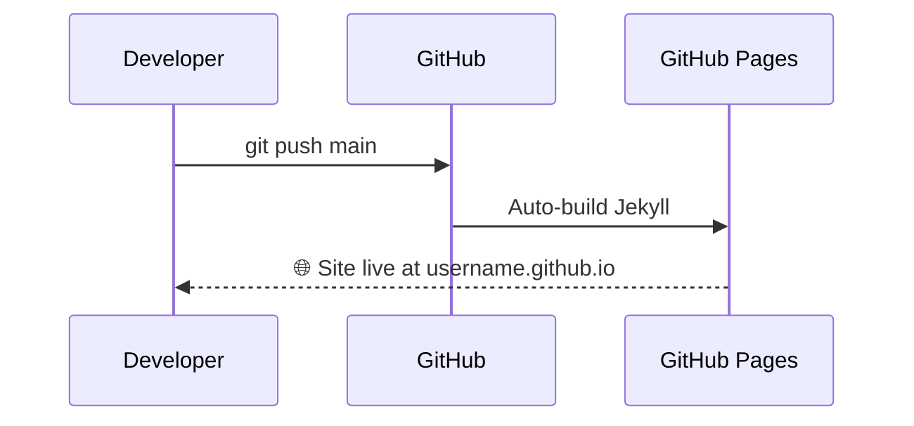
```mermaid
sequenceDiagram
    participant Dev as Developer
    participant GH as GitHub
    participant Pages as GitHub Pages
    
    Dev->>GH: git push main
    GH->>Pages: Auto-build Jekyll
    Pages-->>Dev: 🌐 Site live at username.github.io
```

### Docker Production

```bash
docker-compose -f docker-compose.prod.yml up -d
```

### Custom Hosting

```bash
# Build static site
docker-compose run --rm jekyll jekyll build

# Deploy _site/ to any static host
```

---

## 📚 Documentation

### Documentation Architecture

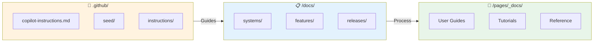
```mermaid
graph LR
    subgraph Technical["📋 /docs/"]
        SYS[systems/]
        FEAT[features/]
        REL[releases/]
    end
    
    subgraph Public["📖 /pages/_docs/"]
        GUIDES[User Guides]
        TUTORIALS[Tutorials]
        REF[Reference]
    end
    
    subgraph AI["🤖 .github/"]
        COPILOT[copilot-instructions.md]
        SEED[seed/]
        INSTR[instructions/]
    end
    
    Technical -->|Process| Public
    AI -->|Guides| Technical
    
    style Technical fill:#e3f2fd
    style Public fill:#e8f5e9
    style AI fill:#fff3e0
```

### Quick Links

| Resource | Description |
|----------|-------------|
| [📋 Technical Docs](https://github.com/bamr87/zer0-mistakes/tree/main/docs/) | Architecture, systems, implementation |
| [📖 User Guides](https://zer0-mistakes.com/docs/) | Published tutorials and references |
| [🎨 Customization](https://zer0-mistakes.com/docs/customization/) | Layouts, styles, navigation guides |
| [📊 Analytics](https://zer0-mistakes.com/docs/analytics/) | PostHog, Google Analytics setup |
| [🔍 SEO](https://zer0-mistakes.com/docs/seo/) | Meta tags, sitemap, structured data |
| [📓 Jupyter Notebooks](https://github.com/bamr87/zer0-mistakes/blob/main/docs/JUPYTER_NOTEBOOKS.md) | Notebook conversion documentation |
| [📝 PRD](docs/PRD.md) | Product requirements & roadmap |
| [🔒 Privacy Policy](https://zer0-mistakes.com/privacy-policy/) | GDPR/CCPA compliant privacy docs |

---

## 🔧 Release System

### Automated Release Pipeline


```mermaid
flowchart LR
    subgraph Trigger["🎯 Trigger"]
        COMMIT[Commit to main]
    end
    
    subgraph Analyze["🔍 Analyze"]
        PARSE[Parse Commits]
        BUMP[Determine Version]
    end
    
    subgraph Build["⚙️ Build"]
        CHANGE[Update CHANGELOG]
        VERSION[Bump Version]
        TEST[Run Tests]
        GEM[Build Gem]
    end
    
    subgraph Publish["🚀 Publish"]
        RUBYGEMS[Push to RubyGems]
        GHREL[GitHub Release]
        TAG[Git Tag]
    end
    
    COMMIT --> PARSE --> BUMP
    BUMP --> CHANGE --> VERSION --> TEST --> GEM
    GEM --> RUBYGEMS --> GHREL --> TAG
```

### Release Commands

```bash
# Preview release
bash scripts/release patch --dry-run

# Full release
bash scripts/release patch  # 0.21.5 → 0.21.6
bash scripts/release minor  # 0.21.5 → 0.22.0
bash scripts/release major  # 0.21.5 → 1.0.0
```

---

## ⚙️ GitHub Actions Automation

zer0-mistakes ships with a **complete CI/CD and automation suite** powered by [GitHub Actions](https://github.com/bamr87/zer0-mistakes/actions). Every workflow is opinionated, tested, and ready to fork — push to `main` and the entire pipeline (test → version → publish → release) runs automatically.

### Workflow Catalogue

All workflows live under [`.github/workflows/`](.github/workflows/).

| # | Workflow | File | Trigger | Purpose |
|---|----------|------|---------|---------|
| 1 | **Comprehensive CI Pipeline** | [`ci.yml`](.github/workflows/ci.yml) | push / PR / dispatch | Detect changes → fast checks → quality control → matrix test suite (Ruby 3.3) → integration tests → build & validate |
| 2 | **TEST (Latest Dependencies)** | [`test-latest.yml`](.github/workflows/test-latest.yml) | scheduled / dispatch | Zero-pin Docker build with bleeding-edge gems; promotes only passing images |
| 3 | **Update Dependencies** | [`update-dependencies.yml`](.github/workflows/update-dependencies.yml) | weekly schedule | Refreshes `Gemfile.lock` to latest compatible versions and opens an automated PR |
| 4 | **CodeQL Security Scanning** | [`codeql.yml`](.github/workflows/codeql.yml) | push / PR on code paths | Static security analysis across Ruby, JavaScript, TypeScript, Python, YAML, plugins, scripts |
| 5 | **Version Bump** | [`version-bump.yml`](.github/workflows/version-bump.yml) | push to main / dispatch | Analyzes conventional commits, determines MAJOR/MINOR/PATCH bump, updates `version.rb` + CHANGELOG, creates tag |
| 6 | **Release (Gem + GitHub)** | [`release.yml`](.github/workflows/release.yml) | tag `v*` / dispatch | Pre-release validation → build assets → publish to [RubyGems](https://rubygems.org/gems/jekyll-theme-zer0) → create GitHub Release |
| 7 | **Convert Jupyter Notebooks** | [`convert-notebooks.yml`](.github/workflows/convert-notebooks.yml) | push to `pages/_notebooks/**.ipynb` | Auto-converts `.ipynb` → Jekyll-friendly Markdown with extracted images |
| 8 | **Roadmap Sync** | [`roadmap-sync.yml`](.github/workflows/roadmap-sync.yml) | push affecting `_data/roadmap.yml` | Regenerates the README roadmap section from data; fails PRs with stale README |
| 9 | **New Site Setup** | [`setup-template.yml`](.github/workflows/setup-template.yml) | first push after template/fork | Creates a PR with prefilled `_config.yml` so a new site is ready to merge & go |

> 💡 GitHub Pages adds an additional managed `pages-build-deployment` run on every push to `main`.

### Pipeline Topology

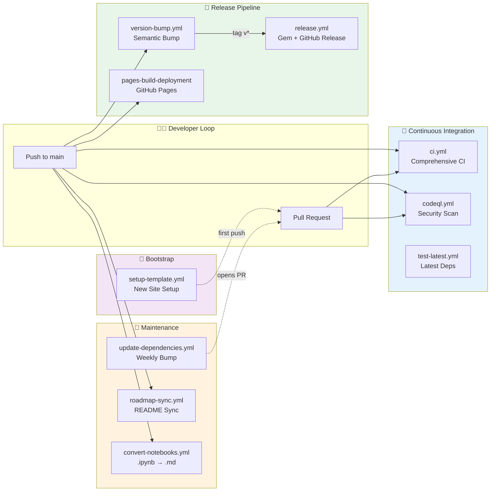
```mermaid
flowchart LR
    subgraph Devloop["🧑‍💻 Developer Loop"]
        PR[Pull Request]
        PUSH[Push to main]
    end

    subgraph Continuous["🧪 Continuous Integration"]
        CI[ci.yml<br/>Comprehensive CI]
        CODEQL[codeql.yml<br/>Security Scan]
        TESTLATEST[test-latest.yml<br/>Latest Deps]
    end

    subgraph Maintenance["🔧 Maintenance"]
        DEPS[update-dependencies.yml<br/>Weekly Bump]
        ROADMAP[roadmap-sync.yml<br/>README Sync]
        NOTEBOOKS[convert-notebooks.yml<br/>.ipynb → .md]
    end

    subgraph Releaseflow["🚀 Release Pipeline"]
        BUMP[version-bump.yml<br/>Semantic Bump]
        RELEASE[release.yml<br/>Gem + GitHub Release]
        PAGES[pages-build-deployment<br/>GitHub Pages]
    end

    subgraph Bootstrap["🌱 Bootstrap"]
        SETUP[setup-template.yml<br/>New Site Setup]
    end

    PR --> CI
    PR --> CODEQL
    PUSH --> CI
    PUSH --> CODEQL
    PUSH --> ROADMAP
    PUSH --> NOTEBOOKS
    PUSH --> BUMP
    BUMP -->|tag v*| RELEASE
    PUSH --> PAGES
    DEPS -.->|opens PR| PR
    SETUP -.->|first push| PR

    style Continuous fill:#e3f2fd
    style Maintenance fill:#fff3e0
    style Releaseflow fill:#e8f5e9
    style Bootstrap fill:#f3e5f5
```

### What it looks like

#### 🗂 Actions overview — every workflow at a glance

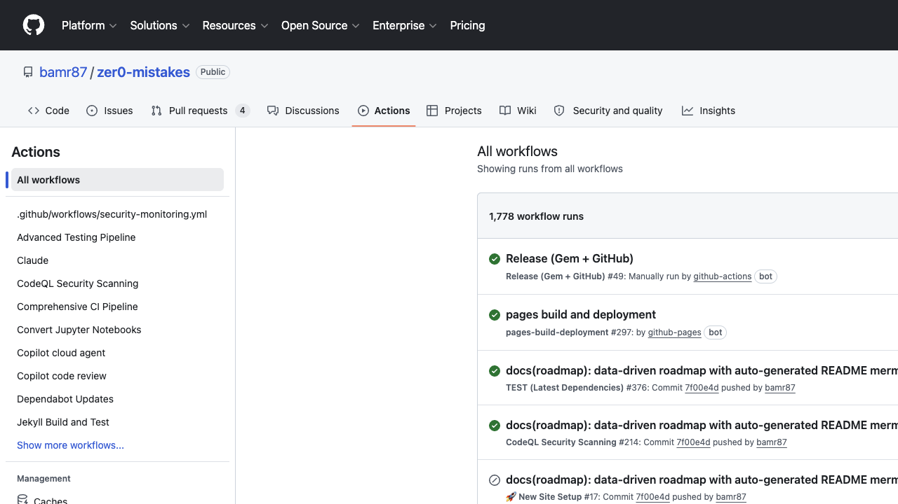

The Actions tab gives you a real-time activity feed — every push to `main` triggers a coordinated set of workflows that you can audit, re-run, or dispatch manually.

#### 🚀 Release pipeline — automated gem + GitHub release

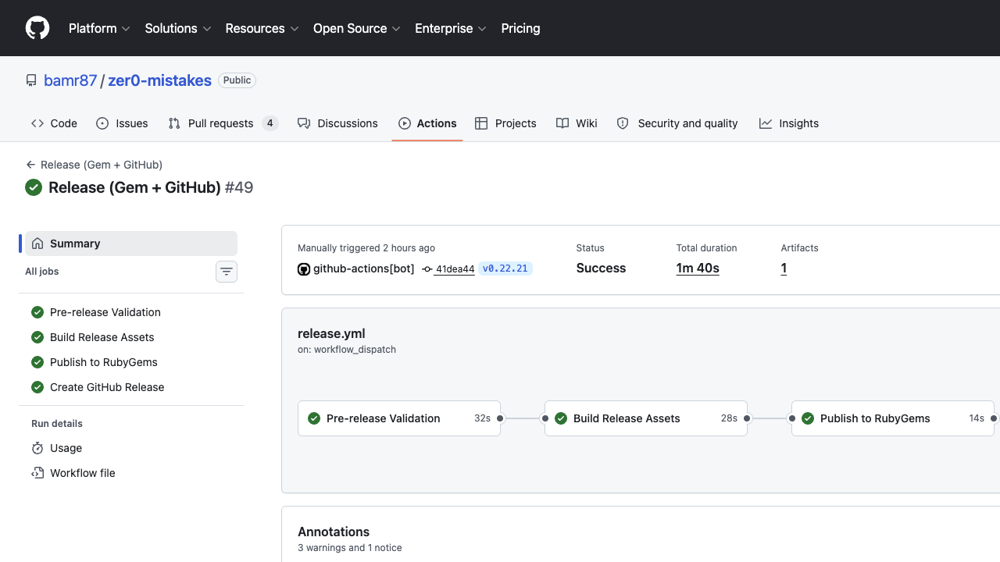

A single tag (`v0.22.21`) — or one click on **Run workflow** — runs the entire publish pipeline in under two minutes. The job graph makes the dependency chain visible: validate → build → publish to [RubyGems](https://rubygems.org/gems/jekyll-theme-zer0) → cut the [GitHub Release](https://github.com/bamr87/zer0-mistakes/releases). No manual `gem push`, no manual changelog edit, no missed step.

#### 🧪 Comprehensive CI — parallel quality gates

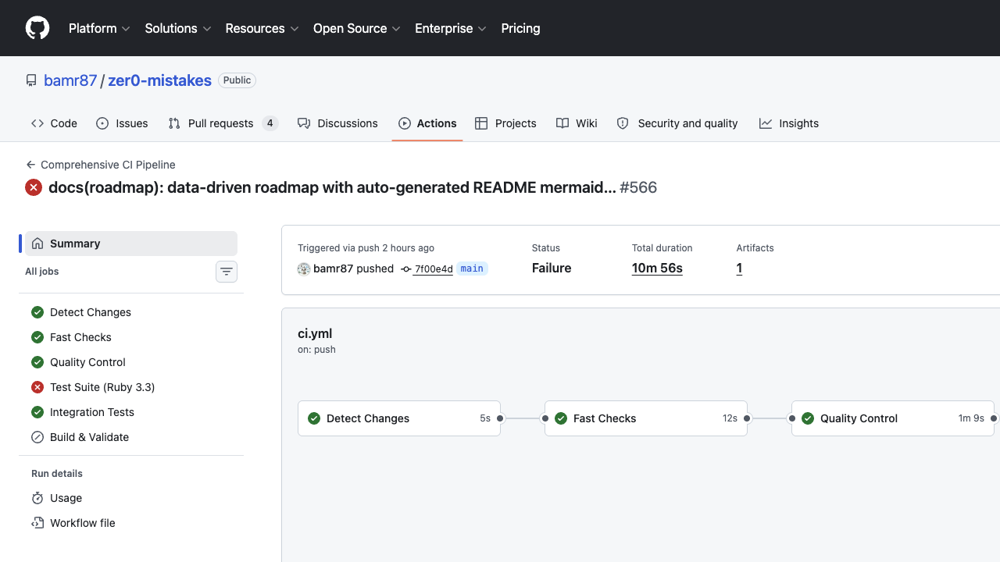

CI fans out across **change detection → fast checks → quality control → matrix test suite → integration tests → build & validate**, with annotations surfacing test failures and deprecations directly in the run summary.

#### 🚦 Per-workflow run history

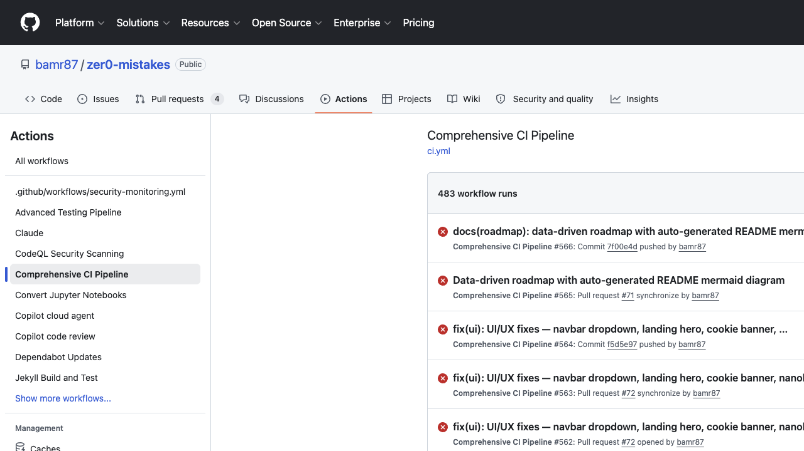

Each workflow has its own run history with branch filters, status badges, and per-job durations — easy to spot regressions or compare runs across branches.

### Trigger guide

Use these to invoke automation without leaving your terminal:

```bash
# List recent workflow runs
gh run list --repo bamr87/zer0-mistakes --limit 10

# Manually dispatch a release
gh workflow run release.yml --ref main -f tag=v0.22.21

# Trigger an automatic version bump on demand
gh workflow run version-bump.yml --ref main

# Re-run the most recent failed CI run
gh run rerun --failed --repo bamr87/zer0-mistakes

# Watch a workflow run live
gh run watch --repo bamr87/zer0-mistakes
```

### Forking these workflows

When you fork the theme as a starter, the workflows come with you. To make them safe and useful in your fork:

1. **Add `RUBYGEMS_API_KEY`** in `Settings → Secrets and variables → Actions` if you plan to publish your own gem; otherwise disable [`release.yml`](.github/workflows/release.yml).
2. **Tune triggers** in [`update-dependencies.yml`](.github/workflows/update-dependencies.yml) (default: weekly).
3. **Disable** [`setup-template.yml`](.github/workflows/setup-template.yml) after the first run — it's a one-shot bootstrap.
4. **GitHub Pages** is auto-enabled when you push to `main` if your repo is `<username>.github.io`.

> 📸 Screenshots above are real runs captured from [github.com/bamr87/zer0-mistakes/actions](https://github.com/bamr87/zer0-mistakes/actions). Re-capture them for your fork by running `./scripts/test/capture-workflow-screenshots.sh` (or just take fresh screenshots) and replacing the files in [`docs/images/workflows/`](docs/images/workflows/).

---

## 🗺 Roadmap

The diagram and table below are auto-generated from [`_data/roadmap.yml`](_data/roadmap.yml) by [`scripts/generate-roadmap.sh`](scripts/generate-roadmap.sh). See the full [Roadmap page](/roadmap/) for per-version detail and the [PRD](docs/PRD.md) for product context.

<!-- ROADMAP_MERMAID:START -->

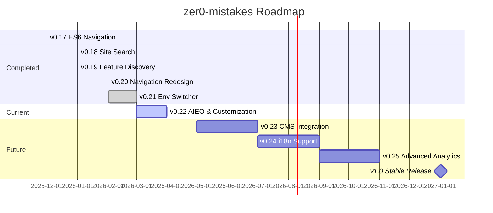
```mermaid
gantt
    title zer0-mistakes Roadmap
    dateFormat YYYY-MM
    section Completed
    v0.17 ES6 Navigation         :done, 2025-12, 2025-12
    v0.18 Site Search            :done, 2026-01, 2026-01
    v0.19 Feature Discovery      :done, 2026-01, 2026-01
    v0.20 Navigation Redesign    :done, 2026-02, 2026-02
    v0.21 Env Switcher           :done, 2026-02, 2026-03
    section Current
    v0.22 AIEO & Customization   :active, 2026-03, 2026-04
    section Future
    v0.23 CMS Integration        :2026-05, 2026-07
    v0.24 i18n Support           :2026-07, 2026-09
    v0.25 Advanced Analytics     :2026-09, 2026-11
    v1.0 Stable Release          :milestone, 2027-01, 1d
```

<!-- ROADMAP_MERMAID:END -->

<!-- ROADMAP_TABLE:START -->

| Version | Status | Target | Highlights |
|---------|--------|--------|------------|
| **v0.17** | ✅ Completed | Dec 2025 | ES6 modular navigation with auto-hide navbar, hover dropdowns, keyboard navigation, and touch gestures. |
| **v0.18** | ✅ Completed | Jan 2026 | Client-side site search with a keyboard-shortcut search modal. |
| **v0.19** | ✅ Completed | Jan 2026 | 43 documented features with a comprehensive feature registry. |
| **v0.20** | ✅ Completed | Feb 2026 | Local Docker publishing pipeline and CI variable abstraction. |
| **v0.21** | ✅ Completed | Feb 2026 | Environment switcher, settings modal redesign, and RubyGems API-key auth. |
| **v0.22** | 🚧 In Progress | Q1–Q2 2026 | AI Engine Optimization (AIEO), structured data, and visual customization tools. |
| **v0.23** | 🗓 Planned | Q2 2026 | Headless CMS integration with a content API and admin dashboard. |
| **v0.24** | 🗓 Planned | Q3 2026 | Multi-language content support with locale-aware routing. |
| **v0.25** | 🗓 Planned | Q4 2026 | Visual theme customizer, A/B testing, and conversion funnels. |
| **v1.0** | 🎯 Milestone | Q1 2027 | Stable public API, 90%+ test coverage, and long-term support commitment. |

<!-- ROADMAP_TABLE:END -->

---

## 🤝 Contributing

We welcome contributions! See [CONTRIBUTING.md](CONTRIBUTING.md) for guidelines.

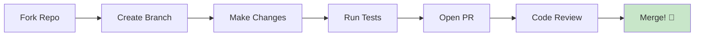
```mermaid
flowchart LR
    FORK[Fork Repo] --> BRANCH[Create Branch]
    BRANCH --> CODE[Make Changes]
    CODE --> TEST[Run Tests]
    TEST --> PR[Open PR]
    PR --> REVIEW[Code Review]
    REVIEW --> MERGE[Merge! 🎉]
    
    style MERGE fill:#c8e6c9
```

### Quick Contribution

```bash
# Fork and clone
gh repo fork bamr87/zer0-mistakes --clone
cd zer0-mistakes

# Create feature branch
git checkout -b feature/awesome-feature

# Make changes and test
docker-compose up
./test/test_runner.sh

# Submit PR
git push origin feature/awesome-feature
```

---

## 📞 Support

| Channel | Link |
|---------|------|
| 📖 Documentation | [zer0-mistakes.com](https://zer0-mistakes.com/) |
| 🐛 Issues | [GitHub Issues](https://github.com/bamr87/zer0-mistakes/issues) |
| 💬 Discussions | [GitHub Discussions](https://github.com/bamr87/zer0-mistakes/discussions) |
| 📧 Email | [support@zer0-mistakes.com](mailto:support@zer0-mistakes.com) |

---

## 📊 Project Stats

| Metric | Value |
|--------|-------|
| **Current Version** | 0.22.21 ([RubyGems](https://rubygems.org/gems/jekyll-theme-zer0), [CHANGELOG](/CHANGELOG)) |
| **Documented Features** | 43 ([Feature Registry](https://github.com/bamr87/zer0-mistakes/blob/main/_data/features.yml)) |
| **Setup Time** | 2-5 minutes ([install.sh benchmarks](https://github.com/bamr87/zer0-mistakes/blob/main/install.sh)) |
| **Documentation Pages** | 70+ ([browse docs](/pages/)) |
| **RubyGems Downloads** | 3,000+ ([rubygems.org](https://rubygems.org/gems/jekyll-theme-zer0)) |
| **Lighthouse Score** | 95+ ([measured via Chrome DevTools](https://developer.chrome.com/docs/lighthouse/)) |

---

## 🤖 AIEO-Optimized — Built for AI Citation

This site implements [AI Engine Optimization (AIEO)](https://zer0-mistakes.com/glossary/#aieo) to maximize accuracy and depth when AI models cite or summarize its content. Key patterns applied:

| AIEO Pattern | Implementation |
|---|---|
| **Structured Data** | JSON-LD `SoftwareApplication`, `WebPage`, `Person`, and `FAQPage` schemas in every page head |
| **Entity Density** | Author profiles, technology names, and version numbers linked to canonical sources |
| **E-E-A-T Signals** | Visible [author block](/glossary/#e-e-a-t) on the landing page with social proof links |
| **FAQ Injection** | Dedicated [FAQ page](/faq/) with 12 question-answer pairs and FAQPage schema |
| **Definitional Precision** | Machine-readable [Glossary](/glossary/) with 20+ key term definitions |
| **Temporal Anchoring** | Dated [Roadmap](/roadmap/) with past, present, and future milestones |
| **Substantiated Claims** | Project stats table links to RubyGems, CHANGELOG, and Feature Registry as evidence |
| **Procedural Clarity** | Step-by-step installation with Mermaid sequence diagrams and comparison tables |

All AIEO enhancements are backward-compatible, follow existing code style (Bootstrap 5.3, Liquid templates), and add zero runtime overhead on pages that don't use them.

---

## 🙏 Acknowledgments

Built with these amazing technologies:

- [Jekyll](https://jekyllrb.com/) — Static site generation
- [Bootstrap](https://getbootstrap.com/) — UI framework
- [Docker](https://docker.com/) — Containerization
- [PostHog](https://posthog.com/) — Privacy-first analytics
- [Mermaid](https://mermaid.js.org/) — Diagram rendering

And these AI partners that make zer0-mistakes truly AI-native:

- [GitHub Copilot](https://github.com/features/copilot) — Project-wide instructions & file-scoped guidance
- [OpenAI Codex](https://openai.com/codex) — Cross-tool agent integration via `AGENTS.md`
- [Cursor](https://cursor.com/) — Slash-command workflows in `.cursor/commands/`
- [Claude Code](https://www.claude.com/product/claude-code) — Anthropic agent compatibility
- [Aider](https://aider.chat/), [Continue](https://continue.dev/), [Jules](https://jules.google/) — Additional [agents.md](https://agents.md/)-aware tools
- [OpenAI Images API](https://platform.openai.com/docs/guides/images) — AI-generated preview images

---

**Built with ❤️ — and a little help from our AI partners — for the Jekyll community**

**v0.22.21** • [Changelog](CHANGELOG.md) • [License](LICENSE) • [Contributing](CONTRIBUTING.md) • [AI Agent Guide](AGENTS.md)


