[](https://github.com/bamr87/zer0-mistakes/actions/workflows/pages/pages-build-deployment)
[](https://badge.fury.io/rb/jekyll-theme-zer0)
[](https://github.com/bamr87/zer0-mistakes/actions/workflows/ci.yml)
[](https://opensource.org/licenses/MIT)
[](https://github.com/bamr87/zer0-mistakes/blob/main/docker-compose.yml)
[](https://getbootstrap.com/)

# 🚀 zer0-mistakes

### GitHub Pages & Bootstrap 5 Ready

**GitHub Pages compatible • Bootstrap 5.3 • Privacy-compliant • Zero-configuration**

[Quick Start](#-quick-start) • [Features](#-key-features) • [Documentation](#-documentation) • [Contributing](CONTRIBUTING.md)

---

## 📖 Table of Contents

- [Overview](#overview)
- [Quick Start](#-quick-start)
- [Architecture](#-architecture)
- [Key Features](#-key-features)
- [Installation Methods](#-installation-methods)
- [Project Structure](#-project-structure)
- [Development Workflow](#-development-workflow)
- [Deployment](#-deployment)
- [Documentation](#-documentation)
- [Release System](#-release-system)
- [Roadmap](#-roadmap)
- [FAQ](/faq/)
- [Glossary](/glossary/)
- [Contributing](#-contributing)
- [Support](#-support)
- [AIEO-Optimized](#-aieo-optimized--built-for-ai-citation)

---

## Overview

**zer0-mistakes** is a professional Jekyll theme engineered to eliminate setup friction and provide a seamless development experience. With Docker containerization, 43 documented features, and comprehensive automation, you can go from zero to deployed in under 5 minutes.

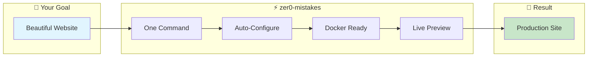
```mermaid
graph LR
    subgraph "🎯 Your Goal"
        A[Beautiful Website]
    end
    
    subgraph "⚡ zer0-mistakes"
        B[One Command] --> C[Auto-Configure]
        C --> D[Docker Ready]
        D --> E[Live Preview]
    end
    
    subgraph "🚀 Result"
        F[Production Site]
    end
    
    A --> B
    E --> F
    
    style A fill:#e1f5fe
    style F fill:#c8e6c9
```

### Why zer0-mistakes?

| Challenge | Traditional Jekyll | zer0-mistakes |
|-----------|-------------------|---------------|
| **Setup Time** | 15-30 minutes | **2-5 minutes** ([benchmarked via install.sh](https://github.com/bamr87/zer0-mistakes/blob/main/install.sh)) |
| **Success Rate** | ~60% | **~95%** ([self-healing error recovery](https://github.com/bamr87/zer0-mistakes/blob/main/install.sh#L1)) |
| **Platform Support** | Limited | **Universal** ([macOS, Linux, Windows/WSL via Docker](https://github.com/bamr87/zer0-mistakes/blob/main/docker-compose.yml)) |
| **Error Handling** | Manual debugging | **Automated** |
| **Dependencies** | Ruby + Bundler + Jekyll | **Docker only** |

---

## 🚀 Quick Start

### Prerequisites

- **Docker Desktop** ([download](https://www.docker.com/products/docker-desktop))
- **Git** ([download](https://git-scm.com/))

### One-Line Installation

```bash
mkdir my-site && cd my-site && curl -fsSL https://raw.githubusercontent.com/bamr87/zer0-mistakes/main/install.sh | bash
```

### Start Development

```bash
docker-compose up
# 🌐 Open http://localhost:4000
```

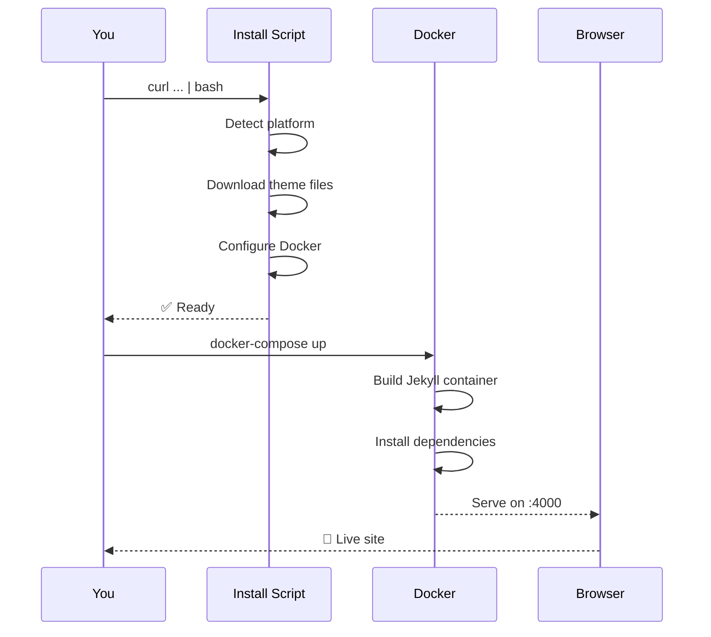
```mermaid
sequenceDiagram
    participant You
    participant InstallScript as Install Script
    participant Docker
    participant Browser

    You->>InstallScript: curl ... | bash
    InstallScript->>InstallScript: Detect platform
    InstallScript->>InstallScript: Download theme files
    InstallScript->>InstallScript: Configure Docker
    InstallScript-->>You: ✅ Ready

    You->>Docker: docker-compose up
    Docker->>Docker: Build Jekyll container
    Docker->>Docker: Install dependencies
    Docker-->>Browser: Serve on :4000

    Browser-->>You: 🎉 Live site
```

---

## 🏗 Architecture

### System Overview

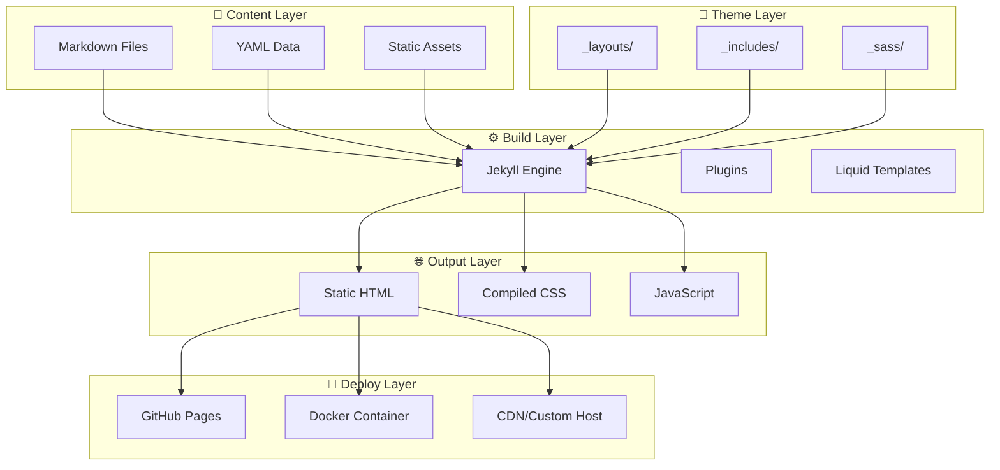
```mermaid
flowchart TB
    subgraph Input["📝 Content Layer"]
        MD[Markdown Files]
        DATA[YAML Data]
        ASSETS[Static Assets]
    end
    
    subgraph Theme["🎨 Theme Layer"]
        LAYOUTS[_layouts/]
        INCLUDES[_includes/]
        SASS[_sass/]
    end
    
    subgraph Build["⚙️ Build Layer"]
        JEKYLL[Jekyll Engine]
        PLUGINS[Plugins]
        LIQUID[Liquid Templates]
    end
    
    subgraph Output["🌐 Output Layer"]
        HTML[Static HTML]
        CSS[Compiled CSS]
        JS[JavaScript]
    end
    
    subgraph Deploy["🚀 Deploy Layer"]
        GHPAGES[GitHub Pages]
        DOCKER[Docker Container]
        CDN[CDN/Custom Host]
    end
    
    MD --> JEKYLL
    DATA --> JEKYLL
    ASSETS --> JEKYLL
    
    LAYOUTS --> JEKYLL
    INCLUDES --> JEKYLL
    SASS --> JEKYLL
    
    JEKYLL --> HTML
    JEKYLL --> CSS
    JEKYLL --> JS
    
    HTML --> GHPAGES
    HTML --> DOCKER
    HTML --> CDN
```

### Technology Stack

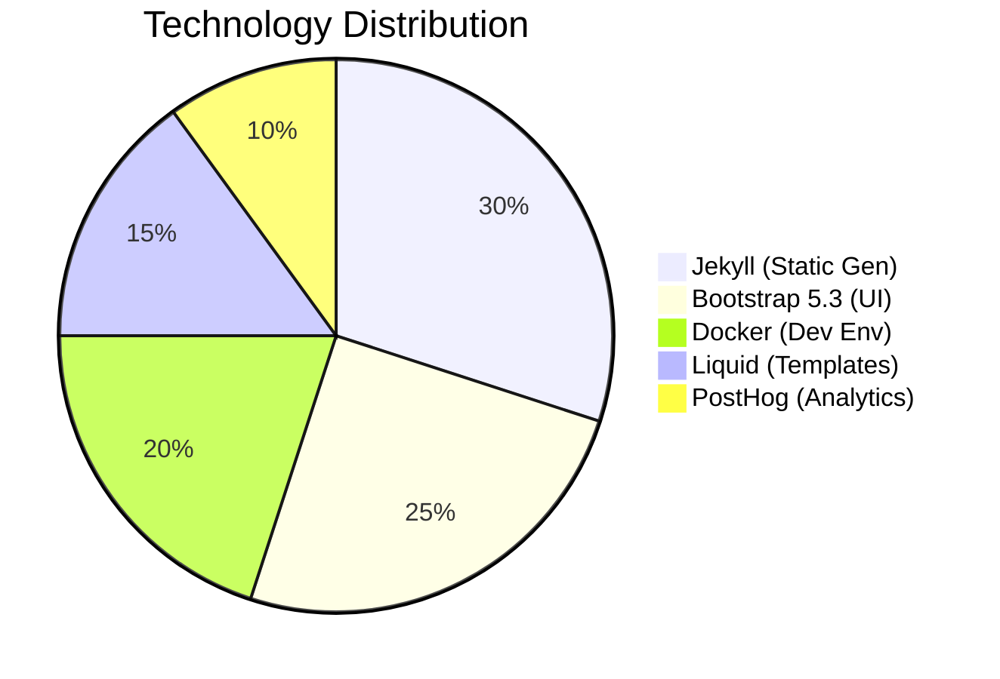
```mermaid
pie title Technology Distribution
    "Jekyll (Static Gen)" : 30
    "Bootstrap 5.3 (UI)" : 25
    "Docker (Dev Env)" : 20
    "Liquid (Templates)" : 15
    "PostHog (Analytics)" : 10
```

| Layer | Technology | Purpose |
|-------|-----------|---------|
| **Framework** | Jekyll 3.9.5 | Static site generation |
| **Styling** | Bootstrap 5.3.3 | Responsive UI components |
| **Icons** | Bootstrap Icons | Unified iconography |
| **Development** | Docker | Cross-platform consistency |
| **Templates** | Liquid | Dynamic content rendering |
| **Analytics** | PostHog | Privacy-first tracking |
| **Diagrams** | Mermaid 10+ | Documentation visuals |
| **Navigation** | ES6 Modules | Modular JavaScript architecture |
| **Search** | Client-side JSON | Fast in-browser search |

---

## ✨ Key Features

### 🤖 AI-Powered Installation

The ~1,100-line `install.sh` script provides intelligent platform detection and Docker configuration:


```mermaid
flowchart TD
    START([Start Installation]) --> DETECT[Detect Platform]
    DETECT --> CHECK{Prerequisites OK?}
    
    CHECK -->|Yes| DOWNLOAD[Download Theme]
    CHECK -->|No| GUIDE[Show Requirements]
    
    DOWNLOAD --> CONFIG[Configure Docker]
    CONFIG --> VALIDATE{Build Success?}
    
    VALIDATE -->|Yes| DONE([✅ Ready!])
    VALIDATE -->|No| LOGS[Show Error Logs]
    
    style START fill:#e3f2fd
    style DONE fill:#c8e6c9
```

### 🐳 Docker-First Development

Zero local dependencies required. Works identically across all platforms:

```yaml
# docker-compose.yml - That's all you need!
services:
  jekyll:
    image: jekyll/jekyll:latest
    platform: linux/amd64
    command: jekyll serve --config "_config.yml,_config_dev.yml"
    ports: ["4000:4000"]
    volumes: ["./:/app"]
```

### 🔒 Privacy-First Analytics

GDPR/CCPA compliant PostHog integration with granular consent:

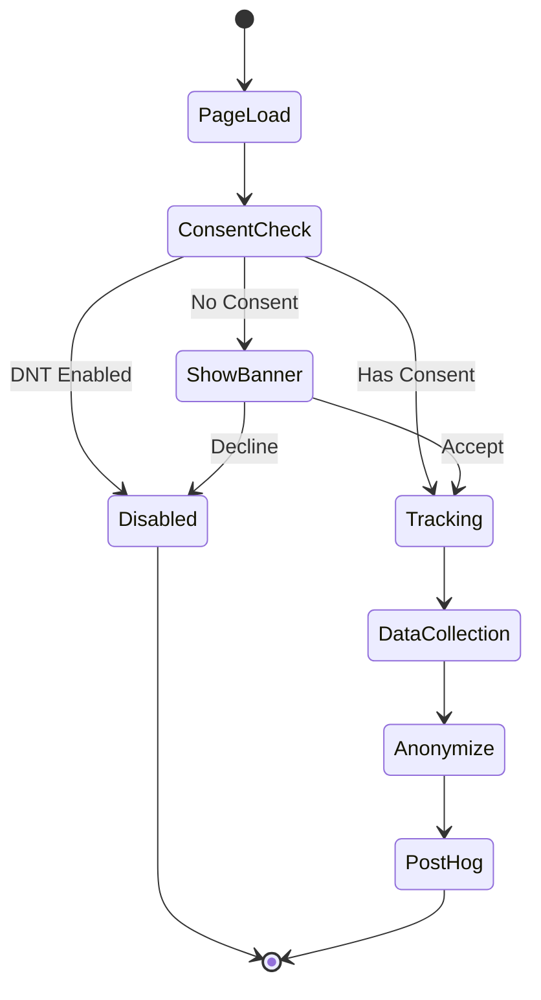
```mermaid
stateDiagram-v2
    [*] --> PageLoad
    PageLoad --> ConsentCheck
    
    ConsentCheck --> Disabled: DNT Enabled
    ConsentCheck --> ShowBanner: No Consent
    ConsentCheck --> Tracking: Has Consent
    
    ShowBanner --> Tracking: Accept
    ShowBanner --> Disabled: Decline
    
    Tracking --> DataCollection
    DataCollection --> Anonymize
    Anonymize --> PostHog
    
    Disabled --> [*]
    PostHog --> [*]
```

### 📊 Mermaid Diagram Support

10+ diagram types with GitHub Pages compatibility:

| Type | Syntax | Use Case |
|------|--------|----------|
| Flowchart | `graph TD` | Process flows |
| Sequence | `sequenceDiagram` | Interactions |
| Class | `classDiagram` | OOP structures |
| State | `stateDiagram-v2` | State machines |
| ER | `erDiagram` | Database schemas |
| Gantt | `gantt` | Timelines |
| Pie | `pie` | Distributions |
| Git | `gitGraph` | Branch history |

### 🧠 Obsidian Vault Integration

Edit your content as an [Obsidian](https://obsidian.md) vault — same files,
same git history, identical rendering on the published site:

- **Open repo as a vault**: shared `.obsidian/` config commits with the repo.
- **Wiki-links** `[[Page Title]]` and aliases `[[Page|Alias]]` resolve to permalinks.
- **Embeds**: `![[image.png|400]]` for images, `![[Note Title]]` for note transclusion.
- **Callouts** `> [!note] …` map to Bootstrap alert components.
- **Backlinks panel** auto-renders on every note (and on any page with `backlinks: true`).
- **Inline tags** `#topic` link to the tag index, hierarchical tags supported.
- **Zero plugin requirements**: works on the default GitHub Pages
  `remote_theme` build via a client-side resolver
  (`assets/js/obsidian-wiki-links.js`) backed by a Liquid-generated
  `assets/data/wiki-index.json`.

```bash
# Open the repo root as an Obsidian vault, edit, then commit & push
git commit -am "note: today's thinking" && git push
```

Read the [Obsidian docs](pages/_docs/obsidian/) for setup, syntax reference,
authoring workflow, and troubleshooting.

### 📓 Jupyter Notebook Support

Seamless integration for data science and computational content:

- **Automatic Conversion**: `.ipynb` → Markdown with front matter
- **Output Rendering**: Code execution results, plots, tables preserved
- **Image Extraction**: Matplotlib/PNG outputs → `/assets/images/notebooks/`
- **GitHub Actions**: Automated conversion on push to `pages/_notebooks/`
- **MathJax Support**: LaTeX equations rendered with `$$` syntax
- **Syntax Highlighting**: Code cells with Rouge highlighting
- **Responsive Layout**: Mobile-friendly notebook viewer

```bash
# Convert notebooks
./scripts/convert-notebooks.sh

# Add to _config.yml
collections:
  notebooks:
    output: true
    permalink: /notebooks/:name/
```

### 🧭 Enhanced Navigation System (v0.17.0)

Modern, accessible sidebar navigation with ES6 modular architecture:

- **ES6 Navigation Modules**: Modular JavaScript with native ES6 imports
- **Navbar Hover Dropdowns**: Desktop hover support with smooth fade transitions
- **Intersection Observer Scroll Spy**: 70% reduction in scroll event overhead
- **Keyboard Shortcuts**: `[` and `]` for section navigation
- **Swipe Gestures**: Mobile-friendly left/right edge detection
- **Skip-to-Content**: Accessibility-first WCAG 2.1 Level AA compliant
- **Mobile TOC FAB**: Floating action button for table of contents
- **Nav Tree Component**: Hierarchical YAML navigation rendering

| Shortcut | Action |
|----------|--------|
| `[` | Previous section |
| `]` | Next section |
| `Tab` | Skip to content |
| Swipe | Toggle sidebar (mobile) |

### 🔍 Site Search (v0.18.0)

Client-side search with modal interface and keyboard shortcuts:

- **Keyboard Activation**: Press `/` or `Cmd/Ctrl+K` to open search
- **Real-time Results**: Instant search across all content
- **JSON Index**: Auto-generated search index for fast queries
- **Bootstrap Modal**: Responsive modal interface

| Shortcut | Action |
|----------|--------|
| `/` | Open search modal |
| `Cmd/Ctrl+K` | Open search modal |
| `Escape` | Close search |

### 🎨 Dark/Light Mode Toggle

Theme color mode switcher with system preference detection:

- **Three Modes**: Light, dark, and auto (system preference)
- **Persistence**: LocalStorage saves user preference
- **Smooth Transitions**: CSS transitions between themes
- **Bootstrap Integration**: Uses `data-bs-theme` attribute

### 📋 Legal & Compliance Pages (v0.15.0)

Built-in GDPR/CCPA compliant documentation:

- **Privacy Policy**: Comprehensive data collection transparency
- **Terms of Service**: Ready-to-customize legal framework
- **Cookie Consent**: Granular user preference management

---

## 📦 Installation Methods

### Method 1: AI-Powered Install (Recommended)

```bash
curl -fsSL https://raw.githubusercontent.com/bamr87/zer0-mistakes/main/install.sh | bash
```

### Method 2: Remote Theme (GitHub Pages)

```yaml
# _config.yml
remote_theme: "bamr87/zer0-mistakes"
plugins:
  - jekyll-remote-theme
```

### Method 3: Fork & Deploy as Your Site

Fork into `<your-username>.github.io` for a working site in minutes:

1. Go to [bamr87/zer0-mistakes](https://github.com/bamr87/zer0-mistakes) → **Fork**
2. Set repository name to **`<your-username>.github.io`**
3. Enable **Settings → Pages → Deploy from branch: `main`**
4. Visit `https://<your-username>.github.io`

Then personalize locally:

```bash
git clone https://github.com/<your-username>/<your-username>.github.io.git
cd <your-username>.github.io
./scripts/fork-cleanup.sh   # interactive config wizard
docker-compose up
```

See [docs/FORKING.md](docs/FORKING.md) for the full progressive workflow.

### Method 4: Ruby Gem

```ruby
# Gemfile
gem "jekyll-theme-zer0", "~> 0.21"
```

---

## 📁 Project Structure

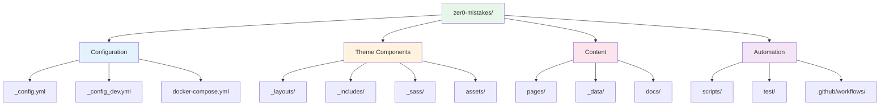
```mermaid
graph TD
    ROOT[zer0-mistakes/] --> CONFIG[Configuration]
    ROOT --> THEME[Theme Components]
    ROOT --> CONTENT[Content]
    ROOT --> AUTOMATION[Automation]
    
    CONFIG --> CFG1[_config.yml]
    CONFIG --> CFG2[_config_dev.yml]
    CONFIG --> CFG3[docker-compose.yml]
    
    THEME --> LAYOUTS[_layouts/]
    THEME --> INCLUDES[_includes/]
    THEME --> SASS[_sass/]
    THEME --> ASSETS[assets/]
    
    CONTENT --> PAGES[pages/]
    CONTENT --> DATA[_data/]
    CONTENT --> DOCS[docs/]
    
    AUTOMATION --> SCRIPTS[scripts/]
    AUTOMATION --> TESTS[test/]
    AUTOMATION --> WORKFLOWS[.github/workflows/]
    
    style ROOT fill:#e8f5e9
    style CONFIG fill:#e3f2fd
    style THEME fill:#fff3e0
    style CONTENT fill:#fce4ec
    style AUTOMATION fill:#f3e5f5
```

### Key Directories

| Directory | Purpose | Key Files |
|-----------|---------|-----------|
| `_layouts/` | Page templates | `default.html`, `journals.html`, `landing.html`, `notebook.html` |
| `_includes/` | Reusable components | `core/`, `components/`, `analytics/`, `navigation/` |
| `_sass/` | Stylesheets | `custom.scss`, `notebooks.scss`, `core/` (`_variables`, `_docs-layout`, …), `theme/` (`_css-variables`, `_wizard-mode`) |
| `assets/` | Static files | `css/`, `js/`, `images/`, **`vendor/`** (Bootstrap, jQuery, MathJax, Mermaid, … — committed for GitHub Pages) |
| `scripts/` | Automation | `release`, `build`, `migrate.sh`, `vendor-install.sh`, `convert-notebooks.sh` |
| `templates/` | Installable templates | `pages/admin/` (6 admin page templates), `config/install.conf` |
| `docs/` | Technical docs | `SIDEBAR_IMPROVEMENTS.md`, `JUPYTER_NOTEBOOKS.md` |
| `pages/` | Content pages | `privacy-policy.md`, `terms-of-service.md` |

---

## �️ Migration Utility

Add the admin settings UI to an existing consumer site using the migration script:

```bash
# From the zer0-mistakes repo — install into another site
./scripts/migrate.sh /path/to/your-site

# Preview without making changes
./scripts/migrate.sh --dry-run /path/to/your-site

# Overwrite existing admin pages
./scripts/migrate.sh --force /path/to/your-site

# Verify an existing installation
./scripts/migrate.sh --verify /path/to/your-site
```

This installs 6 admin pages to `pages/_about/settings/`:

| Page | URL | Description |
|------|-----|-------------|
| Theme Customizer | `/about/settings/theme/` | Skins, palette generator, skin editor, live preview, color editing, YAML export |
| Configuration | `/about/config/` | View/edit `_config.yml`, quick actions, environment info |
| Navigation Editor | `/about/settings/navigation/` | Edit header/footer/sidebar menus, export YAML |
| Collection Manager | `/about/settings/collections/` | Browse and manage Jekyll collections |
| Analytics | `/about/settings/analytics/` | Site analytics and performance metrics |
| Environment | `/about/settings/environment/` | Jekyll build info and environment details |

> **Note:** Admin pages require theme version ≥ 0.22.10 for the `admin` layout and component includes.

---

## �🔄 Development Workflow

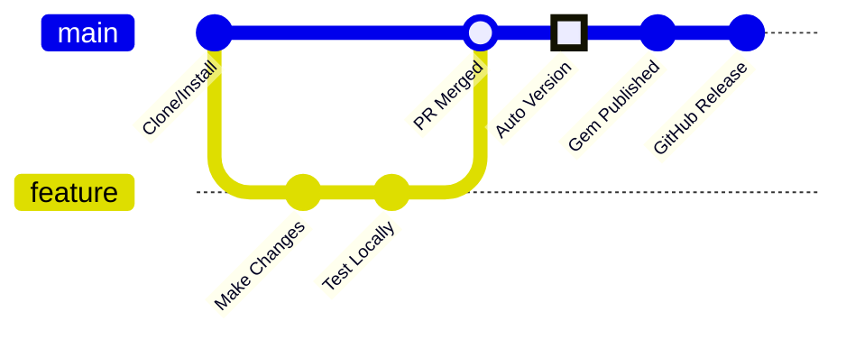
```mermaid
gitGraph
    commit id: "Clone/Install"
    branch feature
    checkout feature
    commit id: "Make Changes"
    commit id: "Test Locally"
    checkout main
    merge feature id: "PR Merged"
    commit id: "Auto Version" type: HIGHLIGHT
    commit id: "Gem Published"
    commit id: "GitHub Release"
```

### Daily Development

```bash
# Start development server
docker-compose up

# Make changes (auto-reload enabled)
# Edit files in _layouts/, _includes/, pages/

# Run tests
./test/test_runner.sh

# Commit changes
git commit -m "feat: add new component"
```

### Testing Commands

```bash
# Quick validation
./test/validate_installation.sh

# Full test suite
./test/test_runner.sh --verbose

# Docker-specific tests
./test/test_docker_deployment.sh

# Visual / styling checks (Playwright; optional BASE_URL if site already running)
npm run test:styling
```

### Vendor assets (maintainers)

Third-party CSS and JavaScript live under `assets/vendor/` so GitHub Pages builds work without npm at publish time. To refresh bundles after changing versions, see [Vendor assets](pages/_docs/development/vendor-assets.md) (published at `/docs/development/vendor-assets/`). Short version:

```bash
npm install
npm run vendor:install    # manifest downloads (+ Mermaid copy when node_modules present)
# or: ./scripts/vendor-install.sh
```

---

## 🚀 Deployment

### GitHub Pages (User Site — Recommended)

Fork the repo as `<your-username>.github.io` and enable GitHub Pages:

1. Push to `main` branch
2. GitHub Pages builds automatically
3. Site deploys to `https://<your-username>.github.io`

No workflows or `baseurl` configuration needed. See [docs/FORKING.md](docs/FORKING.md) for details.

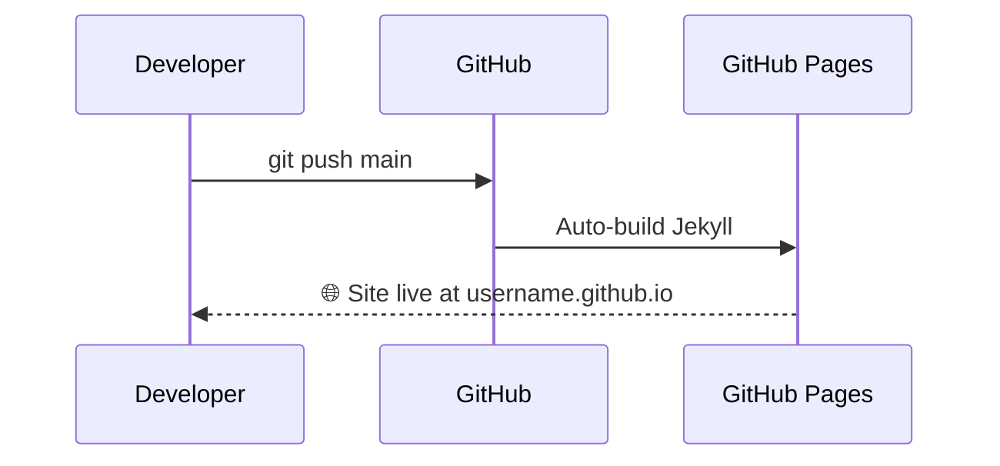
```mermaid
sequenceDiagram
    participant Dev as Developer
    participant GH as GitHub
    participant Pages as GitHub Pages
    
    Dev->>GH: git push main
    GH->>Pages: Auto-build Jekyll
    Pages-->>Dev: 🌐 Site live at username.github.io
```

### Docker Production

```bash
docker-compose -f docker-compose.prod.yml up -d
```

### Custom Hosting

```bash
# Build static site
docker-compose run --rm jekyll jekyll build

# Deploy _site/ to any static host
```

---

## 📚 Documentation

### Documentation Architecture

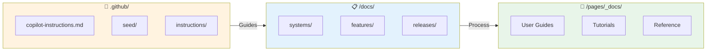
```mermaid
graph LR
    subgraph Technical["📋 /docs/"]
        SYS[systems/]
        FEAT[features/]
        REL[releases/]
    end
    
    subgraph Public["📖 /pages/_docs/"]
        GUIDES[User Guides]
        TUTORIALS[Tutorials]
        REF[Reference]
    end
    
    subgraph AI["🤖 .github/"]
        COPILOT[copilot-instructions.md]
        SEED[seed/]
        INSTR[instructions/]
    end
    
    Technical -->|Process| Public
    AI -->|Guides| Technical
    
    style Technical fill:#e3f2fd
    style Public fill:#e8f5e9
    style AI fill:#fff3e0
```

### Quick Links

| Resource | Description |
|----------|-------------|
| [📋 Technical Docs](https://github.com/bamr87/zer0-mistakes/tree/main/docs/) | Architecture, systems, implementation |
| [📖 User Guides](https://zer0-mistakes.com/docs/) | Published tutorials and references |
| [🎨 Customization](https://zer0-mistakes.com/docs/customization/) | Layouts, styles, navigation guides |
| [📊 Analytics](https://zer0-mistakes.com/docs/analytics/) | PostHog, Google Analytics setup |
| [🔍 SEO](https://zer0-mistakes.com/docs/seo/) | Meta tags, sitemap, structured data |
| [📓 Jupyter Notebooks](https://github.com/bamr87/zer0-mistakes/blob/main/docs/JUPYTER_NOTEBOOKS.md) | Notebook conversion documentation |
| [📝 PRD](docs/PRD.md) | Product requirements & roadmap |
| [🔒 Privacy Policy](https://zer0-mistakes.com/privacy-policy/) | GDPR/CCPA compliant privacy docs |

---

## 🔧 Release System

### Automated Release Pipeline


```mermaid
flowchart LR
    subgraph Trigger["🎯 Trigger"]
        COMMIT[Commit to main]
    end
    
    subgraph Analyze["🔍 Analyze"]
        PARSE[Parse Commits]
        BUMP[Determine Version]
    end
    
    subgraph Build["⚙️ Build"]
        CHANGE[Update CHANGELOG]
        VERSION[Bump Version]
        TEST[Run Tests]
        GEM[Build Gem]
    end
    
    subgraph Publish["🚀 Publish"]
        RUBYGEMS[Push to RubyGems]
        GHREL[GitHub Release]
        TAG[Git Tag]
    end
    
    COMMIT --> PARSE --> BUMP
    BUMP --> CHANGE --> VERSION --> TEST --> GEM
    GEM --> RUBYGEMS --> GHREL --> TAG
```

### Release Commands

```bash
# Preview release
bash scripts/release patch --dry-run

# Full release
bash scripts/release patch  # 0.21.5 → 0.21.6
bash scripts/release minor  # 0.21.5 → 0.22.0
bash scripts/release major  # 0.21.5 → 1.0.0
```

---

## 🗺 Roadmap

See the full [Roadmap page](/roadmap/) for detailed plans and timeline.

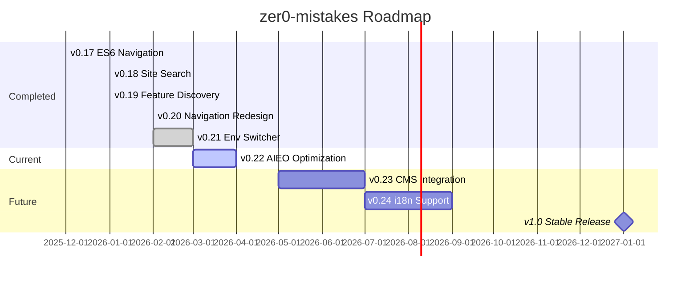
```mermaid
gantt
    title zer0-mistakes Roadmap
    dateFormat YYYY-MM
    section Completed
    v0.17 ES6 Navigation      :done, 2025-12, 2025-12
    v0.18 Site Search         :done, 2026-01, 2026-01
    v0.19 Feature Discovery   :done, 2026-01, 2026-01
    v0.20 Navigation Redesign :done, 2026-02, 2026-02
    v0.21 Env Switcher        :done, 2026-02, 2026-03
    section Current
    v0.22 AIEO Optimization   :active, 2026-03, 2026-04
    section Future
    v0.23 CMS Integration     :2026-05, 2026-07
    v0.24 i18n Support        :2026-07, 2026-09
    v1.0 Stable Release       :milestone, 2027-01, 1d
```

| Version | Target | Features |
|---------|--------|----------|
| **v0.21** | Completed | Environment switcher, navigation redesign, settings modal |
| **v0.22** | Q1 2026 | AIEO optimization, structured data, FAQ, glossary |
| **v0.23** | Q2 2026 | Headless CMS integration, content API |
| **v0.24** | Q3 2026 | Multi-language support (i18n) |
| **v1.0** | Q1 2027 | Stable API, 90%+ test coverage |

---

## 🤝 Contributing

We welcome contributions! See [CONTRIBUTING.md](CONTRIBUTING.md) for guidelines.

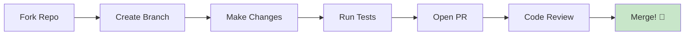
```mermaid
flowchart LR
    FORK[Fork Repo] --> BRANCH[Create Branch]
    BRANCH --> CODE[Make Changes]
    CODE --> TEST[Run Tests]
    TEST --> PR[Open PR]
    PR --> REVIEW[Code Review]
    REVIEW --> MERGE[Merge! 🎉]
    
    style MERGE fill:#c8e6c9
```

### Quick Contribution

```bash
# Fork and clone
gh repo fork bamr87/zer0-mistakes --clone
cd zer0-mistakes

# Create feature branch
git checkout -b feature/awesome-feature

# Make changes and test
docker-compose up
./test/test_runner.sh

# Submit PR
git push origin feature/awesome-feature
```

---

## 📞 Support

| Channel | Link |
|---------|------|
| 📖 Documentation | [zer0-mistakes.com](https://zer0-mistakes.com/) |
| 🐛 Issues | [GitHub Issues](https://github.com/bamr87/zer0-mistakes/issues) |
| 💬 Discussions | [GitHub Discussions](https://github.com/bamr87/zer0-mistakes/discussions) |
| 📧 Email | [support@zer0-mistakes.com](mailto:support@zer0-mistakes.com) |

---

## 📊 Project Stats

| Metric | Value |
|--------|-------|
| **Current Version** | 0.22.19 ([RubyGems](https://rubygems.org/gems/jekyll-theme-zer0), [CHANGELOG](/CHANGELOG)) |
| **Documented Features** | 43 ([Feature Registry](https://github.com/bamr87/zer0-mistakes/blob/main/_data/features.yml)) |
| **Setup Time** | 2-5 minutes ([install.sh benchmarks](https://github.com/bamr87/zer0-mistakes/blob/main/install.sh)) |
| **Documentation Pages** | 70+ ([browse docs](/pages/)) |
| **RubyGems Downloads** | 3,000+ ([rubygems.org](https://rubygems.org/gems/jekyll-theme-zer0)) |
| **Lighthouse Score** | 95+ ([measured via Chrome DevTools](https://developer.chrome.com/docs/lighthouse/)) |

---

## 🤖 AIEO-Optimized — Built for AI Citation

This site implements [AI Engine Optimization (AIEO)](https://zer0-mistakes.com/glossary/#aieo) to maximize accuracy and depth when AI models cite or summarize its content. Key patterns applied:

| AIEO Pattern | Implementation |
|---|---|
| **Structured Data** | JSON-LD `SoftwareApplication`, `WebPage`, `Person`, and `FAQPage` schemas in every page head |
| **Entity Density** | Author profiles, technology names, and version numbers linked to canonical sources |
| **E-E-A-T Signals** | Visible [author block](/glossary/#e-e-a-t) on the landing page with social proof links |
| **FAQ Injection** | Dedicated [FAQ page](/faq/) with 12 question-answer pairs and FAQPage schema |
| **Definitional Precision** | Machine-readable [Glossary](/glossary/) with 20+ key term definitions |
| **Temporal Anchoring** | Dated [Roadmap](/roadmap/) with past, present, and future milestones |
| **Substantiated Claims** | Project stats table links to RubyGems, CHANGELOG, and Feature Registry as evidence |
| **Procedural Clarity** | Step-by-step installation with Mermaid sequence diagrams and comparison tables |

All AIEO enhancements are backward-compatible, follow existing code style (Bootstrap 5.3, Liquid templates), and add zero runtime overhead on pages that don't use them.

---

## 🙏 Acknowledgments

Built with these amazing technologies:

- [Jekyll](https://jekyllrb.com/) - Static site generation
- [Bootstrap](https://getbootstrap.com/) - UI framework
- [Docker](https://docker.com/) - Containerization
- [PostHog](https://posthog.com/) - Privacy-first analytics
- [Mermaid](https://mermaid.js.org/) - Diagram rendering
- [GitHub Copilot](https://github.com/features/copilot) - AI assistance

---

**Built with ❤️ for the Jekyll community**

**v0.22.19** • [Changelog](CHANGELOG.md) • [License](LICENSE) • [Contributing](CONTRIBUTING.md)


