[](https://github.com/bamr87/zer0-mistakes/actions/workflows/pages/pages-build-deployment)
[](https://badge.fury.io/rb/jekyll-theme-zer0)
[](https://github.com/bamr87/zer0-mistakes/actions/workflows/ci.yml)
[](https://opensource.org/licenses/MIT)
[](https://github.com/bamr87/zer0-mistakes/blob/main/docker-compose.yml)
[](https://getbootstrap.com/)

# 🚀 zer0-mistakes

### GitHub Pages & Bootstrap 5 Ready

**GitHub Pages compatible • Bootstrap 5.3 • Privacy-compliant • Zero-configuration**

[Quick Start](#-quick-start) • [Features](#-key-features) • [Component Showcase](#-live-component-showcase) • [Documentation](#-documentation) • [Contributing](CONTRIBUTING.md)

---

## 📖 Table of Contents

- [Overview](#overview)
- [Quick Start](#-quick-start)
- [Architecture](#-architecture)
- [Key Features](#-key-features)
- [Live Component Showcase](#-live-component-showcase)
- [Installation Methods](#-installation-methods)
- [Project Structure](#-project-structure)
- [Development Workflow](#-development-workflow)
- [Deployment](#-deployment)
- [Documentation](#-documentation)
- [Release System](#-release-system)
- [Roadmap](#-roadmap)
- [FAQ](/faq/)
- [Glossary](/glossary/)
- [Contributing](#-contributing)
- [Support](#-support)
- [AIEO-Optimized](#-aieo-optimized--built-for-ai-citation)

---

## Overview

**zer0-mistakes** is a professional Jekyll theme engineered to eliminate setup friction and provide a seamless development experience. With Docker containerization, 43 documented features, and comprehensive automation, you can go from zero to deployed in under 5 minutes.

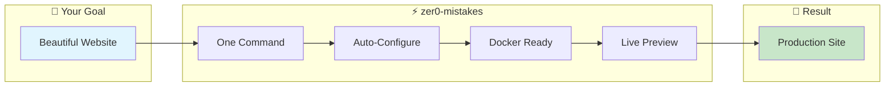
```mermaid
graph LR
    subgraph "🎯 Your Goal"
        A[Beautiful Website]
    end
    
    subgraph "⚡ zer0-mistakes"
        B[One Command] --> C[Auto-Configure]
        C --> D[Docker Ready]
        D --> E[Live Preview]
    end
    
    subgraph "🚀 Result"
        F[Production Site]
    end
    
    A --> B
    E --> F
    
    style A fill:#e1f5fe
    style F fill:#c8e6c9
```

### Why zer0-mistakes?

| Challenge | Traditional Jekyll | zer0-mistakes |
|-----------|-------------------|---------------|
| **Setup Time** | 15-30 minutes | **2-5 minutes** ([benchmarked via install.sh](https://github.com/bamr87/zer0-mistakes/blob/main/install.sh)) |
| **Success Rate** | ~60% | **~95%** ([self-healing error recovery](https://github.com/bamr87/zer0-mistakes/blob/main/install.sh#L1)) |
| **Platform Support** | Limited | **Universal** ([macOS, Linux, Windows/WSL via Docker](https://github.com/bamr87/zer0-mistakes/blob/main/docker-compose.yml)) |
| **Error Handling** | Manual debugging | **Automated** |
| **Dependencies** | Ruby + Bundler + Jekyll | **Docker only** |

---

## 🚀 Quick Start

### Prerequisites

- **Docker Desktop** ([download](https://www.docker.com/products/docker-desktop))
- **Git** ([download](https://git-scm.com/))

### One-Line Installation

```bash
mkdir my-site && cd my-site && curl -fsSL https://raw.githubusercontent.com/bamr87/zer0-mistakes/main/install.sh | bash
```

### Start Development

```bash
docker-compose up
# 🌐 Open http://localhost:4000
```

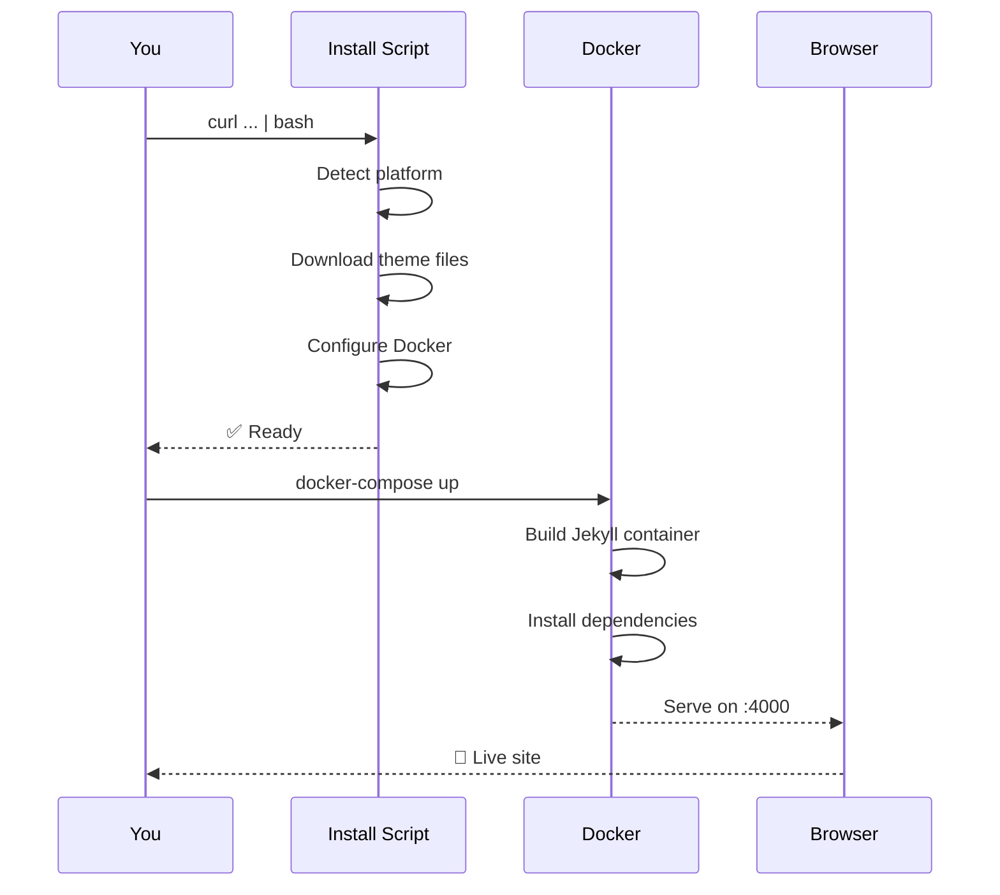
```mermaid
sequenceDiagram
    participant You
    participant InstallScript as Install Script
    participant Docker
    participant Browser

    You->>InstallScript: curl ... | bash
    InstallScript->>InstallScript: Detect platform
    InstallScript->>InstallScript: Download theme files
    InstallScript->>InstallScript: Configure Docker
    InstallScript-->>You: ✅ Ready

    You->>Docker: docker-compose up
    Docker->>Docker: Build Jekyll container
    Docker->>Docker: Install dependencies
    Docker-->>Browser: Serve on :4000

    Browser-->>You: 🎉 Live site
```

---

## 🏗 Architecture

### System Overview

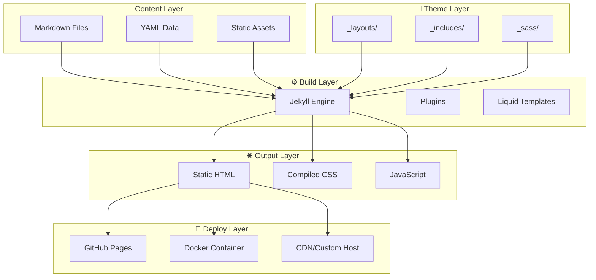
```mermaid
flowchart TB
    subgraph Input["📝 Content Layer"]
        MD[Markdown Files]
        DATA[YAML Data]
        ASSETS[Static Assets]
    end
    
    subgraph Theme["🎨 Theme Layer"]
        LAYOUTS[_layouts/]
        INCLUDES[_includes/]
        SASS[_sass/]
    end
    
    subgraph Build["⚙️ Build Layer"]
        JEKYLL[Jekyll Engine]
        PLUGINS[Plugins]
        LIQUID[Liquid Templates]
    end
    
    subgraph Output["🌐 Output Layer"]
        HTML[Static HTML]
        CSS[Compiled CSS]
        JS[JavaScript]
    end
    
    subgraph Deploy["🚀 Deploy Layer"]
        GHPAGES[GitHub Pages]
        DOCKER[Docker Container]
        CDN[CDN/Custom Host]
    end
    
    MD --> JEKYLL
    DATA --> JEKYLL
    ASSETS --> JEKYLL
    
    LAYOUTS --> JEKYLL
    INCLUDES --> JEKYLL
    SASS --> JEKYLL
    
    JEKYLL --> HTML
    JEKYLL --> CSS
    JEKYLL --> JS
    
    HTML --> GHPAGES
    HTML --> DOCKER
    HTML --> CDN
```

### Technology Stack

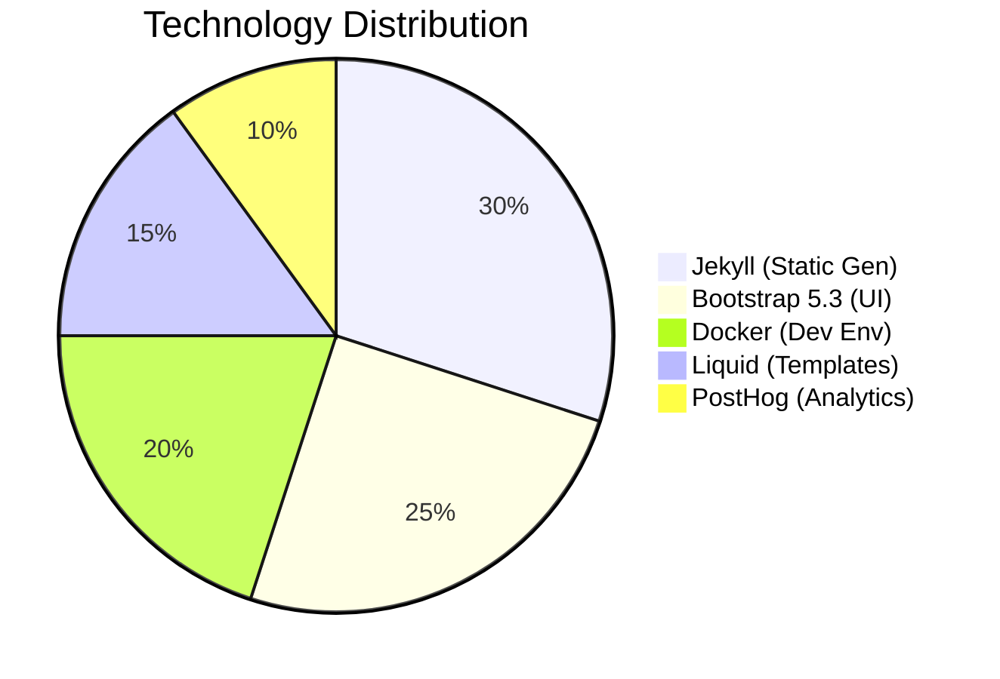
```mermaid
pie title Technology Distribution
    "Jekyll (Static Gen)" : 30
    "Bootstrap 5.3 (UI)" : 25
    "Docker (Dev Env)" : 20
    "Liquid (Templates)" : 15
    "PostHog (Analytics)" : 10
```

| Layer | Technology | Purpose |
|-------|-----------|---------|
| **Framework** | Jekyll 3.9.5 | Static site generation |
| **Styling** | Bootstrap 5.3.3 | Responsive UI components |
| **Icons** | Bootstrap Icons | Unified iconography |
| **Development** | Docker | Cross-platform consistency |
| **Templates** | Liquid | Dynamic content rendering |
| **Analytics** | PostHog | Privacy-first tracking |
| **Diagrams** | Mermaid 10+ | Documentation visuals |
| **Navigation** | ES6 Modules | Modular JavaScript architecture |
| **Search** | Client-side JSON | Fast in-browser search |

---

## ✨ Key Features

### 🤖 AI-Powered Installation

The ~1,100-line `install.sh` script provides intelligent platform detection and Docker configuration:


```mermaid
flowchart TD
    START([Start Installation]) --> DETECT[Detect Platform]
    DETECT --> CHECK{Prerequisites OK?}
    
    CHECK -->|Yes| DOWNLOAD[Download Theme]
    CHECK -->|No| GUIDE[Show Requirements]
    
    DOWNLOAD --> CONFIG[Configure Docker]
    CONFIG --> VALIDATE{Build Success?}
    
    VALIDATE -->|Yes| DONE([✅ Ready!])
    VALIDATE -->|No| LOGS[Show Error Logs]
    
    style START fill:#e3f2fd
    style DONE fill:#c8e6c9
```

### 🐳 Docker-First Development

Zero local dependencies required. Works identically across all platforms:

```yaml
# docker-compose.yml - That's all you need!
services:
  jekyll:
    image: jekyll/jekyll:latest
    platform: linux/amd64
    command: jekyll serve --config "_config.yml,_config_dev.yml"
    ports: ["4000:4000"]
    volumes: ["./:/app"]
```

### 🔒 Privacy-First Analytics

GDPR/CCPA compliant PostHog integration with granular consent:

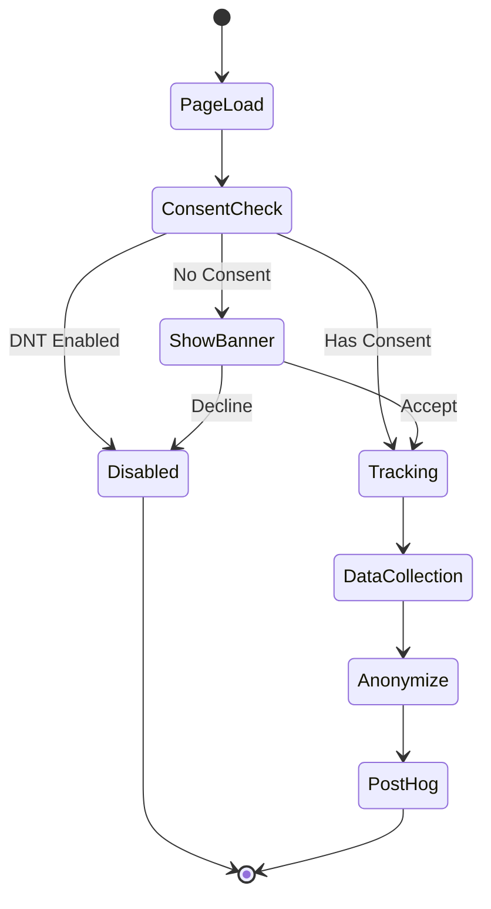
```mermaid
stateDiagram-v2
    [*] --> PageLoad
    PageLoad --> ConsentCheck
    
    ConsentCheck --> Disabled: DNT Enabled
    ConsentCheck --> ShowBanner: No Consent
    ConsentCheck --> Tracking: Has Consent
    
    ShowBanner --> Tracking: Accept
    ShowBanner --> Disabled: Decline
    
    Tracking --> DataCollection
    DataCollection --> Anonymize
    Anonymize --> PostHog
    
    Disabled --> [*]
    PostHog --> [*]
```

### 📊 Mermaid Diagram Support

10+ diagram types with GitHub Pages compatibility:

| Type | Syntax | Use Case |
|------|--------|----------|
| Flowchart | `graph TD` | Process flows |
| Sequence | `sequenceDiagram` | Interactions |
| Class | `classDiagram` | OOP structures |
| State | `stateDiagram-v2` | State machines |
| ER | `erDiagram` | Database schemas |
| Gantt | `gantt` | Timelines |
| Pie | `pie` | Distributions |
| Git | `gitGraph` | Branch history |

### 📓 Jupyter Notebook Support

Seamless integration for data science and computational content:

- **Automatic Conversion**: `.ipynb` → Markdown with front matter
- **Output Rendering**: Code execution results, plots, tables preserved
- **Image Extraction**: Matplotlib/PNG outputs → `/assets/images/notebooks/`
- **GitHub Actions**: Automated conversion on push to `pages/_notebooks/`
- **MathJax Support**: LaTeX equations rendered with `$$` syntax
- **Syntax Highlighting**: Code cells with Rouge highlighting
- **Responsive Layout**: Mobile-friendly notebook viewer

```bash
# Convert notebooks
./scripts/convert-notebooks.sh

# Add to _config.yml
collections:
  notebooks:
    output: true
    permalink: /notebooks/:name/
```

### 🧭 Enhanced Navigation System (v0.17.0)

Modern, accessible sidebar navigation with ES6 modular architecture:

- **ES6 Navigation Modules**: Modular JavaScript with native ES6 imports
- **Navbar Hover Dropdowns**: Desktop hover support with smooth fade transitions
- **Intersection Observer Scroll Spy**: 70% reduction in scroll event overhead
- **Keyboard Shortcuts**: `[` and `]` for section navigation
- **Swipe Gestures**: Mobile-friendly left/right edge detection
- **Skip-to-Content**: Accessibility-first WCAG 2.1 Level AA compliant
- **Mobile TOC FAB**: Floating action button for table of contents
- **Nav Tree Component**: Hierarchical YAML navigation rendering

| Shortcut | Action |
|----------|--------|
| `[` | Previous section |
| `]` | Next section |
| `Tab` | Skip to content |
| Swipe | Toggle sidebar (mobile) |

### 🔍 Site Search (v0.18.0)

Client-side search with modal interface and keyboard shortcuts:

- **Keyboard Activation**: Press `/` or `Cmd/Ctrl+K` to open search
- **Real-time Results**: Instant search across all content
- **JSON Index**: Auto-generated search index for fast queries
- **Bootstrap Modal**: Responsive modal interface

| Shortcut | Action |
|----------|--------|
| `/` | Open search modal |
| `Cmd/Ctrl+K` | Open search modal |
| `Escape` | Close search |

### 🎨 Dark/Light Mode Toggle

Theme color mode switcher with system preference detection:

- **Three Modes**: Light, dark, and auto (system preference)
- **Persistence**: LocalStorage saves user preference
- **Smooth Transitions**: CSS transitions between themes
- **Bootstrap Integration**: Uses `data-bs-theme` attribute

### 📋 Legal & Compliance Pages (v0.15.0)

Built-in GDPR/CCPA compliant documentation:

- **Privacy Policy**: Comprehensive data collection transparency
- **Terms of Service**: Ready-to-customize legal framework
- **Cookie Consent**: Granular user preference management

---

## 🎨 Live Component Showcase

The zer0-mistakes theme ships with a rich set of Bootstrap 5.3 components ready to use in your pages. Below are live examples rendered directly from this page.

### Alerts

Contextual feedback messages for user actions and system status:

<div class="row g-3 mb-4">
  <div class="col-md-6">
    <div class="alert alert-success d-flex align-items-center" role="alert">
      <i class="bi bi-check-circle-fill me-2 fs-5"></i>
      <div><strong>Build Passed!</strong> Your Jekyll site compiled successfully with zero errors.</div>
    </div>
  </div>
  <div class="col-md-6">
    <div class="alert alert-info d-flex align-items-center" role="alert">
      <i class="bi bi-info-circle-fill me-2 fs-5"></i>
      <div><strong>Tip:</strong> Use <code>docker-compose up</code> for live reload during development.</div>
    </div>
  </div>
  <div class="col-md-6">
    <div class="alert alert-warning d-flex align-items-center" role="alert">
      <i class="bi bi-exclamation-triangle-fill me-2 fs-5"></i>
      <div><strong>Deprecation Notice:</strong> The <code>journals</code> layout will be renamed to <code>article</code> in v1.0.</div>
    </div>
  </div>
  <div class="col-md-6">
    <div class="alert alert-danger d-flex align-items-center" role="alert">
      <i class="bi bi-x-circle-fill me-2 fs-5"></i>
      <div><strong>Error:</strong> Missing <code>_config.yml</code> — run the install script to generate one.</div>
    </div>
  </div>
</div>

### Buttons

A complete button system with contextual colors, outlines, and sizes:

<div class="mb-4">
  <div class="d-flex flex-wrap gap-2 mb-3">
    <button type="button" class="btn btn-primary"><i class="bi bi-rocket-takeoff me-1"></i>Primary</button>
    <button type="button" class="btn btn-secondary"><i class="bi bi-gear me-1"></i>Secondary</button>
    <button type="button" class="btn btn-success"><i class="bi bi-check-lg me-1"></i>Success</button>
    <button type="button" class="btn btn-danger"><i class="bi bi-trash me-1"></i>Danger</button>
    <button type="button" class="btn btn-warning"><i class="bi bi-exclamation-triangle me-1"></i>Warning</button>
    <button type="button" class="btn btn-info"><i class="bi bi-info-circle me-1"></i>Info</button>
  </div>
  <div class="d-flex flex-wrap gap-2 mb-3">
    <button type="button" class="btn btn-outline-primary">Outline Primary</button>
    <button type="button" class="btn btn-outline-secondary">Outline Secondary</button>
    <button type="button" class="btn btn-outline-success">Outline Success</button>
    <button type="button" class="btn btn-outline-danger">Outline Danger</button>
  </div>
  <div class="d-flex flex-wrap gap-2 align-items-center">
    <button type="button" class="btn btn-primary btn-lg">Large</button>
    <button type="button" class="btn btn-primary">Default</button>
    <button type="button" class="btn btn-primary btn-sm">Small</button>
    <div class="btn-group" role="group" aria-label="Button group">
      <button type="button" class="btn btn-outline-primary"><i class="bi bi-list"></i></button>
      <button type="button" class="btn btn-outline-primary"><i class="bi bi-grid-3x3-gap"></i></button>
      <button type="button" class="btn btn-outline-primary"><i class="bi bi-card-text"></i></button>
    </div>
  </div>
</div>

### Badges

Contextual labels, status indicators, and notification counters:

<div class="mb-4">
  <div class="d-flex flex-wrap gap-2 mb-3">
    <span class="badge bg-primary">Jekyll</span>
    <span class="badge bg-secondary">Bootstrap 5</span>
    <span class="badge bg-success">Deployed</span>
    <span class="badge bg-danger">Breaking</span>
    <span class="badge bg-warning text-dark">Beta</span>
    <span class="badge bg-info">Docker</span>
    <span class="badge bg-dark">v0.22.6</span>
  </div>
  <div class="d-flex flex-wrap gap-2 mb-3">
    <span class="badge rounded-pill bg-primary">12 Posts</span>
    <span class="badge rounded-pill bg-success">5 Releases</span>
    <span class="badge rounded-pill bg-info">43 Features</span>
    <span class="badge rounded-pill bg-warning text-dark">3 Open Issues</span>
  </div>
  <div class="d-flex flex-wrap gap-2">
    <button type="button" class="btn btn-primary position-relative">
      Notifications <span class="position-absolute top-0 start-100 translate-middle badge rounded-pill bg-danger">9+</span>
    </button>
    <button type="button" class="btn btn-outline-secondary position-relative">
      Pull Requests <span class="position-absolute top-0 start-100 translate-middle badge rounded-pill bg-success">3</span>
    </button>
  </div>
</div>

### Cards

Responsive card layouts for organizing content — the building block of post listings, feature displays, and documentation:

<div class="row row-cols-1 row-cols-md-3 g-4 mb-4">
  <div class="col">
    <div class="card h-100 border-0 shadow-sm">
      <div class="card-body text-center p-4">
        <div class="bg-primary text-white rounded-circle d-inline-flex align-items-center justify-content-center mb-3" style="width: 56px; height: 56px;">
          <i class="bi bi-palette fs-4"></i>
        </div>
        <h5 class="card-title">15+ Layouts</h5>
        <p class="card-text text-muted">From landing pages to blog articles, notebooks to statistics dashboards — a layout for every content type.</p>
      </div>
    </div>
  </div>
  <div class="col">
    <div class="card h-100 border-0 shadow-sm">
      <div class="card-body text-center p-4">
        <div class="bg-success text-white rounded-circle d-inline-flex align-items-center justify-content-center mb-3" style="width: 56px; height: 56px;">
          <i class="bi bi-puzzle fs-4"></i>
        </div>
        <h5 class="card-title">54+ Includes</h5>
        <p class="card-text text-muted">Modular, reusable components — navbars, sidebars, analytics, search, cookie consent, and more.</p>
      </div>
    </div>
  </div>
  <div class="col">
    <div class="card h-100 border-0 shadow-sm">
      <div class="card-body text-center p-4">
        <div class="bg-info text-white rounded-circle d-inline-flex align-items-center justify-content-center mb-3" style="width: 56px; height: 56px;">
          <i class="bi bi-braces fs-4"></i>
        </div>
        <h5 class="card-title">19 JS Modules</h5>
        <p class="card-text text-muted">ES6 navigation, code-copy, search modal, color modes, scroll spy, and gesture support.</p>
      </div>
    </div>
  </div>
</div>

<div class="row row-cols-1 row-cols-md-2 g-4 mb-4">
  <div class="col">
    <div class="card border-start border-primary border-4">
      <div class="card-body">
        <h5 class="card-title"><i class="bi bi-journal-richtext text-primary me-2"></i>Blog Post Card</h5>
        <p class="card-text">Full-featured post cards with preview images, category badges, reading time, author attribution, and tag display. Supports featured and breaking news indicators.</p>
        <a href="/pages/" class="btn btn-sm btn-outline-primary">View Posts →</a>
      </div>
    </div>
  </div>
  <div class="col">
    <div class="card border-start border-success border-4">
      <div class="card-body">
        <h5 class="card-title"><i class="bi bi-book text-success me-2"></i>Documentation Card</h5>
        <p class="card-text">Clean documentation layout with left sidebar navigation, table of contents, breadcrumbs, and responsive typography for technical content.</p>
        <a href="/docs/" class="btn btn-sm btn-outline-success">View Docs →</a>
      </div>
    </div>
  </div>
</div>

### Accordion

Collapsible content sections — ideal for FAQs and detailed documentation:

<div class="accordion mb-4" id="showcaseAccordion">
  <div class="accordion-item">
    <h2 class="accordion-header">
      <button class="accordion-button" type="button" data-bs-toggle="collapse" data-bs-target="#collapseOne" aria-expanded="true" aria-controls="collapseOne">
        <i class="bi bi-boxes me-2 text-primary"></i> Docker-First Development
      </button>
    </h2>
    <div id="collapseOne" class="accordion-collapse collapse show" data-bs-parent="#showcaseAccordion">
      <div class="accordion-body">
        The theme includes a complete Docker setup with <code>docker-compose.yml</code> for local development. Run <code>docker-compose up</code> and your site is live at <strong>localhost:4000</strong> with auto-reload. Supports Apple Silicon, Intel, and Linux with zero local Ruby dependencies.
      </div>
    </div>
  </div>
  <div class="accordion-item">
    <h2 class="accordion-header">
      <button class="accordion-button collapsed" type="button" data-bs-toggle="collapse" data-bs-target="#collapseTwo" aria-expanded="false" aria-controls="collapseTwo">
        <i class="bi bi-moon-stars me-2 text-primary"></i> Dark/Light Mode Toggle
      </button>
    </h2>
    <div id="collapseTwo" class="accordion-collapse collapse" data-bs-parent="#showcaseAccordion">
      <div class="accordion-body">
        Three-way theme switching: <strong>light</strong>, <strong>dark</strong>, or <strong>auto</strong> (follows system preference). User selection persists in localStorage. Powered by Bootstrap's native <code>data-bs-theme</code> attribute with smooth CSS transitions.
      </div>
    </div>
  </div>
  <div class="accordion-item">
    <h2 class="accordion-header">
      <button class="accordion-button collapsed" type="button" data-bs-toggle="collapse" data-bs-target="#collapseThree" aria-expanded="false" aria-controls="collapseThree">
        <i class="bi bi-shield-lock me-2 text-primary"></i> Privacy-First Analytics
      </button>
    </h2>
    <div id="collapseThree" class="accordion-collapse collapse" data-bs-parent="#showcaseAccordion">
      <div class="accordion-body">
        GDPR/CCPA compliant PostHog integration with a granular cookie consent banner. Analytics only load in production after explicit user consent. Three permission levels: essential, analytics, and marketing — each independently toggleable.
      </div>
    </div>
  </div>
</div>

### Tabs

Tabbed content panels for organizing related information without scrolling:

<ul class="nav nav-tabs mb-0" id="showcaseTabs" role="tablist">
  <li class="nav-item" role="presentation">
    <button class="nav-link active" id="remote-tab" data-bs-toggle="tab" data-bs-target="#remote-pane" type="button" role="tab" aria-controls="remote-pane" aria-selected="true">
      <i class="bi bi-cloud me-1"></i>Remote Theme
    </button>
  </li>
  <li class="nav-item" role="presentation">
    <button class="nav-link" id="docker-tab" data-bs-toggle="tab" data-bs-target="#docker-pane" type="button" role="tab" aria-controls="docker-pane" aria-selected="false">
      <i class="bi bi-box-seam me-1"></i>Docker
    </button>
  </li>
  <li class="nav-item" role="presentation">
    <button class="nav-link" id="gem-tab" data-bs-toggle="tab" data-bs-target="#gem-pane" type="button" role="tab" aria-controls="gem-pane" aria-selected="false">
      <i class="bi bi-gem me-1"></i>Ruby Gem
    </button>
  </li>
</ul>
<div class="tab-content border border-top-0 rounded-bottom p-3 mb-4">
  <div class="tab-pane fade show active" id="remote-pane" role="tabpanel" aria-labelledby="remote-tab">
    <p class="mb-2">Add to your <code>_config.yml</code> for GitHub Pages:</p>
    <pre class="bg-dark text-light p-3 rounded small"><code>remote_theme: "bamr87/zer0-mistakes"
plugins:
  - jekyll-remote-theme</code></pre>
  </div>
  <div class="tab-pane fade" id="docker-pane" role="tabpanel" aria-labelledby="docker-tab">
    <p class="mb-2">Run locally with Docker — no Ruby needed:</p>
    <pre class="bg-dark text-light p-3 rounded small"><code>git clone https://github.com/bamr87/zer0-mistakes.git
cd zer0-mistakes
docker-compose up
# Open http://localhost:4000</code></pre>
  </div>
  <div class="tab-pane fade" id="gem-pane" role="tabpanel" aria-labelledby="gem-tab">
    <p class="mb-2">Install as a Ruby gem for classic Jekyll projects:</p>
    <pre class="bg-dark text-light p-3 rounded small"><code># Gemfile
gem "jekyll-theme-zer0", "~> 0.22"

# _config.yml
theme: jekyll-theme-zer0</code></pre>
  </div>
</div>

### Progress Bars

Visual indicators for build status, completion tracking, and loading states:

<div class="mb-4">
  <div class="mb-3">
    <div class="d-flex justify-content-between mb-1">
      <small class="fw-medium">Lighthouse Performance</small>
      <small class="text-muted">95%</small>
    </div>
    <div class="progress" style="height: 8px;">
      <div class="progress-bar bg-success" role="progressbar" style="width: 95%" aria-valuenow="95" aria-valuemin="0" aria-valuemax="100"></div>
    </div>
  </div>
  <div class="mb-3">
    <div class="d-flex justify-content-between mb-1">
      <small class="fw-medium">Accessibility Score</small>
      <small class="text-muted">92%</small>
    </div>
    <div class="progress" style="height: 8px;">
      <div class="progress-bar bg-info" role="progressbar" style="width: 92%" aria-valuenow="92" aria-valuemin="0" aria-valuemax="100"></div>
    </div>
  </div>
  <div class="mb-3">
    <div class="d-flex justify-content-between mb-1">
      <small class="fw-medium">SEO Score</small>
      <small class="text-muted">98%</small>
    </div>
    <div class="progress" style="height: 8px;">
      <div class="progress-bar bg-primary" role="progressbar" style="width: 98%" aria-valuenow="98" aria-valuemin="0" aria-valuemax="100"></div>
    </div>
  </div>
  <div class="mb-3">
    <div class="d-flex justify-content-between mb-1">
      <small class="fw-medium">Best Practices</small>
      <small class="text-muted">100%</small>
    </div>
    <div class="progress" style="height: 8px;">
      <div class="progress-bar" role="progressbar" style="width: 100%; background: linear-gradient(90deg, #0d6efd, #198754);" aria-valuenow="100" aria-valuemin="0" aria-valuemax="100"></div>
    </div>
  </div>
</div>

### Breadcrumbs

Hierarchical navigation trail showing current page position within the site structure:

<nav aria-label="breadcrumb example" class="mb-4">
  <ol class="breadcrumb">
    <li class="breadcrumb-item"><a href="/" class="text-decoration-none"><i class="bi bi-house me-1"></i>Home</a></li>
    <li class="breadcrumb-item"><a href="/docs/" class="text-decoration-none">Documentation</a></li>
    <li class="breadcrumb-item"><a href="/docs/customization/" class="text-decoration-none">Customization</a></li>
    <li class="breadcrumb-item active" aria-current="page">Theme Colors</li>
  </ol>
</nav>

### Responsive Table

Styled tables with Bootstrap for data-rich content — all standard Markdown tables automatically receive Bootstrap styling:

<div class="table-responsive mb-4">
  <table class="table table-striped table-hover align-middle">
    <thead class="table-dark">
      <tr>
        <th><i class="bi bi-puzzle me-1"></i>Component</th>
        <th><i class="bi bi-folder me-1"></i>Location</th>
        <th><i class="bi bi-tag me-1"></i>Type</th>
        <th class="text-center"><i class="bi bi-check-circle me-1"></i>Status</th>
      </tr>
    </thead>
    <tbody>
      <tr>
        <td><strong>Offcanvas Navbar</strong></td>
        <td><code>_includes/navigation/navbar.html</code></td>
        <td><span class="badge bg-primary">Navigation</span></td>
        <td class="text-center"><span class="badge bg-success rounded-pill">Active</span></td>
      </tr>
      <tr>
        <td><strong>Cookie Consent</strong></td>
        <td><code>_includes/components/cookie-consent.html</code></td>
        <td><span class="badge bg-info">Privacy</span></td>
        <td class="text-center"><span class="badge bg-success rounded-pill">Active</span></td>
      </tr>
      <tr>
        <td><strong>Mermaid Diagrams</strong></td>
        <td><code>_includes/components/mermaid.html</code></td>
        <td><span class="badge bg-warning text-dark">Content</span></td>
        <td class="text-center"><span class="badge bg-success rounded-pill">Active</span></td>
      </tr>
      <tr>
        <td><strong>Search Modal</strong></td>
        <td><code>_includes/components/search-modal.html</code></td>
        <td><span class="badge bg-secondary">UI</span></td>
        <td class="text-center"><span class="badge bg-success rounded-pill">Active</span></td>
      </tr>
      <tr>
        <td><strong>PostHog Analytics</strong></td>
        <td><code>_includes/analytics/posthog.html</code></td>
        <td><span class="badge bg-danger">Analytics</span></td>
        <td class="text-center"><span class="badge bg-success rounded-pill">Active</span></td>
      </tr>
    </tbody>
  </table>
</div>

### Tooltips & Popovers

Interactive hints and contextual information on hover or click:

<div class="d-flex flex-wrap gap-3 mb-4">
  <button type="button" class="btn btn-outline-primary" data-bs-toggle="tooltip" data-bs-placement="top" title="Press / or Cmd+K to search">
    <i class="bi bi-search me-1"></i>Search Shortcut
  </button>
  <button type="button" class="btn btn-outline-success" data-bs-toggle="tooltip" data-bs-placement="top" title="Toggle between light, dark, and auto modes">
    <i class="bi bi-moon-stars me-1"></i>Theme Toggle
  </button>
  <button type="button" class="btn btn-outline-info" data-bs-toggle="tooltip" data-bs-placement="top" title="Uses Bootstrap Icons 1.10.3">
    <i class="bi bi-emoji-smile me-1"></i>2,000+ Icons
  </button>
  <button type="button" class="btn btn-outline-warning" data-bs-toggle="tooltip" data-bs-placement="top" title="Keyboard [ and ] for section navigation">
    <i class="bi bi-keyboard me-1"></i>Keyboard Nav
  </button>
</div>

### List Group

Organized content lists with icons, badges, and action states:

<div class="row g-4 mb-4">
  <div class="col-md-6">
    <div class="list-group">
      <a href="/pages/" class="list-group-item list-group-item-action d-flex justify-content-between align-items-center">
        <span><i class="bi bi-journal-richtext text-primary me-2"></i>Blog Posts</span>
        <span class="badge bg-primary rounded-pill">12</span>
      </a>
      <a href="/docs/" class="list-group-item list-group-item-action d-flex justify-content-between align-items-center">
        <span><i class="bi bi-book text-success me-2"></i>Documentation</span>
        <span class="badge bg-success rounded-pill">8</span>
      </a>
      <a href="/categories/" class="list-group-item list-group-item-action d-flex justify-content-between align-items-center">
        <span><i class="bi bi-collection text-info me-2"></i>Categories</span>
        <span class="badge bg-info rounded-pill">6</span>
      </a>
      <a href="/tags/" class="list-group-item list-group-item-action d-flex justify-content-between align-items-center">
        <span><i class="bi bi-tags text-warning me-2"></i>Tags</span>
        <span class="badge bg-warning text-dark rounded-pill">24</span>
      </a>
    </div>
  </div>
  <div class="col-md-6">
    <div class="list-group">
      <div class="list-group-item list-group-item-success d-flex align-items-center">
        <i class="bi bi-check-circle-fill me-2"></i> Bootstrap 5.3.3 integrated
      </div>
      <div class="list-group-item list-group-item-success d-flex align-items-center">
        <i class="bi bi-check-circle-fill me-2"></i> Docker development ready
      </div>
      <div class="list-group-item list-group-item-success d-flex align-items-center">
        <i class="bi bi-check-circle-fill me-2"></i> GitHub Pages compatible
      </div>
      <div class="list-group-item list-group-item-success d-flex align-items-center">
        <i class="bi bi-check-circle-fill me-2"></i> Privacy-first analytics
      </div>
    </div>
  </div>
</div>

### Mermaid Diagram (Live)

Diagrams render automatically with `mermaid: true` in front matter — 10+ chart types supported:

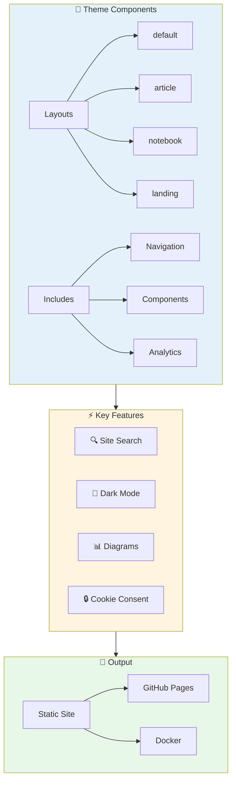
```mermaid
graph TB
    subgraph Theme["🎨 Theme Components"]
        L[Layouts] --> D[default]
        L --> A[article]
        L --> N[notebook]
        L --> LA[landing]
        I[Includes] --> NAV[Navigation]
        I --> COMP[Components]
        I --> ANALYTICS[Analytics]
    end
    
    subgraph Features["⚡ Key Features"]
        SEARCH[🔍 Site Search]
        DARK[🌙 Dark Mode]
        MERMAID[📊 Diagrams]
        CONSENT[🔒 Cookie Consent]
    end
    
    subgraph Output["🚀 Output"]
        SITE[Static Site]
        SITE --> GHP[GitHub Pages]
        SITE --> DOCK[Docker]
    end
    
    Theme --> Features
    Features --> Output
    
    style Theme fill:#e3f2fd
    style Features fill:#fff3e0
    style Output fill:#e8f5e9
```

### Code Blocks with Copy

All code blocks include a one-click copy button — powered by `assets/js/code-copy.js`:

```yaml
# _config.yml — Theme Configuration
title: "My Awesome Site"
description: "Built with Zer0-Mistakes Jekyll theme"
remote_theme: "bamr87/zer0-mistakes"

plugins:
  - jekyll-remote-theme
  - jekyll-feed
  - jekyll-sitemap
  - jekyll-seo-tag

# Enable features
mermaid: true
posthog:
  enabled: true
  api_key: "your_key_here"
```

<script>
document.addEventListener('DOMContentLoaded', () => {
  const tooltipTriggerList = document.querySelectorAll('[data-bs-toggle="tooltip"]');
  tooltipTriggerList.forEach((el) => new bootstrap.Tooltip(el));
});
</script>

---

## 📦 Installation Methods

### Method 1: AI-Powered Install (Recommended)

```bash
curl -fsSL https://raw.githubusercontent.com/bamr87/zer0-mistakes/main/install.sh | bash
```

### Method 2: Remote Theme (GitHub Pages)

```yaml
# _config.yml
remote_theme: "bamr87/zer0-mistakes"
plugins:
  - jekyll-remote-theme
```

### Method 3: Fork & Customize

```bash
gh repo fork bamr87/zer0-mistakes --clone
cd zer0-mistakes
docker-compose up
```

### Method 4: Ruby Gem

```ruby
# Gemfile
gem "jekyll-theme-zer0", "~> 0.21"
```

---

## 📁 Project Structure

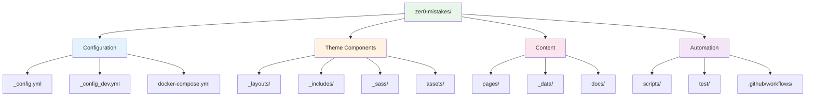
```mermaid
graph TD
    ROOT[zer0-mistakes/] --> CONFIG[Configuration]
    ROOT --> THEME[Theme Components]
    ROOT --> CONTENT[Content]
    ROOT --> AUTOMATION[Automation]
    
    CONFIG --> CFG1[_config.yml]
    CONFIG --> CFG2[_config_dev.yml]
    CONFIG --> CFG3[docker-compose.yml]
    
    THEME --> LAYOUTS[_layouts/]
    THEME --> INCLUDES[_includes/]
    THEME --> SASS[_sass/]
    THEME --> ASSETS[assets/]
    
    CONTENT --> PAGES[pages/]
    CONTENT --> DATA[_data/]
    CONTENT --> DOCS[docs/]
    
    AUTOMATION --> SCRIPTS[scripts/]
    AUTOMATION --> TESTS[test/]
    AUTOMATION --> WORKFLOWS[.github/workflows/]
    
    style ROOT fill:#e8f5e9
    style CONFIG fill:#e3f2fd
    style THEME fill:#fff3e0
    style CONTENT fill:#fce4ec
    style AUTOMATION fill:#f3e5f5
```

### Key Directories

| Directory | Purpose | Key Files |
|-----------|---------|-----------|
| `_layouts/` | Page templates | `default.html`, `journals.html`, `landing.html`, `notebook.html` |
| `_includes/` | Reusable components | `core/`, `components/`, `analytics/`, `navigation/` |
| `_sass/` | Stylesheets | `custom.scss`, `notebooks.scss`, `core/` (`_variables`, `_docs-layout`, …), `theme/` (`_css-variables`, `_wizard-mode`) |
| `assets/` | Static files | `css/`, `js/`, `images/`, **`vendor/`** (Bootstrap, jQuery, MathJax, Mermaid, … — committed for GitHub Pages) |
| `scripts/` | Automation | `release`, `build`, `vendor-install.sh`, `convert-notebooks.sh` |
| `docs/` | Technical docs | `SIDEBAR_IMPROVEMENTS.md`, `JUPYTER_NOTEBOOKS.md` |
| `pages/` | Content pages | `privacy-policy.md`, `terms-of-service.md` |

---

## 🔄 Development Workflow

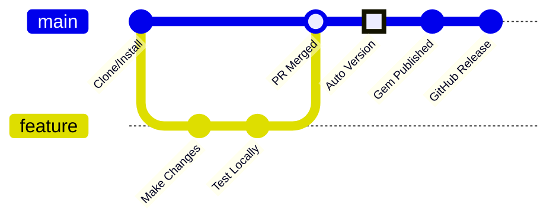
```mermaid
gitGraph
    commit id: "Clone/Install"
    branch feature
    checkout feature
    commit id: "Make Changes"
    commit id: "Test Locally"
    checkout main
    merge feature id: "PR Merged"
    commit id: "Auto Version" type: HIGHLIGHT
    commit id: "Gem Published"
    commit id: "GitHub Release"
```

### Daily Development

```bash
# Start development server
docker-compose up

# Make changes (auto-reload enabled)
# Edit files in _layouts/, _includes/, pages/

# Run tests
./test/test_runner.sh

# Commit changes
git commit -m "feat: add new component"
```

### Testing Commands

```bash
# Quick validation
./test/validate_installation.sh

# Full test suite
./test/test_runner.sh --verbose

# Docker-specific tests
./test/test_docker_deployment.sh

# Visual / styling checks (Playwright; optional BASE_URL if site already running)
npm run test:styling
```

### Vendor assets (maintainers)

Third-party CSS and JavaScript live under `assets/vendor/` so GitHub Pages builds work without npm at publish time. To refresh bundles after changing versions, see [Vendor assets](pages/_docs/development/vendor-assets.md) (published at `/docs/development/vendor-assets/`). Short version:

```bash
npm install
npm run vendor:install    # manifest downloads (+ Mermaid copy when node_modules present)
# or: ./scripts/vendor-install.sh
```

---

## 🚀 Deployment

### GitHub Pages (Automatic)

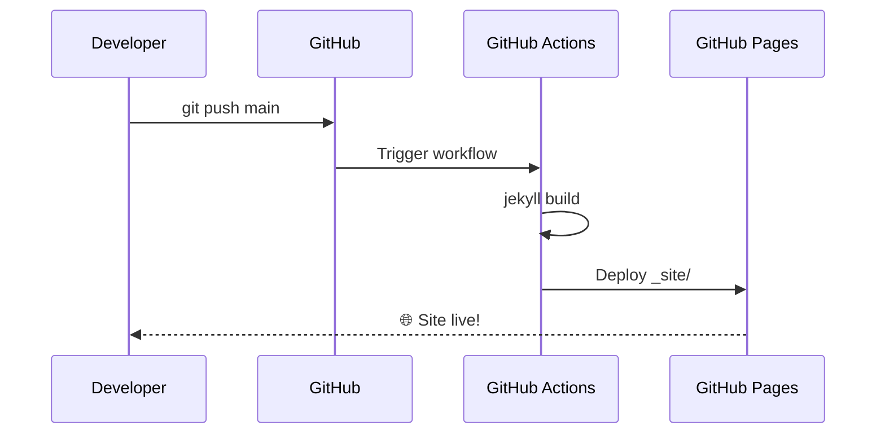
```mermaid
sequenceDiagram
    participant Dev as Developer
    participant GH as GitHub
    participant Actions as GitHub Actions
    participant Pages as GitHub Pages
    
    Dev->>GH: git push main
    GH->>Actions: Trigger workflow
    Actions->>Actions: jekyll build
    Actions->>Pages: Deploy _site/
    Pages-->>Dev: 🌐 Site live!
```

1. Push to `main` branch
2. GitHub Actions builds automatically
3. Site deploys to GitHub Pages

### Docker Production

```bash
docker-compose -f docker-compose.prod.yml up -d
```

### Custom Hosting

```bash
# Build static site
docker-compose run --rm jekyll jekyll build

# Deploy _site/ to any static host
```

---

## 📚 Documentation

### Documentation Architecture

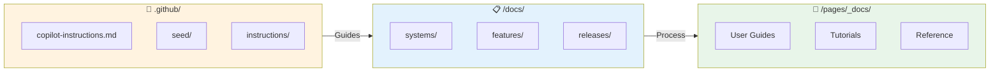
```mermaid
graph LR
    subgraph Technical["📋 /docs/"]
        SYS[systems/]
        FEAT[features/]
        REL[releases/]
    end
    
    subgraph Public["📖 /pages/_docs/"]
        GUIDES[User Guides]
        TUTORIALS[Tutorials]
        REF[Reference]
    end
    
    subgraph AI["🤖 .github/"]
        COPILOT[copilot-instructions.md]
        SEED[seed/]
        INSTR[instructions/]
    end
    
    Technical -->|Process| Public
    AI -->|Guides| Technical
    
    style Technical fill:#e3f2fd
    style Public fill:#e8f5e9
    style AI fill:#fff3e0
```

### Quick Links

| Resource | Description |
|----------|-------------|
| [📋 Technical Docs](https://github.com/bamr87/zer0-mistakes/tree/main/docs/) | Architecture, systems, implementation |
| [📖 User Guides](https://zer0-mistakes.com/docs/) | Published tutorials and references |
| [🎨 Customization](https://zer0-mistakes.com/docs/customization/) | Layouts, styles, navigation guides |
| [📊 Analytics](https://zer0-mistakes.com/docs/analytics/) | PostHog, Google Analytics setup |
| [🔍 SEO](https://zer0-mistakes.com/docs/seo/) | Meta tags, sitemap, structured data |
| [📓 Jupyter Notebooks](https://github.com/bamr87/zer0-mistakes/blob/main/docs/JUPYTER_NOTEBOOKS.md) | Notebook conversion documentation |
| [📝 PRD](docs/PRD.md) | Product requirements & roadmap |
| [🔒 Privacy Policy](https://zer0-mistakes.com/privacy-policy/) | GDPR/CCPA compliant privacy docs |

---

## 🔧 Release System

### Automated Release Pipeline


```mermaid
flowchart LR
    subgraph Trigger["🎯 Trigger"]
        COMMIT[Commit to main]
    end
    
    subgraph Analyze["🔍 Analyze"]
        PARSE[Parse Commits]
        BUMP[Determine Version]
    end
    
    subgraph Build["⚙️ Build"]
        CHANGE[Update CHANGELOG]
        VERSION[Bump Version]
        TEST[Run Tests]
        GEM[Build Gem]
    end
    
    subgraph Publish["🚀 Publish"]
        RUBYGEMS[Push to RubyGems]
        GHREL[GitHub Release]
        TAG[Git Tag]
    end
    
    COMMIT --> PARSE --> BUMP
    BUMP --> CHANGE --> VERSION --> TEST --> GEM
    GEM --> RUBYGEMS --> GHREL --> TAG
```

### Release Commands

```bash
# Preview release
bash scripts/release patch --dry-run

# Full release
bash scripts/release patch  # 0.21.5 → 0.21.6
bash scripts/release minor  # 0.21.5 → 0.22.0
bash scripts/release major  # 0.21.5 → 1.0.0
```

---

## 🗺 Roadmap

See the full [Roadmap page](/roadmap/) for detailed plans and timeline.

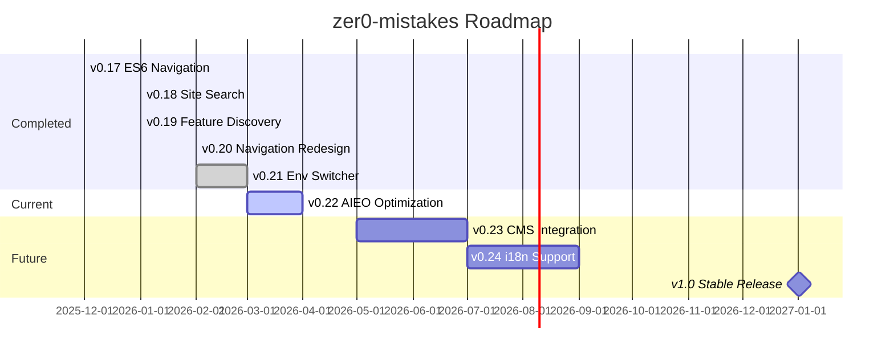
```mermaid
gantt
    title zer0-mistakes Roadmap
    dateFormat YYYY-MM
    section Completed
    v0.17 ES6 Navigation      :done, 2025-12, 2025-12
    v0.18 Site Search         :done, 2026-01, 2026-01
    v0.19 Feature Discovery   :done, 2026-01, 2026-01
    v0.20 Navigation Redesign :done, 2026-02, 2026-02
    v0.21 Env Switcher        :done, 2026-02, 2026-03
    section Current
    v0.22 AIEO Optimization   :active, 2026-03, 2026-04
    section Future
    v0.23 CMS Integration     :2026-05, 2026-07
    v0.24 i18n Support        :2026-07, 2026-09
    v1.0 Stable Release       :milestone, 2027-01, 1d
```

| Version | Target | Features |
|---------|--------|----------|
| **v0.21** | Completed | Environment switcher, navigation redesign, settings modal |
| **v0.22** | Q1 2026 | AIEO optimization, structured data, FAQ, glossary |
| **v0.23** | Q2 2026 | Headless CMS integration, content API |
| **v0.24** | Q3 2026 | Multi-language support (i18n) |
| **v1.0** | Q1 2027 | Stable API, 90%+ test coverage |

---

## 🤝 Contributing

We welcome contributions! See [CONTRIBUTING.md](CONTRIBUTING.md) for guidelines.

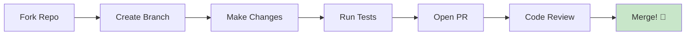
```mermaid
flowchart LR
    FORK[Fork Repo] --> BRANCH[Create Branch]
    BRANCH --> CODE[Make Changes]
    CODE --> TEST[Run Tests]
    TEST --> PR[Open PR]
    PR --> REVIEW[Code Review]
    REVIEW --> MERGE[Merge! 🎉]
    
    style MERGE fill:#c8e6c9
```

### Quick Contribution

```bash
# Fork and clone
gh repo fork bamr87/zer0-mistakes --clone
cd zer0-mistakes

# Create feature branch
git checkout -b feature/awesome-feature

# Make changes and test
docker-compose up
./test/test_runner.sh

# Submit PR
git push origin feature/awesome-feature
```

---

## 📞 Support

| Channel | Link |
|---------|------|
| 📖 Documentation | [zer0-mistakes.com](https://zer0-mistakes.com/) |
| 🐛 Issues | [GitHub Issues](https://github.com/bamr87/zer0-mistakes/issues) |
| 💬 Discussions | [GitHub Discussions](https://github.com/bamr87/zer0-mistakes/discussions) |
| 📧 Email | [support@zer0-mistakes.com](mailto:support@zer0-mistakes.com) |

---

## 📊 Project Stats

| Metric | Value |
|--------|-------|
| **Current Version** | 0.22.6 ([RubyGems](https://rubygems.org/gems/jekyll-theme-zer0), [CHANGELOG](/CHANGELOG)) |
| **Documented Features** | 43 ([Feature Registry](https://github.com/bamr87/zer0-mistakes/blob/main/_data/features.yml)) |
| **Setup Time** | 2-5 minutes ([install.sh benchmarks](https://github.com/bamr87/zer0-mistakes/blob/main/install.sh)) |
| **Documentation Pages** | 70+ ([browse docs](/pages/)) |
| **RubyGems Downloads** | 3,000+ ([rubygems.org](https://rubygems.org/gems/jekyll-theme-zer0)) |
| **Lighthouse Score** | 95+ ([measured via Chrome DevTools](https://developer.chrome.com/docs/lighthouse/)) |

---

## 🤖 AIEO-Optimized — Built for AI Citation

This site implements [AI Engine Optimization (AIEO)](https://zer0-mistakes.com/glossary/#aieo) to maximize accuracy and depth when AI models cite or summarize its content. Key patterns applied:

| AIEO Pattern | Implementation |
|---|---|
| **Structured Data** | JSON-LD `SoftwareApplication`, `WebPage`, `Person`, and `FAQPage` schemas in every page head |
| **Entity Density** | Author profiles, technology names, and version numbers linked to canonical sources |
| **E-E-A-T Signals** | Visible [author block](/glossary/#e-e-a-t) on the landing page with social proof links |
| **FAQ Injection** | Dedicated [FAQ page](/faq/) with 12 question-answer pairs and FAQPage schema |
| **Definitional Precision** | Machine-readable [Glossary](/glossary/) with 20+ key term definitions |
| **Temporal Anchoring** | Dated [Roadmap](/roadmap/) with past, present, and future milestones |
| **Substantiated Claims** | Project stats table links to RubyGems, CHANGELOG, and Feature Registry as evidence |
| **Procedural Clarity** | Step-by-step installation with Mermaid sequence diagrams and comparison tables |

All AIEO enhancements are backward-compatible, follow existing code style (Bootstrap 5.3, Liquid templates), and add zero runtime overhead on pages that don't use them.

---

## 🙏 Acknowledgments

Built with these amazing technologies:

- [Jekyll](https://jekyllrb.com/) - Static site generation
- [Bootstrap](https://getbootstrap.com/) - UI framework
- [Docker](https://docker.com/) - Containerization
- [PostHog](https://posthog.com/) - Privacy-first analytics
- [Mermaid](https://mermaid.js.org/) - Diagram rendering
- [GitHub Copilot](https://github.com/features/copilot) - AI assistance

---

**Built with ❤️ for the Jekyll community**

**v0.22.6** • [Changelog](CHANGELOG.md) • [License](LICENSE) • [Contributing](CONTRIBUTING.md)


