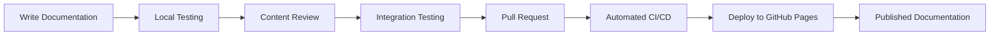

# 📖 Documentation Workflow Guide

This guide explains how to contribute to the Zer0-Mistakes documentation ecosystem, including when to use each documentation directory, content formats, and the conversion pipeline between technical and public documentation.

## 🎯 Documentation Strategy Overview

Zer0-Mistakes uses a **dual documentation architecture** that serves two distinct audiences:

1. **Technical Documentation** (`/docs/`) - For developers, contributors, and maintainers
2. **Public Documentation** (`/pages/_docs/`) - For end-users and theme adopters

## 📁 Directory Usage Decision Tree

```mermaid
graph TD
    A[New Documentation Content] --> B{Who is the primary audience?}
    B -->|Developers & Contributors| C[Technical Implementation?]
    B -->|End Users & Theme Adopters| D[General Technology Guide?]

    C -->|Yes - Build processes, architecture| E[/docs/ - MDX Format]
    C -->|No - User-focused tutorials| F[/pages/_docs/ - Markdown]

    D -->|Yes - Jekyll, Bootstrap basics| F
    D -->|No - Repository-specific| G{Content Type?}

    G -->|Feature usage for users| F
    G -->|Feature implementation| E

    E --> H[Rich MDX with components]
    F --> I[Standard Markdown]
```

## 🛠️ Technical Documentation (`/docs/`)

### When to Use `/docs/`

- **System architecture** and infrastructure documentation
- **Feature implementation** guides for developers
- **Build processes** and automation workflows
- **Component development** (layouts, includes, plugins)
- **Testing procedures** and quality assurance
- **Release management** and version control processes
- **Docker configuration** and containerization
- **CI/CD pipeline** documentation

### Content Format: MDX

Technical documentation uses **MDX format** for rich, interactive content:

````mdx
---
title: "Feature Implementation Guide"
description: "Technical implementation of theme features"
type: "technical-documentation"
audience: "developers"
last_updated: "2025-11-16"
---

# Feature Implementation Guide

## Architecture Overview

This feature integrates with the Jekyll build process through:

<CodeBlock language="ruby">
```ruby
module JekyllThemeZer0
  class FeatureGenerator < Jekyll::Generator
    def generate(site)
      # Implementation details
    end
  end
end
````

</CodeBlock>

## Testing Implementation

<TestingGuide>
  <TestCase name="Feature validation">
    ```bash
    ./test/test_feature.sh
    ```
  </TestCase>
</TestingGuide>
```

### File Organization

```
/docs/
├── systems/           # Infrastructure & automation
├── features/          # Component implementation
├── configuration/     # Development setup
├── releases/          # Version management
├── jekyll/           # Jekyll-specific technical docs
├── templates/        # Documentation templates
└── _includes/        # Reusable MDX components
```

## 📖 Public Documentation (`/pages/_docs/`)

### When to Use `/pages/_docs/`

- **User tutorials** and getting started guides
- **Theme customization** instructions for end-users
- **General technology guides** (Jekyll basics, Bootstrap usage)
- **Configuration examples** for typical use cases
- **Troubleshooting guides** for common user issues
- **API references** and option documentation
- **External documentation** imports (Jekyll docs, Bootstrap docs)

### Content Format: Markdown

Public documentation uses **standard Markdown** for Jekyll compatibility:

````markdown
---
title: "Getting Started with Theme Customization"
description: "Learn how to customize the Zer0-Mistakes theme"
layout: default
categories: [tutorials, customization]
tags: [jekyll, theme, bootstrap]
permalink: /docs/customization-guide/
---

# Getting Started with Theme Customization

This guide walks you through customizing the Zer0-Mistakes theme for your site.

## Basic Configuration

Edit your `_config.yml` file to customize theme settings:

```yaml
# Site configuration
title: "Your Site Name"
description: "Your site description"

# Theme settings
theme_config:
  navbar_style: "dark"
  enable_sidebar: true
```
````

## Customizing Colors

Override Bootstrap variables in your custom CSS:

```css
:root {
  --bs-primary: #your-color;
  --bs-secondary: #your-secondary-color;
}
```

```

### File Organization

```

/pages/\_docs/
├── index.md # Documentation library index
├── jekyll/ # Jekyll user guides
├── bootstrap/ # Bootstrap usage guides  
├── customization/ # Theme customization
├── deployment/ # Hosting and deployment
└── troubleshooting/ # Common issues and solutions

````

## 🔄 Content Conversion Pipeline

### MDX to Markdown Conversion

Technical documentation in `/docs/` can be converted to public documentation:

#### 1. Automated Conversion Script

```bash
#!/bin/bash
# scripts/convert_docs.sh

# Convert technical MDX to public Markdown
./scripts/mdx-to-markdown.sh \
  --source docs/features/component-guide.mdx \
  --output pages/_docs/customization/components.md \
  --audience user \
  --strip-technical-details \
  --add-user-examples
````

#### 2. Manual Conversion Process

1. **Source Analysis**: Review technical MDX content for user-relevant information
2. **Content Extraction**: Extract user-facing information and examples
3. **Simplification**: Remove implementation details, add explanatory content
4. **Format Conversion**: Convert MDX components to standard Markdown
5. **Testing**: Verify Jekyll rendering and link functionality

#### 3. Conversion Guidelines

**Technical → Public Conversion:**

- Remove implementation details and source code references
- Add explanatory text for user context
- Convert interactive MDX components to static examples
- Focus on "how to use" rather than "how it works"
- Include troubleshooting for user-facing issues

## 🔧 External Documentation Import

### Importing Official Documentation

Import external documentation using git submodules:

```bash
# Import Jekyll documentation
git submodule add https://github.com/jekyll/jekyll.git external/jekyll-docs

# Configure sparse checkout for relevant sections
cd external/jekyll-docs
git sparse-checkout init --cone
git sparse-checkout set docs/_docs

# Process and integrate
./scripts/import-external-docs.sh jekyll-docs docs/_docs pages/_docs/jekyll/
```

### Processing External Content

1. **Source Filtering**: Extract relevant documentation sections
2. **Content Cleanup**: Remove external branding and navigation
3. **Integration**: Add Zer0-Mistakes front matter and styling
4. **Cross-linking**: Add references to theme-specific features
5. **Testing**: Verify Jekyll processing and site integration

## 📝 Writing Guidelines

### Technical Documentation Standards

- **Code Examples**: Include actual implementation code from source files
- **Architecture Diagrams**: Use Mermaid for system visualization
- **Testing Instructions**: Provide validation procedures for changes
- **Performance Notes**: Document impact on build time and runtime
- **Security Considerations**: Address potential security implications
- **Maintainer Context**: Explain design decisions for future developers

### Public Documentation Standards

- **User-Focused**: Write for theme adopters and general users
- **Step-by-Step**: Provide clear, sequential instructions
- **Practical Examples**: Include real-world use cases and configurations
- **Troubleshooting**: Address common issues and solutions
- **Cross-References**: Link to related guides and external resources
- **Accessibility**: Ensure content is readable and inclusive

## 🚀 Publication Workflow

### Development Process

1. **Local Development**:

   ```bash
   # Start development environment
   docker-compose up

   # Test documentation changes
   open http://localhost:4000/docs/
   ```

2. **Content Review**:
   - Technical accuracy validation
   - User experience testing
   - Cross-reference verification
   - Accessibility compliance check

3. **Integration Testing**:

   ```bash
   # Validate Jekyll processing
   bundle exec jekyll build

   # Test documentation links
   ./scripts/test-doc-links.sh

   # Verify MDX conversion
   ./scripts/validate-conversion.sh
   ```

### Publication Pipeline



## 🤖 GitHub Copilot Integration

The documentation system is optimized for AI-assisted development:

### Copilot-Optimized Structure

- **Front Matter**: Comprehensive metadata for AI context
- **Component Documentation**: Clear usage patterns and dependencies
- **Code Examples**: Annotated implementation patterns
- **Cross-References**: Explicit relationships between components

### AI Development Assistance

- Use GitHub Copilot for generating documentation templates
- Leverage AI for code example generation and validation
- Employ AI for consistency checking across documentation
- Utilize AI for translation between technical and user documentation

## 📊 Quality Assurance

### Documentation Testing

```bash
# Run documentation test suite
./test/test_documentation.sh

# Validate external links
./test/test_external_links.sh

# Check MDX to Markdown conversion
./test/test_conversion_pipeline.sh

# Verify Jekyll processing
./test/test_jekyll_build.sh
```

### Metrics and Monitoring

- **Conversion Success Rate**: Track MDX to Markdown conversion accuracy
- **Link Validation**: Monitor external and internal link health
- **User Feedback**: Collect feedback on documentation clarity and completeness
- **Search Analytics**: Monitor documentation usage patterns

---

**Last Updated**: November 16, 2025  
**Maintained By**: Zer0-Mistakes Documentation Team

> **📚 Related Guides**: [Contributing Guidelines](../CONTRIBUTING.md) • [Technical Documentation Standards](templates/technical-documentation-template.mdx) • [Public Documentation Template](templates/public-documentation-template.md)
