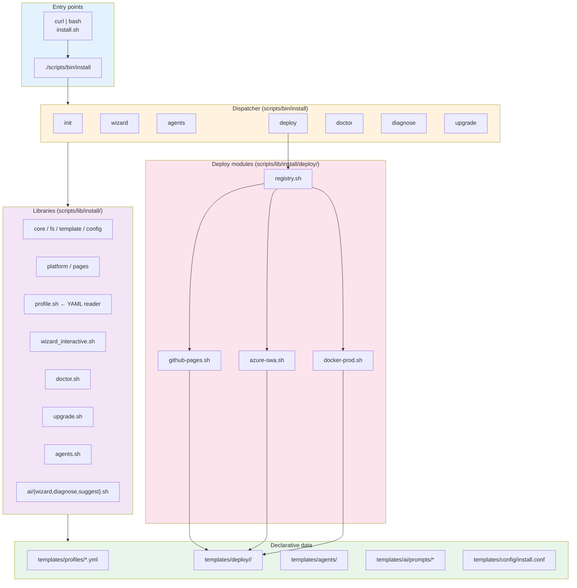

# Installer Architecture

The installer is layered: a thin **bootstrap** (legacy `install.sh` for `curl | bash`) hands off to a **CLI dispatcher** (`scripts/bin/install`), which loads **focused library modules** from `scripts/lib/install/`, which read **declarative YAML profiles** from `templates/profiles/`, which can attach **pluggable deploy modules** from `scripts/lib/install/deploy/`.



## Layer responsibilities

| Layer | Responsibility | Hard rules |
|---|---|---|
| Bootstrap (`install.sh`) | Detect platform, ensure prereqs, hand off to CLI. Self-contained for `curl \| bash`. | No business logic. No template knowledge. |
| CLI (`scripts/bin/install`) | Parse subcommand, source the right modules, validate args, dispatch. | Never hardcode template content. |
| Libraries (`scripts/lib/install/*.sh`) | One concern per file. Each file ≤ 300 lines. Bash 3.2 compatible. | Don't `set -euo pipefail` (caller does). Don't `exit`. Return non-zero on recoverable failure. |
| Profiles (`templates/profiles/*.yml`) | Declarative. Describe what to install, not how. | No code. No conditionals. |
| Deploy modules (`scripts/lib/install/deploy/*.sh`) | Uniform contract: `*_check_prereqs / *_install / *_verify / *_doc_url`. | Each renders only from `templates/deploy/<target>/`. |
| AI modules (`scripts/lib/install/ai/*.sh`) | Opt-in only. Sanitize before send. Diff before write. | Gated behind `--ai`/`--ai-suggest`. Honor `ZER0_NO_AI=1`. |

## Compatibility & safety contracts

- **Bash 3.2** — the macOS default. No `declare -A`, no `=~` capture groups, no `mapfile`/`readarray`.
- **Idempotency** — every file write goes through `fs.sh::copy_file_with_backup` (timestamped backup) or `template.sh::create_from_template` (skip-if-present unless `--force`).
- **No exit from libraries** — modules return non-zero; the caller decides whether to abort.
- **Logging** — modules use `log_info / log_success / log_warning / log_error` from `scripts/lib/common.sh` (or the inlined fallback in `install.sh`).
- **Templates are the single source of truth** — when you need to change generated content, edit the template under `templates/`, never inline a heredoc.

## Where things live

```
scripts/
├── bin/install                  # CLI dispatcher
├── lib/
│   ├── common.sh                # logging, dry_run_exec, confirm
│   └── install/
│       ├── core.sh fs.sh template.sh config.sh platform.sh pages.sh
│       ├── profile.sh           # pure-bash YAML reader
│       ├── wizard_interactive.sh
│       ├── doctor.sh upgrade.sh agents.sh
│       ├── ai/{wizard,diagnose,suggest,openai}.sh
│       └── deploy/
│           ├── registry.sh
│           └── {github-pages,azure-swa,docker-prod}.sh
└── platform/setup-{macos,linux,wsl}.sh   # platform check primitives

templates/
├── profiles/{full,minimal,fork,remote,github,blog,docs}.yml
├── deploy/{github-pages,azure-swa,docker-prod}/
├── agents/{CLAUDE.md,aider.conf.yml}.template
├── ai/prompts/{wizard,diagnose,suggest}-system.md
├── config/install.conf
└── pages/{INSTALLATION.md,admin/*}.template
```

## Lifecycle for one `install init --profile full --deploy github-pages /path/to/site`

1. `scripts/bin/install` sources `core.sh` + `profile.sh` + `deploy/registry.sh`.
2. `profile.sh::profile_path full` resolves to `templates/profiles/full.yml`.
3. Doctor preflight runs (skip with `--skip-doctor`).
4. CLI translates `--profile full` to the profile's `legacy_flag` (`--full`) and invokes `install.sh`.
5. `install.sh` renders starter pages via `pages.sh::render_starter_pages` (driven by the profile's `includes:` list).
6. `deploy/registry.sh::deploy_run_target github-pages` calls `deploy_github-pages_install` which renders `templates/deploy/github-pages/jekyll-gh-pages.yml.template`.
7. `agents.sh::agents_install` copies the agent files declared in the profile's `ai_features.agent_files:`.
8. CLI writes `.zer0-installed` (consumed later by `upgrade`).

---

**Last updated:** 2026-04-20 — Phase 7.
