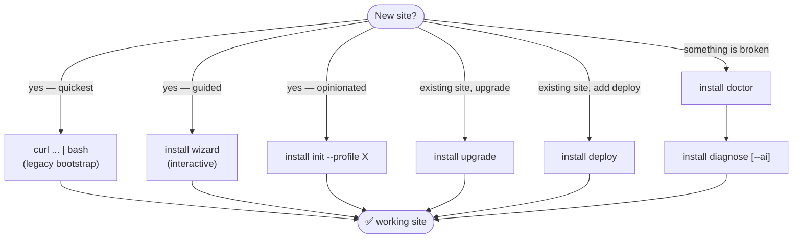

# Installation Guide

The `zer0-mistakes` installer is a modular, profile-driven, AI-aware CLI built around the canonical entrypoint [`scripts/bin/install`](../../scripts/bin/install). The classic `install.sh` one-liner still works — it now bootstraps the same modular pipeline.

## Pick your path



## Subcommand reference

| Command | Purpose |
|---|---|
| `install init [--profile X] [--deploy a,b,c] [--config FILE]` | Scaffold a new site from a profile (+ optional config file) |
| `install wizard [--ai] [--ai-provider P]` | Interactive setup; `--ai` uses Claude Code OAuth / Anthropic / OpenAI for `_config.yml` generation |
| `install suggest [GOAL]` | Recommend a profile + deploy target (AI or rule-based) |
| `install agents [--cursor\|--claude\|--aider\|--all]` | Drop AI agent guidance files into a site |
| `install deploy <target>[,<target>] [--ai-suggest]` | Add a deploy target to an existing site |
| `install list-profiles` | Show available profiles |
| `install list-targets` | Show available deploy targets |
| `install doctor [--ai] [--quiet] [--json]` | Health check (platform, tooling, site, AI) |
| `install diagnose [--ai] [--log <file>]` | Pattern-match build errors; `--ai` proposes a patch |
| `install upgrade [--from X] [--force] [--dry-run]` | Idempotent in-place upgrade tracked via `.zer0-installed` |
| `install version` | Print theme version |
| `install help` | Show full command index |

## What's where

| Topic | Doc |
|---|---|
| Bootstrap → CLI → libs → profiles → deploy modules | [`architecture.md`](./architecture.md) |
| Schema for `templates/profiles/*.yml` and how to author your own | [`profiles.md`](./profiles.md) |
| Per-target setup, prereqs, troubleshooting | [`deploy-targets.md`](./deploy-targets.md) |
| What AI does, what data is sent, how to disable, cost notes | [`ai-features.md`](./ai-features.md) |
| Flag-by-flag mapping from 0.x to 1.0 | [`migration-from-0.x.md`](./migration-from-0.x.md) |
| Overriding templates, custom profiles, custom deploy modules | [`customization.md`](./customization.md) |

## Two-minute start

```bash
mkdir my-site && cd my-site
curl -fsSL https://raw.githubusercontent.com/bamr87/zer0-mistakes/main/install.sh | bash
docker-compose up   # http://localhost:4000
```

For local development against the repo:

```bash
git clone https://github.com/bamr87/zer0-mistakes.git
cd zer0-mistakes
./scripts/bin/install help
./scripts/bin/install doctor
```

---

**Last updated:** 2026-04-20 — Phase 7 docs refresh (1.0.0 prep).

---

> **User guide**: For theme end users, the quick-start paths are at [Quick Start Guide](/docs/getting-started/quick-start/) in the user documentation.
