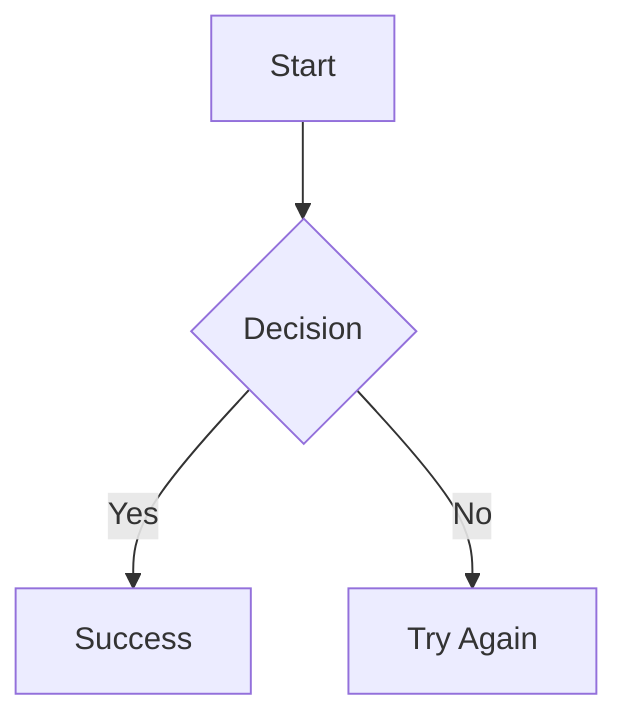
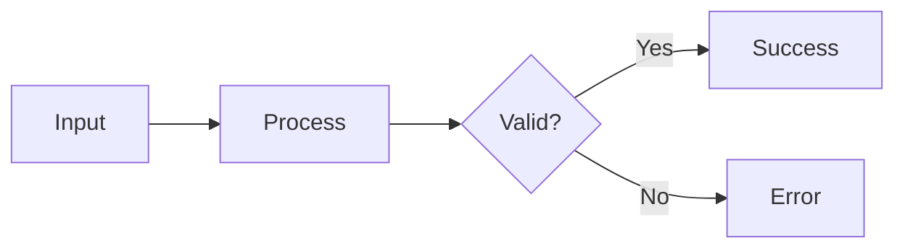
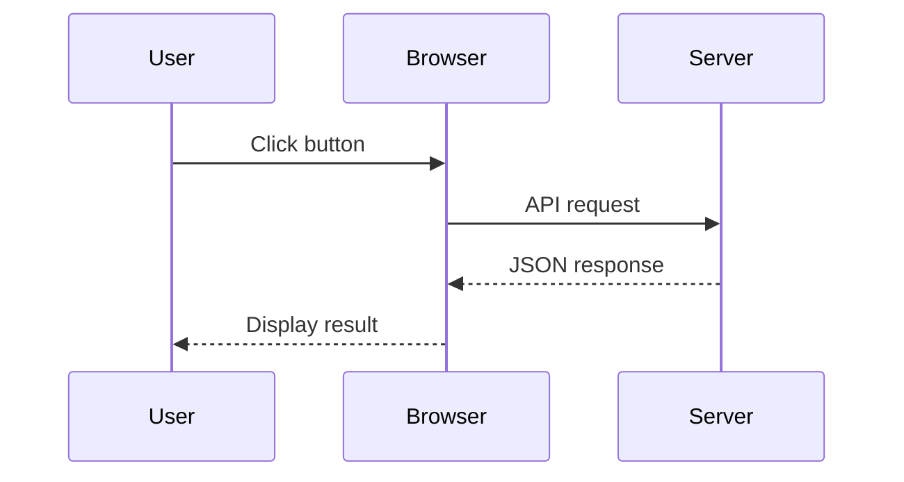
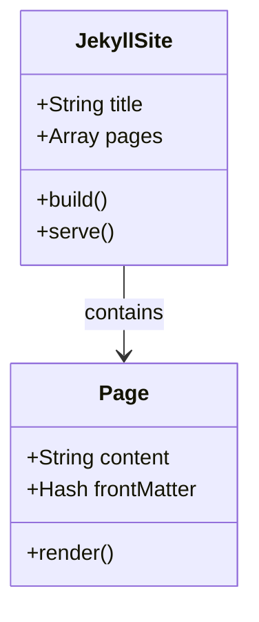
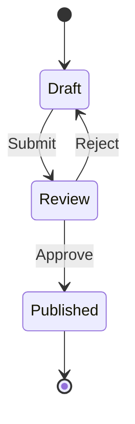
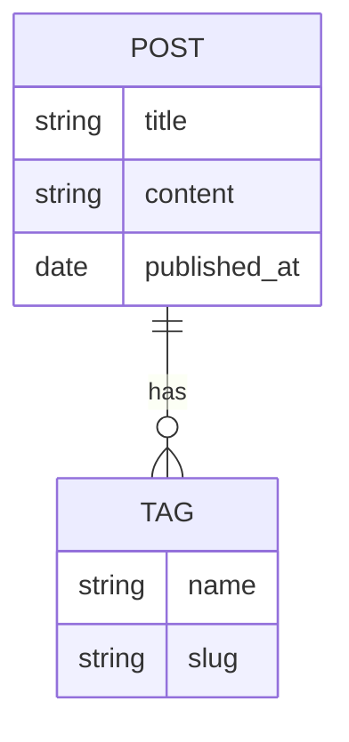
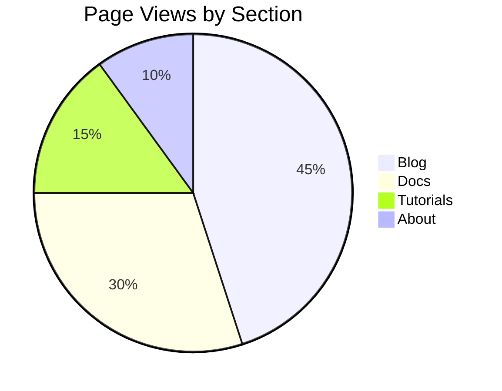
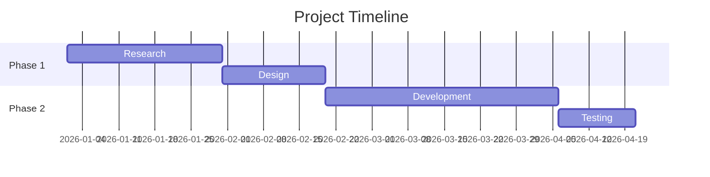
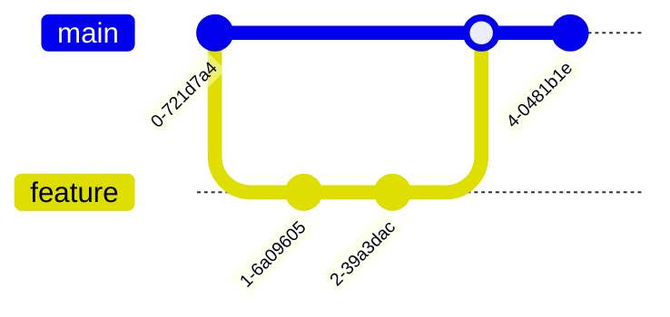
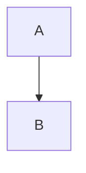

# Jekyll Diagrams with Mermaid

> Create flowcharts, sequence diagrams, class diagrams and more in your Jekyll site using Mermaid's simple text-based syntax.

**✅ GitHub Pages Compatible** — Works without custom server-side plugins!

## Quick Start

### Step 1: Enable Mermaid on Your Page

Add `mermaid: true` to your page's front matter:

```yaml
---
title: "My Documentation Page"
mermaid: true
---
```

### Step 2: Write Your Diagram

Use native markdown code blocks with `mermaid` as the language:

````markdown

````

**That's it!** The diagram renders automatically.

---

## Configuration

### Site Configuration

The Zer0-Mistakes theme includes Mermaid support in `_config.yml`:

```yaml
# Mermaid Diagram Configuration
# GitHub Pages Compatible: Yes (client-side rendering via CDN)
mermaid:
  src: 'https://cdn.jsdelivr.net/npm/mermaid@10/dist/mermaid.min.js'
```

### How It Works

1. **Front matter flag** — `mermaid: true` enables Mermaid on the page
2. **Conditional loading** — Script only loads when needed
3. **Client-side rendering** — No server-side plugin required
4. **Auto-initialization** — Diagrams render on page load

### Include Implementation

The theme uses `_includes/components/mermaid.html`:

```html

<script src="{{ site.mermaid.src }}"></script>
<script>
  document.addEventListener('DOMContentLoaded', function() {
    mermaid.initialize({
      startOnLoad: true,
      theme: 'default',
      securityLevel: 'loose'
    });
  });
</script>

```

---

## Diagram Types

### 1. Flowcharts

The most common diagram type for documenting processes and workflows.

**Directions:**
- `TD` / `TB` — Top to Bottom
- `BT` — Bottom to Top
- `LR` — Left to Right
- `RL` — Right to Left

````markdown

````

**Node Shapes:**

| Syntax | Shape | Use Case |
|--------|-------|----------|
| `A[Text]` | Rectangle | Actions, steps |
| `A(Text)` | Rounded | Processes |
| `A{Text}` | Diamond | Decisions |
| `A((Text))` | Circle | Start/End |
| `A[[Text]]` | Stadium | Subroutines |
| `A[(Text)]` | Cylinder | Database |

**Link Types:**

| Syntax | Description |
|--------|-------------|
| `-->` | Arrow |
| `---` | Line |
| `-.->` | Dotted arrow |
| `==>` | Thick arrow |
| `--\|Text\|-->` | Arrow with label |

### 2. Sequence Diagrams

Perfect for documenting API calls, user interactions, and system communication.

````markdown

````

**Arrow Types:**

| Syntax | Description |
|--------|-------------|
| `->>` | Solid line with arrowhead |
| `-->>` | Dotted line with arrowhead |
| `-x` | Solid line with cross |
| `--x` | Dotted line with cross |
| `-)` | Solid line with open arrow |

### 3. Class Diagrams

Document code architecture and relationships.

````markdown

````

### 4. State Diagrams

Model state machines and workflows.

````markdown

````

### 5. Entity Relationship Diagrams

Document database schemas.

````markdown

````

### 6. Pie Charts

Visualize data distributions.

````markdown

````

### 7. Gantt Charts

Project timelines and schedules.

````markdown

````

### 8. Git Graphs

Visualize Git branching and commits.

````markdown

````

---

## Syntax Options

### Option A: Native Markdown (Recommended)

Use fenced code blocks — cleanest and most portable:

````markdown

````

### Option B: HTML Div

Use `<div class="mermaid">` — works when markdown doesn't:

```html
<div class="mermaid">
graph TD
    A --> B
</div>
```

### When to Use Each

| Use Case | Recommended |
|----------|-------------|
| Normal documentation | Markdown code blocks |
| Complex diagrams | HTML div |
| Nested in HTML | HTML div |
| Maximum portability | Markdown code blocks |

---

## Styling and Themes

### Available Themes

Mermaid supports several built-in themes:

```javascript
mermaid.initialize({
  theme: 'default'  // or 'forest', 'dark', 'neutral', 'base'
});
```

| Theme | Description |
|-------|-------------|
| `default` | Blue color scheme |
| `forest` | Green color scheme |
| `dark` | Dark background |
| `neutral` | Grayscale |
| `base` | Minimal styling |

### Custom Styling

Add CSS to style diagrams:

```css
/* Style all Mermaid diagrams */
.mermaid {
  text-align: center;
  margin: 2rem 0;
}

/* Style nodes */
.mermaid .node rect {
  fill: #f9f9f9;
  stroke: #333;
}
```

---

## GitHub Pages Compatibility

### Why This Works

Unlike many Jekyll plugins, Mermaid renders **client-side** via JavaScript:

1. **No server-side processing** required
2. **Works with any static host** (GitHub Pages, Netlify, etc.)
3. **CDN delivery** — fast and reliable
4. **No build restrictions** — GitHub Pages whitelist doesn't apply

### The jekyll-mermaid Plugin

The `jekyll-mermaid` plugin is **optional**:

```yaml
plugins:
  - jekyll-mermaid  # Only provides  Liquid tag
```

For GitHub Pages, use the client-side approach documented here instead.

---

## Best Practices

### 1. Performance

- **Only enable when needed** — use `mermaid: true` only on pages with diagrams
- **Keep diagrams simple** — complex diagrams slow rendering
- **Use lazy loading** for pages with many diagrams

### 2. Accessibility

- **Add descriptions** — complex diagrams need text explanations
- **Use clear labels** — avoid abbreviations
- **Provide alternative views** — tables for data-heavy diagrams

### 3. Maintenance

- **Test diagrams** — use [Mermaid Live Editor](https://mermaid.live/) first
- **Keep syntax updated** — Mermaid evolves, check docs for new features
- **Document custom themes** — if using non-default themes

---

## Troubleshooting

### Diagram Not Rendering

| Symptom | Solution |
|---------|----------|
| Raw code shown | Add `mermaid: true` to front matter |
| Blank space | Check syntax in [Live Editor](https://mermaid.live/) |
| Script not loading | Verify CDN URL in `_config.yml` |
| Partial render | Check for syntax errors |

### Common Syntax Errors

```markdown
❌ Wrong: graph TD A -> B      (single arrow)
✅ Right: graph TD A --> B     (double arrow)

❌ Wrong: graph TD A[Text]B    (no arrow between nodes)
✅ Right: graph TD A[Text] --> B

❌ Wrong: flowchart TD         (in older Mermaid versions)
✅ Right: graph TD             (more compatible)
```

### Testing Locally

```bash
# Start Jekyll dev server
docker-compose up

# Check browser console for errors
# Open http://localhost:4000/your-page
```

---

## Resources

- **Mermaid Documentation**: [mermaid.js.org](https://mermaid.js.org/)
- **Live Editor**: [mermaid.live](https://mermaid.live/)
- **Syntax Reference**: [Mermaid Syntax](https://mermaid.js.org/intro/syntax-reference.html)
- **Theme Configuration**: [Mermaid Theming](https://mermaid.js.org/config/theming.html)

---

*This guide is part of the [Zer0-Mistakes Jekyll Theme](https://github.com/bamr87/zer0-mistakes) documentation.*
