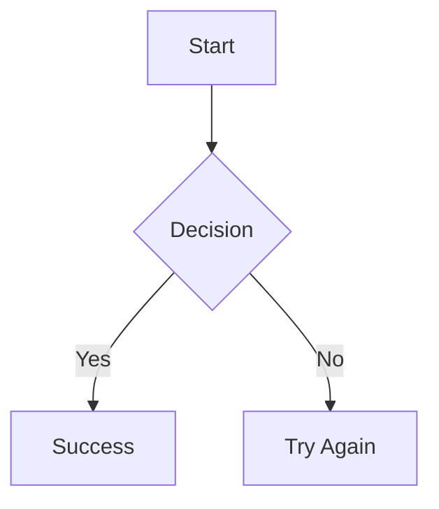

# Jekyll Mermaid Integration Tutorial

> Complete tutorial for integrating Mermaid diagrams in Jekyll sites with GitHub Pages support.

## Overview

This tutorial covers the complete integration of Mermaid diagrams in Jekyll sites, including both the jekyll-mermaid plugin approach and custom implementation for GitHub Pages compatibility.

## Two Implementation Approaches

### 1. Jekyll-Mermaid Plugin (Recommended for Local Development)

**Best for:** Local development, when you control the Jekyll build process.

**Configuration:**

```yaml
# _config.yml
plugins:
  - jekyll-mermaid

mermaid:
  src: "https://cdn.jsdelivr.net/npm/mermaid@10/dist/mermaid.min.js"
```

**Usage:**

````markdown

````

````

### 2. Custom Implementation (GitHub Pages Compatible)

**Best for:** GitHub Pages, when you need full control over the implementation.

**Configuration:**
```yaml
# _config.yml
plugins:
  - jekyll-mermaid  # Still needed for configuration

mermaid:
  src: 'https://cdn.jsdelivr.net/npm/mermaid@10/dist/mermaid.min.js'
````

**Include File:** `_includes/components/mermaid.html`

```html
<script src="https://cdn.jsdelivr.net/npm/mermaid@10/dist/mermaid.min.js"></script>
<script>
  document.addEventListener("DOMContentLoaded", function () {
    mermaid.initialize({
      startOnLoad: true,
      theme: "forest",
    });
  });
</script>
```

**Head Include:** `_includes/core/head.html`

```html
  
```

**Usage:**

```html
<div class="mermaid">
  graph TD A[Start] --> B{Decision} B -->|Yes| C[Success] B -->|No| D[Try Again]
</div>
```

## Implementation Details

### File Structure

```
_includes/
  └── components/
      └── mermaid.html          # Mermaid configuration
  └── core/
      └── head.html             # Conditional include

_config.yml                     # Plugin configuration
```

### Page Front Matter

For custom implementation, add to your page front matter:

```yaml
---
title: "My Page"
mermaid: true
---
```

### Diagram Examples

#### Flowchart

```html
<div class="mermaid">
  graph TD A[Christmas] -->|Get money| B(Go shopping) B --> C{Let me think} C
  -->|One| D[Laptop] C -->|Two| E[iPhone] C -->|Three| F[Car]
</div>
```

#### Sequence Diagram

```html
<div class="mermaid">
  sequenceDiagram Alice->>John: Hello John, how are you? John-->>Alice: Great!
  Alice-)John: See you later!
</div>
```

#### Class Diagram

```html
<div class="mermaid">
  classDiagram Animal <|-- Duck Animal <|-- Fish Animal : +int age Animal :
  +String gender Animal: +isMammal() class Duck{ +String beakColor +swim()
  +quack() }
</div>
```

## GitHub Pages Compatibility

### Why Custom Implementation?

GitHub Pages has limitations on Jekyll plugins. While jekyll-mermaid works locally, it may not render diagrams on GitHub Pages due to:

1. **Plugin Restrictions**: GitHub Pages only supports specific plugins
2. **Build Process**: Different build environment
3. **Security Policies**: Limited JavaScript execution

### Solution: Hybrid Approach

Our implementation uses both approaches:

1. **Plugin Configuration**: For local development and configuration
2. **Custom Include**: For GitHub Pages compatibility
3. **Conditional Loading**: Only loads when needed

## Troubleshooting

### Common Issues

| Issue                  | Solution                                               |
| ---------------------- | ------------------------------------------------------ |
| Diagrams not rendering | Check `mermaid: true` in front matter                  |
| Plugin not working     | Verify jekyll-mermaid is in plugins list               |
| GitHub Pages issues    | Use custom implementation with `<div class="mermaid">` |
| Styling problems       | Check theme configuration in mermaid.html              |

### Testing

1. **Local Testing**: Use `bundle exec jekyll serve`
2. **GitHub Pages**: Push to repository and check live site
3. **Validation**: Use [Mermaid Live Editor](https://mermaid.live/)

## Best Practices

### 1. Choose the Right Approach

- **Local Development**: Use jekyll-mermaid plugin
- **GitHub Pages**: Use custom implementation
- **Both**: Use hybrid approach (recommended)

### 2. Performance Optimization

- Only load Mermaid on pages that need it
- Use conditional loading with `page.mermaid`
- Consider lazy loading for large diagrams

### 3. Maintenance

- Keep Mermaid version updated
- Test both local and GitHub Pages environments
- Document any custom configurations

## Resources

- **Main Documentation**: [Mermaid Guide](/docs/jekyll/mermaid/)
- **Official Docs**: [mermaid.js.org](https://mermaid.js.org/)
- **Live Editor**: [mermaid.live](https://mermaid.live/)
- **Plugin Repository**: [jekyll-mermaid](https://github.com/jasonbellamy/jekyll-mermaid)

---

**Next Steps**: See the [complete Mermaid guide](/docs/jekyll/mermaid/) for comprehensive examples and reference.
