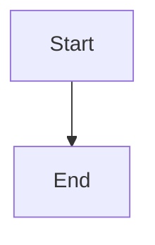
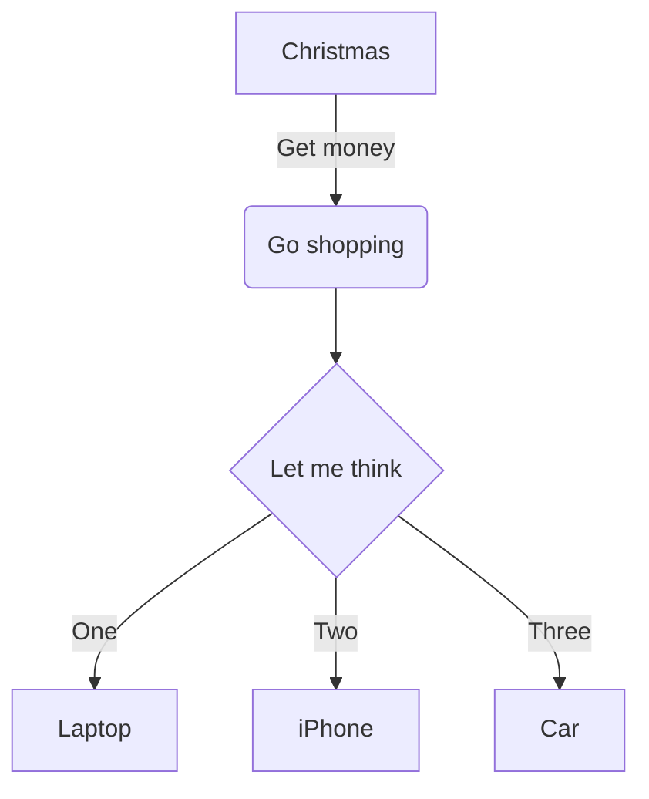
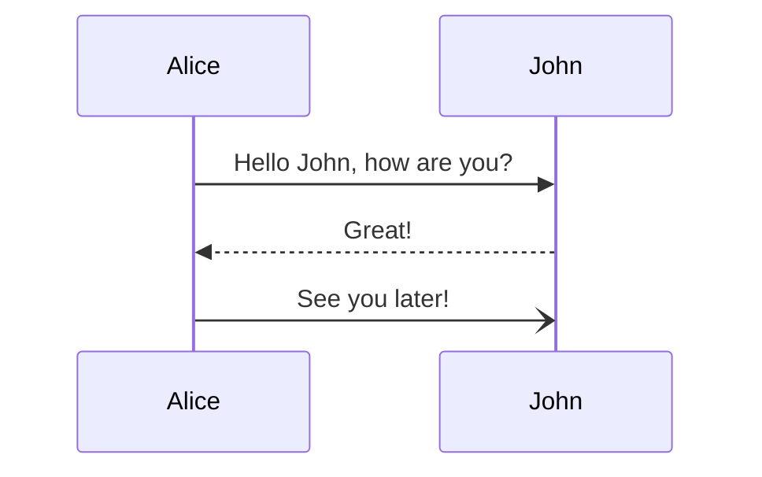
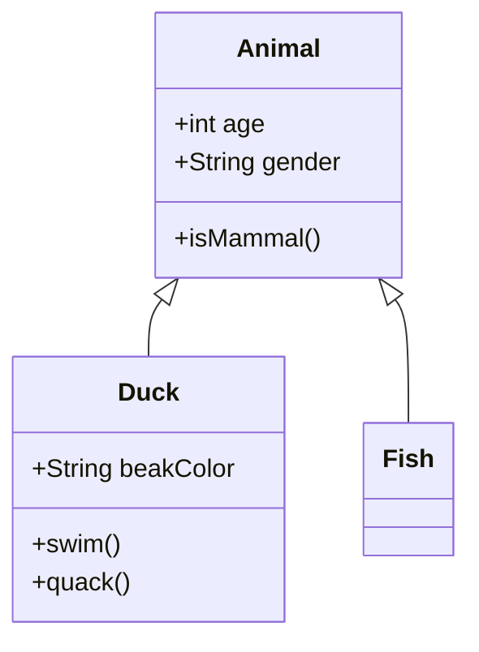
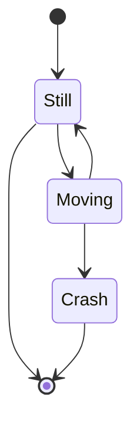
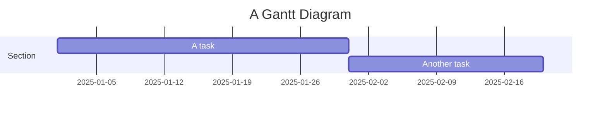
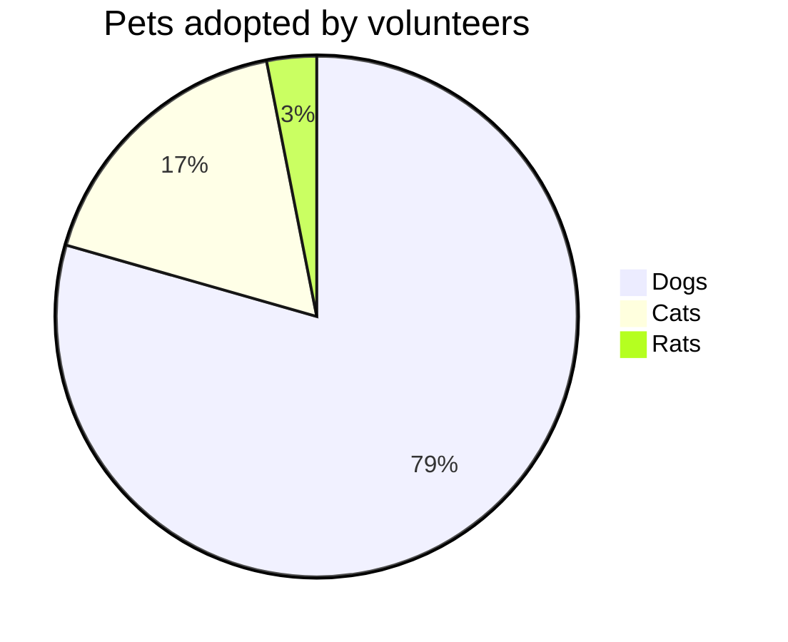
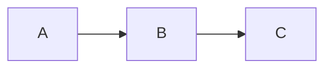

# Mermaid with Native Markdown Syntax

**✨ Simple Implementation:** No HTML tags needed! Just use markdown code blocks.

**🌐 GitHub Pages Compatible:** Works with GitHub Pages without custom plugins!

---

## 🚀 Quick Start

### Step 1: Enable Mermaid in Front Matter

Add `mermaid: true` to your page's front matter:

```yaml
---
title: My Page with Diagrams
mermaid: true
---
```

### Step 2: Write Markdown Code Blocks

Use triple backticks with `mermaid` as the language:

````markdown

````

### That's It!

The native markdown syntax is automatically converted to rendered diagrams.

---

## 📊 Examples

### Example 1: Basic Flowchart

````markdown

````

**Result:**


---

### Example 2: Sequence Diagram

````markdown

````

**Result:**


---

### Example 3: Class Diagram

````markdown

````

**Result:**


---

### Example 4: State Diagram

````markdown

````

**Result:**


---

### Example 5: Gantt Chart

````markdown

````

**Result:**


---

### Example 6: Pie Chart

````markdown

````

**Result:**


---

## 🎯 Benefits

### ✅ Simpler Syntax

- **Before:** `<div class="mermaid">graph TD...</div>` + `mermaid: true` in front matter
- **After:** Just ` ```mermaid ... ``` ` in markdown

### ✅ Standard Markdown

- Native markdown code block syntax
- Compatible with other markdown processors
- GitHub-style fenced code blocks

### ✅ No Configuration Needed

- No front matter variables required
- No conditional includes
- Just write and it works

### ✅ Cleaner Content

- Pure markdown syntax
- No HTML mixed in
- Easier to read and edit

---

## 📚 All Supported Diagram Types

| Type          | Syntax            | Description                 |
| ------------- | ----------------- | --------------------------- |
| **Flowchart** | `graph TD`        | Process flows and decisions |
| **Sequence**  | `sequenceDiagram` | System interactions         |
| **Class**     | `classDiagram`    | OOP relationships           |
| **State**     | `stateDiagram-v2` | State machines              |
| **ER**        | `erDiagram`       | Database schemas            |
| **Gantt**     | `gantt`           | Project timelines           |
| **Pie**       | `pie`             | Data percentages            |
| **Git**       | `gitGraph`        | Version control flows       |
| **Journey**   | `journey`         | User experiences            |

---

## 🔧 Configuration

The plugin is configured in `_config.yml`:

```yaml
plugins:
  - jekyll-mermaid

mermaid:
  src: "https://cdn.jsdelivr.net/npm/mermaid@10/dist/mermaid.min.js"
```

**That's all the configuration needed!**

---

## 📝 Usage Summary

### In Your Markdown Files

Just use standard markdown code blocks:

````markdown

````

### No Front Matter Needed

Unlike the previous implementation, you don't need:

```yaml
---
mermaid: true # ← NOT NEEDED ANYMORE
---
```

### No HTML Tags Needed

Unlike the previous implementation, you don't need:

```html
<div class="mermaid">
  <!-- ← NOT NEEDED ANYMORE -->
  graph LR A --> B
</div>
```

---

## 🎓 Quick Reference

### Flowchart Directions

```
TD or TB - Top to bottom
BT - Bottom to top
LR - Left to right
RL - Right to left
```

### Node Shapes

```
[Rectangle]
(Rounded)
{Diamond}
((Circle))
>Flag]
```

### Arrow Types

```
-->  Solid arrow
-.-> Dotted arrow
==>  Thick arrow
--   Line without arrow
```

---

## 🔗 Resources

- **Jekyll-Mermaid:** [GitHub Repository](https://github.com/jasonbellamy/jekyll-mermaid)
- **Mermaid Docs:** [Official Documentation](https://mermaid.js.org/)
- **Live Editor:** [Test Your Diagrams](https://mermaid.live/)
- **Syntax Guide:** [Complete Reference](https://mermaid.js.org/intro/syntax-reference.html)

---

## ✨ Advantages of This Approach

1. **Native Markdown** - Standard fenced code blocks
2. **Simpler** - No HTML, no front matter variables
3. **Portable** - Works with other markdown processors
4. **Cleaner** - Easier to read and maintain
5. **Automatic** - Plugin handles everything
6. **GitHub-Style** - Same syntax as GitHub markdown

---

**Happy Diagramming! 📊✨**

_Using jekyll-mermaid plugin for automatic diagram generation from native markdown._
