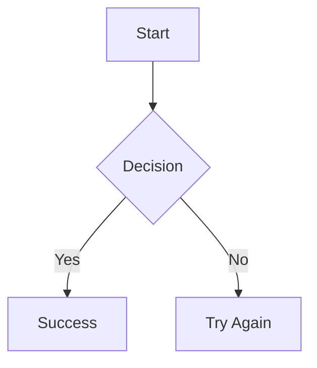

# Mermaid Diagrams in Jekyll

This guide covers everything you need to know about using Mermaid diagrams in your Jekyll site.

**✅ GitHub Pages Compatible:** Works with GitHub Pages without custom plugins!

## Quick Start

### 1. Enable Mermaid on a Page

Add `mermaid: true` to your page's front matter:

```yaml
---
title: "My Page with Diagrams"
mermaid: true
---
```

### 2. Add a Diagram

**Option A: Native Markdown Syntax (Recommended)**

Use triple backticks with `mermaid` as the language:

````markdown

````

**Option B: HTML Div Syntax**

Use the `<div class="mermaid">` syntax:

```html
<div class="mermaid">
  graph TD A[Start] --> B{Decision} B -->|Yes| C[Success] B -->|No| D[Try Again]
</div>
```

**Result:**

<div class="mermaid">
graph TD
    A[Start] --> B{Decision}
    B -->|Yes| C[Success]
    B -->|No| D[Try Again]
</div>

---

## Diagram Types

### 1. Flowcharts

**Basic Flowchart:**

<div class="mermaid">
graph LR
    A[Input] --> B[Process]
    B --> C{Valid?}
    C -->|Yes| D[Success]
    C -->|No| E[Error]
</div>

**Directions:**

- `TD` or `TB` - Top to bottom
- `BT` - Bottom to top
- `LR` - Left to right
- `RL` - Right to left

**Node Shapes:**

- `A[Rectangle]` - Rectangle
- `A(Rounded)` - Rounded edges
- `A{Diamond}` - Diamond (decision)
- `A((Circle))` - Circle

### 2. Sequence Diagrams

<div class="mermaid">
sequenceDiagram
    participant User
    participant Browser
    participant Server
    participant Database
    
    User->>Browser: Enter credentials
    Browser->>Server: POST /login
    Server->>Database: Verify credentials
    Database-->>Server: User found
    Server-->>Browser: Auth token
    Browser-->>User: Login success
</div>

**Arrow Types:**

- `->` - Solid line without arrow
- `-->` - Dotted line without arrow
- `->>` - Solid line with arrow
- `-->>` - Dotted line with arrow

### 3. Class Diagrams

<div class="mermaid">
classDiagram
    class User {
        +String name
        +String email
        +login()
        +logout()
    }
    
    class Admin {
        +String permissions
        +manageUsers()
    }
    
    User <|-- Admin
    User "1" --> "*" Post : creates
</div>

**Relationships:**

- `<|--` - Inheritance
- `*--` - Composition
- `o--` - Aggregation
- `-->` - Association

### 4. State Diagrams

<div class="mermaid">
stateDiagram-v2
    [*] --> Draft
    Draft --> Review: Submit
    Review --> Approved: Accept
    Review --> Draft: Reject
    Approved --> Published: Publish
    Published --> [*]
</div>

### 5. Entity Relationship Diagrams

<div class="mermaid">
erDiagram
    USER ||--o{ POST : creates
    USER ||--o{ COMMENT : writes
    POST ||--o{ COMMENT : has
    
    USER {
        int id PK
        string username
        string email
    }
    
    POST {
        int id PK
        int user_id FK
        string title
        text content
    }
</div>

### 6. Gantt Charts

<div class="mermaid">
gantt
    title Project Timeline
    dateFormat YYYY-MM-DD
    section Planning
    Requirements       :a1, 2025-01-01, 7d
    Design            :a2, after a1, 5d
    section Development
    Frontend          :a3, after a2, 14d
    Backend           :a4, after a2, 14d
</div>

### 7. Pie Charts

<div class="mermaid">
pie title Website Traffic Sources
    "Direct" : 42.5
    "Search Engines" : 28.3
    "Social Media" : 18.7
    "Referral" : 10.5
</div>

### 8. Git Graphs

<div class="mermaid">
gitGraph
    commit id: "Initial commit"
    branch develop
    checkout develop
    commit id: "Add feature"
    branch feature
    checkout feature
    commit id: "Implement feature"
    checkout develop
    merge feature
    checkout main
    merge develop tag: "v1.0.0"
</div>

### 9. Journey Diagrams

<div class="mermaid">
journey
    title User Shopping Experience
    section Discovery
      Search product: 5: User
      View results: 4: User
    section Evaluation
      Read reviews: 3: User
      Compare prices: 4: User
    section Purchase
      Add to cart: 5: User
      Checkout: 3: User
</div>

---

## Styling and Customization

### Theme Options

The Mermaid theme is configured in `_includes/components/mermaid.html`:

```javascript
mermaid.initialize({
  theme: "forest", // Options: default, forest, dark, neutral, base
  themeVariables: {
    primaryColor: "#007bff",
    primaryTextColor: "#fff",
  },
});
```

### Custom Colors

<div class="mermaid">
graph TD
    A[Start]:::greenClass --> B[Process]:::blueClass
    B --> C[End]:::redClass
    
    classDef greenClass fill:#9f6,stroke:#333,stroke-width:2px
    classDef blueClass fill:#69f,stroke:#333,stroke-width:2px
    classDef redClass fill:#f96,stroke:#333,stroke-width:2px
</div>

### Icons (FontAwesome)

<div class="mermaid">
graph TD
    A[fa:fa-home Home]
    B[fa:fa-user User]
    C[fa:fa-cog Settings]
    A --> B
    A --> C
</div>

---

## Advanced Features

### Links and Interactivity

<div class="mermaid">
graph LR
    A[Homepage]
    B[About]
    C[Contact]
    
    click A "https://example.com" "Visit Homepage"
    click B "https://example.com/about" "About Us"
</div>

### Subgraphs

<div class="mermaid">
graph TB
    subgraph Frontend
        A[React] --> B[Components]
    end
    
    subgraph Backend
        C[API] --> D[Database]
    end
    
    B --> C
</div>

### Comments

```html
<div class="mermaid">graph TD A --> B %% This is a comment B --> C</div>
```

---

## Troubleshooting

### Common Issues

| Issue                 | Solution                                          |
| --------------------- | ------------------------------------------------- |
| Diagram not rendering | Add `mermaid: true` to front matter               |
| Syntax error          | Validate at [mermaid.live](https://mermaid.live/) |
| Diagram too small     | Diagrams are responsive by default                |
| Wrong colors          | Check theme setting in mermaid.html               |
| Console errors        | Check browser DevTools for JavaScript errors      |

### Testing Your Diagrams

1. **Validate Syntax**: Use [Mermaid Live Editor](https://mermaid.live/)
2. **Check Front Matter**: Ensure `mermaid: true` is present
3. **Browser Console**: Look for JavaScript errors
4. **Clear Cache**: Force refresh (Cmd+Shift+R / Ctrl+Shift+R)

---

## Best Practices

### 1. Keep Diagrams Simple

```html
<!-- ✅ Good - Clear and focused -->
<div class="mermaid">graph LR A[Input] --> B[Process] --> C[Output]</div>

<!-- ❌ Avoid - Too complex -->
<div class="mermaid">graph TD A --> B --> C --> D --> E --> F --> G --> H</div>
```

### 2. Use Descriptive Labels

```html
<!-- ✅ Good -->
<div class="mermaid">
  graph TD A[User Login] --> B{Credentials Valid?} B -->|Yes| C[Dashboard] B
  -->|No| D[Error Message]
</div>
```

### 3. Add Comments for Complex Diagrams

```html
<div class="mermaid">
  graph TD %% Main authentication flow A[Start] --> B{Auth Type} %% OAuth path B
  -->|OAuth| C[OAuth Provider] %% Basic auth path B -->|Basic| D[Verify
  Credentials]
</div>
```

---

## Resources

### Official Documentation

- **Website**: [mermaid.js.org](https://mermaid.js.org/)
- **GitHub**: [mermaid-js/mermaid](https://github.com/mermaid-js/mermaid)
- **Live Editor**: [mermaid.live](https://mermaid.live/)

### Learning Path

1. **Start Here**: This guide covers the basics
2. **Practice**: Use [mermaid.live](https://mermaid.live/) to test diagrams
3. **Reference**: Keep this page bookmarked for syntax
4. **Master**: Read [Official Docs](https://mermaid.js.org/) for advanced features

---

## Implementation Details

### File Structure

```
_includes/
  └── components/
      └── mermaid.html          # Mermaid configuration
  └── core/
      └── head.html             # Conditional include

_config.yml                     # Plugin configuration
```

### Configuration

The implementation uses:

- **Mermaid v10** - Latest stable version
- **Conditional Loading** - Only loads when `mermaid: true`
- **Forest Theme** - Optimized for dark mode
- **FontAwesome Support** - Icons in diagrams
- **Responsive Design** - Scales automatically

---

**Happy Diagramming! 📊**

_This implementation is fully functional and GitHub Pages compatible._
