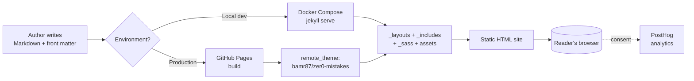

{{ site.description }}

<p class="lead text-body-secondary mb-4">
Un thème Jekyll pensé pour Docker avec Bootstrap 5, un installateur alimenté par l'IA et des publications sémantiques automatisées — conçu pour que votre premier <code>docker-compose up</code> fonctionne du premier coup, sur n'importe quelle machine.
</p>

## Qu'est-ce que Zer0-Mistakes ?

**Zer0-Mistakes** est un thème Jekyll bien pensé — accompagné de son RubyGem ([`jekyll-theme-zer0`](https://rubygems.org/gems/jekyll-theme-zer0)) — destiné aux développeurs qui veulent une plateforme de publication moderne, adaptée aux conteneurs et compatible GitHub Pages, qui fonctionne dès le premier essai. Le nom reflète le principe directeur : chaque valeur par défaut, script et workflow de ce projet existe pour éviter aux nouveaux utilisateurs les petites erreurs qui font dérailler une configuration Jekyll.

Il repose sur quatre piliers :

- 🐳 **Développement centré sur Docker** — `docker-compose up` est la seule commande
  dont vous avez besoin pour commencer à coder, quel que soit votre système d'exploitation ou votre version de Ruby.
- 🤖 **Installation alimentée par l'IA** — un installateur auto-réparateur (`install.sh`)
  qui détecte et corrige automatiquement les problèmes d'environnement courants.
- 🎨 **Bootstrap 5 + prise en charge du remote-theme** — une interface moderne et responsive qui
  fonctionne sur GitHub Pages sans aucune étape de build personnalisée.
- 🚀 **Publications sémantiques automatisées** — analyse des conventional commits,
  génération de changelog et publication du gem en une seule commande.

## En bref

Ce monde a été créé par {{ site.founder }} et est maintenu par :

{:table .table .table-striped}
Nom | Profil
---------|----------

{{ follower.name }} | {{ follower.profile }}


Et, surtout, propulsé par :

{:table .table .table-striped}
Nom | Lien
---------|----------

{{ power.name }} | <a href="{{ power.url }}" target="_blank" rel="nofollow noopener noreferrer">{{ power.url }}</a>


## Aperçu de l'architecture

Le thème suit une architecture modulaire en couches. Les sites de production le consomment comme remote theme sur GitHub Pages, tandis que le développement local utilise les mêmes fichiers montés dans un conteneur Jekyll.



Le **système de double configuration** (`_config.yml` pour la production, `_config_dev.yml` pour les surcharges locales) est ce qui permet à la même arborescence source de servir les deux modes sans modification.

## Prérequis

Pour exécuter ce site — ou tout site construit sur le gem `jekyll-theme-zer0` — en local, vous avez besoin de l'une des chaînes d'outils suivantes :

**Recommandé (centré sur Docker) :**

- [Docker Desktop](https://www.docker.com/products/docker-desktop/) 4.0+ (ou
  Docker Engine + Docker Compose v2)
- Git 2.30+

**Alternative (Ruby natif) :**

- Ruby 3.0+ (3.3 recommandé ; correspond à la matrice CI du gem)
- Bundler 2.x (`gem install bundler`)
- Git 2.30+

Aucune connaissance préalable de Jekyll n'est requise — l'installateur et le fichier Docker Compose gèrent la résolution des dépendances pour vous.

## Démarrage rapide

Le moyen le plus rapide de mettre en place un nouveau site avec ce thème :

```bash
# 1. AI-powered one-line install (creates a new site in ./my-site)
curl -fsSL https://raw.githubusercontent.com/bamr87/zer0-mistakes/main/install.sh | bash -s my-site

# 2. Start the development environment
cd my-site
docker-compose up

# 3. Open http://localhost:4000 in your browser
```

Si vous préférez ajouter le thème à un site Jekyll existant, insérez ces lignes dans votre `Gemfile` et votre `_config.yml` :

```ruby
# Gemfile
gem "jekyll-theme-zer0"
```

```yaml
# _config.yml — for local builds
theme: jekyll-theme-zer0

# _config.yml — for GitHub Pages
remote_theme: bamr87/zer0-mistakes
```

Puis exécutez `bundle install && bundle exec jekyll serve`.

## Coordonnées

Si vous avez des questions, des commentaires ou des suggestions, n'hésitez pas à nous contacter à :

- 📧 **E-mail :** {{ site.email }}
- 🐛 **Problèmes / rapports de bugs :** [github.com/bamr87/zer0-mistakes/issues](https://github.com/bamr87/zer0-mistakes/issues)
- 💬 **Discussions / idées :** [github.com/bamr87/zer0-mistakes/discussions](https://github.com/bamr87/zer0-mistakes/discussions)
- 📦 **Gem sur RubyGems :** [rubygems.org/gems/jekyll-theme-zer0](https://rubygems.org/gems/jekyll-theme-zer0)

## FAQ

**Ai-je besoin de connaître Ruby pour utiliser ce thème ?** Non. Si vous utilisez le workflow centré sur Docker ou que vous consommez le thème comme remote theme sur GitHub Pages, Ruby est entièrement abstrait. Vous n'en avez besoin que si vous souhaitez contribuer au thème lui-même.

**Est-ce compatible avec GitHub Pages ?** Oui. Le `_config.yml` de production utilise `remote_theme: "bamr87/zer0-mistakes"`, qui figure sur la liste d'autorisation de GitHub Pages. Aucun workflow Actions personnalisé n'est requis pour un déploiement de base.

**Pourquoi « zer0-mistakes » ?** Le thème cible le niveau `n00b` (voir `level` dans `_config.yml`) et chaque valeur par défaut est choisie pour éviter les erreurs les plus courantes lors de la prise en main de Jekyll : mauvaise version de Ruby, extensions natives cassées, problèmes de Bundler propres à la plateforme et pièges des templates Liquid.

**Le site me suit-il ?** Les analytics ([PostHog](https://posthog.com/)) ne se chargent qu'en production *et* uniquement après que le visiteur a accepté la bannière de consentement aux cookies. Voir [`_includes/analytics/posthog.html`](https://github.com/bamr87/zer0-mistakes/blob/main/_includes/analytics/posthog.html) et [`_includes/components/cookie-consent.html`](https://github.com/bamr87/zer0-mistakes/blob/main/_includes/components/cookie-consent.html) pour l'implémentation complète.

## Dépannage

| Symptôme | Cause probable | Solution |
|---------|--------------|-----|
| `docker-compose up` échoue sur Apple Silicon avec des erreurs de plateforme | Incompatibilité d'architecture de l'image de conteneur | Le `docker-compose.yml` fourni fixe déjà `platform: linux/amd64` — assurez-vous de ne pas l'avoir supprimé. |
| `bundle install` échoue avec des erreurs d'extensions natives | En-têtes de développement manquants / mauvaise version de Ruby | Utilisez le workflow Docker, ou assurez-vous d'être sur Ruby 3.0+ avec les outils de build installés. |
| Le site se génère mais les styles du thème sont absents sur GitHub Pages | `remote_theme` non activé | Vérifiez que `remote_theme: bamr87/zer0-mistakes` est défini dans `_config.yml` et que le plugin `jekyll-remote-theme` figure dans votre `Gemfile`. |
| Erreurs 404 sur les pages après le déploiement | Incohérence de `baseurl` | Si votre dépôt n'est *pas* un dépôt `<user>.github.io`, définissez `baseurl: "/<repo-name>"` dans `_config.yml`. |

Pour en savoir plus, consultez le [README](https://github.com/bamr87/zer0-mistakes#troubleshooting) du projet et la [documentation de l'installateur auto-réparateur](https://github.com/bamr87/zer0-mistakes/blob/main/install.sh).

## Étapes suivantes

Maintenant que vous savez ce qu'est Zer0-Mistakes, voici la suite :

- 🎨 [**Fonctionnalités du thème**](/about/features/) — liste complète des composants, mises en page et intégrations
- 🧩 [**Exemples de composants Bootstrap**](/about/theme/) — extraits d'interface prêts à copier-coller
- 📊 [**Tableau de bord des statistiques du site**](/about/stats/) — métriques de contenu en temps réel
- ⚙️ [**Référence de configuration**](/about/config/) — chaque option `_config.yml` expliquée
- 🤖 [**Guide de développement avec l'IA**](/about/features/ai-development-guide/) — comment travailler sur ce thème avec Copilot, Codex, Cursor et consorts
- 🚀 [**Système de publication automatisé**](/about/features/comprehensive-gem-automation-system/) — comment sont produits les versions, journaux des modifications et publications de gem

<div class="alert alert-primary d-flex flex-column flex-md-row align-items-md-center gap-3 mt-4">
  <div class="flex-grow-1">
    <h3 class="h5 mb-1">Prêt à publier votre propre site ?</h3>
    <p class="mb-0">
      Lancez un nouveau site Zer0-Mistakes en moins d'une minute grâce à l'installateur
      en une ligne — aucune configuration Ruby requise.
    </p>
  </div>
  <div class="d-flex flex-wrap gap-2">
    <a class="btn btn-primary" href="https://github.com/bamr87/zer0-mistakes#quick-start">
      Commencer
    </a>
    <a class="btn btn-outline-primary" href="https://github.com/bamr87/zer0-mistakes">
      Mettre une étoile sur GitHub
    </a>
  </div>
</div>

## Ressources connexes

- [`AGENTS.md`](https://github.com/bamr87/zer0-mistakes/blob/main/AGENTS.md) — point d'entrée multi-outils pour les agents de codage IA
- [`CONTRIBUTING.md`](https://github.com/bamr87/zer0-mistakes/blob/main/CONTRIBUTING.md) — comment proposer des modifications
- [`CHANGELOG.md`](https://github.com/bamr87/zer0-mistakes/blob/main/CHANGELOG.md) — historique des versions
