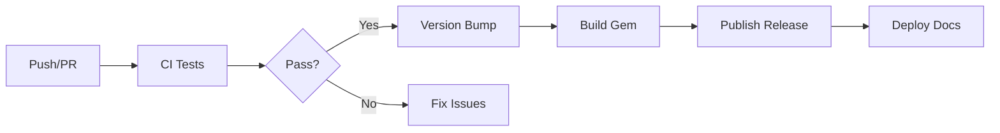

# Pipeline CI/CD

Le thème Zer0-Mistakes utilise GitHub Actions pour l'intégration et le déploiement continus, en automatisant les tests, la compilation et la publication.

## Vue d'ensemble du workflow



## Workflows disponibles

| Workflow | Déclencheur | Objectif |
|----------|---------|---------|
| `ci.yml` | Push, PR | Exécuter les tests et validations |
| `version-bump.yml` | Push sur main, Manuel | Incrémenter la version et taguer |
| `release.yml` | Push de tag | Compiler et publier le gem |
| `codeql.yml` | Push, PR, Planifié | Analyse de sécurité |
| `update-dependencies.yml` | Planifié, Manuel | Mettre à jour les gems Ruby |
| `convert-notebooks.yml` | Push | Convertir les notebooks Jupyter |

## Workflow CI (`ci.yml`)

### Déclencheurs

```yaml
on:
  push:
    branches: [main, develop]
  pull_request:
    branches: [main]
```

### Jobs

#### 1. Matrice de tests

Tests sur plusieurs versions de Ruby :

```yaml
strategy:
  matrix:
    ruby-version: ['3.0', '3.1', '3.2', '3.3']
    os: [ubuntu-latest]
```

#### 2. Étapes de compilation

```yaml
steps:
  - uses: actions/checkout@v4
  
  - name: Set up Ruby
    uses: ruby/setup-ruby@v1
    with:
      ruby-version: ${{ matrix.ruby-version }}
      bundler-cache: true
  
  - name: Run tests
    run: ./test/test_runner.sh
  
  - name: Build Jekyll site
    run: bundle exec jekyll build
  
  - name: Build gem
    run: gem build jekyll-theme-zer0.gemspec
```

### Contrôles de qualité

- **Linting** : validation YAML, Markdown
- **Build** : compilation du site Jekyll
- **Tests** : exécution de la suite de tests complète
- **Gem** : vérification de la construction du package

## Workflow de publication (`release.yml`)

### Déclencheur

```yaml
on:
  push:
    tags:
      - 'v*'
```

### Étapes de publication

1. **Checkout** de la version taguée
2. **Compilation** du package gem
3. **Test** de l'installation du gem
4. **Publication** sur RubyGems.org
5. **Création** d'une GitHub Release
6. **Téléversement** des ressources de la release

### Ressources de la release

- `jekyll-theme-zer0-X.Y.Z.gem`
- Script d'installation
- Notes de version (depuis CHANGELOG)

## Variables d'environnement

### Secrets requis

| Secret | Objectif |
|--------|---------|
| `RUBYGEMS_API_KEY` | Publication du gem |
| `GITHUB_TOKEN` | Création de la release (automatique) |

### Configuration

```yaml
env:
  RUBY_VERSION: '3.2'
  JEKYLL_ENV: production
```

## Protection des branches

### Règles de la branche main

- Exiger des revues de pull request
- Exiger la réussite des contrôles de statut :
  - `test (3.2, ubuntu-latest)`
  - `build`
  - `CodeQL`
- Exiger un historique linéaire

### Contrôles de statut

```yaml
# Required checks before merge
required_status_checks:
  - test
  - build
  - codeql
```

## Stratégie de cache

### Dépendances Ruby

```yaml
- uses: ruby/setup-ruby@v1
  with:
    bundler-cache: true  # Caches vendor/bundle
```

### Cache de compilation Jekyll



```yaml
- uses: actions/cache@v4
  with:
    path: |
      .jekyll-cache
      _site
    key: jekyll-${{ hashFiles('_config.yml') }}
```



## Artefacts

### Résultats des tests

```yaml
- uses: actions/upload-artifact@v4
  with:
    name: test-results
    path: test/results/
    retention-days: 30
```

### Sorties de compilation

```yaml
- uses: actions/upload-artifact@v4
  with:
    name: gem-package
    path: "*.gem"
```

## Notifications

### Notifications d'échec

Configurez les notifications pour les échecs de workflow :

```yaml
- name: Notify on failure
  if: failure()
  uses: actions/github-script@v7
  with:
    script: |
      github.rest.issues.createComment({
        issue_number: context.issue.number,
        body: '❌ CI failed. Please check the logs.'
      })
```

## Débogage des workflows

### Activer la journalisation de débogage

Définissez les secrets du dépôt :

- `ACTIONS_RUNNER_DEBUG`: `true`
- `ACTIONS_STEP_DEBUG`: `true`

### Accès SSH

Pour déboguer dans le runner :

```yaml
- name: Setup tmate session
  if: failure()
  uses: mxschmitt/action-tmate@v3
```

## Bonnes pratiques

### Gardez des workflows rapides

- Mettez les dépendances en cache
- Exécutez les tâches en parallèle
- Ignorez les étapes inutiles

### Utilisez des workflows réutilisables

```yaml
jobs:
  test:
    uses: ./.github/workflows/test.yml
```

### Limitez les exécutions simultanées

```yaml
concurrency:
  group: ${{ github.workflow }}-${{ github.ref }}
  cancel-in-progress: true
```

## Dépannage

### Les tests passent en local mais échouent en CI

1. Vérifiez les différences de version de Ruby
2. Vérifiez les variables d'environnement
3. Recherchez les tests sensibles au timing

### Le workflow ne se déclenche pas

1. Vérifiez les règles de protection de branche
2. Vérifiez les filtres de chemin
3. Recherchez les erreurs dans le fichier de workflow

### Permission refusée

Assurez-vous que le workflow dispose des permissions requises :

```yaml
permissions:
  contents: write
  packages: read
```

## Ressources associées

- [Guide de test](/docs/development/testing/)
- [Incrémentation de version](/docs/development/version-bump/)
- [Gestion des versions](/docs/development/release-management/)

## Voir aussi

- [[Development]]
- [[Testing]]
- [[Release Management]]
- [[Security Scanning]]
