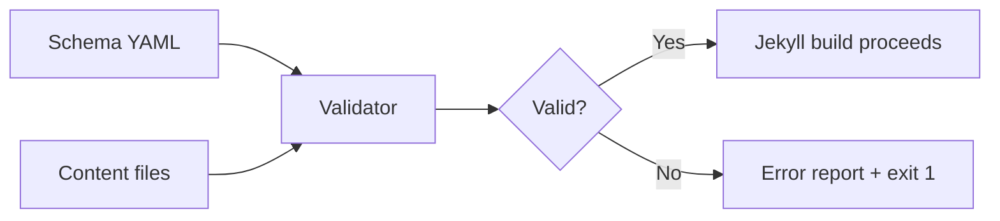

# Validation du frontmatter pilotée par configuration

Le thème zer0-mistakes est livré avec un système de validation du frontmatter piloté par un schéma. Il détecte les champs obligatoires manquants, les formats de date invalides et les références à des layouts inconnus avant même que Jekyll ne démarre sa construction, ce qui permet de gagner du temps en CI et d'éviter les erreurs de contenu silencieuses.

## Fonctionnement

Le validateur lit un schéma YAML qui définit des règles par collection, puis vérifie le frontmatter de chaque fichier Markdown par rapport à ces règles.



## Fichier de schéma

Le schéma se trouve à :

```text
.github/config/frontmatter_schema.yml
```

### Exemple de schéma

```yaml
collections:
  _posts:
    required:
      - title
      - date
      - categories
    date_fields:
      - date
      - lastmod
    allowed_layouts:
      - article
      - default

  _docs:
    required:
      - title
      - description
      - permalink
    allowed_layouts:
      - default
```

## Exécuter la validation

```bash
# Via the unified validate script
./scripts/bin/validate

# Quick host-only checks (no Jekyll build)
./scripts/bin/validate --quick
```

L'étape de validation est intégrée à la vérification préalable standard et s'exécute automatiquement en CI avant chaque construction.

## Intégration CI

Le pipeline CI `.github/workflows/` exécute `./scripts/bin/validate` à chaque push et pull request. Les erreurs de frontmatter apparaissent comme des échecs de workflow avec des diagnostics au niveau des lignes.

## Maintenance assistée par IA

Un prompt Copilot dédié vous aide à auditer et réparer le frontmatter sur l'ensemble du site :

```text
.github/prompts/frontmatter-maintainer.prompt.md
```

Utilisez-le via GitHub Copilot Chat :

```text
@workspace /frontmatter-maintainer
```

## Normes de frontmatter

Toutes les pages de ce thème suivent un schéma de frontmatter cohérent. Champs courants :

| Champ | Obligatoire | Description |
|---|---|---|
| `title` | ✅ | Titre de page lisible par un humain |
| `description` | ✅ | Méta-description SEO (150–160 caractères) |
| `layout` | ✅ | Fichier de layout Jekyll (sans `.html`) |
| `permalink` | ✅ pour la doc | Chemin d'URL canonique |
| `date` | ✅ pour les articles | Date de publication ISO 8601 |
| `lastmod` | Recommandé | Date de dernière modification (ISO 8601) |
| `categories` | Recommandé | Tableau de chaînes de catégories |
| `tags` | Recommandé | Tableau de chaînes de tags |
| `draft` | Facultatif | `true` masque des constructions de production |

## Dépannage

### « Champ obligatoire manquant »

Ajoutez le champ manquant au frontmatter de la page.

### « Layout inconnu »

Vérifiez que le nom du layout correspond à un fichier sous `_layouts/` (sans l'extension `.html`).

### « Format de date invalide »

Utilisez le format ISO 8601 : `YYYY-MM-DD` ou `YYYY-MM-DDTHH:MM:SSZ`.

## Voir aussi

- [Guide de documentation](/docs/development/documentation/)
- [Aperçu des scripts](/docs/development/scripts/)
- [Pipeline CI/CD](/docs/development/ci-cd/)

## Voir aussi

- [[Development]]
- [[Testing]]
- [[CI/CD]]
