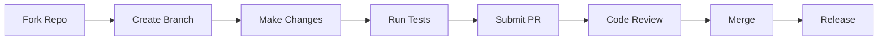

# Contribuer à Zer0-Mistakes

Cette section fournit des guides pour les **contributeurs du thème** — les développeurs qui souhaitent contribuer, étendre ou modifier le thème Jekyll Zer0-Mistakes lui-même.

> La **référence technique approfondie** (architecture, scripts, systèmes, mécanismes internes d'automatisation des versions) se trouve dans le [`docs/` répertoire](https://github.com/bamr87/zer0-mistakes/tree/main/docs) du dépôt. Cette section fournit l'aperçu accessible aux contributeurs ; le répertoire `docs/` contient la référence technique complète.

## Premiers pas

Avant de contribuer, assurez-vous d'avoir :

- Docker Desktop installé (recommandé)
- Git configuré avec des clés SSH
- Une compréhension de base de Jekyll et Ruby

## Guides pour développeurs

### Build et publication

| Guide | Description |
|-------|-------------|
| [Gestion des versions](release-management/) | Versionnage sémantique, gestion du changelog et publication de gems |
| [Incrémentation de version](version-bump/) | Flux de travail automatisé d'incrémentation de version |
| [Pipeline CI/CD](ci-cd/) | Flux d'intégration et de déploiement continus |

### Qualité et sécurité

| Guide | Description |
|-------|-------------|
| [Tests](testing/) | Structure de la suite de tests et normes de développement |
| [Sécurité](security/) | Analyse CodeQL et bonnes pratiques de sécurité |
| [Mises à jour des dépendances](dependency-updates/) | Gestion automatisée des dépendances |

### Documentation et outillage

| Guide | Description |
|-------|-------------|
| [Documentation](documentation/) | Architecture de documentation double et flux de travail |
| [Scripts](scripts/) | Bibliothèque d'automatisation de scripts shell |
| [PRD](prd/) | Document d'exigences produit |

## Commandes rapides

```bash
# Run all tests
./test/test_runner.sh

# Build the gem
./scripts/build.sh

# Create a release
./scripts/release.sh

# Bump version
./scripts/version.sh patch  # or minor, major
```

## Flux de développement



## Contribuer

1. **Forkez** le dépôt
2. **Créez** une branche de fonctionnalité (`feature/my-feature`)
3. **Effectuez** vos modifications avec des tests
4. **Soumettez** une pull request

Consultez [CONTRIBUTING.md](https://github.com/bamr87/zer0-mistakes/blob/main/CONTRIBUTING.md) pour des directives détaillées.

## Connexe

- [Guide d'installation](/docs/installation/)
- [Développement Docker](/docs/docker/)
- [Personnalisation](/docs/customization/)

## Voir aussi

- [[Docker]]
- [[Jekyll]]
- [[Customization]]
- [[Installation]]
