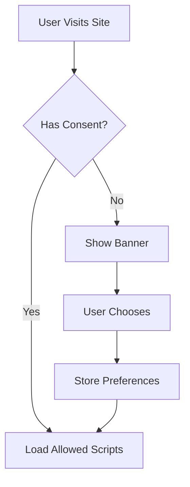

# Gestion du consentement aux cookies

Le thème Zer0-Mistakes inclut un système de consentement aux cookies conforme au RGPD/CCPA avec des contrôles d'autorisation granulaires.


La bannière apparaît jusqu'à ce qu'un visiteur fasse un choix ; « Gérer les cookies » ouvre une fenêtre modale pour des bascules granulaires d'analyse/marketing. Le consentement conditionne le chargement des outils d'analyse, de sorte que rien n'est suivi tant que le visiteur n'a pas donné son accord.

## Vue d'ensemble

Le système de consentement aux cookies offre :

- **Conformité en matière de confidentialité** : conforme au RGPD et au CCPA
- **Contrôles granulaires** : options de consentement par catégorie
- **Stockage persistant** : persistance du consentement pendant 365 jours
- **Intégration Bootstrap** : interface modale native

## Démarrage rapide

### Activer le consentement aux cookies

La bannière de consentement est incluse automatiquement. Configurez-la dans `_config.yml` :

```yaml
cookie_consent:
  enabled: true
  categories:
    - necessary
    - analytics
    - marketing
```

## Fonctionnement

### Flux de consentement



### Catégories de cookies

| Catégorie | Objectif | Requis |
|----------|---------|----------|
| `necessary` | Fonctionnalité essentielle | Oui |
| `analytics` | Suivi d'utilisation (PostHog, GA) | Non |
| `marketing` | Publicité, suivi | Non |
| `preferences` | Paramètres utilisateur | Non |

## Configuration

### Configuration de base

```yaml
cookie_consent:
  enabled: true
  position: bottom  # bottom, top
  theme: light      # light, dark, auto
  expires: 365      # days
```

### Configuration des catégories

```yaml
cookie_consent:
  categories:
    necessary:
      name: "Essential"
      description: "Required for the website to function"
      required: true
    analytics:
      name: "Analytics"
      description: "Help us understand how you use our site"
      required: false
      default: false
```

### Intégration avec les outils d'analyse

```yaml
# PostHog only loads with analytics consent
posthog:
  enabled: true
  require_consent: true

# Google Analytics with consent
google_analytics:
  tracking_id: UA-XXXXXXXX-X
  require_consent: true
```

## Personnalisation de la bannière

### Contenu textuel

```yaml
cookie_consent:
  text:
    message: "We use cookies to improve your experience."
    accept: "Accept All"
    decline: "Decline"
    settings: "Cookie Settings"
    save: "Save Preferences"
```

### Mise en forme

Remplacez les styles dans votre CSS :

```css
/* Custom banner styling */
.cookie-consent-banner {
  background: var(--bs-dark);
  color: var(--bs-light);
}

.cookie-consent-btn {
  border-radius: var(--bs-border-radius);
}
```

## API JavaScript

### Vérifier le consentement

```javascript
// Check if category is consented
if (CookieConsent.hasConsent('analytics')) {
  // Load analytics
}

// Get all consents
const consents = CookieConsent.getConsents();
```

### Écouter les changements

```javascript
document.addEventListener('cookieConsent:update', function(e) {
  const { category, consented } = e.detail;
  console.log(`${category}: ${consented}`);
});
```

### Contrôle programmatique

```javascript
// Show settings modal
CookieConsent.showSettings();

// Revoke all consent
CookieConsent.revokeAll();

// Grant specific category
CookieConsent.grant('analytics');
```

## Intégration de la politique de confidentialité

Reliez votre politique de confidentialité :

```yaml
cookie_consent:
  privacy_policy: /privacy-policy/
  show_policy_link: true
```

La bannière de consentement inclura un lien vers votre politique de confidentialité.

## Fonctionnalités de conformité

### Exigences du RGPD

- ✅ Consentement préalable avant les cookies non essentiels
- ✅ Choix granulaires par catégorie
- ✅ Retrait facile du consentement
- ✅ Informations claires sur la confidentialité
- ✅ Aucune case pré-cochée

### Exigences du CCPA

- ✅ Option « Ne pas vendre »
- ✅ Lien vers l'avis de confidentialité
- ✅ Mécanisme de désinscription
- ✅ Enregistrement du consentement

## Bonnes pratiques

### Cookies essentiels uniquement

N'exigez jamais de consentement pour :

- Les cookies de session
- Les jetons d'authentification
- La protection CSRF
- La répartition de charge

### Descriptions claires

```yaml
categories:
  analytics:
    description: |
      We use analytics cookies to understand how you use our site. 
      This helps us improve your experience. We use PostHog, which 
      is privacy-focused and GDPR compliant.
```

### Audits réguliers

1. Examinez l'utilisation des cookies chaque trimestre
2. Mettez à jour les descriptions des catégories
3. Testez le flux de consentement
4. Vérifier le blocage des scripts

## Dépannage

### La bannière ne s'affiche pas

1. Vérifier `cookie_consent.enabled: true`
2. Effacer les cookies du navigateur
3. Vérifier que l'include est présent

### Les scripts se chargent sans consentement

1. Encapsuler les scripts dans des vérifications de consentement
2. Utiliser des includes conditionnels
3. Vérifier les exigences de catégorie

### Le consentement ne persiste pas

1. Vérifier l'expiration des cookies
2. Vérifier l'accès à localStorage
3. Tester en navigation privée

## Ressources associées

- [PostHog Analytics](/docs/features/posthog-analytics/)
- [Politique de confidentialité](/privacy-policy/)
- [Google Analytics](/docs/analytics/google-analytics/)

## Voir aussi

- [[Features]]
- [[PostHog Analytics]]
- [[Google Analytics]]
