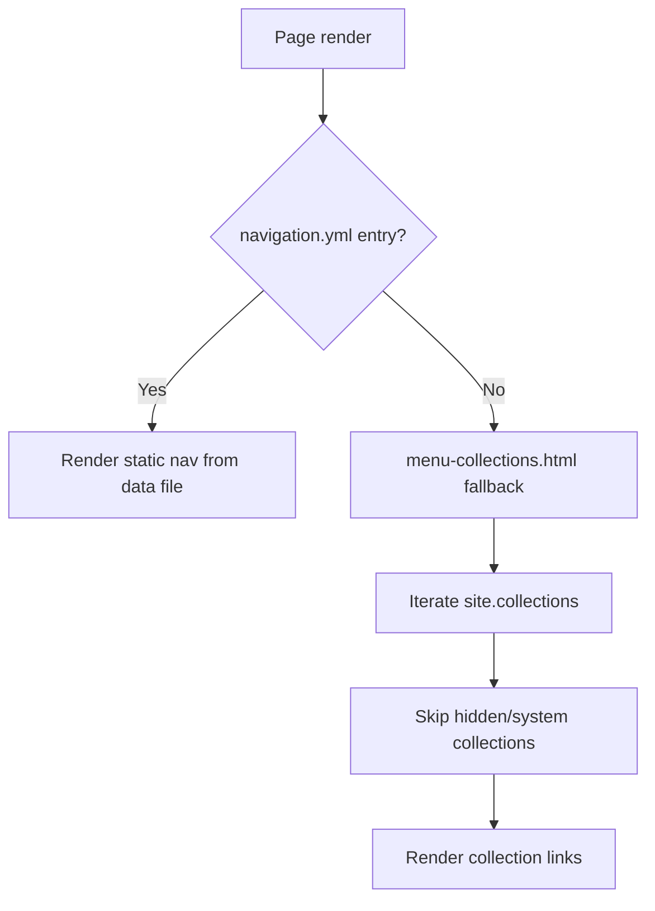

# Navigation dynamique basée sur les collections

zer0-mistakes fournit un **repli de navigation sans configuration** : lorsqu'aucune entrée `_data/navigation.yml` personnalisée n'existe pour la barre de navigation, le thème découvre automatiquement vos collections Jekyll et génère un menu de navigation fonctionnel au premier lancement.


## Pourquoi cela existe

Les nouveaux sites n'ont pas encore de données de navigation. Sans ce repli, les visiteurs verraient une barre de navigation vide. Le repli dynamique génère automatiquement des liens utiles afin que chaque nouveau site démarre avec une structure navigable.

## Fonctionnement



### Includes clés

| Fichier | Rôle |
|---|---|
| `_includes/navigation/navbar.html` | Barre de navigation principale — vérifie les données, se rabat sur les collections |
| `_includes/navigation/menu-collections.html` | Génère un lien par collection |

### Logique de la barre de navigation (simplifiée)

```liquid

  

  

```

## Configurer une navigation statique

Une fois prêt à figer le menu, créez `_data/navigation.yml` :

```yaml
main:
  - title: "Home"
    url: "/"
  - title: "Docs"
    url: "/docs/"
  - title: "Posts"
    url: "/posts/"
```

Le repli est silencieusement désactivé dès que ce fichier est présent.

## Exclure des collections du repli

Les collections préfixées par `_` dans la configuration du site peuvent être masquées en définissant `output: false` ou en les ajoutant à la liste d'exclusion à l'intérieur de `menu-collections.html` :

```liquid

  ...

```

## Navigation latérale

La barre latérale utilise une clé `_data/navigation.yml` distincte (`docs`, `sidebar`, etc.) et n'est pas affectée par le repli dynamique. Consultez le guide [Navigation latérale](/docs/features/sidebar-navigation/) pour plus de détails.

## Voir aussi

- [Navigation latérale](/docs/features/sidebar-navigation/)
- [Navigation modulaire ES6](/docs/features/navigation-architecture/)

## Voir aussi

- [[Features]]
- [[Navigation]]
