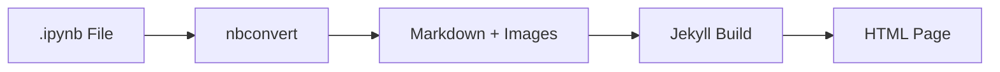

# Intégration des notebooks Jupyter

Le thème Zer0-Mistakes offre une prise en charge complète des notebooks Jupyter avec compatibilité GitHub Pages grâce à une conversion automatisée avant la génération.


## Vue d'ensemble

Fonctionnalités clés :

- **Compatible GitHub Pages** : utilise une conversion avant la génération (aucun plugin personnalisé)
- **Conversion automatisée** : workflow GitHub Actions au push
- **Contenu riche** : code, équations, graphiques, tableaux, images
- **Design responsive** : styles Bootstrap 5

## Fonctionnement



1. Les notebooks sont stockés dans `pages/_notebooks/`
2. Le script de conversion s'exécute pendant la génération
3. Des fichiers Markdown sont générés avec un front matter
4. Les images sont extraites vers `assets/images/notebooks/`
5. Jekyll produit le HTML final

## Démarrage rapide

### Ajouter un notebook

1. Placez le fichier `.ipynb` dans `pages/_notebooks/` :

```text
pages/_notebooks/
├── data-analysis.ipynb
└── machine-learning-intro.ipynb
```

1. Convertissez les notebooks :

```bash
# Using Docker
docker-compose exec jekyll ./scripts/convert-notebooks.sh

# Or locally (requires nbconvert)
./scripts/convert-notebooks.sh
```

1. Consultez à `/notebooks/your-notebook-name/`

## Script de conversion

### Utilisation de base

```bash
# Convert all notebooks
./scripts/convert-notebooks.sh

# Dry run (preview only)
./scripts/convert-notebooks.sh --dry-run

# Force reconvert all
./scripts/convert-notebooks.sh --force

# List notebooks
./scripts/convert-notebooks.sh --list
```

### Ce qu'il fait

1. Trouve les fichiers `.ipynb` dans `pages/_notebooks/`
2. Exécute `jupyter nbconvert --to markdown`
3. Extrait les images vers `assets/images/notebooks/`
4. Ajoute le front matter Jekyll
5. Crée une entrée dans la collection

## Mise en page des notebooks

Les notebooks utilisent une mise en page spécialisée :

```yaml
# _config.yml
defaults:
  - scope:
      path: "pages/_notebooks"
      type: "notebooks"
    values:
      layout: "notebook"
      permalink: /notebooks/:basename/
```

### Fonctionnalités de la mise en page

- Affichage des métadonnées (auteur, date, kernel)
- Navigation entre les notebooks
- Lien de téléchargement du fichier `.ipynb` original
- Intégration des commentaires
- Tableaux et images responsives

## Styles

### Cellules de code

```css
/* Input cells */
.notebook-input {
  background: var(--bs-code-bg);
  border-left: 3px solid var(--bs-primary);
  padding: 1rem;
}

/* Output cells */
.notebook-output {
  background: var(--bs-light);
  border-left: 3px solid var(--bs-success);
  padding: 1rem;
}

/* Execution count */
.notebook-prompt {
  color: var(--bs-secondary);
  font-family: monospace;
}
```

### Tableaux

```css
/* Dataframe tables */
.notebook-table {
  overflow-x: auto;
}

.notebook-table table {
  border-collapse: collapse;
  width: 100%;
}
```

### Images

```css
/* Plot outputs */
.notebook-image img {
  max-width: 100%;
  height: auto;
}
```

## Intégration de MathJax

Les équations s'affichent automatiquement :

**Math en ligne** :

```latex
The equation $E = mc^2$ is famous.
```

**Math en bloc** :

```latex
$$
\int_0^\infty e^{-x^2} dx = \frac{\sqrt{\pi}}{2}
$$
```

## GitHub Actions

### Conversion automatisée

```yaml
# .github/workflows/convert-notebooks.yml
on:
  push:
    paths:
      - 'pages/_notebooks/**/*.ipynb'

jobs:
  convert:
    runs-on: ubuntu-latest
    steps:
      - uses: actions/checkout@v4
      - name: Convert notebooks
        run: ./scripts/convert-notebooks.sh
      - name: Commit changes
        run: |
          git add pages/_notebooks/*.md assets/images/notebooks/
          git commit -m "Convert notebooks" || true
          git push
```

## Configuration

### Configuration Jekyll

```yaml
# _config.yml
collections:
  notebooks:
    output: true
    permalink: /notebooks/:basename/

defaults:
  - scope:
      type: notebooks
    values:
      layout: notebook
      mathjax: true
      toc: true
```

### Cibles Makefile

```makefile
# Convert all notebooks
convert-notebooks:
 ./scripts/convert-notebooks.sh

# Preview conversion
convert-notebooks-dry-run:
 ./scripts/convert-notebooks.sh --dry-run
```

## Dépannage

### La conversion échoue

1. Vérifiez que nbconvert est installé :

   ```bash
   pip install nbconvert
   ```

2. Vérifiez que le notebook est un JSON valide
3. Vérifiez la présence de caractères spéciaux dans le chemin

### Les images ne s'affichent pas

1. Vérifiez que les images sont extraites vers `assets/images/notebooks/`
2. Vérifiez les chemins des images dans le Markdown généré
3. Régénérez le site Jekyll

### Les équations ne s'affichent pas

1. Assurez-vous que `mathjax: true` figure dans le front matter
2. Vérifier que le script MathJax est chargé
3. Vérifier la syntaxe des équations

### Débordement des tableaux

Ajoutez un conteneur responsive :

```html
<div class="table-responsive">
  {{ table_content }}
</div>
```

## Voir aussi

- [Mathématiques MathJax](/docs/features/mathjax-math/)
- [Coloration syntaxique](/docs/jekyll/code-highlighting/)
- [Diagrammes Mermaid](/docs/features/mermaid-diagrams/)

## Référence technique

Pour les détails d'implémentation (pipeline de conversion Docker, configuration nbconvert, styles SCSS, workflow GitHub Actions) :

- [Jupyter Notebooks → docs/features/jupyter-notebooks.md](https://github.com/bamr87/zer0-mistakes/blob/main/docs/features/jupyter-notebooks.md)

## Voir aussi

- [[Features]]
- [[Mermaid Diagrams]]
- [[MathJax Math]]
