# Diagrammes Mermaid pour les sites Jekyll

Les diagrammes Mermaid sont activés avec un seul indicateur de front matter et un bloc de code standard : aucun plugin côté serveur ni dépendance CDN, car le moteur de rendu est fourni avec le thème.

**Compatible GitHub Pages** — Fonctionne sans plugins personnalisés côté serveur !

**Ce que vous allez faire :** transformer un bloc de code ` ```mermaid ` en un diagramme rendu, zoomable, qui suit le mode couleur et le skin de votre site.

**Prérequis :**

- Une page construite avec ce thème (n'importe quelle mise en page)
- Une définition Mermaid — essayez-en une d'abord dans le [Live Editor](https://mermaid.live/)

Chaque diagramme d'une page est rendu sous forme de figure avec sa propre barre d'outils. Survolez le diagramme ci-dessous (ou touchez-le sur un téléphone) pour voir les contrôles :

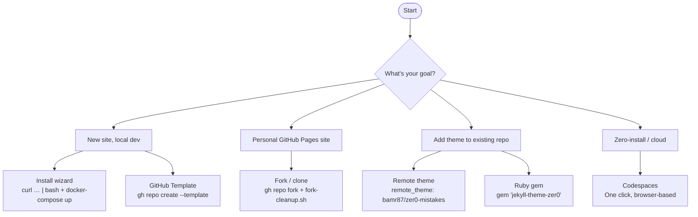

La légende sous le diagramme provient de sa ligne `accTitle` — voir [Légendes et noms accessibles](#captions-and-accessible-names).

## Démarrage rapide

### Étape 1 : Activer Mermaid sur votre page

Ajoutez `mermaid: true` au front matter de votre page :

```yaml
---
title: "My Documentation Page"
mermaid: true
---
```

### Étape 2 : Écrire votre diagramme

Utilisez des blocs de code Markdown natifs avec `mermaid` comme langage :

````markdown
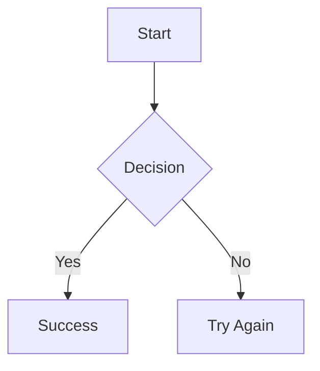
````

**C'est tout !** Le diagramme est rendu automatiquement.

### Vérifier

Rechargez la page. Le bloc de code est remplacé par une figure bordée contenant le diagramme ; le survol révèle la barre d'outils dans le coin supérieur droit. Si vous voyez toujours le texte brut, consultez la section [Dépannage](#troubleshooting).

---

## Ce dont bénéficie chaque diagramme

Chaque ` ```mermaid ` block becomes a `<figure>` avec un SVG rendu et une petite barre d'outils. Rien de plus à écrire — c'est le même bloc que vous écririez pour GitHub.

### La barre d'outils

| Contrôle | Icône | Fonction |
|---------|------|--------------|
| Zoom arrière / Zoom avant | <i class="bi bi-zoom-out" aria-hidden="true"></i><span class="visually-hidden">loupe avec moins</span> <i class="bi bi-zoom-in" aria-hidden="true"></i><span class="visually-hidden">loupe avec plus</span> | Met le diagramme à l'échelle par paliers de 25 % (50 %–400 %). Une fois plus grand que son cadre, faites glisser pour vous déplacer ou faites défiler. |
| Réinitialiser le zoom | <i class="bi bi-arrow-counterclockwise" aria-hidden="true"></i><span class="visually-hidden">flèche anti-horaire</span> | Retour à l'ajustement à la largeur. |
| Afficher en plein écran | <i class="bi bi-arrows-fullscreen" aria-hidden="true"></i><span class="visually-hidden">quatre flèches vers l'extérieur</span> | Ouvre le diagramme en plein écran — la solution pour un diagramme large trop petit sur un téléphone. `Esc` le ferme. |
| Copier la source du diagramme | <i class="bi bi-clipboard" aria-hidden="true"></i><span class="visually-hidden">presse-papiers</span> | Copie le texte Mermaid dans le presse-papiers, afin que les lecteurs puissent le coller dans le Live Editor. |
| Télécharger en SVG | <i class="bi bi-download" aria-hidden="true"></i><span class="visually-hidden">flèche de téléchargement</span> | Enregistre le diagramme rendu, avec l'arrière-plan de la page intégré afin qu'un export en mode sombre reste lisible. |

La barre d'outils apparaît au survol ou au focus clavier sur ordinateur, et se place au-dessus du diagramme sur les appareils tactiles.

### Raccourcis clavier

Tabulez jusqu'à un diagramme (son cadre est focalisable, et aussi défilable), puis :

| Touche | Action |
|-----|--------|
| `+` / `=` | Zoom avant |
| `-` | Zoom arrière |
| `0` | Réinitialiser le zoom |
| `F` | Ouvrir le plein écran |
| `Esc` | Fermer le plein écran |
| `Ctrl` + molette de défilement | Zoom (le défilement simple fait toujours défiler la page) |

### Légendes et noms accessibles

Les directives d'accessibilité de Mermaid servent à la fois de légende de la figure et de nom pour les lecteurs d'écran :

````markdown
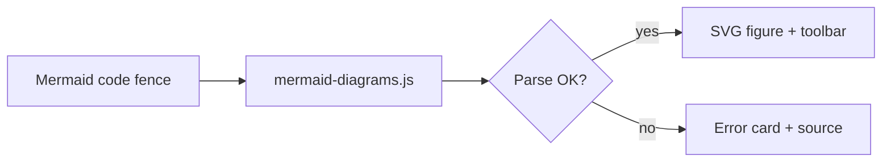
````


- `accTitle` devient la légende visible et le nom accessible du cadre du diagramme (le `aria-label` sur la région défilable) ; Mermaid l'inscrit également dans le `<title>` du SVG.
- `accDescr` est transmis au moteur de rendu de Mermaid, qui l'insère en tant que `<desc>` du SVG, lu par les lecteurs d'écran.
- Sans `accTitle`, le diagramme est nommé selon son type (« Organigramme », « Diagramme de séquence », …).

### Les couleurs suivent votre thème

Les couleurs des diagrammes ne sont configurées **nulle part**. Elles sont dérivées au moment du rendu à partir des design tokens du thème (`--bs-primary`, `--bs-body-bg`, `--zer0-color-*`), de sorte qu'un diagramme correspond à ce que le lecteur regarde : mode clair ou sombre, n'importe quel skin, et n'importe quelle surcharge `theme_color`. Changez le mode couleur avec le bouton de la barre de navigation et regardez le diagramme ci-dessus se réafficher.

Le style par nœud (`classDef`, `style`) fonctionne toujours — le thème ne surcharge plus les couleurs SVG avec `!important`.

### Quand un diagramme comporte une faute de frappe

Une erreur de syntaxe ne vide pas la page ni ne déverse de texte SVG brut. La figure indique ce qui n'a pas fonctionné et garde la source visible, et le contrôle *Copier* fonctionne toujours pour que vous puissiez la coller directement dans le Live Editor. Le diagramme ci-dessous est intentionnellement cassé (un seul `->` là où Mermaid a besoin de `-->`) :

```mermaid
graph TD
    A[Start] -> B[Broken arrow]
```

### Sans JavaScript

Le bundle Mermaid intégré et le script du thème se chargent tous deux avec `defer`, de sorte qu'ils ne bloquent jamais la page. Si JavaScript n'est pas disponible, ou si le script ne parvient pas à se charger, le bloc reste un bloc de code normal et lisible — la définition n'est jamais masquée.

---

## Configuration

### Configuration du site

Tout ce qui se trouve sous `mermaid:` dans `_config.yml` est optionnel :

```yaml
mermaid:
  src: '/assets/vendor/mermaid/mermaid.min.js'   # vendored, no CDN
  security_level: strict   # strict | loose
  toolbar: true            # zoom / fullscreen / copy / download controls
  fullscreen: true         # allow the fullscreen view
  download: true           # allow "Download as SVG"
```

| Clé | Par défaut | Notes |
|-----|---------|-------|
| `src` | `/assets/vendor/mermaid/mermaid.min.js` | Chemin vers le bundle Mermaid. Actualisez-le avec `npm run vendor:mermaid` (dans le conteneur : `docker-compose exec jekyll npm run vendor:mermaid`). Pour actualiser tous les assets intégrés d'un coup (Bootstrap, icônes, Mermaid), exécutez `./scripts/vendor-install.sh`. |
| `security_level` | `strict` | `strict` nettoie le texte des diagrammes. Utilisez `loose` uniquement si vous avez besoin de callbacks `click` ou de HTML dans les étiquettes — cela désactive ce nettoyage, gardez-le donc `strict` lorsque les diagrammes peuvent provenir de contenu non fiable. |
| `toolbar` | `true` | Définissez `false` pour afficher des diagrammes nus sans contrôles. |
| `fullscreen` | `true` | Définissez `false` pour supprimer le contrôle plein écran. |
| `download` | `true` | Définissez `false` pour supprimer le contrôle d'export SVG. |

Les étiquettes de la barre d'outils sont traduites avec le reste de l'interface via `_data/ui-text.yml` (clés `diagram_*`).

Consultez [Assets Bootstrap et icônes intégrés](/docs/features/vendored-assets/) pour le workflow complet d'actualisation des assets.

### Comment ça fonctionne

1. **Indicateur de front matter** — `mermaid: true` active Mermaid sur la page
2. **Chargement conditionnel** — les scripts ne se chargent que sur les pages qui l'activent, et ne bloquent jamais le rendu
3. **Rendu côté client** — aucun plugin côté serveur requis
4. **Habillage de figure** — `assets/js/mermaid-diagrams.js` convertit chaque bloc en figure, l'affiche, et le réaffiche lorsque le mode de couleur ou l'habillage change

---

## Types de diagrammes

### 1. Organigrammes

Le type de diagramme le plus courant pour documenter les processus et les workflows.

**Directions :**

- `TD` / `TB` — De haut en bas
- `BT` — De bas en haut
- `LR` — De gauche à droite
- `RL` — De droite à gauche

````markdown
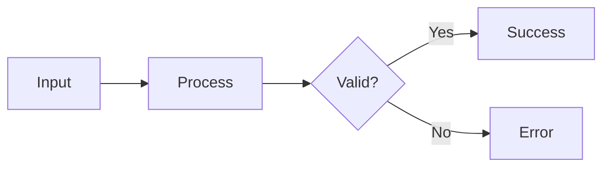
````


**Formes de nœuds :**

| Syntaxe | Forme | Cas d'usage |
|--------|-------|----------|
| `A[Text]` | Rectangle | Actions, étapes |
| `A(Text)` | Arrondi | Processus |
| `A([Text])` | Stade | Début/Fin |
| `A{Text}` | Losange | Décisions |
| `A((Text))` | Cercle | Terminaux, connecteurs |
| `A[[Text]]` | Sous-routine | Sous-processus |
| `A[(Text)]` | Cylindre | Base de données |

**Types de liens :**

| Syntaxe | Description |
|--------|-------------|
| `-->` | Flèche |
| `---` | Ligne |
| `-.->` | Flèche pointillée |
| `==>` | Flèche épaisse |
| `--\|Text\|-->` | Flèche avec étiquette |

### 2. Diagrammes de séquence

Parfaits pour documenter les appels d'API, les interactions utilisateur et la communication système.

````markdown
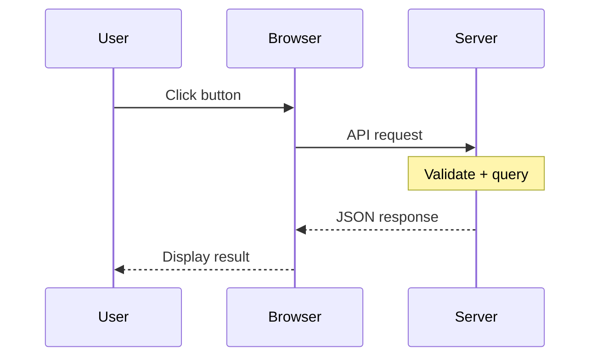
````


**Types de flèches :**

| Syntaxe | Description |
|--------|-------------|
| `->>` | Ligne pleine avec pointe de flèche |
| `-->>` | Ligne pointillée avec pointe de flèche |
| `-x` | Ligne pleine avec croix |
| `--x` | Ligne pointillée avec croix |
| `-)` | Ligne pleine avec flèche ouverte |

### 3. Diagrammes de classes

Documentez l'architecture du code et les relations.

````markdown
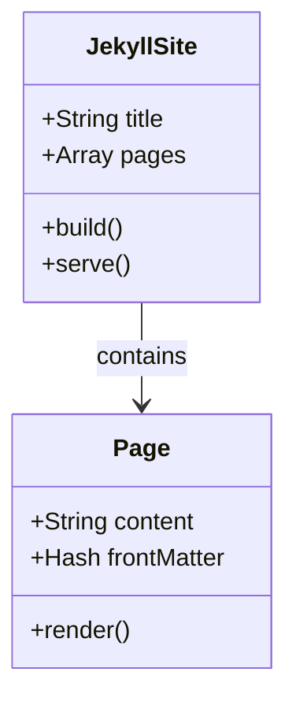
````


### 4. Diagrammes d'états

Modélisez les machines à états et les workflows.

````markdown
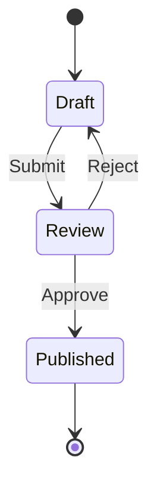
````


### 5. Diagrammes entité-association

Documentez les schémas de base de données.

````markdown
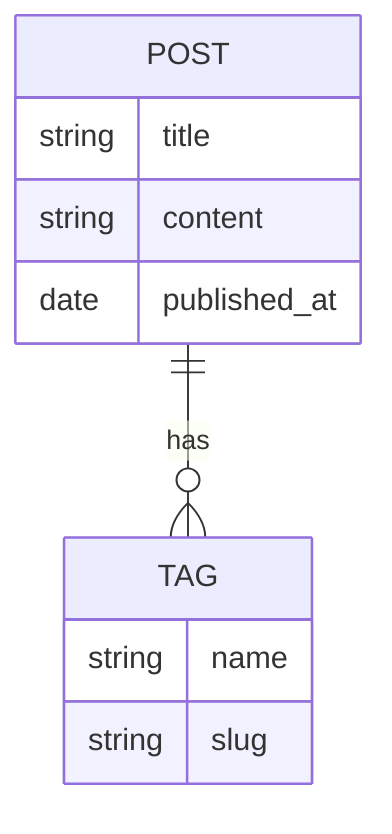
````


### 6. Diagrammes circulaires

Visualisez les distributions de données.

````markdown
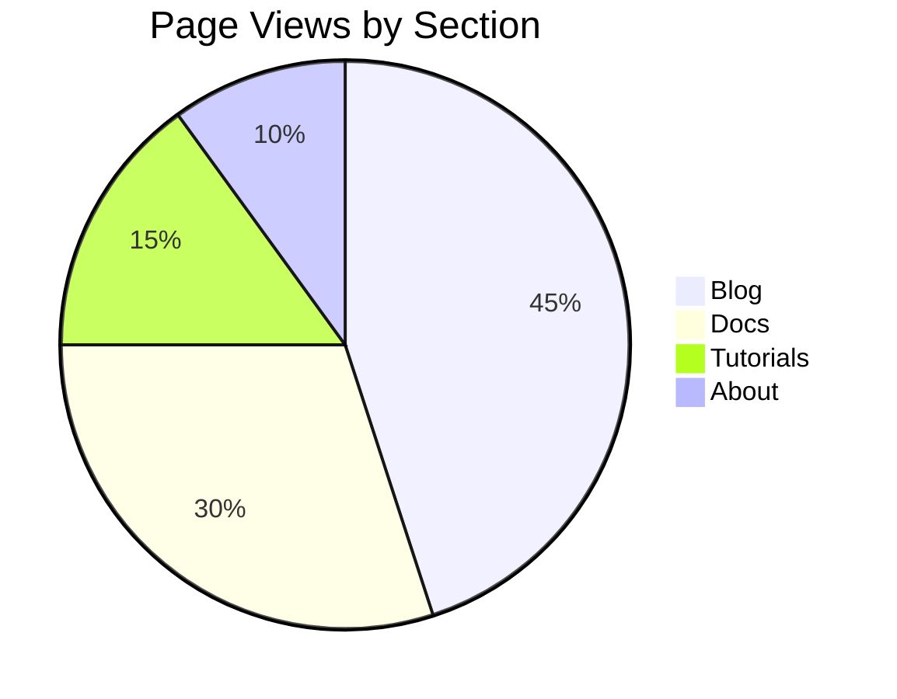
````


### 7. Diagrammes de Gantt

Chronologies et calendriers de projet.

````markdown
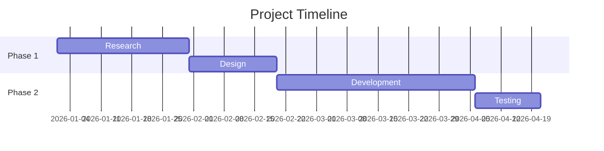
````

Une version plus riche illustre les balises de statut et le formatage des axes :

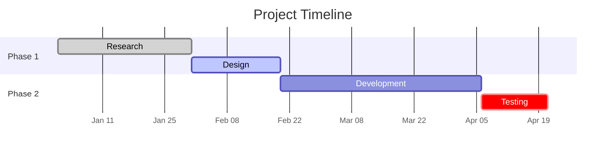

Les balises `done`, `active` et `crit` reprennent les couleurs discrète, d'accentuation et de danger du thème ; `axisFormat` et `tickInterval` évitent que les étiquettes d'axe se chevauchent sur les écrans étroits.

### 8. Graphes Git

Visualisez les branches et les commits Git.

````markdown

````

```mermaid
gitGraph
    commit
    branch feature
    checkout feature
    commit
    commit
    checkout main
    merge feature
    commit
```

---

## Options de syntaxe

### Option A : Markdown natif (recommandé)

Utilisez des blocs de code délimités — la solution la plus propre et la plus portable :

````markdown
```mermaid
graph TD
    A --> B
```
````

### Option B : div HTML

Utilisez `<div class="mermaid">` — fonctionne lorsque le Markdown ne convient pas :

```html
<div class="mermaid">
graph TD
    A --> B
</div>
```

### Quand utiliser chacune

| Cas d'usage | Recommandé |
|----------|-------------|
| Documentation classique | Blocs de code Markdown |
| Dans un include Liquid/HTML | div HTML |
| Imbriqué dans du HTML | div HTML |
| Portabilité maximale | Blocs de code Markdown |

Les deux formes produisent la même figure, la même barre d'outils et le même thème.

---

## Styles et thèmes

### Application automatique du thème

Vous ne choisissez pas de thème Mermaid. Le thème utilise le thème `base` de Mermaid et remplit ses variables à partir des jetons de design en direct du site, de sorte que :

- **Les modes de couleur clair / sombre / wizard** disposent chacun d'une palette lisible, et un changement de mode réaffiche chaque diagramme sur place.
- **Les habillages** (`data-theme-skin`) recolorent les bordures, les remplissages des nœuds et les couleurs de série selon la marque de l'habillage.
- **Les remplacements `theme_color`** dans `_config.yml` transitent par les mêmes jetons.
- Les couleurs de série des parts de camembert, des branches git et des cartes mentales se déploient à partir de la teinte de la marque, afin de rester distinctes dans les deux modes.

### Remplacer un diagramme unique

Une directive Mermaid en tête de bloc prime toujours pour ce diagramme — utile lorsqu'un graphique précis nécessite un rendu précis :

````markdown
```mermaid
%%{init: {'theme': 'forest'}}%%
graph LR
    A --> B
```
````

Le style par nœud fonctionne comme documenté par Mermaid :

````markdown
```mermaid
graph LR
    A[Normal] --> B[Highlighted]
    classDef hot fill:#fde68a,stroke:#b45309,color:#1f2937
    class B hot
```
````

```mermaid
graph LR
    A[Normal] --> B[Highlighted]
    classDef hot fill:#fde68a,stroke:#b45309,color:#1f2937
    class B hot
```

---

## API JavaScript

Le composant expose une petite API pour les pages qui injectent du contenu après le chargement (onglets, résultats de recherche, chat IA) :

```javascript
// Convert and render any new ```mermaid fences under a root element
window.zer0Mermaid.renderAll(document.querySelector('#tab-pane'));

// Re-derive the palette and re-render everything (after changing tokens)
window.zer0Mermaid.refresh();

// Render one element (a <pre>, <div class="mermaid">, or existing figure)
window.zer0Mermaid.render(element, 'graph TD; A --> B');

// Read a figure's source, or open it fullscreen
window.zer0Mermaid.getSource(figure);
window.zer0Mermaid.openFullscreen(figure);
```

Événements : `zer0:diagram-rendered` se déclenche sur chaque figure (`detail.ok`, `detail.type`, `detail.error`) ; `zer0:diagrams-ready` se déclenche sur `document` une fois un lot terminé (`detail.count`, `detail.failed`).

---

## Dépannage

### Le diagramme ne s'affiche pas

| Symptôme | Solution |
|---------|----------|
| Code brut affiché | Ajoutez `mermaid: true` au front matter |
| Carte jaune « could not be rendered » | Corrigez la syntaxe indiquée sur la carte — le message pointe la ligne fautive. Vérifiez-la dans l'[éditeur en direct](https://mermaid.live/) |
| Le script ne se charge pas | Vérifiez que `mermaid.src` dans `_config.yml` pointe vers le bundle intégré (`/assets/vendor/mermaid/mermaid.min.js`) |
| Diagramme minuscule sur un téléphone | Les diagrammes larges se réduisent pour s'adapter. Utilisez la commande plein écran ou zoomez |
| Aucune barre d'outils visible | Elle apparaît au survol / au focus clavier sur ordinateur. Définissez `mermaid.toolbar: true` si elle a été désactivée |
| Les couleurs semblent incorrectes après un changement de mode | Le diagramme se réaffiche lors des changements `data-bs-theme` / `data-theme-skin` ; si vous définissez les jetons depuis du JS personnalisé, appelez `window.zer0Mermaid.refresh()` |

### Erreurs de syntaxe courantes

```text
Wrong: graph TD A -> B      (single arrow)
Right: graph TD A --> B     (double arrow)

Wrong: graph TD A[Text]B    (no arrow between nodes)
Right: graph TD A[Text] --> B
```

`graph TD` et `flowchart TD` sont équivalents : `flowchart` est le mot-clé actuel, `graph` un alias hérité que Mermaid accepte encore.

### Tester en local

```bash
# Start Jekyll dev server
docker-compose up

# Check browser console for errors
# Open http://localhost:4000/your-page
```

---

## Accessibilité

- Chaque diagramme est un `<figure>` ; `accTitle` devient son `<figcaption>` et son nom accessible.
- Le cadre du diagramme est une région focalisable et pilotable au clavier (voir les [raccourcis](#keyboard-shortcuts)), de sorte qu'un diagramme plus large que la page n'est jamais piégé derrière un défilement à la souris uniquement.
- Les boutons de la barre d'outils sont de véritables `<button>` avec des libellés ; le niveau de zoom et le retour de copie sont annoncés via une région live discrète.
- La vue plein écran est un `<dialog>` natif : le focus y est piégé, `Esc` la ferme, et le focus revient au contrôle qui l'a ouverte.
- Les couleurs de série sont choisies à une luminosité fixe par mode de couleur, afin que les parts de camembert et les branches adjacentes restent distinguables.

---

## Bonnes pratiques

1. **N'activez que si nécessaire** — utilisez `mermaid: true` uniquement sur les pages comportant des diagrammes
2. **Donnez un `accTitle` aux diagrammes** — c'est la légende, le nom accessible et le nom de fichier d'un export SVG
3. **Gardez les diagrammes simples** — les diagrammes complexes ralentissent le rendu
4. **Testez dans l'éditeur en direct** — utilisez d'abord [mermaid.live](https://mermaid.live/)
5. **Ajoutez des descriptions** — les diagrammes complexes nécessitent des explications textuelles
6. **Utilisez des libellés clairs** — évitez les abréviations

---

## Ressources

- **Documentation Mermaid** : [mermaid.js.org](https://mermaid.js.org/)
- **Éditeur en direct** : [mermaid.live](https://mermaid.live/)
- **Référence de syntaxe** : [Syntaxe Mermaid](https://mermaid.js.org/intro/syntax-reference.html)
- **Directives d'accessibilité** : [Accessibilité Mermaid](https://mermaid.js.org/config/accessibility.html)
- **Configuration du thème** : [Thème Mermaid](https://mermaid.js.org/config/theming.html)

---

## Référence technique

Pour les détails d'implémentation (modifications de fichiers, suite de tests) :

- [Intégration Mermaid v2.0 → docs/implementation/feature-change-log.md](https://github.com/bamr87/zer0-mistakes/blob/main/docs/implementation/feature-change-log.md#mermaid-integration-v20-january-2025--v030) — décrit l'approche antérieure `<div class="mermaid">` ; la refonte actuelle des figures, de la barre d'outils et du thème par tokens est enregistrée sous `ZER0-013` dans `_data/features.yml`
- Fichiers de composants : `_includes/components/mermaid.html` (chargeur), `assets/js/mermaid-diagrams.js` (comportement), `_sass/components/_mermaid.scss` (styles)
- Test de régression : `test/visual/features/mermaid.spec.js`

## Voir aussi

- [[Features]]
- [[MathJax Math]]
- [[Jupyter Notebook Integration]]
