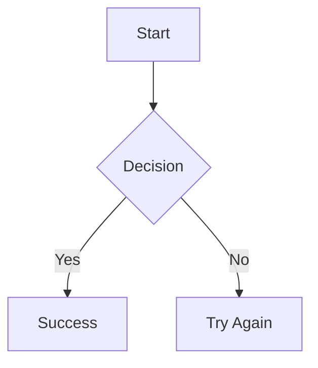
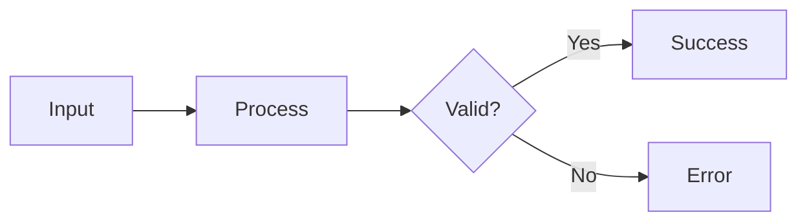
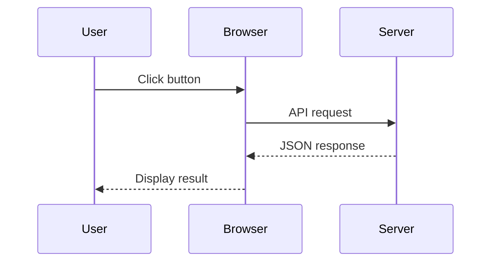
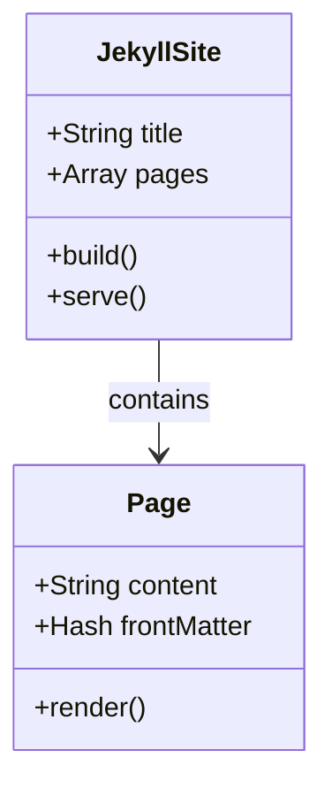
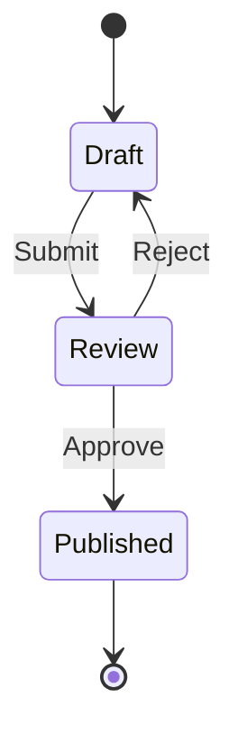
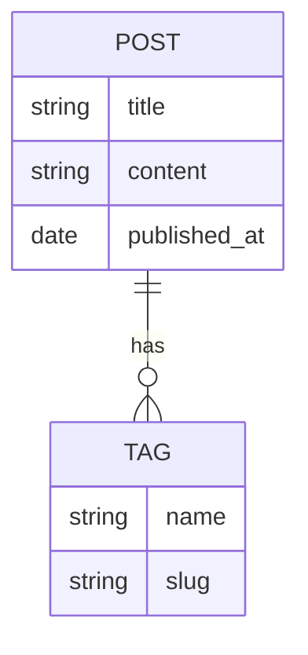
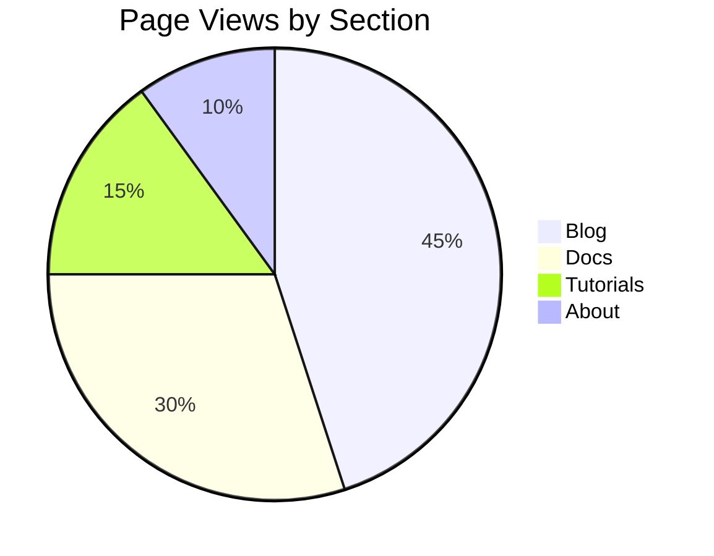
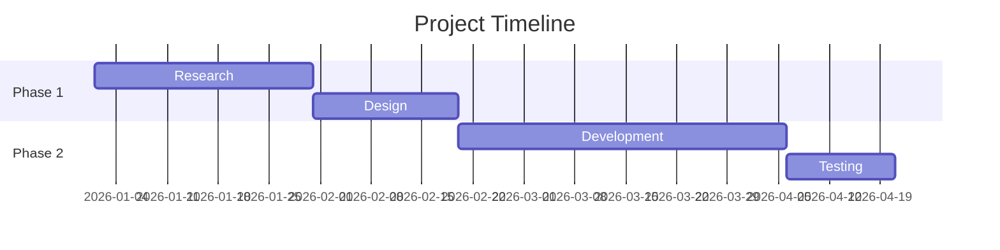
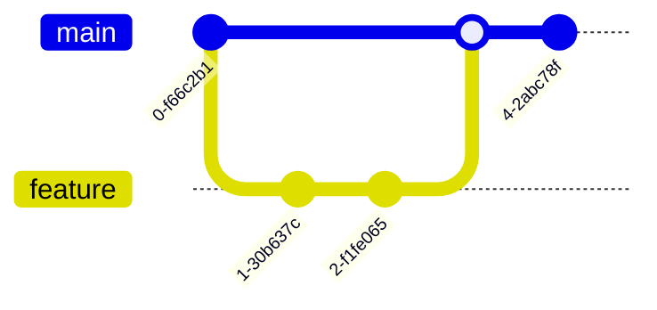

# Diagrammes Mermaid

> Créez des organigrammes, des diagrammes de séquence, des diagrammes de classes et bien plus dans votre site Jekyll grâce à la syntaxe textuelle simple de Mermaid.

**Compatible avec GitHub Pages** — Fonctionne sans plugins côté serveur personnalisés !

Un bloc ` ```mermaid ` est rendu sous forme de diagramme SVG dans le navigateur. Par exemple, l'organigramme « choisissez votre parcours » du guide de démarrage rapide est un bloc Mermaid que le thème rend automatiquement :


## Démarrage rapide

### Étape 1 : Activer Mermaid sur votre page

Ajoutez `mermaid: true` dans le front matter de votre page :

```yaml
---
title: "My Documentation Page"
mermaid: true
---
```

### Étape 2 : Écrire votre diagramme

Utilisez des blocs de code markdown natifs avec `mermaid` comme langage :

````markdown

````

**C'est tout !** Le diagramme est rendu automatiquement.

---

## Configuration

### Configuration du site

Le thème intègre la prise en charge de Mermaid dans `_config.yml` :

```yaml
mermaid:
  src: '/assets/vendor/mermaid/mermaid.min.js'
```

### Comment ça fonctionne

1. **Indicateur du front matter** — `mermaid: true` active Mermaid sur la page
2. **Chargement conditionnel** — Le script ne se charge que lorsque c'est nécessaire
3. **Rendu côté client** — Aucun plugin côté serveur requis
4. **Initialisation automatique** — Les diagrammes sont rendus au chargement de la page

---

## Types de diagrammes

### 1. Organigrammes

Le type de diagramme le plus courant pour documenter les processus et les flux de travail.

**Directions :**

- `TD` / `TB` — De haut en bas
- `BT` — De bas en haut
- `LR` — De gauche à droite
- `RL` — De droite à gauche

````markdown

````

**Formes de nœuds :**

| Syntaxe | Forme | Cas d'usage |
|--------|-------|----------|
| `A[Text]` | Rectangle | Actions, étapes |
| `A(Text)` | Arrondi | Processus |
| `A{Text}` | Losange | Décisions |
| `A((Text))` | Cercle | Début/Fin |
| `A⟦17⟧` | Stade | Sous-routines |
| `A[(Text)]` | Cylindre | Base de données |

**Types de liens :**

| Syntaxe | Description |
|--------|-------------|
| `-->` | Flèche |
| `---` | Ligne |
| `-.->` | Flèche pointillée |
| `==>` | Flèche épaisse |
| `--\|Text\|-->` | Flèche avec étiquette |

### 2. Diagrammes de séquence

Parfaits pour documenter les appels d'API, les interactions utilisateur et la communication entre systèmes.

````markdown

````

**Types de flèches :**

| Syntaxe | Description |
|--------|-------------|
| `->>` | Ligne pleine avec pointe de flèche |
| `-->>` | Ligne pointillée avec pointe de flèche |
| `-x` | Ligne pleine avec croix |
| `--x` | Ligne pointillée avec croix |
| `-)` | Ligne pleine avec flèche ouverte |

### 3. Diagrammes de classes

Documentez l'architecture du code et les relations.

````markdown

````

### 4. Diagrammes d'états

Modélisez les machines à états et les flux de travail.

````markdown

````

### 5. Diagrammes entité-association

Documentez les schémas de base de données.

````markdown

````

### 6. Diagrammes circulaires

Visualisez les répartitions de données.

````markdown

````

### 7. Diagrammes de Gantt

Chronologies et calendriers de projet.

````markdown

````

### 8. Graphiques Git

Visualisez les branches et les commits Git.

````markdown

````

---

## Options de syntaxe

### Option A : Markdown natif (recommandé)

Utilisez des blocs de code délimités — la solution la plus propre et la plus portable :

````markdown

````

### Option B : Div HTML

Utilisez `<div class="mermaid">` — fonctionne lorsque le markdown ne fonctionne pas :

```html
<div class="mermaid">
graph TD
    A --> B
</div>
```

### Quand utiliser chacune

| Cas d'usage | Recommandé |
|----------|-------------|
| Documentation normale | Blocs de code Markdown |
| Diagrammes complexes | Div HTML |
| Imbriqué dans du HTML | Div HTML |
| Portabilité maximale | Blocs de code Markdown |

---

## Styles et thèmes

### Thèmes disponibles

Mermaid prend en charge plusieurs thèmes intégrés :

```javascript
mermaid.initialize({
  theme: 'default'  // or 'forest', 'dark', 'neutral', 'base'
});
```

| Thème | Description |
|-------|-------------|
| `default` | Palette de couleurs bleue |
| `forest` | Palette de couleurs verte |
| `dark` | Fond sombre |
| `neutral` | Niveaux de gris |
| `base` | Style minimal |

---

## Dépannage

### Le diagramme ne s'affiche pas

| Symptôme | Solution |
|---------|----------|
| Code brut affiché | Ajoutez `mermaid: true` au front matter |
| Espace vide | Vérifiez la syntaxe dans l'[éditeur en ligne](https://mermaid.live/) |
| Script qui ne se charge pas | Vérifiez l'URL du CDN dans `_config.yml` |
| Rendu partiel | Recherchez les erreurs de syntaxe |

### Erreurs de syntaxe courantes

```markdown
Wrong: graph TD A -> B      (single arrow)
Right: graph TD A --> B     (double arrow)

Wrong: graph TD A[Text]B    (no arrow between nodes)
Right: graph TD A[Text] --> B

Wrong: flowchart TD         (in older Mermaid versions)
Right: graph TD             (more compatible)
```

### Test en local

```bash
# Start Jekyll dev server
docker-compose up

# Check browser console for errors
# Open http://localhost:4000/your-page
```

---

## Bonnes pratiques

1. **N'activez que si nécessaire** — utilisez `mermaid: true` uniquement sur les pages contenant des diagrammes
2. **Gardez les diagrammes simples** — les diagrammes complexes ralentissent le rendu
3. **Testez dans l'éditeur en ligne** — utilisez d'abord [mermaid.live](https://mermaid.live/)
4. **Ajoutez des descriptions** — les diagrammes complexes nécessitent des explications textuelles
5. **Utilisez des libellés clairs** — évitez les abréviations

---

## Ressources

- **Documentation Mermaid** : [mermaid.js.org](https://mermaid.js.org/)
- **Éditeur en ligne** : [mermaid.live](https://mermaid.live/)
- **Référence de syntaxe** : [Syntaxe Mermaid](https://mermaid.js.org/intro/syntax-reference.html)
- **Configuration des thèmes** : [Thèmes Mermaid](https://mermaid.js.org/config/theming.html)

---

*Ce guide fait partie de la documentation du [thème Jekyll Zer0-Mistakes](https://github.com/bamr87/zer0-mistakes).*

## Référence technique

Pour les détails d'implémentation (comment Mermaid v2 a été intégré, modifications de fichiers, suite de tests) :

- [Intégration de Mermaid → docs/implementation/feature-change-log.md](https://github.com/bamr87/zer0-mistakes/blob/main/docs/implementation/feature-change-log.md#mermaid-integration-v20)

## Voir aussi

- [[Features]]
- [[MathJax Math]]
- [[Jupyter Notebook Integration]]
