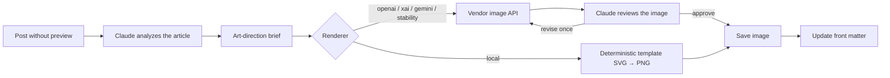

# Générateur d'images d'aperçu par IA

Générez automatiquement des images d'aperçu pour vos articles et vos pages à l'aide de services de génération d'images par IA.

## Vue d'ensemble

Le générateur d'images d'aperçu offre :

- **Claude comme directeur artistique et éditeur** : Claude analyse chaque article et rédige un brief d'image spécifique au sujet, puis examine l'image générée avec la vision — la régénérant une fois avec un prompt corrigé lorsque l'image représente mal l'article (via votre jeton OAuth Claude Code, votre clé API Anthropic ou la CLI `claude` connectée ; se replie élégamment sur un prompt basé sur un modèle en l'absence de l'un de ceux-ci)
- **Moteurs de rendu** : OpenAI (GPT Image ou DALL-E 3, par défaut), xAI (grok-2-image), Stability AI et Google Gemini
- **Moteur de modèles local** : bannières déterministes, gratuites et sans réseau pour le développement et l'intégration continue
- **Style configurable** : esthétique pixel art rétro par défaut, avec surcharges par auteur
- **Génération par lots** : traitez plusieurs articles à la fois (workers parallèles)

## Fonctionnement



## Configuration

### Configuration de base

```yaml
# _config.yml
preview_images:
  enabled: true
  provider: openai  # renderer: openai, xai, stability, gemini, local
```

### Configuration complète

```yaml
preview_images:
  enabled: true
  provider: openai            # renderer: openai, xai, stability, gemini, local
  model: gpt-image-2          # empty = renderer default (gpt-image-2, grok-2-image, ...)
  size: 1536x1024             # raster vendors adapt per model (DALL-E 3: 1792x1024)
  quality: auto               # auto for GPT Image; standard/hd for DALL-E 3
  style: "retro pixel art, 8-bit video game aesthetic, vibrant colors"
  style_modifiers: "pixelated, retro gaming style, CRT screen glow effect"
  output_dir: assets/images/previews
  prompt_engine: claude       # Claude analyzes the article (template = built-in)
  review_engine: claude       # Claude reviews the render (none = skip)
  assets_prefix: /assets
  auto_prefix: true
  collections:                # engine default if omitted
    - posts
    - docs
    - quickstart
```

Les valeurs ci-dessus correspondent au fichier `_config.yml` fourni. `collections` vaut par défaut `[posts, quickstart, docs]` dans le moteur (`scripts/lib/preview_generator.py`) lorsqu'elle est omise.

### Identifiants

Le moteur de rendu a besoin de sa propre clé (par défaut : openai) :

```bash
export OPENAI_API_KEY="sk-..."       # openai (also powers --enhance)
export XAI_API_KEY="xai-..."         # xai
export STABILITY_API_KEY="sk-..."    # stability
export GEMINI_API_KEY="..."          # gemini
```

L'orchestration Claude (analyse d'article + examen d'image) accepte l'UN des éléments suivants, dans l'ordre — elle est facultative et se replie sur le prompt basé sur un modèle sans examen :

```bash
# 1. Claude Code OAuth token (recommended — from `claude setup-token`)
export CLAUDE_CODE_OAUTH_TOKEN="sk-ant-oat01-..."

# 2. Short-lived Bearer token
export ANTHROPIC_AUTH_TOKEN="..."

# 3. Anthropic API key (console.anthropic.com)
export ANTHROPIC_API_KEY="sk-ant-..."

# 4. Nothing — a logged-in `claude` CLI is used automatically.
```

## Utilisation

### Génération manuelle

Exécutez le script de génération :

```bash
# Generate for all posts without previews
./scripts/generate-preview-images.sh

# Generate for specific post
./scripts/generate-preview-images.sh --file pages/_posts/2025-01-25-my-post.md

# Dry run (preview what would be generated)
./scripts/generate-preview-images.sh --dry-run
```

### Dans les templates

Le rendu est du Liquid pur via l'include `components/preview-image.html` du thème (fonctionne sous le mode sécurisé de la gem `github-pages` — aucun plugin personnalisé requis) :

```liquid

```

### Dans le front matter

```yaml
---
title: "My Post Title"
preview: /images/previews/ai-preview-image-generator.png
---
```

## Orchestration Claude

Claude ne dessine jamais l'image — il la dirige. Deux étapes encadrent chaque moteur de rendu raster (toutes deux activées par défaut ; toutes deux ignorées élégamment sans identifiant Claude) :

- **Analyse** (`prompt_engine: claude`) : Claude lit l'article (titre,
description, tags, extrait) et rédige un brief artistique spécifique au sujet — une scène concrète qui représente le contenu, composée pour une bannière large dans votre style configuré, avec une règle stricte d'absence de texte.
- **Examen** (`review_engine: claude`) : après que le moteur de rendu a produit le PNG,
Claude l'inspecte avec la vision. S'il représente mal l'article, rompt le style ou contient du texte illisible, Claude rédige un prompt corrigé et le moteur régénère une fois ; sinon l'image est approuvée.

Avec un abonnement Claude Pro/Max (jeton OAuth Claude Code ou CLI `claude` connectée), l'orchestration ne coûte rien de plus ; seul le moteur de rendu facture par image.

## Moteurs de rendu

### OpenAI (GPT Image / DALL-E 3) — par défaut

Meilleure qualité raster. Le modèle par défaut est GPT Image ; DALL-E 3 est également pris en charge. OpenAI alimente aussi le mode `--enhance` (`/v1/images/edits`) :

```yaml
preview_images:
  provider: openai
  model: gpt-image-2    # default; or dall-e-3, dall-e-2
  size: 1536x1024       # GPT Image landscape; DALL-E 3 also takes 1792x1024
  quality: auto         # auto for GPT Image; standard/hd for DALL-E 3
```

### xAI (Grok)

Utilise `grok-2-image` via l'API compatible OpenAI de xAI. Définissez `provider: xai` et fournissez `XAI_API_KEY` :

```yaml
preview_images:
  provider: xai
```

### Stability AI

Définissez `provider: stability` et fournissez `STABILITY_API_KEY`. Le moteur appelle l'endpoint Stable Diffusion XL 1024 en 1024x1024 — il n'y a pas de clé `engine`/`size` distincte à définir pour ce fournisseur :

```yaml
preview_images:
  provider: stability
  # Uses STABILITY_API_KEY; generates 1024x1024 via Stable Diffusion XL
```

### Google Gemini

Utilise `gemini-2.5-flash-image`. Définissez `provider: gemini` et fournissez `GEMINI_API_KEY` (aistudio.google.com) :

```yaml
preview_images:
  provider: gemini
```

### Local (modèle)

Gratuit, sans API et sans réseau. Le fournisseur `local` génère un SVG déterministe de paysage rétro (initialisé à partir du slug de l'article) et le rasterise en PNG — le même article obtient toujours la même bannière, ce qui le rend idéal pour le développement et l'intégration continue. L'analyse/l'examen par Claude est ignoré (la sortie est déterministe) :

```yaml
preview_images:
  provider: local
```

## Personnalisation du style

### Style par défaut

Par défaut, le générateur produit du pixel art rétro :

```yaml
style: "retro pixel art, 8-bit video game aesthetic, vibrant colors, nostalgic"
style_modifiers: "pixelated, retro gaming style, CRT screen glow effect"
```

### Style professionnel

```yaml
style: "professional, modern, clean, minimalist design"
style_modifiers: "corporate, business, elegant, high quality"
```

### Style artistique

```yaml
style: "watercolor painting, artistic, creative"
style_modifiers: "hand-painted, artistic texture, vibrant colors"
```

### Personnalisé par article

```yaml
---
title: "My Technical Post"
preview_style: "technical diagram, blueprint style, clean lines"
---
```

## Spécifications des images

### Tailles recommandées

| Plateforme | Taille | Ratio |
|----------|------|--------|
| Open Graph | 1200×630 | 1.91:1 |
| Twitter | 1200×600 | 2:1 |
| DALL-E 3 | 1792×1024 | 1.75:1 |

### Répertoire de sortie

Images enregistrées dans :

```text
assets/images/previews/
├── post-slug-preview.png
├── another-post-preview.png
└── ...
```

## Génération automatique

### GitHub Actions

Ajoutez à un workflow CI (la génération est pilotée par script, jamais intégrée au build Jekyll) :

```yaml
- name: Generate preview images
  env:
    CLAUDE_CODE_OAUTH_TOKEN: ${{ secrets.CLAUDE_CODE_OAUTH_TOKEN }}
    # or OPENAI_API_KEY for --provider openai
  run: ./scripts/generate-preview-images.sh
```

## Considérations de coût

### Orchestration Claude

- Couvert par un abonnement Claude Pro/Max lors de l'utilisation d'un jeton
  OAuth Claude Code ou du CLI `claude` ; l'usage par clé API est facturé aux tarifs de jetons Anthropic standard
- L'analyse représente un petit appel texte par image ; la révision est un appel de vision (plus
  un rendu supplémentaire lorsqu'une révision est demandée)

### OpenAI DALL-E 3

- Qualité standard : ~0,04 $ par image
- Qualité HD : ~0,08 $ par image

### Conseils budgétaires

1. Utilisez le fournisseur `local` pendant le développement (gratuit, déterministe)
2. Générez uniquement pour les articles publiés
3. Générez par lots périodiquement
4. Mettez en cache les images générées

## Dépannage

### Clé API introuvable

```bash
# Verify key is set
echo $OPENAI_API_KEY

# Set in current session
export OPENAI_API_KEY="sk-..."
```

### Échec de la génération

1. Vérifiez la validité de la clé API
2. Vérifiez le quota de l'API
3. Vérifiez la connexion réseau
4. Consultez les journaux d'erreurs

### Chemin d'image incorrect

1. Vérifiez la configuration `assets_prefix`
2. Vérifiez que `output_dir` existe
3. Vérifiez le chemin dans le front matter

### Les images ne s'affichent pas

1. Vérifiez que le fichier existe au chemin indiqué
2. Vérifiez que le build Jekyll inclut les assets
3. Videz le cache du navigateur
4. Vérifiez l'assistant d'URL relative

## Voir aussi

- [Balises méta SEO](/docs/seo/meta-tags/)
- [Documentation de l'API OpenAI](https://platform.openai.com/docs/guides/images)

## Référence technique

Pour les détails d'implémentation (architecture multi-fournisseurs, intégration xAI Grok, flux de génération) :

- [Générateur d'images de prévisualisation → docs/implementation/preview-image-generator.md](https://github.com/bamr87/zer0-mistakes/blob/main/docs/implementation/preview-image-generator.md)

## Voir aussi

- [[Features]]
- [[SEO]]
