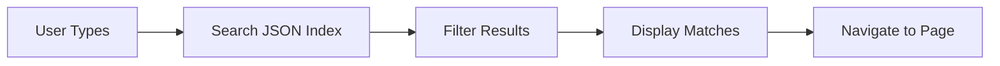

# Recherche sur le site

Fonctionnalité de recherche côté client avec une interface modale Bootstrap et une activation par raccourci clavier.


Ouvrez-la depuis l'icône de recherche dans la barre de navigation (ou appuyez sur <kbd>/</kbd>), saisissez une requête, et les correspondances apparaissent instantanément — l'index est construit au moment du build et la recherche s'effectue entièrement dans le navigateur, ce qui fonctionne sur GitHub Pages sans aucun backend.

## Aperçu

- **Côté client** : Aucun serveur requis
- **Index JSON** : Index de recherche pré-construit
- **Interface modale** : Interface modale Bootstrap
- **Raccourci clavier** : Appuyez sur `/` pour rechercher

## Fonctionnement



1. Jekyll construit `search.json` avec tout le contenu des pages
2. L'utilisateur ouvre la fenêtre de recherche (clic ou touche `/`)
3. JavaScript filtre l'index au fur et à mesure de la saisie
4. Les résultats renvoient vers les pages correspondantes

## Index de recherche

### Fichier généré

Jekyll génère `search.json` :

```json
[
  {
    "title": "Getting Started",
    "url": "/docs/getting-started/",
    "content": "Welcome to the documentation...",
    "categories": ["docs"],
    "tags": ["setup", "installation"]
  }
]
```

### Modèle d'index

```liquid
---
layout: null
---
[
  
    
    {
      "title": {{ page.title | jsonify }},
      "url": {{ page.url | jsonify }},
      "content": {{ page.content | strip_html | truncate: 500 | jsonify }},
      "categories": {{ page.categories | jsonify }},
      "tags": {{ page.tags | jsonify }}
    },
    
  
]
```

## Interface modale

### Structure HTML

```html
<div class="modal fade" id="siteSearchModal" tabindex="-1">
  <div class="modal-dialog modal-lg">
    <div class="modal-content">
      <div class="modal-header">
        <input type="search" 
               class="form-control" 
               data-search-input
               placeholder="Search documentation..."
               autofocus>
        <button type="button" class="btn-close" data-bs-dismiss="modal"></button>
      </div>
      <div class="modal-body">
        <div data-search-results></div>
        <div data-search-empty class="text-center text-muted py-4">
          Type to search...
        </div>
      </div>
    </div>
  </div>
</div>
```

### Bouton d'activation de la recherche

```html
<button class="btn btn-outline-secondary" data-search-toggle>
  <i class="bi bi-search"></i>
  <span class="d-none d-md-inline ms-1">Search</span>
  <kbd class="ms-2">/</kbd>
</button>
```

## JavaScript

### Contrôleur de recherche

```javascript
function initSearchModal() {
  const modalEl = document.getElementById('siteSearchModal');
  const searchInput = modalEl.querySelector('[data-search-input]');
  const resultsContainer = modalEl.querySelector('[data-search-results]');
  let searchIndex = null;

  // Load search index
  async function loadIndex() {
    const response = await fetch('/search.json');
    searchIndex = await response.json();
  }

  // Perform search
  function search(query) {
    if (!searchIndex || !query) return [];
    
    const terms = query.toLowerCase().split(' ');
    return searchIndex.filter(item => {
      const content = `${item.title} ${item.content}`.toLowerCase();
      return terms.every(term => content.includes(term));
    });
  }

  // Render results
  function renderResults(results) {
    if (results.length === 0) {
      resultsContainer.innerHTML = '<p class="text-muted">No results found.</p>';
      return;
    }
    
    resultsContainer.innerHTML = results.map(item => `
      <a href="${item.url}" class="search-result d-block p-2 rounded">
        <strong>${item.title}</strong>
        <small class="d-block text-muted">${item.url}</small>
      </a>
    `).join('');
  }

  // Event listeners
  searchInput.addEventListener('input', () => {
    renderResults(search(searchInput.value));
  });

  // Load index when modal opens
  modalEl.addEventListener('show.bs.modal', loadIndex);
}
```

### Raccourci clavier

```javascript
document.addEventListener('keydown', (e) => {
  // Skip if typing in input
  if (e.target.matches('input, textarea')) return;
  
  if (e.key === '/') {
    e.preventDefault();
    const modal = bootstrap.Modal.getOrCreateInstance(
      document.getElementById('siteSearchModal')
    );
    modal.show();
  }
});
```

## Configuration

### Exclure des pages

```yaml
# In page front matter
search: false
```

```liquid

  // Include in index

```

### Champs de l'index

Contrôlez ce qui est indexé :

```liquid
"content": {{ page.content | strip_html | truncate: 1000 | jsonify }}
```

## Mise en forme

```css
.search-result {
  text-decoration: none;
  color: inherit;
  transition: background-color 0.2s;
}

.search-result:hover {
  background-color: var(--bs-light);
}

.search-result.active {
  background-color: var(--bs-primary);
  color: white;
}
```

## Navigation au clavier

```javascript
// Arrow key navigation in results
searchInput.addEventListener('keydown', (e) => {
  const results = resultsContainer.querySelectorAll('.search-result');
  const active = resultsContainer.querySelector('.search-result.active');
  
  if (e.key === 'ArrowDown') {
    e.preventDefault();
    const next = active ? active.nextElementSibling : results[0];
    if (next) {
      active?.classList.remove('active');
      next.classList.add('active');
    }
  }
  
  if (e.key === 'Enter' && active) {
    window.location.href = active.href;
  }
});
```

## Performance

### Chargement différé

Charger l'index uniquement lorsque nécessaire :

```javascript
let indexPromise = null;

function getIndex() {
  if (!indexPromise) {
    indexPromise = fetch('/search.json').then(r => r.json());
  }
  return indexPromise;
}
```

### Anti-rebond

```javascript
let timeout;
searchInput.addEventListener('input', () => {
  clearTimeout(timeout);
  timeout = setTimeout(() => {
    renderResults(search(searchInput.value));
  }, 150);
});
```

## Dépannage

### L'index ne se construit pas

1. Vérifiez que le modèle `search.json` existe
2. Vérifiez que le build Jekyll l'inclut
3. Recherchez d'éventuelles erreurs Liquid

### La recherche ne fonctionne pas

1. Vérifiez que `search.json` est accessible
2. Consultez la console du navigateur pour repérer les erreurs
3. Testez la validité du JSON

### Conflits de raccourcis clavier

1. Recherchez d'autres gestionnaires `/`
2. Vérifiez que l'ID de la fenêtre modale correspond
3. Testez dans différents navigateurs

## Voir aussi

- [Navigation au clavier](/docs/features/keyboard-navigation/)
- [Composants modaux](/docs/bootstrap/)

## Voir aussi

- [[Features]]
- [[Keyboard Navigation]]
