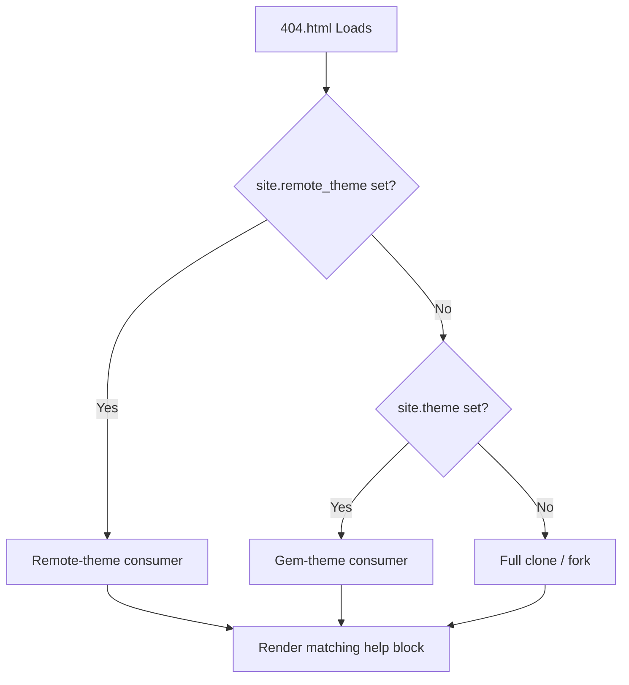

# 404 intelligente et détection de la configuration du site

La `404.html` de zer0-mistakes n'est pas un simple espace réservé « page introuvable ». Elle détecte la manière dont le site est déployé et propose au visiteur des conseils adaptés au contexte.


## Logique de détection



Le modèle Liquid examine `site.remote_theme`, `site.theme` et un petit ensemble de variables `site.github.*` que GitHub Pages injecte au moment de la construction.

## Implémentation

La 404 intelligente se trouve à la racine du dépôt :

```text
404.html
```

Variables Liquid clés utilisées :

| Variable | Rôle |
|---|---|
| `site.remote_theme` | Détecter le mode remote-theme |
| `site.theme` | Détecter le mode gem-theme |
| `site.github.owner_name` | Renvoyer vers le bon profil GitHub |
| `site.url` / `site.baseurl` | Construire des liens absolus vers la page d'accueil |

## Ce que voient les visiteurs

### Consommateur en remote-theme

```text
🔍 Page Not Found
This page doesn't exist on this site.
→ Return to home  → View the theme source on GitHub
```

### Clone / fork complet

```text
🔍 Page Not Found
It looks like this page was removed or the URL changed.
→ Return to home  → Browse the docs
```

## Personnaliser la 404

Remplacez uniquement ce fichier dans le dépôt de votre site :

```text
your-site/
└── 404.html   ← Your custom version takes precedence
```

La `404.html` du thème n'est utilisée que lorsqu'aucune substitution locale n'existe.

## Ressources associées

- [Guide de démarrage rapide](/docs/getting-started/quick-start/)
- [Modèle minimal](/docs/quickstart/bare-minimum/)

## Voir aussi

- [[Features]]
- [[Getting Started]]
