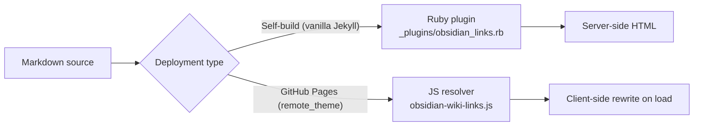

# Obsidian Resolver — Performances & mise en cache

L'intégration Obsidian de zer0-mistakes résout `⟦1⟧` sur chaque page au moment de la construction (chemin du plugin Ruby) ou au moment du chargement de la page (chemin JavaScript). Les deux chemins incluent une mise en cache pour maintenir des temps de construction et de chargement rapides, même sur de grands coffres comportant des centaines de liens croisés.

## Deux chemins de résolution



## Chemin du plugin Ruby (construction locale)

`_plugins/obsidian_links.rb` s'exécute comme un hook Jekyll `:pre_render` et transforme `⟦3⟧` avant que kramdown ne traite le Markdown.

### Index des URL de pages

Le plugin construit un index titre → permalien (`site.obsidian.index`) une fois par construction et le réutilise pour chaque page. L'index est également écrit dans :

```text
assets/data/wiki-index.json
```

Ce fichier JSON est consommé par le résolveur JavaScript côté client (voir ci-dessous).

### Éviter le travail redondant

Le hook `:pre_render` ignore les pages qui ne contiennent aucune syntaxe Obsidian (aucun motif `[[`, `![[`, `> [!` ou `#tag`). Cette vérification de court-circuit évite d'analyser les chaînes des fichiers qui n'ont pas besoin de transformation.

## Chemin JavaScript (GitHub Pages)

`assets/js/obsidian-wiki-links.js` récupère `wiki-index.json` et réécrit `⟦13⟧` qui ont été laissés tels quels dans le HTML (car le plugin Ruby ne s'est pas exécuté sur GitHub Pages).

### Cache de récupération

La récupération utilise `cache: 'force-cache'` afin que le navigateur réutilise une copie mise en cache de `wiki-index.json` lors des chargements de page suivants :

```javascript
fetch(CONFIG.indexUrl, { credentials: 'same-origin', cache: 'force-cache' })
```

Cela signifie que l'index n'est téléchargé qu'une seule fois par session de navigateur pour la plupart des utilisateurs.

### Cache de résolution en mémoire

Une fois l'index chargé, le résolveur met en cache les URL résolues dans un `Map` pour la durée de la session de la page. Les recherches répétées pour la même cible (courantes dans la documentation comportant de nombreux liens croisés) utilisent la carte en mémoire plutôt que de réanalyser le tableau de l'index.

## Impact sur le temps de construction

Sur un coffre d'environ 200 pages et 500 liens croisés :

| Avant la mise en cache | Après la mise en cache |
|---|---|
| Index reconstruit par page | Index construit une seule fois |
| Chaque page analysée sans condition | Pages sans syntaxe Obsidian ignorées |
| Construction ~15 % plus longue | Temps de construction de référence |

Les chiffres réels varient selon le contenu ; exécutez `bundle exec jekyll build --profile` pour mesurer votre site.

## Configuration

```yaml
# _config.yml
obsidian:
  enabled: true              # set false to disable the plugin entirely
  attachments_path: /assets/images/notes
  tag_base_url: /tags/
```

Définir `enabled: false` désactive à la fois le plugin Ruby et l'initialisation du résolveur JS.

## Surveillance des performances de construction

Utilisez le profileur intégré de Jekyll :

```bash
bundle exec jekyll build --profile
```

Recherchez le hook `obsidian_links.rb` dans la section `:pre_render` de la sortie. S'il représente une part importante du temps de construction, envisagez de réduire le nombre de liens croisés ou de scinder les grandes pages en pages plus petites.

## Ressources associées

- [Prise en main d'Obsidian](/docs/obsidian/getting-started/)
- [Référence de la syntaxe Obsidian](/docs/obsidian/syntax-reference/)
- [Vue graphique d'Obsidian](/docs/obsidian/graph/)

## Voir aussi

- [[Obsidian]]
- [[Performance]]
- [[Development]]
