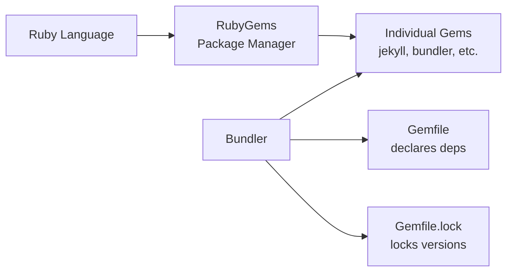

# Ruby 101

Cette page couvre les fondamentaux de Ruby dont vous avez besoin pour travailler avec le thème Jekyll Zer0-Mistakes — de l'installation des gems à la gestion des dépendances avec Bundler.

---

## Prérequis

Avant de commencer, assurez-vous d'avoir :

| Prérequis | Commande de vérification | Version minimale |
|-------------|---------------|-----------------|
| **Ruby** | `ruby --version` | 2.7.0+ |
| **RubyGems** | `gem --version` | 3.0+ |
| **Bundler** | `bundle --version` | 2.3+ |
| **Git** | `git --version` | toute version |

> **Astuce :** Si vous utilisez Docker pour le développement (`docker-compose up`), Ruby est déjà installé dans le conteneur — vous pouvez ignorer entièrement la configuration locale de Ruby.

---

## Comment Ruby, les Gems et Bundler s'articulent



| Concept | Ce qu'il fait |
|---------|--------------|
| **Ruby** | Le langage de programmation dans lequel Jekyll est écrit |
| **Gem** | Une bibliothèque Ruby empaquetée (comme les paquets `npm`) |
| **RubyGems** | Le gestionnaire de paquets intégré qui installe les gems |
| **Bundler** | Gère les versions de gems au niveau du projet via `Gemfile` |

---

## Gems

Une **gem** est une bibliothèque Ruby autonome distribuée via [rubygems.org](https://rubygems.org). Le thème Zer0-Mistakes lui-même est publié sous forme de gem : [`jekyll-theme-zer0`](https://rubygems.org/gems/jekyll-theme-zer0).

### Installer des gems globalement

```bash
# Install Bundler and Jekyll system-wide
gem install bundler jekyll
```

### Installer les dépendances du projet

Si vous exécutez depuis le dépôt, Bundler lit le `Gemfile` et installe tout :

```bash
bundle install
```

Cela crée (ou met à jour) `Gemfile.lock`, qui fige les versions exactes utilisées.

### Lister les gems installées

```bash
# All gems in the current bundle
bundle list

# Search for a specific gem
bundle list | grep jekyll
```

---

## Le Gemfile expliqué

Le `Gemfile` du projet déclare chaque dépendance. Voici une décomposition simplifiée :

```ruby
source "https://rubygems.org"       # Where to download gems

gemspec                             # Pull deps from .gemspec

gem "github-pages", ">= 228", group: :jekyll_plugins
gem "webrick"                       # Web server (Ruby 3.0+)
gem "jekyll-mermaid"                # Mermaid diagram support

group :development, :test do
  gem "html-proofer"                # Link & HTML checker
  gem "rspec"                       # Test framework
  gem "rubocop"                     # Linter
end
```

**Points clés :**

- `gemspec` charge les dépendances d'exécution depuis `jekyll-theme-zer0.gemspec`.
- Le groupe `:jekyll_plugins` est particulier — Jekyll charge automatiquement les gems qu'il contient.
- Les gems de développement/test sont ignorées en production (`bundle install --without development test`).

---

## Commandes courantes

### Aide-mémoire

```bash
# Install all dependencies
bundle install

# Update all gems to latest allowed versions
bundle update

# Update a single gem
bundle update jekyll

# Run any command through Bundler (ensures correct gem versions)
bundle exec jekyll serve

# Check for outdated gems
bundle outdated

# Show where a gem is installed
bundle info jekyll

# Clean unused gems
bundle clean --force
```

### Vérifier les versions

```bash
ruby --version            # e.g. ruby 3.2.2
gem --version             # e.g. 3.4.19
bundle --version          # e.g. Bundler version 2.4.19
bundle exec jekyll --version  # e.g. jekyll 3.10.0
```

---

## Fichiers clés

| Fichier | Rôle |
|------|---------|
| `Gemfile` | Déclare les dépendances de gems et les sources |
| `Gemfile.lock` | Verrouille les versions résolues exactes (à valider dans le dépôt !) |
| `jekyll-theme-zer0.gemspec` | Métadonnées de la gem du thème et dépendances d'exécution |
| `lib/jekyll-theme-zer0/version.rb` | Source unique de vérité pour la version du thème |

---

## Utiliser Ruby avec Docker

Lors du développement avec Docker, toutes les commandes Ruby s'exécutent dans le conteneur :

```bash
# Start the dev environment
docker-compose up

# Check Ruby version in container
docker-compose exec jekyll ruby --version

# Install/update gems inside container
docker-compose exec jekyll bundle install
docker-compose exec jekyll bundle update

# Build the site inside container
docker-compose exec -T jekyll bundle exec jekyll build \
  --config '_config.yml,_config_dev.yml'
```

> **Remarque :** Le conteneur Docker est préconfiguré — vous avez rarement besoin d'exécuter `bundle install` manuellement, sauf si vous modifiez le `Gemfile`.

---

## FAQ et dépannage

### Erreur « Could not find gem »

```bash
# Remove cached state and reinstall
rm -rf vendor/bundle .bundle
bundle install
```

### Erreurs de permission sur `gem install`

```bash
# Install gems to your home directory instead of system
gem install --user-install bundler jekyll

# Or use a version manager (recommended)
# rbenv: https://github.com/rbenv/rbenv
# asdf:  https://asdf-vm.com/
```

### « Bundler could not find compatible versions »

```bash
# Delete the lock file and let Bundler re-resolve
rm Gemfile.lock
bundle install
```

### Incompatibilité de version Jekyll (3.x vs 4.x)

La gem `github-pages` fige Jekyll en **3.x** pour la compatibilité avec GitHub Pages. C'est intentionnel — n'essayez pas de forcer Jekyll 4.x lorsque vous utilisez `github-pages`.

```bash
# Verify which Jekyll version is active
bundle exec jekyll --version
# Expected output: jekyll 3.10.x
```

### WEBrick manquant (Ruby 3.0+)

Ruby 3.0 a retiré WEBrick de la bibliothèque standard. Le Gemfile du projet l'inclut déjà, mais si vous voyez `cannot load such file -- webrick` :

```bash
gem install webrick
# Or ensure you run through Bundler:
bundle exec jekyll serve
```

---

## Étapes suivantes

- [Référence Ruby et Bundler](/docs/ruby/) — Approfondissement de la gestion des versions
- [Guide d'installation](/docs/installation/) — Configuration complète de l'environnement
- [Guide Jekyll](/docs/jekyll/) — Comprendre le générateur de site statique
- [Développement Docker](/docs/docker/) — Flux de travail basé sur des conteneurs

---

## Voir aussi

- [[Ruby]]
- [[Jekyll]]
- [[Installation]]
