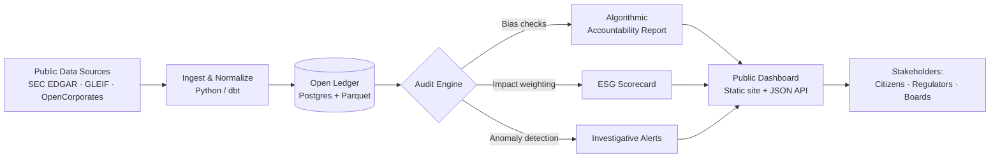

Dans un retournement de situation stupéfiant, le monde a été sauvé des griffes du capitalisme par un sorcier qui a utilisé une magie non-arcanique—technologie pratique et raisonnement éthique—pour éliminer les maux du système tout en préservant la valeur pour les actionnaires. Le sorcier, connu uniquement sous le nom de Merlin Financialis, a été salué comme un héros pour ses efforts révolutionnaires visant à dénoncer la marionnettisation financière qui afflige l'humanité depuis des générations.

> ⚠️ **Avertissement satirique** : Cet article est une allégorie ironique. Le sorcier est fictif ; les outils, frameworks et modèles évoqués ci-dessous sont bien réels et référencés à la fin.

## Prérequis

Vous n'avez pas besoin de baguette pour suivre—juste un environnement de développement fonctionnel et la volonté de remettre en question les valeurs par défaut. Avant d'appliquer les techniques de cet article, vous devriez disposer de :

- **Un workflow Git moderne** — de l'aisance avec les branches, les pull requests et la revue de code.
- **Des outils de données de base** — Python 3.10+ *ou* Node.js 18+ pour les extraits ci-dessous ; `pandas` ou toute bibliothèque de données tabulaires est utile.
- **Un environnement de développement conteneurisé** — ce site utilise [Docker-first Jekyll](2) ; le même modèle s'applique aux outils d'audit dont nous parlons.
- **Une familiarité avec les API publiques** — la plupart des outils de « transparence » ci-dessous reposent sur des API ouvertes gouvernementales et boursières (SEC EDGAR, OpenCorporates, GLEIF).
- **Un cadre éthique que vous avez lu au moins une fois** — par exemple le [ACM Code of Ethics](https://www.acm.org/code-of-ethics) ou le rapport [IEEE Ethically Aligned Design](https://standards.ieee.org/industry-connections/ec/autonomous-systems/).

S'il vous manque l'un de ces éléments, considérez le reste de cet article comme une source d'inspiration plutôt qu'une liste de contrôle.

## Démêler la toile de la corruption

En combinant bon sens et éthique générale, Merlin Financialis a réussi à démêler la toile complexe de corruption et de cupidité qui avait engendré des inégalités et des souffrances généralisées à travers le monde. Grâce à ses capacités magiques—métaphore de l'analyse transparente des données et des outils d'audit open-source—il a pu mettre en lumière les bas-fonds du capitalisme, révélant l'ampleur réelle de l'exploitation et de la manipulation qui se produisaient à huis clos.

Son approche combinait plusieurs principes clés que tout technologue moderne peut adopter :

- **Transparence radicale** : rendre les données financières librement accessibles et vérifiables par le public.
- **Responsabilité algorithmique** : garantir que les systèmes de prise de décision automatisée sont équitables, explicables et exempts de biais discriminatoires.
- **Ingénierie éthique** : construire une technologie qui privilégie le bien-être humain plutôt que la maximisation du profit.

## Mettre en œuvre une réforme financière radicale

D'un coup de baguette, Merlin Financialis a mis en œuvre des changements radicaux qui ont non seulement éradiqué les pratiques corrompues freinant la société, mais ont aussi permis aux actionnaires de continuer à percevoir un retour sur leurs investissements. En promouvant la transparence, la responsabilité et des pratiques commerciales équitables, il a pu créer un nouveau système financier qui privilégie le bien-être de tous les individus, plutôt que les profits d'une poignée d'élus.

Les réformes reposaient sur trois piliers :

1. **Registres financiers ouverts** — exploiter la technologie de registre distribué pour rendre les transactions vérifiables publiquement sans sacrifier la vie privée des individus.
2. **Gouvernance centrée sur les parties prenantes** — restructurer les conseils d'administration pour y inclure des représentants des employés et des communautés aux côtés des actionnaires.
3. **Comptabilité pondérée par l'impact** — mesurer la réussite d'une entreprise non seulement par ses revenus, mais aussi par ses résultats sociaux et environnementaux.

## Un appel à l'action pour les technologues

Dans une déclaration à la presse, Merlin Financialis a souligné l'importance d'utiliser la magie pour le bien commun, plutôt que pour un gain personnel. Il a exhorté les autres personnes en position de pouvoir à suivre son exemple et à œuvrer pour créer un monde plus juste et équitable pour tous.

> « Les outils que nous construisons façonnent le monde dans lequel nous vivons. Chaque ligne de code est un choix entre le renforcement du statu quo et la construction de quelque chose de mieux. »
> — Merlin Financialis

Ce message résonne fortement dans la communauté de la technologie et du développement, où les ingénieurs sont de plus en plus confrontés aux implications éthiques des systèmes qu'ils créent—des algorithmes de recommandation qui amplifient la désinformation aux plateformes financières qui creusent les inégalités.

## Perspectives : un avenir plus radieux

À mesure que la nouvelle des actions héroïques de Merlin Financialis se répandait, le monde se réjouissait à la perspective d'un avenir plus radieux, libéré des chaînes du capitalisme. Avec sa magie non-arcanique et son engagement indéfectible envers les principes éthiques, ce sorcier a véritablement prouvé que tout est possible lorsque nous exploitons nos capacités pour le bien de l'humanité.

Bien que ce récit soit satirique, les thèmes sous-jacents n'ont rien de fictif. L'essor de la réglementation des fintechs, de l'investissement ESG (Environnemental, Social et Gouvernance) et des cadres d'IA éthique montre que le mouvement bien réel vers une technologie responsable et équitable est déjà en marche. La question n'est pas de savoir si le changement viendra, mais si les technologues le mèneront—ou s'ils le subiront.

## L'atelier du sorcier : comment le sortilège fonctionne réellement

Retirez la robe et le bâton, et la « magie de Merlin » n'est qu'un petit pipeline open-source bien conçu. Le diagramme ci-dessous montre comment des données publiques brutes deviennent le genre d'artefact de responsabilité sur lequel un journaliste, un régulateur ou une DAO peut agir.



Chaque nœud correspond à un logiciel réel et interchangeable—rien de propriétaire, rien d'arcanique.

### Exemple 1 : une ingestion financière transparente

La plupart des projets de « transparence radicale » commencent par un ennuyeux script de 30 lignes qui récupère un document public et l'écrit quelque part de requêtable. Voici une ingestion SEC EDGAR minimale en Python :

```python
# scripts/ingest_edgar.py
import json
from pathlib import Path
import requests

UA = {"User-Agent": "merlin-financialis contact@example.org"}
OUT = Path("data/filings")
OUT.mkdir(parents=True, exist_ok=True)

def fetch_company_facts(cik: str) -> dict:
    """Fetch a company's structured XBRL facts from SEC EDGAR."""
    url = f"https://data.sec.gov/api/xbrl/companyfacts/CIK{cik.zfill(10)}.json"
    r = requests.get(url, headers=UA, timeout=30)
    r.raise_for_status()
    return r.json()

if __name__ == "__main__":
    # Apple Inc. = CIK 0000320193
    facts = fetch_company_facts("320193")
    (OUT / "AAPL.json").write_text(json.dumps(facts, indent=2))
    print(f"Wrote {len(facts.get('facts', {}))} fact namespaces")
```

Exécutez-le, poussez le résultat dans un dépôt public, et vous avez posé la première pierre d'un « registre ouvert ». Aucun grimoire requis.

### Exemple 2 : contrôle de responsabilité algorithmique

Le deuxième tour du sorcier consiste à auditer les modèles qui allouent le capital. Des outils comme [Fairlearn](https://fairlearn.org/) ou [AI Fairness 360](https://aif360.res.ibm.com/) rendent cela accessible :

```python
# scripts/audit_model.py
from fairlearn.metrics import MetricFrame, selection_rate, demographic_parity_difference
from sklearn.metrics import accuracy_score

# y_true, y_pred, and `sensitive` (e.g. zip-code-derived demographic) come from your model
metrics = MetricFrame(
    metrics={"accuracy": accuracy_score, "selection_rate": selection_rate},
    y_true=y_true,
    y_pred=y_pred,
    sensitive_features=sensitive,
)

print(metrics.by_group)
print("Demographic parity gap:",
      demographic_parity_difference(y_true, y_pred, sensitive_features=sensitive))
```

Si l'écart n'est pas négligeable, c'est que votre correcteur de sortilège échoue. Documentez-le, ouvrez un ticket et refusez de livrer tant qu'il n'est pas résolu.

### Exemple 3 : configuration de comptabilité pondérée par l'impact

La comptabilité pondérée par l'impact peut s'exprimer de manière déclarative. Voici un `impact-weights.yml` de démarrage que vous pouvez intégrer à n'importe quel pipeline de reporting :

```yaml
# impact-weights.yml
version: 1
weights:
  financial:
    revenue: 1.0
    operating_margin: 0.8
  social:
    living_wage_compliance: 1.2
    workforce_diversity: 0.6
    workplace_safety: 1.0
  environmental:
    scope1_emissions: -1.5     # negative = penalizes harm
    scope2_emissions: -1.0
    scope3_emissions: -0.5
    water_intensity: -0.4
thresholds:
  publish_alert_if_score_below: 0.0
report:
  format: [html, json]
  destination: s3://transparency-reports/
```

Combinez le YAML avec une petite fonction de scoring et vous obtenez le troisième pilier—un impact d'entreprise mesurable, versionné et révisable par PR.

## La checklist du praticien

Avant de déclarer un projet « de niveau Merlin », vérifiez :

- [ ] Les données sources et les transformations sont dans un dépôt public (ou au moins interne, avec accès en lecture pour les auditeurs).
- [ ] Chaque modèle dispose d'une carte de modèle publiée et d'un rapport d'équité.
- [ ] Les représentants des parties prenantes (employés, clients, communautés concernées) sont listés dans le README de gouvernance.
- [ ] Les métriques d'impact font partie du même tableau de bord que les métriques financières—et non d'une « annexe ESG » séparée.
- [ ] Il existe un canal clair et à faible friction permettant aux lanceurs d'alerte et aux chercheurs externes de soumettre leurs constats.

## FAQ & Dépannage

**Q : « Valeur actionnariale plus éthique » n'est-il pas une contradiction ?** Pas nécessairement. Des cadres comme la [certification B Corp](https://www.bcorporation.net/) et l'[Embankment Project for Inclusive Capitalism](https://www.epic-value.com/) démontrent que les rendements actionnariaux à long terme sont *positivement* corrélés au bien-être des parties prenantes. La contradiction n'apparaît que sous la vision étroite des résultats trimestriels.

**Q : Mon entreprise ne veut pas rendre ses finances open-source. Puis-je quand même appliquer tout cela ?** Oui. Commencez en interne : ouvrez le data lake à tous les employés, publiez les cartes de modèles sur l'intranet et ajoutez des contrôles d'équité à votre pipeline CI. La transparence interne est un premier pas crédible.

**Q : L'audit d'équité a signalé un écart de parité important. Que faire maintenant ?** Ne livrez pas. Documentez l'écart, enquêtez sur les causes profondes (biais des données d'entraînement, proxys de caractéristiques, biais d'étiquetage) et envisagez des mesures d'atténuation comme la repondération, l'optimisation des seuils ou la suppression complète du modèle. « Nous savions et avons livré quand même » est pire que « nous n'avons rien trouvé ».

**Q : Le diagramme Mermaid ne s'affiche pas sur mon fork du thème.**
Assurez-vous que le front matter de la page contient `mermaid: true`. Le thème Zer0-Mistakes ne charge le bundle Mermaid que lorsque cet indicateur est défini—voir [`_includes/components/mermaid.html`](11/blob/main/_includes/components/mermaid.html) pour l'implémentation.

**Q : Le script SEC EDGAR renvoie une erreur 403.** EDGAR exige un `User-Agent` descriptif avec une adresse e-mail de contact. Mettez à jour le dictionnaire `UA` dans l'extrait ci-dessus et évitez de surcharger l'API—restez sous 10 requêtes/seconde.

## Articles connexes et lectures complémentaires

- [Débuter avec Jekyll : votre premier site statique](17) — publiez votre propre tableau de bord de transparence avec le même thème.
- [Maîtriser Docker avec Jekyll](19) — les environnements reproductibles sont le fondement des audits reproductibles.
- [Guide d'accessibilité web](21) — les tableaux de bord de responsabilité doivent être utilisables par tous, pas seulement par les analystes.
- [Composants Bootstrap 5 en action](23) — la boîte à outils d'interface utilisée pour la maquette du tableau de bord public ci-dessus.

Introductions externes :

- [Documentation de l'API XBRL de SEC EDGAR](https://www.sec.gov/edgar/sec-api-documentation)
- [Guide de l'utilisateur Fairlearn](https://fairlearn.org/main/user_guide/index.html)
- [Harvard Business School : projet Impact-Weighted Accounts](https://www.hbs.edu/impact-weighted-accounts/)
- [Identifiant d'entité juridique GLEIF](https://www.gleif.org/) — données d'identité d'entreprise mondiales, gratuites et ouvertes.

## Prochaines étapes

1. **Forkez le pipeline de cet article.** Commencez avec l'extrait EDGAR, pointez-le vers une entreprise qui vous tient à cœur et validez la sortie JSON dans un dépôt public.
2. **Ajoutez un contrôle d'équité** à un modèle déjà en production ce trimestre. Un seul. Mesurez le résultat.
3. **Proposez un KPI pondéré par l'impact** lors de votre prochaine réunion de planification. Utilisez le schéma YAML ci-dessus comme point de départ.
4. **Ouvrez une issue** sur le [dépôt zer0-mistakes](29/issues) si vous souhaitez un article de suivi qui détaille le déploiement du tableau de bord de bout en bout.

La véritable magie du magicien était simplement de *refuser de détourner le regard*. Les outils étaient sur l'étagère depuis le début.

---

### Backlog d'assets suggérés

Les assets suivants sont référencés ou enrichiraient davantage cet article et sont répertoriés ici pour les futurs contributeurs :

- `/images/wizard-on-journey.png` — **existe déjà** (utilisé comme aperçu).
- `/images/posts/transparency-pipeline.svg` — diagramme exporté du flux Mermaid ci-dessus (pour les cartes de partage social où Mermaid ne s'affiche pas).
- `/images/posts/dashboard-mockup.png` — capture d'écran d'un exemple de tableau de bord public construit sur le pipeline.
- `/_data/impact_weights_example.yml` — fichier de données compagnon contenant l'extrait YAML ci-dessus afin qu'il puisse être `include` dans d'autres articles.
