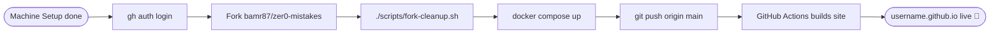

# Configuration GitHub

Authentifiez-vous auprès de GitHub, forkez le thème et déployez votre site sur GitHub Pages.



## Prérequis

- [Configuration de la machine](/quickstart/machine-setup/) terminée (Docker, Git, GitHub CLI)
- Un [compte GitHub](https://github.com/signup)

## Étape 1 — S'authentifier avec GitHub CLI

```bash
gh auth login
# → GitHub.com
# → HTTPS
# → Login with a web browser
# Copy the one-time code, press Enter, paste in the browser
```

Vérifiez :

```bash
gh auth status
```


## Étape 2 — Forker le dépôt


Forkez `bamr87/zer0-mistakes` dans votre compte. La solution la plus simple est de le nommer `<your-username>.github.io` afin que GitHub Pages effectue le déploiement sur votre domaine racine — sans `baseurl` nécessaire.

**Via GitHub CLI :**

```bash
gh repo fork bamr87/zer0-mistakes --clone
cd zer0-mistakes
```


**Ou via l'interface web GitHub :**

1. Rendez-vous sur [github.com/bamr87/zer0-mistakes](https://github.com/bamr87/zer0-mistakes)
2. Cliquez sur **Fork** → définissez le nom sur `<your-username>.github.io`
3. Cliquez sur **Create fork**, puis clonez :

```bash
git clone https://github.com/<your-username>/<your-username>.github.io.git
cd <your-username>.github.io
```


> Consultez [docs/installation/forking.md](https://github.com/bamr87/zer0-mistakes/blob/main/docs/installation/forking.md) pour le workflow complet fork → configuration → personnalisation.

## Étape 3 — Exécuter le script de nettoyage du fork

L'assistant interactif supprime le contenu spécifique au thème et configure le dépôt pour votre site :

```bash
./scripts/fork-cleanup.sh
```

Il vous demandera le titre de votre site, l'URL, le nom de l'auteur et d'autres paramètres de base, puis les inscrira dans `_config.yml`.


## Étape 4 — Lancer le serveur de développement

```bash
docker compose up
```

Rendez-vous sur [http://localhost:4000](http://localhost:4000) pour confirmer que votre site personnalisé fonctionne.

## Étape 5 — Activer GitHub Pages

Dans votre dépôt forké sur GitHub.com :

1. **Settings** → **Pages**
2. **Source** : Deploy from branch
3. **Branch** : `main` → `/` (root)
4. Cliquez sur **Save**


Après le premier push, GitHub Actions construit le site et celui-ci apparaît sur :

```text
https://<your-username>.github.io
```

## Étape 6 — Pousser vos modifications

```bash
git add _config.yml pages/          # stage by path, not `git add -A`
git commit -m "feat: initial site personalization"
git push origin main
```


Suivez le déploiement : onglet **Actions** → workflow **pages build and deployment**.

## Workflow Git pour le développement continu

```bash
# New feature branch
git checkout -b feat/my-feature

# Make changes, then stage the files you actually touched
git add pages/_posts/my-first-post.md
git commit -m "feat(posts): add first blog post"

# Push and open PR
git push origin feat/my-feature
gh pr create --fill
```

Fusionnez dans `main` pour déclencher un déploiement Pages.

## Dépannage

**Forker sous un nom de dépôt différent (pas `username.github.io`)**

Ajoutez `baseurl` à `_config.yml` :

```yaml
baseurl: "/repo-name"
url: "https://username.github.io"
```

**Échec de la construction Pages**

```bash
# Check the Actions tab in GitHub for build logs
# Common fix: ensure _config.yml has no YAML syntax errors
bundle exec jekyll build --config '_config.yml,_config_dev.yml' --trace
```

**`gh auth login` échoue**

Assurez-vous que le port 443 (HTTPS) est ouvert. Essayez le drapeau `--web` ou créez un [Personal Access Token](https://github.com/settings/tokens) et utilisez `gh auth login --with-token`.

**Incohérence du dépôt distant origin**

```bash
git remote -v                                       # verify remotes
git remote set-url origin https://github.com/<you>/<repo>.git
```

---

<div class="d-flex justify-content-between mt-5">
  <a href="/quickstart/jekyll-setup/" class="btn btn-outline-secondary">
    <i class="bi bi-arrow-left"></i> Retour : Configuration Jekyll
  </a>
  <a href="/quickstart/personalization/" class="btn btn-primary">
    Suivant : Personnalisation <i class="bi bi-arrow-right"></i>
  </a>
</div>
