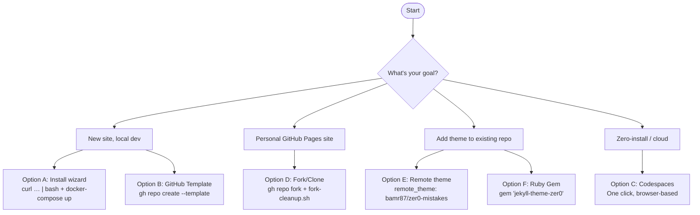

# Guide de démarrage rapide

Faites fonctionner votre site Jekyll **zer0-mistakes** en moins de 5 minutes. Choisissez le parcours qui correspond à votre objectif :



## ⚡ Démarrage le plus rapide (1 commande) {#fastest-start-1-command}

```bash
mkdir my-site && cd my-site
curl -fsSL https://raw.githubusercontent.com/bamr87/zer0-mistakes/main/install.sh | bash
docker-compose up
```

Votre site sera en ligne à l'adresse `http://localhost:4000`.


## Ce que vous obtenez

- **Environnement Docker** — configuration de développement cohérente sur macOS, Linux et Windows (WSL)
- **Bootstrap 5.3.3** — intégré, responsive, compatible mode sombre
- **Rechargement en direct** — le navigateur se met à jour à chaque enregistrement de fichier
- **Compatible GitHub Pages** — poussez vers `main`, le site se déploie automatiquement
- **Analytique respectueuse de la vie privée** — PostHog avec barrière de consentement, désactivée en dev

## Options d'installation {#installation-options}

| Parcours | Méthode | Idéal pour |
|------|--------|----------|
| **A** | Assistant d'installation (une ligne) | Nouveau site local |
| **B** | Modèle GitHub | Copie propre via l'interface ou le CLI GitHub |
| **C** | GitHub Codespaces | Dev sans installation, dans le navigateur |
| **D** | Fork/Clone | Site personnel `username.github.io` |
| **E** | Thème distant | Ajouter le thème à un dépôt existant |
| **F** | Gem Ruby | Flux de travail Bundler traditionnel |

### Option A — Assistant d'installation

```bash
mkdir my-site && cd my-site
curl -fsSL https://raw.githubusercontent.com/bamr87/zer0-mistakes/main/install.sh | bash
docker-compose up
```

### Option B — Modèle GitHub

1. Rendez-vous sur [github.com/bamr87/zer0-mistakes](https://github.com/bamr87/zer0-mistakes)
2. Cliquez sur **Use this template** → **Create a new repository**
3. Clonez votre nouveau dépôt et exécutez `docker-compose up`

Ou via le CLI :

```bash
gh repo create my-site --template bamr87/zer0-mistakes --clone
cd my-site && docker-compose up
```

### Option C — GitHub Codespaces

[](https://codespaces.new/bamr87/zer0-mistakes)

Ou : page du dépôt → **Code** → **Codespaces** → **Create codespace on main**.

### Option D — Fork/Clone (site personnel)

Forkez dans `<your-username>.github.io` pour obtenir votre propre site GitHub Pages :

```bash
gh repo fork bamr87/zer0-mistakes --clone
cd zer0-mistakes
./scripts/fork-cleanup.sh   # interactive config wizard
docker-compose up
```

Activez Pages : **Settings → Pages → Branch: main → Save**.

Consultez [docs/FORKING.md](https://github.com/bamr87/zer0-mistakes/blob/main/docs/installation/forking.md) pour le guide complet fork → configuration → personnalisation.

### Option E — Thème distant

```yaml
# _config.yml
remote_theme: "bamr87/zer0-mistakes"
plugins:
  - jekyll-remote-theme
```

Activez GitHub Pages dans les **Settings → Pages** de votre dépôt.

### Option F — Gem Ruby

```ruby
# Gemfile
gem "jekyll-theme-zer0"
```

```yaml
# _config.yml
theme: "jekyll-theme-zer0"
```

```bash
bundle install && bundle exec jekyll serve
```

## Guides de configuration {#essential-setup}

| Guide | Objectif | Durée | Difficulté |
|-------|---------|------|------------|
| **[Configuration de la machine](/quickstart/machine-setup/)** | Installer Docker, Git, GitHub CLI | 10 min | Débutant |
| **[Configuration de Jekyll](/quickstart/jekyll-setup/)** | Lancer le serveur de dev, créer du contenu | 5 min | Débutant |
| **[Configuration de GitHub](/quickstart/github-setup/)** | Forker, déployer sur GitHub Pages | 10 min | Intermédiaire |
| **[Personnalisation](/quickstart/personalization/)** | Configurer `_config.yml` pour votre site | 5 min | Débutant |

## Dépannage rapide

**Port 4000 déjà utilisé**

```bash
lsof -i :4000          # see what's running
docker-compose down    # stop any existing containers
docker-compose up      # restart
```

**Avertissements de plateforme Docker (Apple Silicon)**

C'est normal — `docker-compose.yml` définit déjà `platform: linux/amd64`. Le site fonctionne normalement.

**Erreurs de compilation Jekyll**

```bash
docker-compose exec jekyll bundle exec jekyll doctor
docker-compose exec jekyll bundle exec jekyll build --trace
```

**Validez votre configuration :**

```bash
docker-compose exec -T jekyll bundle exec jekyll build \
  --config '_config.yml,_config_dev.yml'
```

## Besoin d'aide ?

| Ressource | Objectif |
|----------|---------|
| [GitHub Issues](https://github.com/bamr87/zer0-mistakes/issues) | Rapports de bogues et support technique |
| [Discussions](https://github.com/bamr87/zer0-mistakes/discussions) | Questions-réponses de la communauté et demandes de fonctionnalités |
| [Guide d'installation](/docs/installation/) | Documentation de configuration approfondie |

---

Commencez par **[Configuration de la machine →](/quickstart/machine-setup/)** s'il s'agit de votre première fois, ou passez directement aux [Options d'installation](#installation-options) pour choisir votre parcours.
