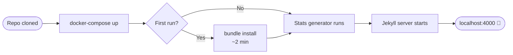

# Configuration de Jekyll

Démarrez votre serveur de développement Jekyll basé sur Docker et créez votre premier contenu. **Aucune installation locale de Ruby n'est nécessaire** — tout s'exécute à l'intérieur du conteneur.



## Prérequis

Complétez d'abord [Configuration de la machine](/quickstart/machine-setup/) (Docker Desktop, Git, GitHub CLI).

## Étape 1 — Cloner le dépôt

Si vous n'avez pas encore cloné :

```bash
gh repo clone bamr87/zer0-mistakes
cd zer0-mistakes
```

Ou, si vous avez utilisé l'assistant d'installation, vous êtes déjà dans le bon répertoire.

## Étape 2 — Démarrer le serveur de développement

```bash
docker-compose up
```

Au premier lancement, Docker :
1. Récupère l'image Jekyll (≈ 1–2 min)
2. Exécute `bundle install` à l'intérieur du conteneur
3. Exécute `_data/generate_statistics.sh` pour générer les statistiques du site
4. Démarre Jekyll avec le rechargement automatique

Votre site est disponible à l'adresse **[http://localhost:4000](http://localhost:4000)**.


## Étape 3 — Vérifier l'état du site

```bash
docker-compose exec jekyll bundle exec jekyll doctor
```


Sortie attendue :

```
Configuration file: /app/_config.yml
           Source: /app
      Destination: /app/_site
 Incremental build: enabled
      Generating: done in X seconds.
```

## Commandes essentielles

```bash
# Start server (foreground — shows live logs)
docker-compose up

# Start detached
docker-compose up -d && docker-compose logs -f

# Stop server
docker-compose down

# Force rebuild (after Gemfile or Dockerfile changes)
docker-compose down && docker-compose up --build

# Shell into the container
docker-compose exec jekyll bash

# Build for production (no watch)
docker-compose exec -T jekyll bundle exec jekyll build \
  --config '_config.yml,_config_dev.yml'
```

## Fichiers de configuration

Le thème utilise **deux configurations superposées** — le développement remplace la production :

### `_config.yml` (production)

```yaml
title: "Your Site Title"
description: "Your site description"
url: "https://yourdomain.com"
baseurl: ""

remote_theme: "bamr87/zer0-mistakes"

plugins:
  - github-pages
  - jekyll-remote-theme
  - jekyll-feed
  - jekyll-sitemap
  - jekyll-seo-tag
  - jekyll-paginate
  - jekyll-relative-links
  - jekyll-redirect-from
  - jekyll-include-cache
```

### `_config_dev.yml` (surcharges de développement)

```yaml
url: "http://localhost:4000"
baseurl: ""

# Use local theme files instead of remote
theme: "jekyll-theme-zer0"
remote_theme: false

livereload: true
incremental: true
show_drafts: true
future: true
```

> Bootstrap 5.3.3 est **intégré** dans `assets/vendor/` — il n'y a aucune clé de configuration `bootstrap:`.

## Créer votre premier article

Les articles se trouvent dans `pages/_posts/`. Format du nom de fichier : `YYYY-MM-DD-slug.md`.

```bash
cat > pages/_posts/$(date +%Y-%m-%d)-my-first-post.md << 'EOF'
---
title: "My First Post"
description: "Hello from zer0-mistakes"
date: 2026-05-30T00:00:00.000Z
layout: article
tags: [hello-world]
categories: [Blog]
---
Hello, world! This is my first post.
EOF
```

Jekyll le prend en compte immédiatement (le rechargement automatique actualise le navigateur).

## Structure du projet

```
zer0-mistakes/
├── _config.yml          # Production config
├── _config_dev.yml      # Dev overrides (loaded by docker-compose)
├── docker-compose.yml   # Container definition
├── pages/
│   ├── _posts/          # Blog posts
│   ├── _docs/           # Documentation pages
│   └── _quickstart/     # This guide
├── _layouts/            # Page templates
├── _includes/           # Reusable components
├── _sass/               # Sass partials
└── assets/
    ├── css/             # Compiled CSS + custom overrides
    ├── js/              # JavaScript modules
    └── vendor/          # Bootstrap 5.3.3 (vendored)
```


## Styles personnalisés

Ajoutez vos styles dans `_sass/custom.scss` (compilés dans `assets/css/main.css`) :

```scss
// _sass/custom.scss
:root {
  --bs-primary: #0d6efd;   // override Bootstrap primary color
}

.my-hero {
  background: linear-gradient(135deg, var(--bs-primary), var(--bs-secondary));
}
```

Ou ajoutez `assets/css/user-overrides.css` et liez-le dans `_includes/core/head.html` après `main.css`.

## Dépannage

**Le conteneur ne démarre pas**

```bash
docker-compose logs jekyll
docker-compose down && docker-compose up --build
```

**Erreurs `bundle install`**

```bash
docker-compose exec jekyll bundle install --retry 3
```

**Page introuvable / contenu obsolète**

```bash
docker-compose exec jekyll bundle exec jekyll clean
docker-compose restart
```

**Erreurs de permissions (Linux)**

```bash
sudo chown -R $USER:$USER .
```

---

<div class="d-flex justify-content-between mt-5">
  <a href="/quickstart/machine-setup/" class="btn btn-outline-secondary">
    <i class="bi bi-arrow-left"></i> Précédent : Configuration de la machine
  </a>
  <a href="/quickstart/github-setup/" class="btn btn-primary">
    Suivant : Configuration de GitHub <i class="bi bi-arrow-right"></i>
  </a>
</div>
