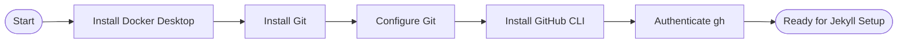

# Configuration de la machine

Installez les outils dont vous avez besoin avant de commencer le développement Jekyll. Ce guide couvre **macOS**, **Windows** et **Linux**.

> **Vous préférez une configuration guidée ?** Le [Site Builder](/quickstart/site-builder/) exécute ces mêmes vérifications en direct sur votre machine, affiche la commande d'installation adaptée à votre système d'exploitation, puis vous accompagne dans la configuration et le lancement d'un site complet avec Claude à vos côtés. Cette page est la référence manuelle derrière son étape Prérequis.



## Aperçu des prérequis

| Outil | macOS | Windows | Linux | Requis ? |
|------|-------|---------|-------|-----------|
| Docker Desktop | `brew install --cask docker` | `winget install Docker.DockerDesktop` | [get.docker.com](https://get.docker.com) | Oui |
| Git | `brew install git` | `winget install Git.Git` | `apt install git` | Oui |
| GitHub CLI | `brew install gh` | `winget install GitHub.cli` | [pkg install](https://cli.github.com) | Oui |
| VS Code | `brew install --cask visual-studio-code` | `winget install Microsoft.VisualStudioCode` | `snap install code --classic` | Recommandé |

## Étape 1 — Installer Docker Desktop

Docker exécute votre site Jekyll dans un conteneur isolé afin de ne jamais vous confronter aux conflits de versions de Ruby.

**macOS (Homebrew)**

```bash
brew install --cask docker
# Then open Docker.app to complete setup
open /Applications/Docker.app
```

**Windows (Winget)**

```powershell
winget install Docker.DockerDesktop
# Restart, then launch Docker Desktop from the Start menu
```

**Linux**

```bash
curl -fsSL https://get.docker.com | sh
sudo usermod -aG docker $USER
newgrp docker          # apply group without logging out
```

Vérifier :

```bash
docker --version && docker compose version
```

## Étape 2 — Installer Git

**macOS**

```bash
brew install git
```

**Windows**

```powershell
winget install Git.Git
```

**Linux**

```bash
sudo apt install git       # Debian/Ubuntu
sudo dnf install git       # Fedora/RHEL
```

## Étape 3 — Configurer Git

Remplacez les valeurs ci-dessous par votre véritable nom d'utilisateur GitHub et l'adresse e-mail no-reply issue de [github.com/settings/emails](https://github.com/settings/emails) :

```bash
git config --global user.name "YourGitHubUsername"
git config --global user.email "ID+username@users.noreply.github.com"
git config --global core.editor "code --wait"
```

Vérifier :

```bash
git config --global --list
```


## Étape 4 — Installer GitHub CLI

**macOS**

```bash
brew install gh
```

**Windows**

```powershell
winget install GitHub.cli
```

**Linux**

```bash
sudo apt install gh        # Debian/Ubuntu (after adding the gh apt repo)
# Full instructions: https://cli.github.com/manual/installation
```

S'authentifier :

```bash
gh auth login
# Choose: GitHub.com → HTTPS → Login with a web browser
# Copy the one-time code shown, press Enter, paste in the browser
```

## Étape 5 — Installer VS Code (recommandé)

**macOS**

```bash
brew install --cask visual-studio-code
```

**Windows**

```powershell
winget install Microsoft.VisualStudioCode
```

**Linux**

```bash
sudo snap install code --classic
```

Extensions utiles pour le travail avec Jekyll :

```bash
code --install-extension redhat.vscode-yaml
code --install-extension yzhang.markdown-all-in-one
code --install-extension sissel.shopify-liquid
code --install-extension ms-vscode-remote.remote-containers
code --install-extension ms-azuretools.vscode-docker
```

## Tout vérifier

```bash
docker --version && docker compose version
git --version
gh --version
code --version
```


## macOS : installer tous les outils avec Homebrew

Si vous êtes sous macOS et que vous n'avez pas encore Homebrew, installez-le d'abord :

```bash
/bin/bash -c "$(curl -fsSL https://raw.githubusercontent.com/Homebrew/install/HEAD/install.sh)"
```

Installez ensuite tout en une seule fois :

```bash
brew install git gh
brew install --cask docker visual-studio-code
```


## Dépannage

**Docker : permission refusée (Linux)**

```bash
sudo usermod -aG docker $USER && newgrp docker
```

**Docker Desktop ne démarre pas (Windows)**

Assurez-vous que Hyper-V ou WSL 2 est activé. Exécutez `wsl --install` dans une invite PowerShell avec privilèges élevés, puis redémarrez.

**Le port 4000 est déjà utilisé**

```bash
lsof -i :4000          # find the PID
kill <PID>             # free the port
```

## Ressources connexes

- [Site Builder](/quickstart/site-builder/) — le parcours guidé qui exécute pour vous ces
  vérifications de prérequis.
- [Référence du Site Builder](/docs/features/site-builder/) — ce que l'assistant
  génère, les outils qu'il expose et ses limites de sécurité.
- [Configuration de Jekyll](/quickstart/jekyll-setup/) — l'étape suivante une fois ces outils
  installés.

---

<div class="d-flex justify-content-between mt-5">
  <a href="/quickstart/" class="btn btn-outline-secondary">
    <i class="bi bi-arrow-left"></i> Précédent : Aperçu du démarrage rapide
  </a>
  <a href="/quickstart/jekyll-setup/" class="btn btn-primary">
    Suivant : Configuration de Jekyll <i class="bi bi-arrow-right"></i>
  </a>
</div>
