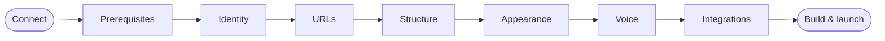

# Générateur de site

Le Générateur de site est un assistant en neuf étapes qui vous mène d'un dossier vide à un site zer0-mistakes personnalisé et fonctionnel. Il est accessible à `/setup/` sur toute compilation locale du thème et sur l'écran d'accueil d'un nouveau site utilisant le thème distant. Une session IA intégrée accompagne chaque étape, prise en charge par le fournisseur que vous connectez avec votre propre token — Claude (Anthropic) ou Grok (xAI). Elle peut lire vos réponses, remplir les formulaires, vérifier votre machine, lire le code source réel du thème, écrire le projet généré sur le disque, démarrer Docker et, dans une session ouverte, modifier un site que vous possédez déjà et générer des images pour celui-ci.



## Ce que vous allez faire

Ouvrez l'assistant, connectez Claude ou Grok via le proxy de développement local, répondez à quelques questions — ou décrivez simplement le site dans une session ouverte — et repartez avec un dossier de projet servi à `http://localhost:4000` et prêt à être publié sur GitHub Pages.

## Prérequis

- Une copie locale du thème avec son serveur de développement en cours d'exécution (`docker compose up` dans le dépôt du thème), ou tout site utilisant la mise en page `welcome`.
- Node.js 20.6 ou plus récent, pour le proxy de développement qui connecte l'IA.
- Un token pour un fournisseur : la CLI Claude Code connectée à un compte Claude Pro ou Max (`claude setup-token`), une clé API Anthropic, ou une clé xAI depuis console.x.ai. Sans token, l'assistant fonctionne quand même ; seul le panneau IA reste inactif.
- Docker Desktop, Git et la CLI GitHub pour le site que vous êtes sur le point de créer. L'étape Prérequis les vérifie pour vous et affiche la commande d'installation adaptée à votre système d'exploitation.

## Parcourir l'assistant

L'assistant comporte neuf étapes ; ce parcours les regroupe en six passages.

### Connexion

Ouvrez `http://localhost:4000/setup/`. L'étape Connexion recherche le proxy de développement ; démarrez-le depuis la racine du thème (il n'a plus besoin de clé pour démarrer) :

```bash
node --env-file=.env templates/deploy/chat-proxy/dev-proxy.mjs
```

Choisissez **Claude** ou **Grok**, collez un token — `claude setup-token` affiche un token Claude ; console.x.ai délivre les clés xAI — et appuyez sur **Utiliser pour cette session**. Le proxy vérifie le token auprès du fournisseur, le conserve en mémoire pour la durée de l'exécution et n'affiche que ses quatre derniers caractères ; activez l'interrupteur pour que le proxy l'enregistre dans le fichier `.env` ignoré par git pour la prochaine fois. Choisissez un modèle, activez la génération d'images si vous disposez d'une clé xAI ou OpenAI, et décidez de votre méthode de travail : **Étapes guidées** ou une **Session ouverte** où vous indiquez simplement à l'assistant ce qu'il faut créer ou modifier.

La page effectue une nouvelle vérification toutes les quinze secondes. Une fois que le badge du panneau affiche **Claude connecté** ou **Grok connecté**, le compositeur se déverrouille et le panneau vous accueille. Le token ne réside jamais dans la page : il est envoyé une seule fois à `http://localhost:8787` et y reste.

### Prérequis

Appuyez sur **Lancer les vérifications**. Le proxy exécute une liste fixe de commandes de version en lecture seule (Docker, le moteur Docker, Git et son identité, la CLI GitHub et sa connexion, VS Code, Node, la CLI Claude) et la liste de contrôle passe au vert ou au rouge pour chaque outil. Choisissez votre système d'exploitation pour voir la commande d'installation correspondante, ou demandez à Claude d'expliquer ce qui manque. Hors ligne, cochez chaque élément au fur et à mesure de son installation.

### Identité, URL et structure

Décrivez votre site dans le champ de présentation et appuyez sur **Rédiger avec Claude** (ou **avec Grok**). L'assistant propose un titre, un sous-titre, une accroche et une description, puis les applique après votre confirmation sur la carte en ligne. Renseignez votre nom d'utilisateur et votre dépôt GitHub, appuyez sur **Suggérer** pour dériver l'URL du site et le chemin de base, puis choisissez un type de site afin de présélectionner les collections et un menu de navigation que vous pouvez modifier ligne par ligne.

### Apparence et ton

Choisissez l'un des sept habillages et prévisualisez-le sur la page que vous consultez, définissez le mode de couleur et choisissez un ton et un public. **Rédiger les deux avec Claude** (ou Grok) écrit l'article de bienvenue et la page à propos avec ce ton ; les deux sont en simple Markdown que vous pouvez modifier avant qu'ils ne deviennent des fichiers. Avec la génération d'images activée, **Image d'en-tête avec …** produit une image de page d'accueil dans le projet.

### Intégrations

Activez ce que vous souhaitez : le widget « améliorer cette page », les liens wiki Obsidian, les commentaires Giscus, l'analytique PostHog ou l'assistant de discussion IA. Aucune donnée n'est envoyée tant que vous n'ajoutez pas d'identifiant ou de clé, et les clés ne figurent jamais dans `_config.yml`.

### Compilation

Chaque fichier généré reste dans le panneau d'aperçu en permanence. Saisissez un nom de dossier de projet, appuyez sur **Check** pour voir où il sera créé, puis sur **Write project**. Appuyez sur **docker compose up** et observez la construction dans le panneau terminal. Lorsque Jekyll indique qu'il assure le service, **Open site** vous mène au nouveau site. Pour le modifier plus tard, sélectionnez-le sous **Modify an existing site**, appuyez sur **Open** et demandez : l'assistant lit, modifie et ajoute des fichiers à cet endroit, et **jekyll build** valide le résultat. Sans le proxy, téléchargez le paquet et exécutez-le :

```bash
bash zer0-site-bundle.sh my-site
cd my-site && docker compose up
```

## Vérifier

- Le badge du panneau affiche **Claude connected** ou **Grok connected** et les boutons de l'étape Build sont activés.
- `docker compose ps` dans le nouveau dossier affiche un service `jekyll` en cours d'exécution.
- `http://localhost:4000/` (ou le port que vous avez choisi) affiche votre titre, votre habillage et votre article de bienvenue.
- `zer0.install.yml` dans le nouveau dossier enregistre vos réponses afin que l'installateur puisse les rejouer.

## Dépannage

| Problème | Solution |
| --- | --- |
| Le badge reste **offline** | Vérifiez que le proxy a affiché `listening on http://localhost:8787` ; il démarre avec ou sans clé. |
| Le badge affiche **needs a token** | Le proxy est actif mais le fournisseur choisi n'a pas encore de clé : collez-en une, ou basculez vers le fournisseur qui en possède une dans `.env`. |
| **Write project** indique que la cible n'est pas autorisée | Par défaut, les nouveaux sites se placent sous le dossier parent du thème. Définissez `WIZARD_TARGET_ROOT=/path` au démarrage du proxy pour changer cela. |
| `docker compose up` échoue lors de la première exécution | La première construction installe les gems et peut prendre plusieurs minutes. Appuyez sur **Logs** ; Claude peut les lire et expliquer l'erreur. |
| Le chat indique que l'identifiant a été rejeté | Collez un jeton neuf à l'étape Connect : réexécutez `claude setup-token` pour Claude, ou créez une nouvelle clé sur console.x.ai pour Grok. |
| Le port 4000 est déjà utilisé | Changez le **Dev port** à l'étape URLs avant d'écrire le projet, ou arrêtez l'autre serveur. |

## Voir aussi

- [Machine Setup](/quickstart/machine-setup/) est la référence manuelle qui sous-tend l'étape Prérequis.
- [Référence de la fonctionnalité Site Builder](/docs/features/site-builder/) documente les outils, les routes du proxy et le modèle de sécurité.
- [Assistant de chat IA](/docs/features/ai-chat-assistant/) explique le proxy que le générateur réutilise.

---

<div class="d-flex justify-content-between mt-5">
  <a href="/quickstart/" class="btn btn-outline-secondary">
    <i class="bi bi-arrow-left"></i> Retour : Aperçu du démarrage rapide
  </a>
  <a href="/quickstart/machine-setup/" class="btn btn-primary">
    Suivant : Configuration de la machine <i class="bi bi-arrow-right"></i>
  </a>
</div>
