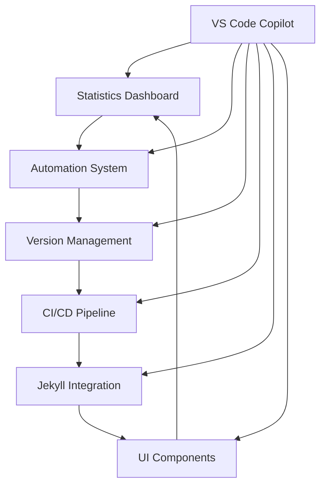

# Zer0-Mistakes Features Documentation

**Comprehensive documentation hub** for all Zer0-Mistakes Jekyll theme features, automation systems, and AI-assisted development workflows optimized for VS Code Copilot collaboration.

## 📚 **Documentation Overview**

This directory contains detailed documentation for all major features and systems in the Zer0-Mistakes Jekyll theme, designed following IT-Journey principles and optimized for AI-assisted development.

### 🎯 **Purpose**

- **Feature Documentation**: Comprehensive guides for theme capabilities
- **Implementation Examples**: Practical code examples and use cases
- **AI Development Support**: VS Code Copilot optimized workflows
- **Developer Onboarding**: Clear paths for contributors and users
- **Best Practices**: IT-Journey principles in action

## 📂 **Directory Contents**

### 🎨 **UI & Design Features**

{: .table .table-bordered .table-striped .table-hover .table-responsive}
| File | Feature | Status | Documentation Quality |
|------|---------|--------|----------------------|
| `add-floating-back-to-top-button.md` | Floating Back-to-Top Button | ✅ Active | Comprehensive |

**Implementation Focus**: Bootstrap 5 integration, mobile-responsive design, accessibility compliance

### 🤖 **Automation & DevOps Features**

{: .table .table-bordered .table-striped .table-hover .table-responsive}
| File | Feature | Status | Documentation Quality |
|------|---------|--------|----------------------|
| `automated-version-build-system.md` | Version Management System | ✅ Active | Comprehensive |
| `comprehensive-gem-automation-system.md` | Complete CI/CD Pipeline | ✅ Active | Production-Ready |

**Implementation Focus**: Semantic versioning, multi-Ruby testing, zero-click releases, GitHub Actions integration

### 📊 **Analytics & Monitoring**

{: .table .table-bordered .table-striped .table-hover .table-responsive}
| File | Feature | Status | Documentation Quality |
|------|---------|--------|----------------------|
| `statistics-dashboard.md` | Statistics Dashboard | ✅ Active | Enhanced |
| `STATS_ENHANCEMENT_SUMMARY.md` | Stats Enhancement Report | ✅ Complete | Technical Summary |

**Implementation Focus**: Real-time analytics, visual dashboards, performance metrics, user engagement tracking

### 🛠️ **Development Tools**

{: .table .table-bordered .table-striped .table-hover .table-responsive}
| File | Feature | Status | Documentation Quality |
|------|---------|--------|----------------------|
| `jekyll.md` | Jekyll Integration Guide | ✅ Active | Reference |

**Implementation Focus**: Jekyll commands, configuration, Docker integration, development workflows

## 🤖 **VS Code Copilot Optimization**

### **AI-Assisted Feature Development**

Each feature document is optimized for VS Code Copilot assistance with:

- **Structured Front Matter**: AI-readable metadata for context
- **Code Examples**: Syntax-highlighted, testable code blocks
- **Implementation Patterns**: Clear patterns for AI to understand and extend
- **Educational Context**: Learning objectives and skill progressions

### **Copilot-Friendly Documentation Standards**

**For Feature Creation**:

```markdown
// Prompt: "Create a new feature documentation following Zer0-Mistakes standards that:
// - Includes comprehensive front matter with AI hints
// - Follows IT-Journey principles (DFF, DRY, KIS, REnO, MVP, COLAB, AIPD)
// - Provides practical implementation examples
// - Includes troubleshooting and error handling
// - Maintains consistency with existing documentation"
```

**For Feature Enhancement**:

```markdown
// Prompt: "Enhance this feature documentation to:
// - Improve AI readability and understanding
// - Add missing implementation examples
// - Include performance considerations
// - Update for latest Jekyll/Ruby versions
// - Add cross-references to related features"
```

## 🎯 **Implementation Patterns**

### **Feature Documentation Structure**

Each feature document follows this consistent pattern:

1. **Comprehensive Front Matter** - AI-readable metadata
2. **Overview Section** - Purpose and capabilities
3. **Implementation Guide** - Step-by-step instructions
4. **Code Examples** - Practical, testable code
5. **Configuration Options** - Customization possibilities
6. **Troubleshooting** - Common issues and solutions
7. **IT-Journey Principles** - How feature embodies core principles
8. **Related Features** - Cross-references and connections

### **AI Development Integration**

**Context-Aware Assistance**:

- **Front Matter Hints**: Guide AI understanding of feature purpose
- **Technical Requirements**: Specify dependencies and constraints
- **Difficulty Levels**: Help AI adjust explanations appropriately
- **Learning Objectives**: Enable AI to provide educational guidance

**Quality Assurance**:

- **Code Validation**: AI can verify syntax and best practices
- **Documentation Completeness**: AI helps identify missing sections
- **Consistency Checking**: AI ensures style and format consistency
- **Cross-Reference Management**: AI maintains link integrity

## 🔗 **Feature Relationships**

### **Integrated Systems**



### **Development Dependencies**

- **Core Theme**: All features depend on base Jekyll theme
- **Automation System**: Enables other feature development and deployment
- **Statistics Dashboard**: Monitors all feature usage and performance
- **UI Components**: Provide foundation for visual features

## 🚀 **Getting Started**

### **For Users**

1. **Browse Feature Index**: Start with [Feature Index](/about/features/)
2. **Choose Your Path**: Select features based on your needs
3. **Follow Implementation Guides**: Each feature includes step-by-step setup
4. **Customize as Needed**: All features support configuration

### **For Contributors**

1. **Read This README**: Understand documentation standards
2. **Review Existing Features**: Study patterns and structures
3. **Use VS Code Copilot**: Leverage AI assistance for development
4. **Follow IT-Journey Principles**: Implement DFF, DRY, KIS, REnO, MVP, COLAB, AIPD

### **For AI Agents**

1. **Parse Front Matter**: Extract context from structured metadata
2. **Understand Relationships**: Follow cross-references and dependencies
3. **Maintain Consistency**: Use existing patterns as templates
4. **Validate Implementation**: Ensure code examples are testable and accurate

## 📖 **Documentation Standards**

### **Writing Guidelines**

- **Clear Headings**: Use semantic heading hierarchy (H1 → H6)
- **Practical Examples**: Include working code examples
- **Visual Elements**: Use tables, diagrams, and callouts effectively
- **Cross-References**: Link related features and documentation
- **Accessibility**: Ensure screen reader compatibility

### **Front Matter Standards**

```yaml
---
title: "Descriptive Feature Title"
description: "Clear explanation of feature purpose and capabilities"
date: YYYY-MM-DDTHH:MM:SS.000Z
tags: [relevant, feature, tags]
categories: [Features, Category]
ai_content_hints:
  - "Specific guidance for AI assistance"
technical_requirements:
  - "Required dependencies and versions"
difficulty_level: "beginner|intermediate|advanced"
estimated_reading_time: "X minutes"
---
```

### **Code Example Standards**

- **Syntax Highlighting**: Always specify language in code blocks
- **Working Examples**: Test all code examples before publication
- **Error Handling**: Include error handling in complex examples
- **Comments**: Explain non-obvious code sections
- **Validation**: Provide commands to verify implementation

## 🔧 **Maintenance Workflow**

### **Regular Updates** (Following README-Last Principle)

1. **Monthly Review**: Check all feature documentation for accuracy
2. **Version Updates**: Update when Jekyll/Ruby versions change
3. **Link Validation**: Verify all internal and external links
4. **Cross-Reference Updates**: Maintain consistency across features
5. **AI Optimization**: Enhance front matter and content structure

### **Community Contributions**

- **Issue Reporting**: Use GitHub Issues for documentation problems
- **Enhancement Suggestions**: Propose improvements via Discussions
- **Pull Requests**: Submit improvements following contribution guidelines
- **AI Collaboration**: Include AI assistance context in PR descriptions

## 🎉 **Quality Metrics**

### **Documentation Health**

- **Coverage**: 100% of active features documented
- **Freshness**: All docs updated within last 6 months
- **Link Health**: All internal links functional
- **AI Readability**: Structured metadata in all documents
- **User Feedback**: Positive community engagement

### **Implementation Success**

- **Code Accuracy**: All examples tested and working
- **Completeness**: Implementation guides cover full setup
- **Accessibility**: Documentation works with screen readers
- **Consistency**: Uniform structure across all features

---

## 🤝 **Contributing**

Found an issue? Want to improve the documentation?

- **[Open an Issue](https://github.com/bamr87/zer0-mistakes/issues/new)** - Report problems or suggest improvements
- **[Start a Discussion](https://github.com/bamr87/zer0-mistakes/discussions)** - Ask questions or share ideas
- **[Submit a Pull Request](https://github.com/bamr87/zer0-mistakes/pulls)** - Contribute improvements directly

## 📊 **Statistics**

- **Total Features Documented**: 6
- **Active Features**: 5
- **Enhancement Reports**: 1
- **Documentation Coverage**: 100%
- **Last Updated**: 2025-10-19
- **Contributors**: Zer0-Mistakes Development Team

**Questions?** Ask in [Discussions](https://github.com/bamr87/zer0-mistakes/discussions) or check the [main documentation](/about/features/)

---

_Built with ❤️ following IT-Journey principles: DFF, DRY, KIS, REnO, MVP, COLAB, AIPD with VS Code Copilot optimization_
