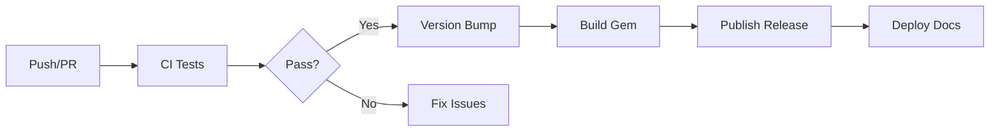

# CI/CD Pipeline

The Zer0-Mistakes theme uses GitHub Actions for continuous integration and deployment, automating testing, building, and releasing.

## Workflow Overview



## Available Workflows

| Workflow | Trigger | Purpose |
|----------|---------|---------|
| `ci.yml` | Push, PR | Run tests and validations |
| `version-bump.yml` | Push to main, Manual | Bump version and tag |
| `release.yml` | Tag push | Build and publish gem |
| `codeql.yml` | Push, PR, Schedule | Security scanning |
| `update-dependencies.yml` | Schedule, Manual | Update Ruby gems |
| `convert-notebooks.yml` | Push | Convert Jupyter notebooks |

## CI Workflow (`ci.yml`)

### Triggers

```yaml
on:
  push:
    branches: [main, develop]
  pull_request:
    branches: [main]
```

### Jobs

#### 1. Test Matrix

Tests across multiple Ruby versions:

```yaml
strategy:
  matrix:
    ruby-version: ['3.0', '3.1', '3.2', '3.3']
    os: [ubuntu-latest]
```

#### 2. Build Steps

```yaml
steps:
  - uses: actions/checkout@v4
  
  - name: Set up Ruby
    uses: ruby/setup-ruby@v1
    with:
      ruby-version: ${{ matrix.ruby-version }}
      bundler-cache: true
  
  - name: Run tests
    run: ./test/test_runner.sh
  
  - name: Build Jekyll site
    run: bundle exec jekyll build
  
  - name: Build gem
    run: gem build jekyll-theme-zer0.gemspec
```

### Quality Checks

- **Linting**: YAML, Markdown validation
- **Build**: Jekyll site compilation
- **Tests**: Full test suite execution
- **Gem**: Package building verification

## Release Workflow (`release.yml`)

### Trigger

```yaml
on:
  push:
    tags:
      - 'v*'
```

### Release Steps

1. **Checkout** tagged version
2. **Build** gem package
3. **Test** gem installation
4. **Publish** to RubyGems.org
5. **Create** GitHub Release
6. **Upload** release assets

### Release Assets

- `jekyll-theme-zer0-X.Y.Z.gem`
- Installation script
- Release notes (from CHANGELOG)

## Environment Variables

### Required Secrets

| Secret | Purpose |
|--------|---------|
| `RUBYGEMS_API_KEY` | Gem publishing |
| `GITHUB_TOKEN` | Release creation (automatic) |

### Configuration

```yaml
env:
  RUBY_VERSION: '3.2'
  JEKYLL_ENV: production
```

## Branch Protection

### Main Branch Rules

- Require pull request reviews
- Require status checks to pass:
  - `test (3.2, ubuntu-latest)`
  - `build`
  - `CodeQL`
- Require linear history

### Status Checks

```yaml
# Required checks before merge
required_status_checks:
  - test
  - build
  - codeql
```

## Caching Strategy

### Ruby Dependencies

```yaml
- uses: ruby/setup-ruby@v1
  with:
    bundler-cache: true  # Caches vendor/bundle
```

### Jekyll Build Cache

```yaml
- uses: actions/cache@v4
  with:
    path: |
      .jekyll-cache
      _site
    key: jekyll-${{ hashFiles('_config.yml') }}
```

## Artifacts

### Test Results

```yaml
- uses: actions/upload-artifact@v4
  with:
    name: test-results
    path: test/results/
    retention-days: 30
```

### Build Outputs

```yaml
- uses: actions/upload-artifact@v4
  with:
    name: gem-package
    path: "*.gem"
```

## Notifications

### Failure Notifications

Configure notifications for workflow failures:

```yaml
- name: Notify on failure
  if: failure()
  uses: actions/github-script@v7
  with:
    script: |
      github.rest.issues.createComment({
        issue_number: context.issue.number,
        body: '❌ CI failed. Please check the logs.'
      })
```

## Debugging Workflows

### Enable Debug Logging

Set repository secrets:
- `ACTIONS_RUNNER_DEBUG`: `true`
- `ACTIONS_STEP_DEBUG`: `true`

### SSH Access

For debugging in runner:

```yaml
- name: Setup tmate session
  if: failure()
  uses: mxschmitt/action-tmate@v3
```

## Best Practices

### Keep Workflows Fast

- Cache dependencies
- Run jobs in parallel
- Skip unnecessary steps

### Use Reusable Workflows

```yaml
jobs:
  test:
    uses: ./.github/workflows/test.yml
```

### Limit Concurrent Runs

```yaml
concurrency:
  group: ${{ github.workflow }}-${{ github.ref }}
  cancel-in-progress: true
```

## Troubleshooting

### Tests Pass Locally, Fail in CI

1. Check Ruby version differences
2. Verify environment variables
3. Check for timing-sensitive tests

### Workflow Not Triggering

1. Check branch protection rules
2. Verify path filters
3. Check for workflow file errors

### Permission Denied

Ensure workflow has required permissions:

```yaml
permissions:
  contents: write
  packages: read
```

## Related

- [Testing Guide](/docs/development/testing/)
- [Version Bump](/docs/development/version-bump/)
- [Release Management](/docs/development/release-management/)
