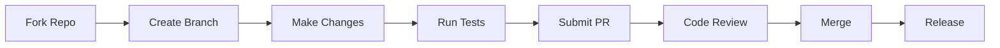

# Development Documentation

This section provides comprehensive guides for developers who want to contribute to, extend, or customize the Zer0-Mistakes Jekyll theme.

## Getting Started

Before contributing, ensure you have:

- Docker Desktop installed (recommended)
- Git configured with SSH keys
- Basic understanding of Jekyll and Ruby

## Developer Guides

### Build & Release

| Guide | Description |
|-------|-------------|
| [Release Management](release-management/) | Semantic versioning, changelog management, and gem publishing |
| [Version Bump](version-bump/) | Automated version bumping workflow |
| [CI/CD Pipeline](ci-cd/) | Continuous integration and deployment workflows |

### Quality & Security

| Guide | Description |
|-------|-------------|
| [Testing](testing/) | Test suite structure and development standards |
| [Security](security/) | CodeQL scanning and security best practices |
| [Dependency Updates](dependency-updates/) | Automated dependency management |

### Documentation & Tooling

| Guide | Description |
|-------|-------------|
| [Documentation](documentation/) | Dual documentation architecture and workflow |
| [Scripts](scripts/) | Shell script automation library |
| [PRD](prd/) | Product requirements document |

## Quick Commands

```bash
# Run all tests
./test/test_runner.sh

# Build the gem
./scripts/build.sh

# Create a release
./scripts/release.sh

# Bump version
./scripts/version.sh patch  # or minor, major
```

## Development Workflow



## Contributing

1. **Fork** the repository
2. **Create** a feature branch (`feature/my-feature`)
3. **Make** your changes with tests
4. **Submit** a pull request

See [CONTRIBUTING.md](https://github.com/bamr87/zer0-mistakes/blob/main/CONTRIBUTING.md) for detailed guidelines.

## Related

- [Installation Guide](/docs/installation/)
- [Docker Development](/docs/docker/)
- [Customization](/docs/customization/)
