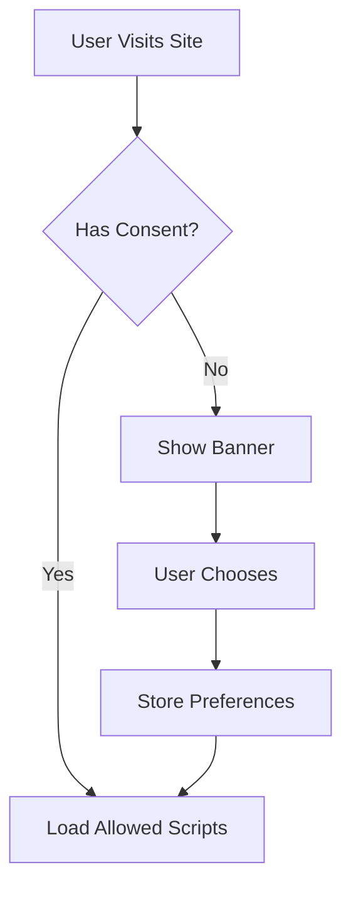

# Cookie Consent Management

The Zer0-Mistakes theme includes a GDPR/CCPA compliant cookie consent system with granular permission controls.

## Overview

The cookie consent system provides:

- **Privacy Compliance**: GDPR and CCPA compliant
- **Granular Controls**: Per-category consent options
- **Persistent Storage**: 365-day consent persistence
- **Bootstrap Integration**: Native modal UI

## Quick Start

### Enable Cookie Consent

The consent banner is included automatically. Configure in `_config.yml`:

```yaml
cookie_consent:
  enabled: true
  categories:
    - necessary
    - analytics
    - marketing
```

## How It Works

### Consent Flow



### Cookie Categories

| Category | Purpose | Required |
|----------|---------|----------|
| `necessary` | Essential functionality | Yes |
| `analytics` | Usage tracking (PostHog, GA) | No |
| `marketing` | Advertising, tracking | No |
| `preferences` | User settings | No |

## Configuration

### Basic Setup

```yaml
cookie_consent:
  enabled: true
  position: bottom  # bottom, top
  theme: light      # light, dark, auto
  expires: 365      # days
```

### Category Configuration

```yaml
cookie_consent:
  categories:
    necessary:
      name: "Essential"
      description: "Required for the website to function"
      required: true
    analytics:
      name: "Analytics"
      description: "Help us understand how you use our site"
      required: false
      default: false
```

### Integration with Analytics

```yaml
# PostHog only loads with analytics consent
posthog:
  enabled: true
  require_consent: true

# Google Analytics with consent
google_analytics:
  tracking_id: UA-XXXXXXXX-X
  require_consent: true
```

## Banner Customization

### Text Content

```yaml
cookie_consent:
  text:
    message: "We use cookies to improve your experience."
    accept: "Accept All"
    decline: "Decline"
    settings: "Cookie Settings"
    save: "Save Preferences"
```

### Styling

Override styles in your CSS:

```css
/* Custom banner styling */
.cookie-consent-banner {
  background: var(--bs-dark);
  color: var(--bs-light);
}

.cookie-consent-btn {
  border-radius: var(--bs-border-radius);
}
```

## JavaScript API

### Check Consent

```javascript
// Check if category is consented
if (CookieConsent.hasConsent('analytics')) {
  // Load analytics
}

// Get all consents
const consents = CookieConsent.getConsents();
```

### Listen for Changes

```javascript
document.addEventListener('cookieConsent:update', function(e) {
  const { category, consented } = e.detail;
  console.log(`${category}: ${consented}`);
});
```

### Programmatic Control

```javascript
// Show settings modal
CookieConsent.showSettings();

// Revoke all consent
CookieConsent.revokeAll();

// Grant specific category
CookieConsent.grant('analytics');
```

## Privacy Policy Integration

Link your privacy policy:

```yaml
cookie_consent:
  privacy_policy: /privacy-policy/
  show_policy_link: true
```

The consent banner will include a link to your privacy policy.

## Compliance Features

### GDPR Requirements

- ✅ Prior consent before non-essential cookies
- ✅ Granular category choices
- ✅ Easy withdrawal of consent
- ✅ Clear privacy information
- ✅ No pre-checked boxes

### CCPA Requirements

- ✅ "Do Not Sell" option
- ✅ Privacy notice link
- ✅ Opt-out mechanism
- ✅ Record of consent

## Best Practices

### Essential Cookies Only

Never require consent for:

- Session cookies
- Authentication tokens
- CSRF protection
- Load balancing

### Clear Descriptions

```yaml
categories:
  analytics:
    description: |
      We use analytics cookies to understand how you use our site. 
      This helps us improve your experience. We use PostHog, which 
      is privacy-focused and GDPR compliant.
```

### Regular Audits

1. Review cookie usage quarterly
2. Update category descriptions
3. Test consent flow
4. Verify script blocking

## Troubleshooting

### Banner Not Showing

1. Check `cookie_consent.enabled: true`
2. Clear browser cookies
3. Verify include is present

### Scripts Loading Without Consent

1. Wrap scripts in consent checks
2. Use conditional includes
3. Verify category requirements

### Consent Not Persisting

1. Check cookie expiration
2. Verify localStorage access
3. Test in private browsing

## Related

- [PostHog Analytics](/docs/features/posthog-analytics/)
- [Privacy Policy](/privacy-policy/)
- [Google Analytics](/docs/analytics/google-analytics/)
