# Mermaid Diagrams for Jekyll Sites

Mermaid diagrams are enabled with one front matter flag and a standard code fence: no server-side plugin and no CDN dependency, because the renderer is vendored with the theme.

**GitHub Pages Compatible** — Works without custom server-side plugins!

**What you'll do:** turn a ` ```mermaid ` code block into a rendered, zoomable diagram that follows your site's color mode and skin.

**Prerequisites:**

- A page built with this theme (any layout)
- A Mermaid definition — try one in the [Live Editor](https://mermaid.live/) first

Every diagram on a page renders as a figure with its own toolbar. Hover the diagram below (or tap it on a phone) to see the controls:

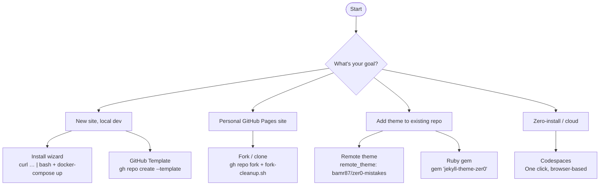

The caption under the diagram comes from its `accTitle` line — see [Captions and accessible names](#captions-and-accessible-names).

## Quick start

### Step 1: Enable Mermaid on your page

Add `mermaid: true` to your page's front matter:

```yaml
---
title: "My Documentation Page"
mermaid: true
---
```

### Step 2: Write your diagram

Use native Markdown code blocks with `mermaid` as the language:

````markdown
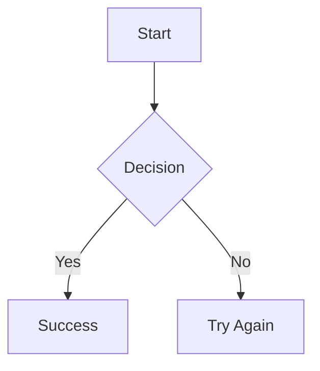
````

**That's it!** The diagram renders automatically.

### Verify

Reload the page. The code block is replaced by a bordered figure containing the diagram; hovering it reveals the toolbar in the top-right corner. If you still see the raw text, work through [Troubleshooting](#troubleshooting).

---

## What every diagram gets

Each ` ```mermaid ` block becomes a `<figure>` with a rendered SVG and a small toolbar. Nothing extra to write — it is the same block you would write for GitHub.

### The toolbar

| Control | Icon | What it does |
|---------|------|--------------|
| Zoom out / Zoom in | <i class="bi bi-zoom-out" aria-hidden="true"></i><span class="visually-hidden">magnifier with minus</span> <i class="bi bi-zoom-in" aria-hidden="true"></i><span class="visually-hidden">magnifier with plus</span> | Scales the diagram in 25 % steps (50 %–400 %). Once it is larger than its frame, drag to pan or scroll. |
| Reset zoom | <i class="bi bi-arrow-counterclockwise" aria-hidden="true"></i><span class="visually-hidden">counter-clockwise arrow</span> | Back to fit-to-width. |
| View fullscreen | <i class="bi bi-arrows-fullscreen" aria-hidden="true"></i><span class="visually-hidden">four outward arrows</span> | Opens the diagram in a fullscreen view — the fix for a wide diagram that is too small on a phone. `Esc` closes it. |
| Copy diagram source | <i class="bi bi-clipboard" aria-hidden="true"></i><span class="visually-hidden">clipboard</span> | Copies the Mermaid text to the clipboard, so readers can paste it into the Live Editor. |
| Download as SVG | <i class="bi bi-download" aria-hidden="true"></i><span class="visually-hidden">download arrow</span> | Saves the rendered diagram, with the page background baked in so a dark-mode export stays readable. |

The toolbar appears on hover or keyboard focus on desktop, and sits above the diagram on touch devices.

### Keyboard shortcuts

Tab to a diagram (its frame is focusable, and also scrollable), then:

| Key | Action |
|-----|--------|
| `+` / `=` | Zoom in |
| `-` | Zoom out |
| `0` | Reset zoom |
| `F` | Open fullscreen |
| `Esc` | Close fullscreen |
| `Ctrl` + scroll wheel | Zoom (plain scrolling still scrolls the page) |

### Captions and accessible names

Mermaid's accessibility directives double as the figure's caption and screen-reader name:

````markdown
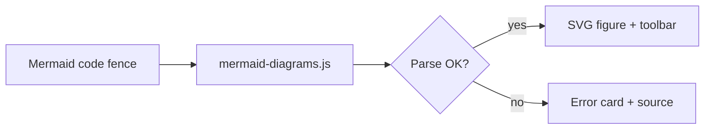
````


- `accTitle` becomes the visible caption and the accessible name of the diagram frame (the `aria-label` on the scrollable region); Mermaid also writes it into the SVG's `<title>`.
- `accDescr` is passed through to Mermaid's renderer, which inserts it as the SVG's `<desc>`, read by screen readers.
- Without `accTitle`, the diagram is named by its type ("Flowchart", "Sequence diagram", …).

### Colors follow your theme

Diagram colors are **not** configured anywhere. They are derived at render time from the theme's design tokens (`--bs-primary`, `--bs-body-bg`, `--zer0-color-*`), so a diagram matches whatever the reader is looking at: light or dark mode, any skin, and any `theme_color` override. Switch the color mode with the toggle in the navbar and watch the diagram above re-render.

Per-node styling (`classDef`, `style`) still works — the theme no longer overrides SVG colors with `!important`.

### When a diagram has a typo

A syntax error does not blank the page or dump raw SVG text. The figure shows what went wrong and keeps the source visible, and the *Copy* control still works so you can paste it straight into the Live Editor. The diagram below is intentionally broken (a single `->` where Mermaid needs `-->`):

```mermaid
graph TD
    A[Start] -> B[Broken arrow]
```

### Without JavaScript

The vendored Mermaid bundle and the theme's script both load with `defer`, so they never block the page. If JavaScript is unavailable, or the script fails to load, the block stays a normal, readable code block — the definition is never hidden.

---

## Configuration

### Site configuration

Everything under `mermaid:` in `_config.yml` is optional:

```yaml
mermaid:
  src: '/assets/vendor/mermaid/mermaid.min.js'   # vendored, no CDN
  security_level: strict   # strict | loose
  toolbar: true            # zoom / fullscreen / copy / download controls
  fullscreen: true         # allow the fullscreen view
  download: true           # allow "Download as SVG"
```

| Key | Default | Notes |
|-----|---------|-------|
| `src` | `/assets/vendor/mermaid/mermaid.min.js` | Path to the Mermaid bundle. Refresh it with `npm run vendor:mermaid` (inside the container: `docker-compose exec jekyll npm run vendor:mermaid`). To refresh every vendored asset at once (Bootstrap, icons, Mermaid), run `./scripts/vendor-install.sh`. |
| `security_level` | `strict` | `strict` sanitises diagram text. Use `loose` only if you need `click` callbacks or HTML in labels — it disables that sanitisation, so keep it `strict` when diagrams can come from untrusted content. |
| `toolbar` | `true` | Set `false` to render bare diagrams with no controls. |
| `fullscreen` | `true` | Set `false` to remove the fullscreen control. |
| `download` | `true` | Set `false` to remove the SVG export control. |

The toolbar labels are translated with the rest of the UI through `_data/ui-text.yml` (`diagram_*` keys).

See [Vendored Bootstrap & Icon Assets](/docs/features/vendored-assets/) for the full asset refresh workflow.

### How it works

1. **Front matter flag** — `mermaid: true` enables Mermaid on the page
2. **Conditional loading** — the scripts load only on pages that opt in, and never block rendering
3. **Client-side rendering** — no server-side plugin required
4. **Figure chrome** — `assets/js/mermaid-diagrams.js` converts each fence into a figure, renders it, and re-renders when the color mode or skin changes

---

## Diagram types

### 1. Flowcharts

The most common diagram type for documenting processes and workflows.

**Directions:**

- `TD` / `TB` — Top to Bottom
- `BT` — Bottom to Top
- `LR` — Left to Right
- `RL` — Right to Left

````markdown
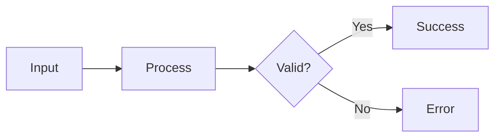
````


**Node Shapes:**

| Syntax | Shape | Use Case |
|--------|-------|----------|
| `A[Text]` | Rectangle | Actions, steps |
| `A(Text)` | Rounded | Processes |
| `A([Text])` | Stadium | Start/End |
| `A{Text}` | Diamond | Decisions |
| `A((Text))` | Circle | Terminals, connectors |
| `A[[Text]]` | Subroutine | Sub-processes |
| `A[(Text)]` | Cylinder | Database |

**Link Types:**

| Syntax | Description |
|--------|-------------|
| `-->` | Arrow |
| `---` | Line |
| `-.->` | Dotted arrow |
| `==>` | Thick arrow |
| `--\|Text\|-->` | Arrow with label |

### 2. Sequence diagrams

Perfect for documenting API calls, user interactions, and system communication.

````markdown
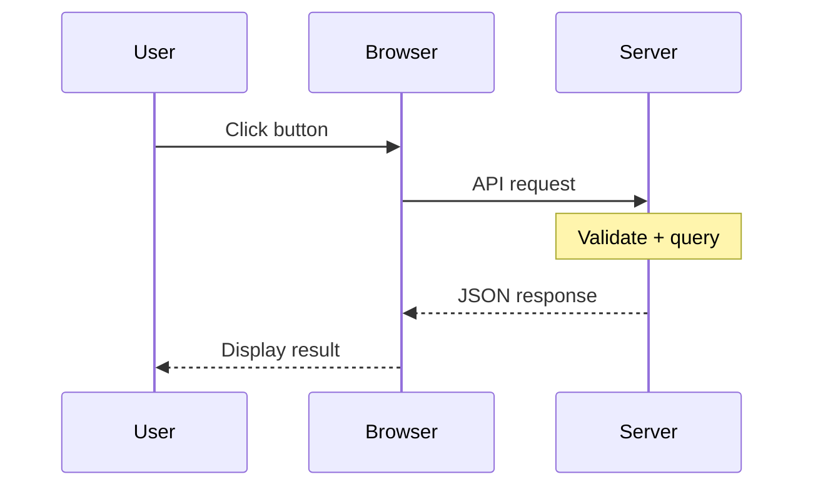
````


**Arrow Types:**

| Syntax | Description |
|--------|-------------|
| `->>` | Solid line with arrowhead |
| `-->>` | Dotted line with arrowhead |
| `-x` | Solid line with cross |
| `--x` | Dotted line with cross |
| `-)` | Solid line with open arrow |

### 3. Class diagrams

Document code architecture and relationships.

````markdown
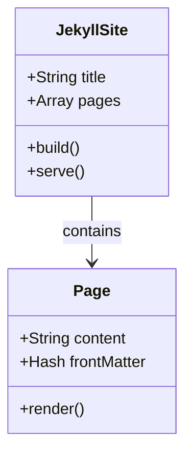
````


### 4. State diagrams

Model state machines and workflows.

````markdown
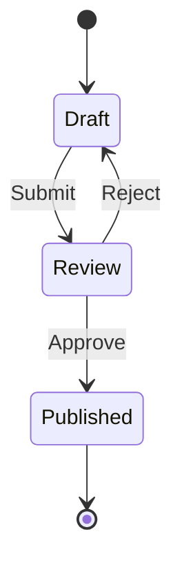
````


### 5. Entity relationship diagrams

Document database schemas.

````markdown
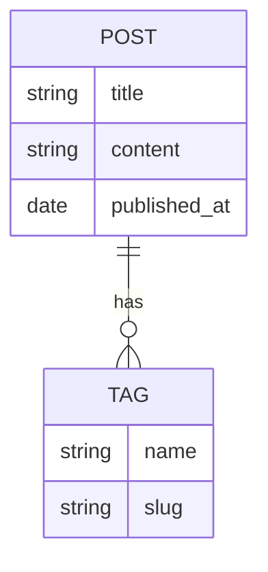
````


### 6. Pie charts

Visualize data distributions.

````markdown
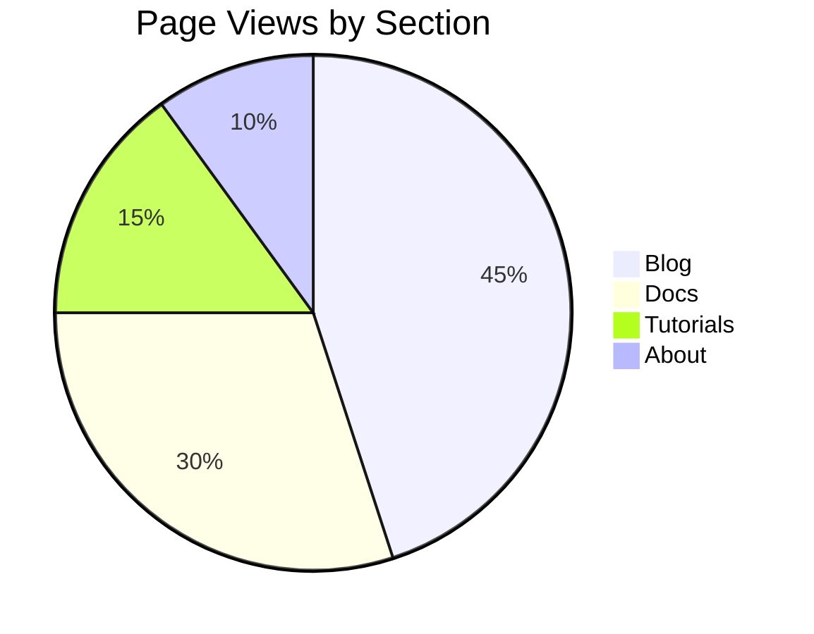
````


### 7. Gantt charts

Project timelines and schedules.

````markdown
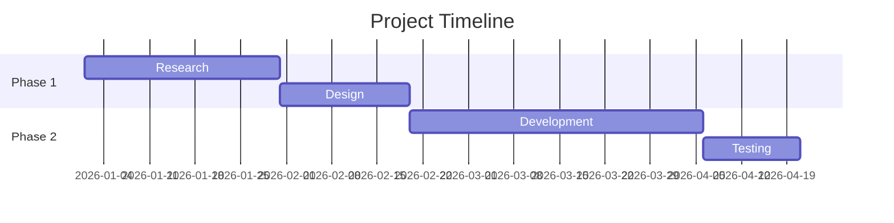
````

A richer version demonstrates status tags and axis formatting:

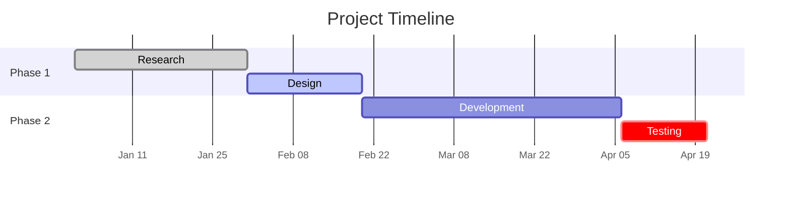

`done`, `active` and `crit` tags pick up the theme's muted, accent and danger colors; `axisFormat` and `tickInterval` keep the axis labels from crowding on narrow screens.

### 8. Git graphs

Visualize Git branching and commits.

````markdown
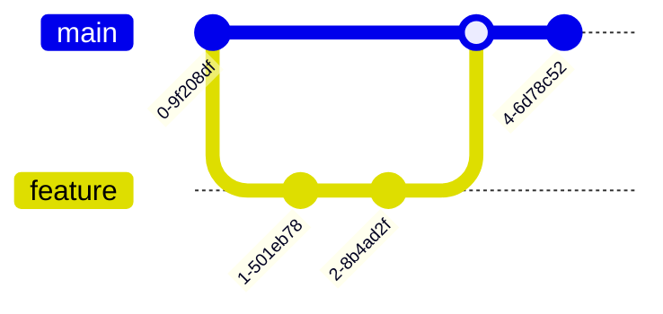
````

```mermaid
gitGraph
    commit
    branch feature
    checkout feature
    commit
    commit
    checkout main
    merge feature
    commit
```

---

## Syntax options

### Option A: Native Markdown (recommended)

Use fenced code blocks — cleanest and most portable:

````markdown
```mermaid
graph TD
    A --> B
```
````

### Option B: HTML div

Use `<div class="mermaid">` — works when Markdown doesn't:

```html
<div class="mermaid">
graph TD
    A --> B
</div>
```

### When to use each

| Use Case | Recommended |
|----------|-------------|
| Normal documentation | Markdown code blocks |
| Inside a Liquid/HTML include | HTML div |
| Nested in HTML | HTML div |
| Maximum portability | Markdown code blocks |

Both forms get the same figure, toolbar and theming.

---

## Styling and themes

### Automatic theming

You do not pick a Mermaid theme. The theme uses Mermaid's `base` theme and fills its variables from the site's live design tokens, so:

- **Light / dark / wizard** color modes each get a legible palette, and a mode switch re-renders every diagram in place.
- **Skins** (`data-theme-skin`) recolor node borders, fills and series colors to the skin's brand.
- **`theme_color`** overrides in `_config.yml` flow through the same tokens.
- Series colors for pie slices, git branches and mind maps fan out from the brand hue, so they stay distinct in both modes.

### Overriding a single diagram

A Mermaid directive at the top of a block still wins for that diagram — useful when a specific chart needs a specific look:

````markdown
```mermaid
%%{init: {'theme': 'forest'}}%%
graph LR
    A --> B
```
````

Per-node styling works as documented by Mermaid:

````markdown
```mermaid
graph LR
    A[Normal] --> B[Highlighted]
    classDef hot fill:#fde68a,stroke:#b45309,color:#1f2937
    class B hot
```
````

```mermaid
graph LR
    A[Normal] --> B[Highlighted]
    classDef hot fill:#fde68a,stroke:#b45309,color:#1f2937
    class B hot
```

---

## JavaScript API

The component exposes a small API for pages that inject content after load (tabs, search results, the AI chat):

```javascript
// Convert and render any new ```mermaid fences under a root element
window.zer0Mermaid.renderAll(document.querySelector('#tab-pane'));

// Re-derive the palette and re-render everything (after changing tokens)
window.zer0Mermaid.refresh();

// Render one element (a <pre>, <div class="mermaid">, or existing figure)
window.zer0Mermaid.render(element, 'graph TD; A --> B');

// Read a figure's source, or open it fullscreen
window.zer0Mermaid.getSource(figure);
window.zer0Mermaid.openFullscreen(figure);
```

Events: `zer0:diagram-rendered` fires on each figure (`detail.ok`, `detail.type`, `detail.error`); `zer0:diagrams-ready` fires on `document` once a batch is done (`detail.count`, `detail.failed`).

---

## Troubleshooting

### Diagram not rendering

| Symptom | Solution |
|---------|----------|
| Raw code shown | Add `mermaid: true` to front matter |
| Yellow "could not be rendered" card | Fix the syntax shown in the card — the message points at the failing line. Check it in the [Live Editor](https://mermaid.live/) |
| Script not loading | Verify `mermaid.src` in `_config.yml` points at the vendored bundle (`/assets/vendor/mermaid/mermaid.min.js`) |
| Diagram tiny on a phone | Wide diagrams shrink to fit. Use the fullscreen control or zoom in |
| No toolbar visible | It appears on hover / keyboard focus on desktop. Set `mermaid.toolbar: true` if it was disabled |
| Colors look wrong after a mode switch | The diagram re-renders on `data-bs-theme` / `data-theme-skin` changes; if you set tokens from custom JS, call `window.zer0Mermaid.refresh()` |

### Common syntax errors

```text
Wrong: graph TD A -> B      (single arrow)
Right: graph TD A --> B     (double arrow)

Wrong: graph TD A[Text]B    (no arrow between nodes)
Right: graph TD A[Text] --> B
```

`graph TD` and `flowchart TD` are equivalent: `flowchart` is the current keyword, `graph` a legacy alias that Mermaid still accepts.

### Testing locally

```bash
# Start Jekyll dev server
docker-compose up

# Check browser console for errors
# Open http://localhost:4000/your-page
```

---

## Accessibility

- Each diagram is a `<figure>`; `accTitle` becomes its `<figcaption>` and accessible name.
- The diagram frame is a focusable, keyboard-operable region (see [shortcuts](#keyboard-shortcuts)), so a diagram wider than the page is never trapped behind a mouse-only scroll.
- Toolbar buttons are real `<button>`s with labels; zoom level and copy feedback are announced through a polite live region.
- The fullscreen view is a native `<dialog>`: focus is trapped inside it, `Esc` closes it, and focus returns to the control that opened it.
- Series colors are chosen at a fixed lightness per color mode so adjacent pie slices and branches stay distinguishable.

---

## Best practices

1. **Only enable when needed** — use `mermaid: true` only on pages with diagrams
2. **Give diagrams an `accTitle`** — it is the caption, the accessible name, and the file name of an SVG export
3. **Keep diagrams simple** — complex diagrams slow rendering
4. **Test in Live Editor** — use [mermaid.live](https://mermaid.live/) first
5. **Add descriptions** — complex diagrams need text explanations
6. **Use clear labels** — avoid abbreviations

---

## Resources

- **Mermaid Documentation**: [mermaid.js.org](https://mermaid.js.org/)
- **Live Editor**: [mermaid.live](https://mermaid.live/)
- **Syntax Reference**: [Mermaid Syntax](https://mermaid.js.org/intro/syntax-reference.html)
- **Accessibility directives**: [Mermaid Accessibility](https://mermaid.js.org/config/accessibility.html)
- **Theme Configuration**: [Mermaid Theming](https://mermaid.js.org/config/theming.html)

---

## Technical reference

For implementation details (file changes, test suite):

- [Mermaid Integration v2.0 → docs/implementation/feature-change-log.md](https://github.com/bamr87/zer0-mistakes/blob/main/docs/implementation/feature-change-log.md#mermaid-integration-v20-january-2025--v030) — describes the earlier `<div class="mermaid">` approach; the current figure, toolbar and token-theming rework is registered as `ZER0-013` in `_data/features.yml`
- Component files: `_includes/components/mermaid.html` (loader), `assets/js/mermaid-diagrams.js` (behaviour), `_sass/components/_mermaid.scss` (styles)
- Regression test: `test/visual/features/mermaid.spec.js`

## See also

- [[Features]]
- [[MathJax Math]]
- [[Jupyter Notebook Integration]]
