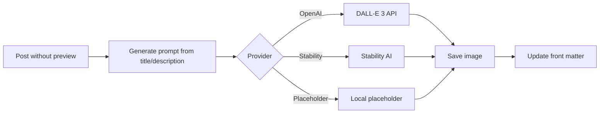

# AI Preview Image Generator

Automatically generate preview images for your posts and pages using AI image generation services.

## Overview

The preview image generator provides:

- **AI-Powered**: Uses DALL-E 3, Stability AI, or placeholders
- **Jekyll Integration**: Liquid tags and filters
- **Configurable Style**: Default retro pixel art aesthetic
- **Batch Generation**: Process multiple posts at once

## How It Works



## Configuration

### Basic Setup

```yaml
# _config.yml
preview_images:
  enabled: true
  provider: openai  # openai, stability, placeholder
  auto_generate: false  # Generate during build
```

### Full Configuration

```yaml
preview_images:
  enabled: true
  provider: openai
  model: dall-e-3
  size: 1792x1024
  quality: standard
  style: "retro pixel art, 8-bit video game aesthetic, vibrant colors"
  style_modifiers: "pixelated, retro gaming style, CRT screen glow effect"
  output_dir: assets/images/previews
  assets_prefix: /assets
  auto_prefix: true
  auto_generate: false
  collections:
    - posts
    - docs
    - quickstart
```

### API Keys

Set environment variables:

```bash
# OpenAI
export OPENAI_API_KEY="sk-..."

# Stability AI
export STABILITY_API_KEY="sk-..."
```

## Usage

### Manual Generation

Run the generation script:

```bash
# Generate for all posts without previews
./scripts/generate-preview-images.sh

# Generate for specific post
./scripts/generate-preview-images.sh --file pages/_posts/2025-01-25-my-post.md

# Dry run (preview what would be generated)
./scripts/generate-preview-images.sh --dry-run
```

### Liquid Tags

```liquid
<!-- Show count of missing previews -->


<!-- Get preview image path -->
{{ page | preview_image_path }}

<!-- Check if page has preview -->

  

```

### In Front Matter

```yaml
---
title: "My Post Title"
preview: /images/previews/my-post-preview.png
---
```

## Providers

### OpenAI DALL-E 3

Best quality, most expensive:

```yaml
preview_images:
  provider: openai
  model: dall-e-3
  size: 1792x1024  # or 1024x1024
  quality: standard  # or hd
```

### Stability AI

Good alternative:

```yaml
preview_images:
  provider: stability
  engine: stable-diffusion-xl
  size: 1024x1024
```

### Placeholder

Free, no API needed:

```yaml
preview_images:
  provider: placeholder
  placeholder_style: gradient  # or pattern, solid
```

## Style Customization

### Default Style

The default generates retro pixel art:

```yaml
style: "retro pixel art, 8-bit video game aesthetic, vibrant colors, nostalgic"
style_modifiers: "pixelated, retro gaming style, CRT screen glow effect"
```

### Professional Style

```yaml
style: "professional, modern, clean, minimalist design"
style_modifiers: "corporate, business, elegant, high quality"
```

### Artistic Style

```yaml
style: "watercolor painting, artistic, creative"
style_modifiers: "hand-painted, artistic texture, vibrant colors"
```

### Custom Per-Post

```yaml
---
title: "My Technical Post"
preview_style: "technical diagram, blueprint style, clean lines"
---
```

## Plugin Details

### File Location

```
_plugins/preview_image_generator.rb
```

### Available Methods

```ruby
# Check if document has preview
PreviewImageGenerator.has_preview?(doc)

# Get preview path
PreviewImageGenerator.preview_path(doc)

# Generate prompt from document
PreviewImageGenerator.generate_prompt(doc)
```

### Liquid Filters

| Filter | Description |
|--------|-------------|
| `preview_image_path` | Returns full preview image path |
| `has_preview_image` | Returns true if preview exists |

### Liquid Tags

| Tag | Description |
|-----|-------------|
| `` | Shows missing preview count |

## Image Specifications

### Recommended Sizes

| Platform | Size | Aspect |
|----------|------|--------|
| Open Graph | 1200×630 | 1.91:1 |
| Twitter | 1200×600 | 2:1 |
| DALL-E 3 | 1792×1024 | 1.75:1 |

### Output Directory

Images saved to:
```
assets/images/previews/
├── post-slug-preview.png
├── another-post-preview.png
└── ...
```

## Automatic Generation

### During Build

Enable auto-generation (slow!):

```yaml
preview_images:
  auto_generate: true
```

### GitHub Actions

Add to CI workflow:

```yaml
- name: Generate preview images
  env:
    OPENAI_API_KEY: ${{ secrets.OPENAI_API_KEY }}
  run: ./scripts/generate-preview-images.sh
```

## Cost Considerations

### OpenAI DALL-E 3

- Standard quality: ~$0.04 per image
- HD quality: ~$0.08 per image

### Budget Tips

1. Use placeholder during development
2. Generate only for published posts
3. Batch generate periodically
4. Cache generated images

## Troubleshooting

### API Key Not Found

```bash
# Verify key is set
echo $OPENAI_API_KEY

# Set in current session
export OPENAI_API_KEY="sk-..."
```

### Generation Failed

1. Check API key validity
2. Verify API quota
3. Check network connection
4. Review error logs

### Wrong Image Path

1. Check `assets_prefix` config
2. Verify `output_dir` exists
3. Check front matter path

### Images Not Showing

1. Verify file exists at path
2. Check Jekyll build includes assets
3. Clear browser cache
4. Check relative URL helper

## Related

- [SEO Meta Tags](/docs/seo/meta-tags/)
- [Jekyll Configuration](/docs/jekyll/jekyll-config/)
- [OpenAI API Documentation](https://platform.openai.com/docs/guides/images)
