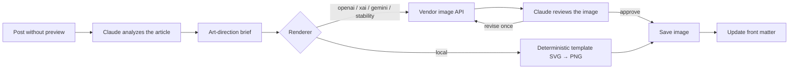

# AI Preview Image Generator

Automatically generate preview images for your posts and pages using AI image generation services.

## Overview

The preview image generator provides:

- **Claude as art director & editor**: Claude analyzes each article and writes a subject-specific image brief, then reviews the rendered image with vision — regenerating once with a corrected prompt when the image misrepresents the article (via your Claude Code OAuth token, Anthropic API key, or logged-in `claude` CLI; degrades gracefully to a template prompt without one)
- **Renderers**: OpenAI (GPT Image or DALL-E 3, default), xAI (grok-2-image), Stability AI, and Google Gemini
- **Local template engine**: deterministic, free, network-less banners for development and CI
- **Configurable Style**: Default retro pixel art aesthetic, with per-author overrides
- **Batch Generation**: Process multiple posts at once (parallel workers)

## How It Works


```mermaid
graph LR
    A[Post without preview] --> B[Claude analyzes the article]
    B --> B2[Art-direction brief]
    B2 --> C{Renderer}
    C -->|openai / xai / gemini / stability| E[Vendor image API]
    C -->|local| F[Deterministic template SVG → PNG]
    E --> R[Claude reviews the image]
    R -->|approve| G[Save image]
    R -->|revise once| E
    F --> G
    G --> H[Update front matter]
```

## Configuration

### Basic Setup

```yaml
# _config.yml
preview_images:
  enabled: true
  provider: openai  # renderer: openai, xai, stability, gemini, local
```

### Full Configuration

```yaml
preview_images:
  enabled: true
  provider: openai            # renderer: openai, xai, stability, gemini, local
  model: gpt-image-2          # empty = renderer default (gpt-image-2, grok-2-image, ...)
  size: 1536x1024             # raster vendors adapt per model (DALL-E 3: 1792x1024)
  quality: auto               # auto for GPT Image; standard/hd for DALL-E 3
  style: "retro pixel art, 8-bit video game aesthetic, vibrant colors"
  style_modifiers: "pixelated, retro gaming style, CRT screen glow effect"
  output_dir: assets/images/previews
  prompt_engine: claude       # Claude analyzes the article (template = built-in)
  review_engine: claude       # Claude reviews the render (none = skip)
  assets_prefix: /assets
  auto_prefix: true
  collections:                # engine default if omitted
    - posts
    - docs
    - quickstart
```

The values above match the shipped `_config.yml`. `collections` defaults to
`[posts, quickstart, docs]` in the engine (`scripts/lib/preview_generator.py`)
when omitted.

### Credentials

The renderer needs its own key (default: openai):

```bash
export OPENAI_API_KEY="sk-..."       # openai (also powers --enhance)
export XAI_API_KEY="xai-..."         # xai
export STABILITY_API_KEY="sk-..."    # stability
export GEMINI_API_KEY="..."          # gemini
```

Claude orchestration (article analysis + image review) accepts any ONE of, in
order — it is optional and degrades to the template prompt with no review:

```bash
# 1. Claude Code OAuth token (recommended — from `claude setup-token`)
export CLAUDE_CODE_OAUTH_TOKEN="sk-ant-oat01-..."

# 2. Short-lived Bearer token
export ANTHROPIC_AUTH_TOKEN="..."

# 3. Anthropic API key (console.anthropic.com)
export ANTHROPIC_API_KEY="sk-ant-..."

# 4. Nothing — a logged-in `claude` CLI is used automatically.
```

## Usage

### Manual Generation

Run the generation script:

```bash
# Generate for all posts without previews
./scripts/generate-preview-images.sh

# Generate for specific post
./scripts/generate-preview-images.sh --file pages/_posts/2025-01-25-my-post.md

# Dry run (preview what would be generated)
./scripts/generate-preview-images.sh --dry-run
```

### Liquid Tags

```liquid
<!-- Show count of missing previews -->


<!-- Get preview image path -->
{{ page | preview_image_path }}

<!-- Check if page has preview -->

  

```

### In Front Matter

```yaml
---
title: "My Post Title"
preview: /images/previews/ai-preview-image-generator.png
---
```

## Claude Orchestration

Claude never draws the image — it directs it. Two stages wrap every raster
renderer (both default-on; both skip gracefully without a Claude credential):

- **Analyze** (`prompt_engine: claude`): Claude reads the article (title,
  description, tags, excerpt) and writes a subject-specific art brief — a
  concrete scene that represents the content, composed for a wide banner in
  your configured style, with a strict no-text rule.
- **Review** (`review_engine: claude`): after the renderer produces the PNG,
  Claude inspects it with vision. If it misrepresents the article, breaks the
  style, or contains garbled text, Claude writes a corrected prompt and the
  engine regenerates once; otherwise the image is approved.

On a Claude Pro/Max subscription (Claude Code OAuth token or logged-in
`claude` CLI) the orchestration costs nothing extra; only the renderer bills
per image.

## Renderers

### OpenAI (GPT Image / DALL-E 3) — default

Best raster quality. The default model is GPT Image; DALL-E 3 is also
supported. OpenAI also powers the `--enhance` mode (`/v1/images/edits`):

```yaml
preview_images:
  provider: openai
  model: gpt-image-2    # default; or dall-e-3, dall-e-2
  size: 1536x1024       # GPT Image landscape; DALL-E 3 also takes 1792x1024
  quality: auto         # auto for GPT Image; standard/hd for DALL-E 3
```

### xAI (Grok)

Uses `grok-2-image` through xAI's OpenAI-compatible API. Set
`provider: xai` and supply `XAI_API_KEY`:

```yaml
preview_images:
  provider: xai
```

### Stability AI

Set `provider: stability` and supply `STABILITY_API_KEY`. The engine calls the
Stable Diffusion XL 1024 endpoint at 1024x1024 — there is no separate
`engine`/`size` key to set for this provider:

```yaml
preview_images:
  provider: stability
  # Uses STABILITY_API_KEY; generates 1024x1024 via Stable Diffusion XL
```

### Google Gemini

Uses `gemini-2.5-flash-image`. Set `provider: gemini` and supply
`GEMINI_API_KEY` (aistudio.google.com):

```yaml
preview_images:
  provider: gemini
```

### Local (template)

Free, no API and no network. The `local` provider renders a deterministic
retro-landscape SVG (seeded from the post slug) and rasterizes it to PNG — the
same post always gets the same banner, which makes it ideal for development
and CI. Claude analysis/review is skipped (the output is deterministic):

```yaml
preview_images:
  provider: local
```

## Style Customization

### Default Style

The default generates retro pixel art:

```yaml
style: "retro pixel art, 8-bit video game aesthetic, vibrant colors, nostalgic"
style_modifiers: "pixelated, retro gaming style, CRT screen glow effect"
```

### Professional Style

```yaml
style: "professional, modern, clean, minimalist design"
style_modifiers: "corporate, business, elegant, high quality"
```

### Artistic Style

```yaml
style: "watercolor painting, artistic, creative"
style_modifiers: "hand-painted, artistic texture, vibrant colors"
```

### Custom Per-Post

```yaml
---
title: "My Technical Post"
preview_style: "technical diagram, blueprint style, clean lines"
---
```

## Plugin Details

> **Note:** the Liquid filters and tags below come from an optional Jekyll
> plugin that only loads in unrestricted Jekyll builds. Under the
> `github-pages` gem (safe mode) custom plugins never load — the theme's own
> rendering uses the pure-Liquid `components/preview-image.html` include
> instead, so generated previews display either way.

### File Location

```text
_plugins/preview_image_generator.rb
```

### Available Methods

```ruby
# Check if document has preview
PreviewImageGenerator.has_preview?(doc)

# Get preview path
PreviewImageGenerator.preview_path(doc)

# Generate prompt from document
PreviewImageGenerator.generate_prompt(doc)
```

### Liquid Filters

| Filter | Description |
|--------|-------------|
| `preview_image_path` | Returns full preview image path |
| `has_preview_image` | Returns true if preview exists |

### Liquid Tags

| Tag | Description |
|-----|-------------|
| `` | Shows missing preview count |

## Image Specifications

### Recommended Sizes

| Platform | Size | Aspect |
|----------|------|--------|
| Open Graph | 1200×630 | 1.91:1 |
| Twitter | 1200×600 | 2:1 |
| DALL-E 3 | 1792×1024 | 1.75:1 |

### Output Directory

Images saved to:

```text
assets/images/previews/
├── post-slug-preview.png
├── another-post-preview.png
└── ...
```

## Automatic Generation

### GitHub Actions

Add to a CI workflow (generation is script-driven, never part of the Jekyll
build):

```yaml
- name: Generate preview images
  env:
    CLAUDE_CODE_OAUTH_TOKEN: ${{ secrets.CLAUDE_CODE_OAUTH_TOKEN }}
    # or OPENAI_API_KEY for --provider openai
  run: ./scripts/generate-preview-images.sh
```

## Cost Considerations

### Claude orchestration

- Covered by a Claude Pro/Max subscription when using a Claude Code OAuth
  token or the `claude` CLI; API-key usage bills normal Anthropic token rates
- Analysis is one small text call per image; review is one vision call (plus
  one extra render when a revision is requested)

### OpenAI DALL-E 3

- Standard quality: ~$0.04 per image
- HD quality: ~$0.08 per image

### Budget Tips

1. Use the `local` provider during development (free, deterministic)
2. Generate only for published posts
3. Batch generate periodically
4. Cache generated images

## Troubleshooting

### API Key Not Found

```bash
# Verify key is set
echo $OPENAI_API_KEY

# Set in current session
export OPENAI_API_KEY="sk-..."
```

### Generation Failed

1. Check API key validity
2. Verify API quota
3. Check network connection
4. Review error logs

### Wrong Image Path

1. Check `assets_prefix` config
2. Verify `output_dir` exists
3. Check front matter path

### Images Not Showing

1. Verify file exists at path
2. Check Jekyll build includes assets
3. Clear browser cache
4. Check relative URL helper

## Related

- [SEO Meta Tags](/docs/seo/meta-tags/)
- [OpenAI API Documentation](https://platform.openai.com/docs/guides/images)

## Technical Reference

For implementation details (multi-provider architecture, xAI Grok integration, generation workflow):

- [Preview Image Generator → docs/implementation/preview-image-generator.md](https://github.com/bamr87/zer0-mistakes/blob/main/docs/implementation/preview-image-generator.md)

## See also

- [[Features]]
- [[SEO]]
