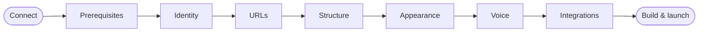

# Site Builder

The Site Builder is a nine-step wizard that takes you from an empty folder to a personalized, running zer0-mistakes site. It lives at `/setup/` on any local build of the theme and on the welcome screen of a fresh remote-theme site. An embedded AI session sits beside every step, answered by the provider you connect with your own token — Claude (Anthropic) or Grok (xAI). It can read your answers, fill in the forms, check your machine, read the theme's real source code, write the generated project to disk, start Docker, and, in an open session, modify a site you already have and generate images for it.



## What you'll do

Open the wizard, connect Claude or Grok through the local dev proxy, answer a handful of questions — or just describe the site in an open session — and leave with a project folder that serves at `http://localhost:4000` and is ready to push to GitHub Pages.

## Prerequisites

- A local checkout of the theme with its dev server running (`docker compose up` in the theme repository), or any site that uses the `welcome` layout.
- Node.js 20.6 or newer, for the dev proxy that connects the AI.
- A token for one provider: the Claude Code CLI signed in to a Claude Pro or Max account (`claude setup-token`), an Anthropic API key, or an xAI key from console.x.ai. Without one the wizard still works; only the AI panel stays off.
- Docker Desktop, Git, and the GitHub CLI for the site you are about to build. The Prerequisites step checks these for you and shows the install command for your operating system.

## Walk through the wizard

The wizard has nine steps; this walkthrough groups them into six passes.

### Connect

Open `http://localhost:4000/setup/`. The Connect step looks for the dev proxy; start it from the theme root (it no longer needs a key to start):

```bash
node --env-file=.env templates/deploy/chat-proxy/dev-proxy.mjs
```

Pick **Claude** or **Grok**, paste a token — `claude setup-token` prints a Claude one; console.x.ai issues xAI keys — and press **Use for this session**. The proxy checks the token with the provider, keeps it in memory for the run, and shows only its last four characters; tick the switch to have the proxy save it to the git-ignored `.env` for next time. Choose a model, switch on image generation if you have an xAI or OpenAI key, and decide how to work: **Guided steps** or an **Open session** where you simply tell the assistant what to build or change.

The page re-checks every fifteen seconds. Once the badge in the panel reads **Claude connected** or **Grok connected**, the composer unlocks and the panel greets you. The token never lives in the page: it goes once to `http://localhost:8787` and stays there.

### Prerequisites

Press **Run checks**. The proxy runs a fixed list of read-only version commands (Docker, the Docker engine, Git and its identity, the GitHub CLI and its login, VS Code, Node, the Claude CLI) and the checklist turns green or red per tool. Pick your operating system to see the matching install command, or ask Claude to explain what is missing. Offline, tick each item as you install it.

### Identity, URLs and Structure

Describe your site in the brief box and press **Draft with Claude** (or **with Grok**). The assistant proposes a title, subtitle, tagline and description and applies them after you confirm on the inline card. Fill in your GitHub username and repository, press **Suggest** to derive the site URL and base path, then pick a kind of site to preselect collections and a navigation menu you can edit row by row.

### Appearance and Voice

Choose one of the seven skins and preview it on the page you are looking at, set the color mode, and pick a tone and audience. **Draft both with Claude** (or Grok) writes the welcome post and about page in that voice; both are plain Markdown you can edit before they become files. With image generation on, **Hero image with …** renders a landing-page image into the project.

### Integrations

Switch on what you want: the improve-this-page widget, Obsidian wiki-links, Giscus comments, PostHog analytics, or the AI chat assistant. Nothing sends data until you add an ID or key, and keys never go in `_config.yml`.

### Build

Every generated file is in the preview panel the whole time. Enter a project folder name, press **Check** to see where it will be created, then **Write project**. Press **docker compose up** and watch the build in the terminal panel. When Jekyll reports it is serving, **Open site** takes you to the new site. To change it later, pick it under **Modify an existing site**, press **Open**, and ask: the assistant reads, edits and adds files there, and **jekyll build** validates the result. Without the proxy, download the bundle and run it:

```bash
bash zer0-site-bundle.sh my-site
cd my-site && docker compose up
```

## Verify

- The panel badge reads **Claude connected** or **Grok connected** and the Build step buttons are enabled.
- `docker compose ps` in the new folder shows a running `jekyll` service.
- `http://localhost:4000/` (or the port you chose) renders your title, skin and welcome post.
- `zer0.install.yml` in the new folder records your answers so the installer can replay them.

## Troubleshooting

| Issue | Fix |
| --- | --- |
| Badge stays **offline** | Confirm the proxy printed `listening on http://localhost:8787`; it starts with or without a key. |
| Badge reads **needs a token** | The proxy is up but the provider you picked has no key yet: paste one, or switch to the provider that has one in `.env`. |
| **Write project** says the target is not allowed | New sites go under the theme's parent folder by default. Set `WIZARD_TARGET_ROOT=/path` when starting the proxy to change that. |
| `docker compose up` fails on the first run | The first build installs gems and can take several minutes. Press **Logs**; Claude can read them and explain the error. |
| Chat says the credential was rejected | Paste a fresh token on the Connect step: re-run `claude setup-token` for Claude, or create a new key at console.x.ai for Grok. |
| Port 4000 is already in use | Change **Dev port** on the URLs step before writing the project, or stop the other server. |

## Related

- [Machine Setup](/quickstart/machine-setup/) is the manual reference behind the Prerequisites step.
- [Site Builder feature reference](/docs/features/site-builder/) documents the tools, the proxy routes, and the safety model.
- [AI Chat Assistant](/docs/features/ai-chat-assistant/) explains the proxy the builder reuses.

---

<div class="d-flex justify-content-between mt-5">
  <a href="/quickstart/" class="btn btn-outline-secondary">
    <i class="bi bi-arrow-left"></i> Back: Quick Start Overview
  </a>
  <a href="/quickstart/machine-setup/" class="btn btn-primary">
    Next: Machine Setup <i class="bi bi-arrow-right"></i>
  </a>
</div>
