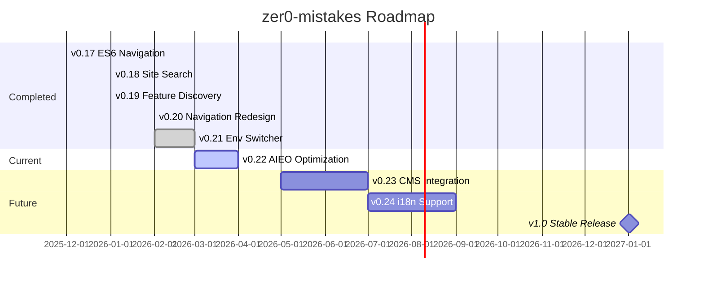

# {{ page.title }}

The zer0-mistakes development roadmap tracks completed milestones, the current release focus, and planned future work. All versions follow [Semantic Versioning](https://semver.org/).

---

## Visual Timeline

---

## Release History

| Version | Date | Highlights |
|---------|------|------------|
| **v0.21.2** | 2026-03-21 | RubyGems API-key auth, dependency updates |
| **v0.21.0** | 2026-02-01 | Environment switcher, navigation redesign, settings modal tabs |
| **v0.20.7** | 2026-02-01 | Local Docker publishing, CI variable abstraction |
| **v0.19.0** | 2026-01-25 | 43 documented features, comprehensive feature registry |
| **v0.18.0** | 2026-01-15 | Client-side site search, search modal |
| **v0.17.0** | 2025-12-15 | ES6 modular navigation, auto-hide navbar |

See the full [CHANGELOG](/CHANGELOG) for detailed release notes.

---

## Current Focus: v0.22 — AIEO Optimization

**Target**: March–April 2026

| Feature | Status |
|---------|--------|
| JSON-LD SoftwareApplication schema | ✅ Complete |
| Author E-E-A-T visibility block | ✅ Complete |
| FAQ page with FAQPage schema | ✅ Complete |
| Glossary with key term definitions | ✅ Complete |
| Roadmap page with temporal anchoring | ✅ Complete |
| Citation hooks on project stats | ✅ Complete |

---

## Planned: v0.23 — CMS Integration

**Target**: Q2 2026

- Headless CMS integration (Decap CMS or Tina)
- Content API for programmatic access
- Admin dashboard for content management
- Draft preview workflow

---

## Planned: v0.24 — Internationalization (i18n)

**Target**: Q3 2026

- Multi-language content support
- Locale-aware routing
- Translated UI strings via `_data/ui-text.yml`
- Right-to-left (RTL) layout support

---

## Planned: v1.0 — Stable Release

**Target**: Q1 2027

- Stable public API for theme customization
- 90%+ automated test coverage
- Migration guide from Minima and other themes
- Long-term support (LTS) commitment

---

## How We Prioritize

Roadmap priorities are informed by:

1. **Community feedback** — [GitHub Issues](https://github.com/bamr87/zer0-mistakes/issues) and [Discussions](https://github.com/bamr87/zer0-mistakes/discussions)
2. **Usage analytics** — Privacy-compliant PostHog data on feature adoption
3. **Ecosystem changes** — Jekyll, Bootstrap, and GitHub Pages updates
4. **Contributor interest** — Open feature requests that attract PRs

Want to influence the roadmap? [Open a discussion](https://github.com/bamr87/zer0-mistakes/discussions) with your use case.
