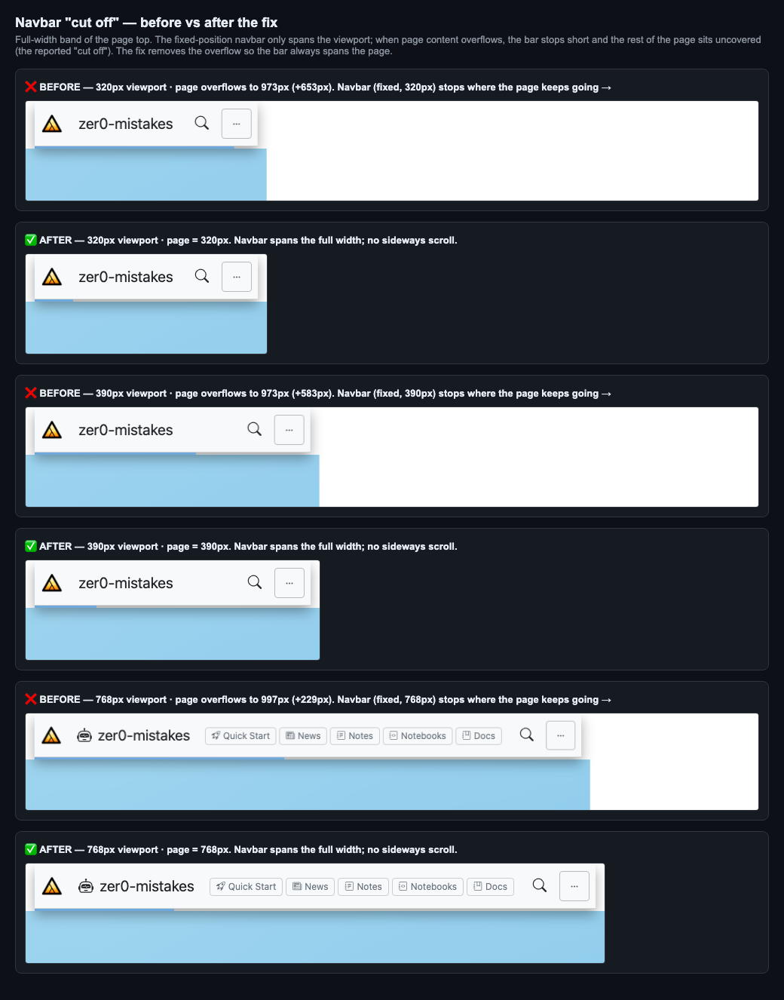
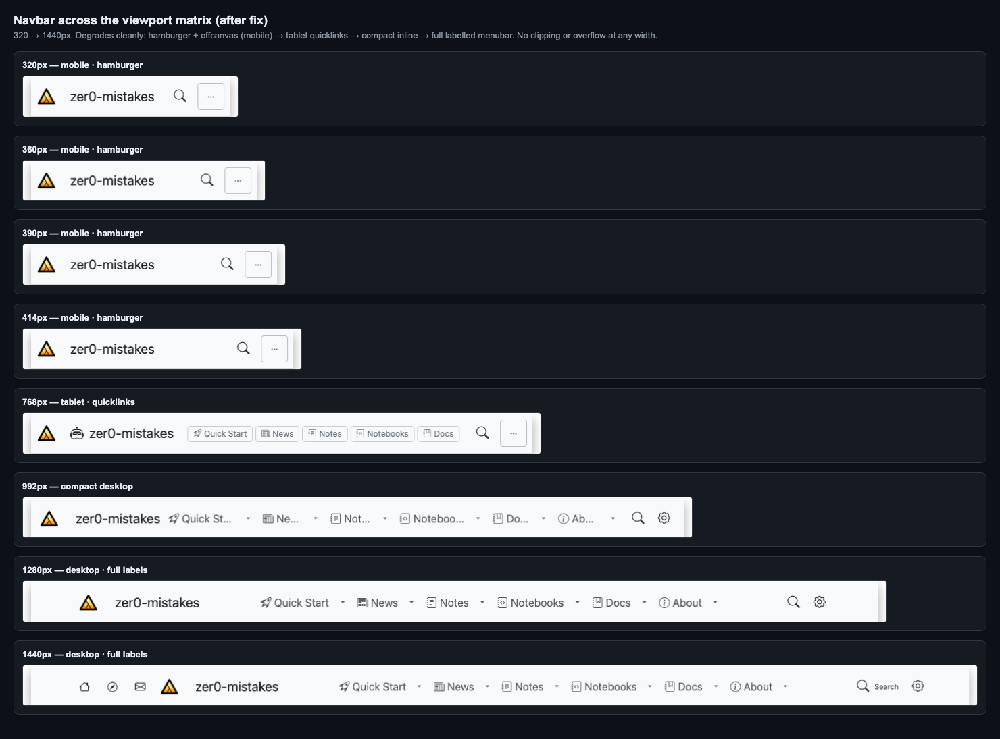
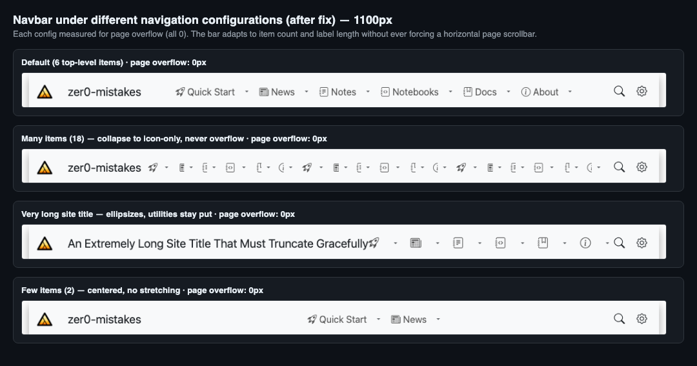
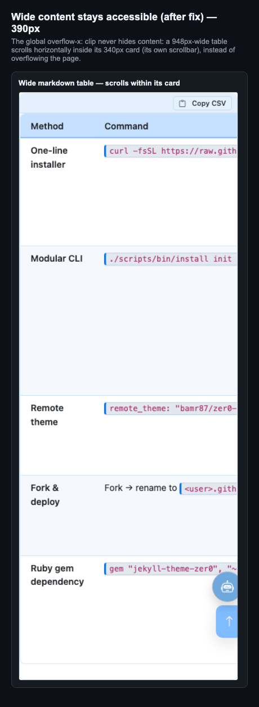
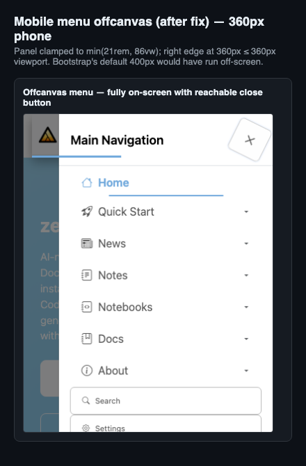

# Navbar responsiveness — evidence (PR #215)

Visual + numeric proof for the navbar "cut off" fix. Everything here is
regenerated by [`../navbar-evidence.mjs`](../navbar-evidence.mjs) against the
live dev server, so it is reproducible — not hand-picked screenshots.

> **The bug was never the navbar markup.** Because the header is
> `position: fixed`, it only spans the viewport. Any element that pushed the
> page wider than the viewport (a 948px markdown table, a long inline-code
> token) created a horizontal page scrollbar, and the bar visibly stopped where
> the page kept going — the reported "cut off".

## 1. Before vs after — the bug



Full-width band of the page top at three viewports. **Before**, the white navbar
spans only the viewport width while the page extends far past it; **after**, the
page no longer overflows so the bar always spans it.

### Page overflow measured across the width matrix

Worst horizontal overflow of any non-scrollable in-flow element (px past the
viewport). `0` = no sideways scroll = navbar cannot be cut off.

| Viewport | Before | After |
|---:|---:|---:|
| 320px | **653** | **0** |
| 360px | 613 | 0 |
| 390px | 583 | 0 |
| 414px | 559 | 0 |
| 768px | 229 | 0 |
| 992px | 5 | 0 |
| 1280px | 0 | 0 |
| 1440px | 0 | 0 |

The `before` numbers are reproduced by injecting CSS that reverts the fix and
match the originally-reported overflow exactly. Raw data: [`metrics.json`](metrics.json).

## 2. Every viewport (after) — clean, with graceful degradation



320 → 1440px: hamburger + offcanvas (mobile) → tablet quicklink chips → compact
inline (icon + ellipsized labels) → full labelled menubar (+ home quick-links at
the widest). No clipping or page overflow at any width.

## 3. Various navigation configurations (after)



The bar adapts to item count and label length — 18 items collapse to icon-only,
a very long title ellipsizes while the search/settings cluster stays put, 2
items stay centered — and **page overflow is 0 in every case**.

## 4. Wide content is not hidden by the safety net



`html { overflow-x: clip }` never hides content: a 948px-wide table scrolls
horizontally inside its 340px card (its own scrollbar) instead of overflowing
the page.

## 5. Mobile offcanvas fits a narrow phone



The slide-in menu is clamped to `min(21rem, 86vw)`; at 360px its right edge
lands at exactly 360px with the close button reachable. Bootstrap's default
400px would have run off-screen.

## Automated regression coverage

[`../navbar-responsive.spec.js`](../navbar-responsive.spec.js) — **26 tests, all
passing** in the `smoke` (CI) tier:

- 16-width matrix (320 → 1920px): no page overflow, header spans the viewport,
  utilities stay on-screen, brand renders, inline menubar never clips.
- Content pages (`/`, `/docs/`) at 375 / 768 / 1280px: no horizontal overflow.
- Mobile offcanvas fits the viewport; desktop dropdown stays within the viewport.
- Stress: long title ellipsizes; many items never force a page scrollbar.

Element-level overflow detection means these still fail loudly if a regression
appears even though `overflow-x: clip` would hide it visually.

## Reproduce

```bash
# dev server (Docker) serving the theme at :4000 (or :4001 here)
docker compose up
# regenerate every image + metrics.json in this folder
BASE_URL=http://localhost:4000 node test/visual/navbar-evidence.mjs
# run the regression suite
BASE_URL=http://localhost:4000 npx playwright test --config=test/playwright.config.js --project=smoke navbar-responsive
```
