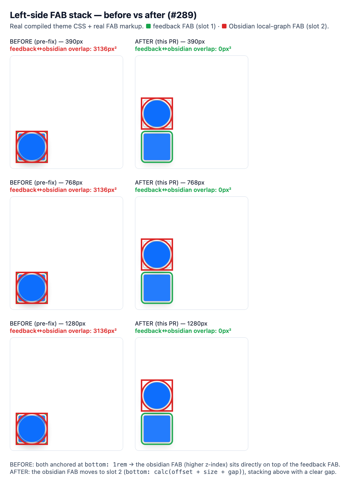

# Evidence — left-side FAB stack (no overlap)

Proof for the fix in PR #289 / issue #288: the two bottom-left floating action
buttons no longer overlap.

## The bug

The page-feedback **"Improve this page"** FAB (`#pageFeedbackFab`, added in #286)
and the pre-existing Obsidian **local-graph** FAB (`#obsidianLocalGraphFab`) were
both anchored at `bottom: 1rem; left: 1rem`. With identical positions and the
obsidian FAB carrying the higher z-index (`--zer0-layer-fab-local-graph` 1060 >
`--zer0-layer-fab-feedback` 1051), it sat **directly on top of** the feedback FAB
— the feedback button was unreachable on any page that renders the graph FAB.
The docs-sidebar restore FAB (`.bd-sidebar-fab--restore`) shared the same
collision on mobile.

## The fix

The slot-2 FABs move to `bottom: calc(offset + size + gap)` — the identical
stacking formula `.bd-toc-fab` already uses to sit above `#backToTopBtn` on the
right edge. Left-side stack, bottom → top:

| Slot | `bottom` | FAB |
| --- | --- | --- |
| 1 | `1rem` (16px) | `#pageFeedbackFab` — always on |
| 2 | `calc(1rem + 3.5rem + 0.75rem)` (84px) | `#obsidianLocalGraphFab` / `.bd-sidebar-fab--restore` — conditional |

## Before → after



`01-before-after.png` — rows are 390 / 768 / 1280px viewports; columns are
BEFORE (pre-fix) and AFTER (this PR). The **green** outline is the feedback FAB
(slot 1); the **red** outline is the Obsidian local-graph FAB (slot 2). BEFORE:
one stacked pile — the red circle is coincident with the green square. AFTER:
two distinct FABs with a clear gap.

## Metrics (`metrics.json`)

Measured feedback↔obsidian overlap and the obsidian FAB's resolved `bottom`, at
each width:

| Width | BEFORE overlap | BEFORE `bottom` | AFTER overlap | AFTER `bottom` |
| --- | --- | --- | --- | --- |
| 390px | **3136px²** | 16px | **0px²** | 84px |
| 768px | **3136px²** | 16px | **0px²** | 84px |
| 1280px | **3136px²** | 16px | **0px²** | 84px |

`3136 = 56×56` — the two `3.5rem` FABs were exactly coincident. The
docs-sidebar restore FAB moves `16px → 84px` the same way.

## Regression test

[`test/visual/features/fab-stack.spec.js`](../../features/fab-stack.spec.js)
(smoke tier). It mounts an element carrying each slot-2 FAB's production
id/class next to the always-present feedback FAB and asserts the shipped CSS
lands it at slot 2 (`bottom` 84px), clear of slot 1 — verified to **fail** on
the pre-fix `bottom: 1rem` (off by 68px) and **pass** after.

## How this evidence was generated

[`test/visual/fab-stack-evidence.mjs`](../../fab-stack-evidence.mjs). Unlike the
sibling `*-evidence.mjs` kits (which drive a live Docker Jekyll server), this one
is self-contained: it compiles the **real** theme stylesheet with dart-sass
(`assets/css/main.scss` → the same CSS Jekyll emits, including this fix) and
renders the **real** FAB markup inside the real `<body class="zer0-bg-body">`
elevation context, then measures geometry with host Chromium. Because these FABs
are `position: fixed` (viewport-relative, independent of page content flow), the
measured geometry is identical to the live site — it just needs no multi-GB
Docker image. BEFORE is reproduced with an `unfix` stylesheet, mirroring
`evidence-kit.mjs`'s `unfixCss` pattern.

```bash
node test/visual/fab-stack-evidence.mjs
```
