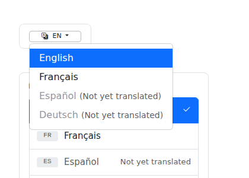
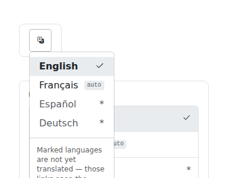

# Evidence — icon-only language trigger and a compact, positive menu (#406, PR #431)

Before/after for T-038: the navbar trigger loses its `EN` label and caret, and the menu stops rendering "not available" as a wall of disabled, greyed-out rows.

## Before / after

| | Before | After |
| --- | ---: | ---: |
| Trigger size | 88 × 19 px | **38 × 38 px** |
| Trigger visible text | `EN` | **(none)** |
| Caret (`dropdown-toggle`) | present, `::after` `inline-block` | **absent, `::after: none`** |
| Trigger accessible name | `title="Language"` | **`title="Language: English"`** |
| Menu width | 243 px | **144 px** |
| Widest row | 241 px | **142 px** |
| Disabled / `aria-disabled` rows | 2 | **0** |
| Bootstrap `.active` primary fill | 1 | **0** |
| Untranslated rows that are real links | 0 | **2** |
| `auto` chips on machine translations | 0 | **1** |
| Per-row "Not yet translated" strings | 2 | **1** (the single footnote) |

 

The panel variant is captured too (`01-before-panel-variant.png`, `02-after-panel-variant.png`) — the include renders two markups and this change touches both.

## Against the issue's acceptance criteria

- **Menu shows no disabled rows** — 2 → **0**. Español and Deutsch are now `<a>`
elements to the source page, so the existing `zer0-lang` preference handler (which matches `a[data-lang]`) fires on the fallback path too; it could never fire on the old `span.disabled`.
- **Widest row ≤ 220px** — 241px → **142px**, *measured* with
`getBoundingClientRect()`. PR #431 originally shipped this criterion as a static assertion on the CSS rule with an explicit caveat that nothing had measured it in a browser. This closes that gap: the old menu genuinely exceeded the cap, the new one is 78px inside it.
- **Current language visually distinct without a primary fill** — Bootstrap's
`.dropdown-item.active` count is 1 → **0**, replaced by `.is-current` (tint + `bi-check2`) while `aria-current="true"` is retained.
- **Trigger is icon-only at all widths with an accessible name** — the `EN` span
and the caret are gone, the button is a 38px square, and `aria-label` / `title` are the only accessible name — so `title` now names the language being read rather than just "Language".
- **One footnote instead of per-row text** — 2 per-row strings → **1** footnote
  under a divider, referenced by each marked row via `aria-describedby`.

## How this was measured — and the caveat

**No Jekyll site was served.** The agent sandbox has no bundler and could not install one, so `bundle exec jekyll build` and the usual `evidence-kit.mjs` run against `localhost:4000` were both impossible.

Instead the include is rendered with **liquidjs** against a fixture and styled by **the real `assets/css/main.scss` compiled with Dart Sass** plus the repo's **vendored Bootstrap CSS and JS**, then measured in real Chromium via Playwright. "Before" is `origin/main`, "after" is this branch — same harness, same browser, same fixture, same viewport.

Two honest limits:

1. The fixture declares three target languages (`fr` translated, `es`/`de` not)
where `_config.yml` ships only `[fr]`. That is deliberate — with a single, translated target none of the untranslated / chip / footnote states would render at all — but the absolute row counts above are the fixture's, not production's.
2. These are component crops, not full-page screenshots of the built site, so
they do not show the toggle in the real navbar cluster at every viewport. `test/visual/features/language-toggle.spec.js` runs against the real built site in `Test Suite (Ruby 3.3)` and remains the authoritative check.
